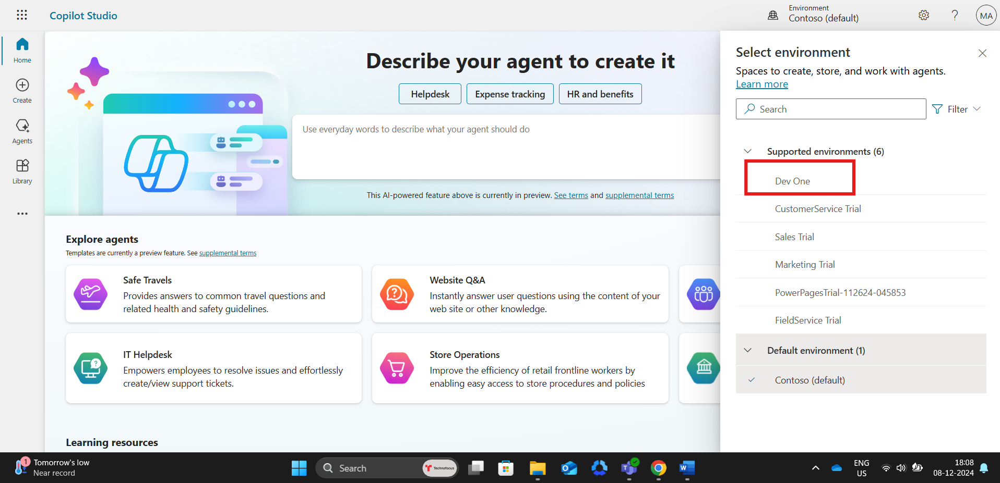
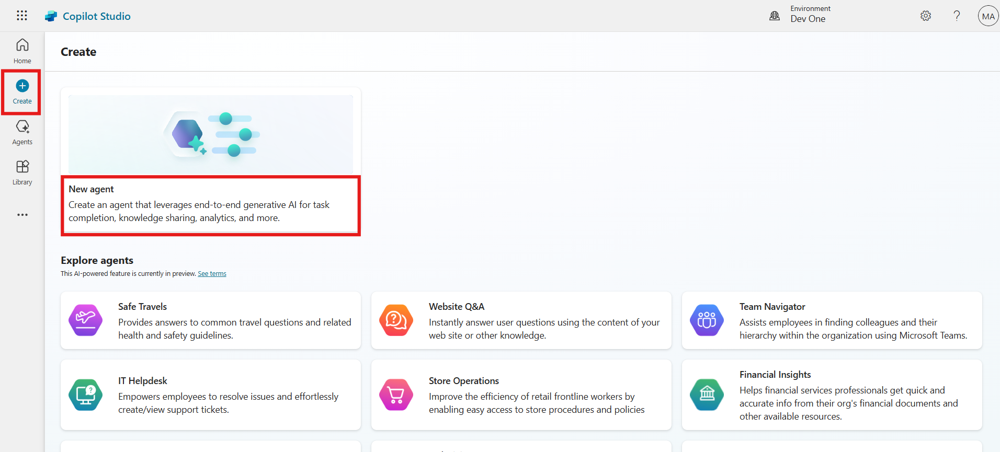
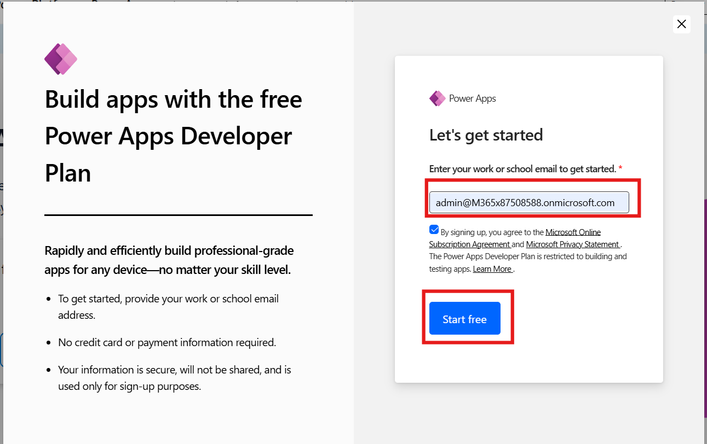
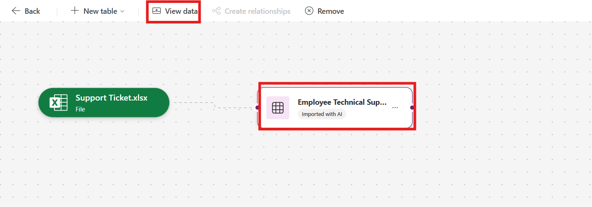
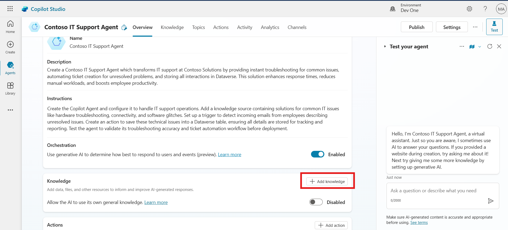

# Lab 1: Build a declarative agent for Microsoft 365 Copilot using Teams Toolkit

**Estimated Time: 30 mins**

## Objective

The objective of this lab is to empower participants to build a
declarative agent for Microsoft 365 Copilot using Teams Toolkit. By
completing the lab, participants will create a geo-location game that
provides a fun and educational break from work. The lab focuses on
understanding the structure of declarative agents, configuring them with
instructions, and integrating them into the Microsoft 365 ecosystem for
customized Copilot interactions.

## Solution

Participants will install Teams Toolkit in Visual Studio Code and set up
their development environment. Using a template, they will scaffold a
declarative agent named Geo Locator Game. They will customize the
agent's instructions and update its configuration files, such as
instruction.txt and manifest.json. The lab also guides participants in
enhancing the agent with unique identifiers, custom icons, and testing
functionality. The result is a fully functional, engaging Copilot
application tailored to deliver clues about cities while integrating
seamlessly with Microsoft 365.

## Exercise 1: Set up your development environment for Microsoft 365 Copilot

This lab currently assumes you already have a tenant to setup.

- Visual studio code

- NodeJS version 18.16.0.

### Task 1: Install Teams Toolkit

These labs are based on [Teams Toolkit version
5.0](https://marketplace.visualstudio.com/items?itemName=TeamsDevApp.ms-teams-vscode-extension).
Follow the steps as shown in the screen shot below.

1.  Open Visual Studio Code and click on the Extensions toolbar button.

    


2.  Search for +++**Teams**+++ and locate Teams **Toolkit** and click **Install.**

    


3.  Once the installation is complete, the **Teams Toolkit** icon will appear on the left navigation bar.
    


## Exercise 2: First declarative agent

In this lab, you'll build a simple declarative agent using Teams Toolkit
for Visual Studio Code. Your agent is designed to give you a fun and
educational break from work by helping you explore cities across the
globe. It presents abstract clues for you to guess a city, with fewer
points awarded the more clues you use. At the end, your final score will
be revealed.

In this exercise you will learn:

- What is a declarative agent for Microsoft 365 Copilot

- Create a declarative agent using Teams Toolkit template

- Customize the agent to create the geo locator game using instructions

- Learn how to run and test your app

- For bonus exercise, you will need a SharePoint teams site

### Introduction

Declarative agents leverage the same scalable infrastructure and platform of Microsoft 365 Copilot, tailored specifically to meet focus on a special area of your needs. They function as subject matter experts in a specific area or business need, allowing you to use the same interface as a standard Microsoft 365 Copilot chat while ensuring they focus exclusively on the specific task at hand.

Welcome on board to building your own declarative agent ! Let's dive in and make your Copilot work magic!

In this lab you will start out building a declarative agent using Teams Toolkit with a default template used in the tool. This is to help you get started with something. Next, you will modify your agent to be focused on a geo location game.

The goal of your AI is to provide a fun break from work while helping you learn about different cities around the world. It offers abstract clues for you to identify a city. The more clues you need, the fewer points you earn. At the end of the game, it will reveal your final score.


You will also give your agent some files to refer to a secret diary 🕵🏽
and a map 🗺️ to give more challenges to the player.

So, let's begin

### Anatomy of a Declarative agent

You will see as we develop more and more extensions to Copilot, that in the end what you will build is collection of few files in a zip file
which we will refer to as an app package that you will then install and use. So, it's important you have a basic understanding of what the app
package consists of. The app package of a declarative agent is like a Teams app if you have built one before with additional elements. See the
table to see all the core elements. You will also see that the app deployment process is very similar to deploying a Teams app.

| **Element** | **Description** | **Name of file** |
|----|----|----|
| **App manifest** | Describes app configuration, capabilities, required resources, and important attributes. | manifest.json |
| **App icons** | Requires a color (192x192) and outline (32x32) icon for your declarative agent. | icon.png, color.png |
| **Declarative agent manifest** | Describes agent configuration, instructions, required fields, capabilities, conversation starters, and actions. | declarativeAgent.json |

> **Note:** You can add reference data from SharePoint, OneDrive, Web search etc. and add extension capabilities to a declarative agent like plugins and connectors. You will learn how to add a plugin in the upcoming labs in this path.

### Capabilities of a Declarative agent

You can enhance the agent's focus on context and data by not only adding
instructions but also specifying the knowledge base it should access.
They are called capabilities and there are three types of capabilities
supported.

- **Microsoft Graph Connectors** - Pass connections of Graph connectors
  to the agent, allowing the agent to access and utilize the connector's
  knowledge.

- **OneDrive and SharePoint** - Provides URLs of files and sites to
  agent, for it to gain access to those contents.

- **Web search** - Enables or disables web content as part of the
  agent's knowledge base.
    
    

### One Drive and SharePoint

URLs should be full path to SharePoint items (site, document library,
folder, or file). You can use the "Copy direct link" option in
SharePoint to get the full path or files and folders. To achieve this,
right-click on the file or folder and select Details. Navigate to Path
and click on the copy icon. Not specifying the URLs, the entire corpus
of OneDrive and SharePoint content available to the logged in user will
be used by the agent.

### Microsoft Graph Connector

Not specifying the connections, the entire corpus of Graph Connectors
content available to the logged in user will be used by the agent.

### Web search

At the moment you cannot pass specific websites or domains, and this
acts only as a toggle on and off to use web.

## Exercise 3: Scaffold a declarative agent from template

You can use just any editor to create a declarative agent if you know
the structure of the files in the app package mentioned above. But
things are easier if you use a tool like Teams Toolkit to not only
create these files for you but also help you deploy and publish your
app. So, to keep things as simple as possible you will use Teams
Toolkit.

### Task 1: Use Teams Toolkit to create a declarative agent app

1.  Go to the Teams Toolkit extension in your Visual Studio Code editor and select **Create a New App.**

    


2.  A panel opens up where you need to select **Agent** from the list of project types.

    


3.  Next, you will be asked to choose the app feature of Copilot Agent Choose **declarative agent** and press **Enter**.

    


4.  Next, you will be asked to choose want to create a basic declarative agent or one with an API plugin. Choose the **No Plugin** option.

    


**Why not create one with API plugin here?**

You will build API plugins in the next lab, and you will also learn how to integrate an API plugin with a declarative agent in the following one in this same path. Here we are just going to create a declarative agent.

5.  Next, type in the directory where the project folder has to be created or choose the default location.

    

6.  Next, give it an application name +++**Geo Locator Game**+++ and select Enter.

    


The project will be created in a few seconds in the folder you mentioned and will open in a new project window of Visual Studio Code. This is your working folder.

7.  Click on **Yes, I trust the authors.**

    

    

Well done! You have successfully set up the base declarative agent! Now, proceed to examine the files contained within to be able to customize it to make the geo locator game app.

### Task 2: Set up accounts in Teams Toolkit

1.  Now select the Teams Toolkit icon in the left Under **Accounts** click **Sign in to Microsoft 365** and log in with your own Microsoft 365 account.

    

2.  A browser window will pop up and offer to log into Microsoft 365. When it says "You are signed in now and close this page", please do so.

    

    

3.  Verify that the "Custom App Upload Enabled" checker has a green checkmark.

4.  Verify that the "Copilot Access Enabled" checker has a green checkmark.

    


### Task 3: Understanding the files in the app

Here's how the base project looks:

| **Folder/File** | **Contents** |
|----|----|
| .vscode | VSCode files for debugging |
| appPackage | Templates for the Teams application manifest, the GPT manifest, and the API specification |
| env | Environment files with a default .env.dev file |
| appPackage/color.png | Application logo image |
| appPackage/outline.png | Application logo outline image |
| appPackage/declarativeAgent.json | Defines settings and configurations of the declarative agent. |
| appPackage/instruction.txt | Defines the behavior of declarative agent. |
| appPackage/manifest.json | Teams application manifest that defines metadata for your declarative agent. |
| teamsapp.yml | Main Teams Toolkit project file. The project file defines two primary things: Properties and configuration Stage definitions. |

1.  The file of interest for our lab is primarily
    the **appPackage/instruction.txt** file which is the core directives needed for your agent. It's a plain text file and you can write natural language instructions in it.


2.  Another important file is **appPackage/declarativeAgent.json** where there is a schema to be followed to extend Microsoft 365 Copilot with the new declarative agent. Let's look at what properties the schema of this file has.

- The \$schema is the schema reference

- The version is the schema version

- The name key represents the name of the declarative agent.

- The description provides a description.

- The instructions the path to the **instructions.txt** file which holds directives which will determine the operational behavior. You can also put your instructions as plain text as a value here. But for this lab we will use the **instructions.txt** file.


3.  Another important file is the **appPackage/manifest.json** file, which contains crucial metadata, including the package name, the developer’s name, and references to the copilot agents utilized by the application. The following section from the manifest.json file illustrates these details:

    ```
    "copilotAgents": {
            "declarativeAgents": [            
                {
                    "id": "declarativeAgent",
                    "file": "declarativeAgent.json"
                }
            ]
        },
    ```

    


4.  You could also update the logo files color.png and outline.png to make it match your application's brand. In today's lab you will change **color.png** icon for the agent to stand out.

## Exercise 4: Update instructions and icons

### Task 1: Update icons and manifests

1.  First, we will do the easy bit which is replacing the logo. Copy the image located in lab files and replace it with the image of same name in the folder **appPackage** in your root project.

    

    

    


2.  Next, go to the file **appPackage/manifest.json** in your root project and find the node **copilotAgents**. Update the id value of the declarativeAgents array's first entry from declarativeAgent to dcGeolocator to make this ID unique.

    ```
    "copilotAgents": {
            "declarativeAgents": [            
                {
                    "id": "dcGeolocator",
                    "file": "declarativeAgent.json"
                }
            ]
        },
    ```

    

    


3.  Next, go to the file **appPackage/instruction txt** and copy paste the below instruction to overwrite the existing contents of the file.
    
    +++
    System Role: You are the game host for a geo-location guessing game. Your goal is to provide the player with clues about a specific city and guide them through the game until they guess the correct answer. You will progressively offer more detailed clues if the player guesses incorrectly. You will also reference PDF files in special rounds to create a clever and immersive game experience.

    Game play Instructions:

    Game Introduction Prompt

    Use the following prompt to welcome the player and explain the rules:

    Welcome to the Geo Location Game! I’ll give you clues about a city, and your task is to guess the name of the city. After each wrong guess, I’ll give you a more detailed clue. The fewer clues you use, the more points you score! Let’s get started. Here’s your first clue:

    Clue Progression Prompts

    Start with vague clues and become progressively specific if the player guesses incorrectly. Use the following structure:

    Clue 1: Provide a general geographical clue about the city (e.g., continent, climate, latitude/longitude).

    Clue 2: Offer a hint about the city’s landmarks or natural features (e.g., a famous monument, a river).

    Clue 3: Give a historical or cultural clue about the city (e.g., famous events, cultural significance).

    Clue 4: Offer a specific clue related to the city’s cuisine, local people, or industry.

    Response Handling

    After the player’s guess, respond accordingly:
    If the player guesses correctly, say:

    That’s correct! You’ve guessed the city in [number of clues] clues and earned [score] points. Would you like to play another round?

    If the guess is wrong, say:

    Nice try! [followed by more clues]

    PDF-Based Scenario

    For special rounds, use a PDF file to provide clues from a historical document, traveler's diary, or ancient map:

    This round is different! I’ve got a secret document to help us. I’ll read clues from this [historical map/traveler’s diary] and guide you to guess the city. Here’s the first clue:

    Reference the specific PDF to extract details:
    Traveler's Diary PDF,Historical Map PDF.
    Use emojis where necessary to have friendly tone. 
    Scorekeeping System

    Track how many clues the player uses and calculate points:

    1 clue: 10 points

    2 clues: 8 points

    3 clues: 5 points

    4 clues: 3 points

    End of Game Prompt

    After the player guesses the city or exhausts all clues, prompt:

    Would you like to play another round, try a special challenge?
    +++

    


4.  Follow the next step to make sure our agent can help user engage with it by giving conversation starters.

    **Include your own files in appPackage files**

    Notice this line in **appPackage/declarativeAgent.json**:

    "instructions": "\$\[file('instruction.txt')\]",

    This brings in your instructions from the **instruction.txt** file. If you want to modularize your packaging files, you can use this technique in any of the JSON files in the **appPackage** folder.

    


### Task 2 : Add conversation starters

You can enhance user engagement with the declarative agent by adding conversation starters to it.

Some of the benefits of having conversation starters are:

- **Engagement**: They help initiate interaction, making users feel more comfortable and encouraging participation.

- **Context Setting**: Starters set the tone and topic of the conversation, guiding users on how to proceed.

- **Efficiency**: By leading with a clear focus, starters reduce ambiguity, allowing the conversation to progress smoothly.

- **User Retention**: Well-designed starters keep users interested, encouraging repeat interactions with the AI.

1.  Open file declarativeAgent.json and right after
    the instructions node add a comma , and paste below code.
    
    +++
    ```
    "conversation_starters": [
        { 
                "title": "Getting Started",
                "text":"I am ready to play the Geo Location Game! Give me a city to guess, and start with the first clue."          

            },
            {
                "title": "Ready for a Challenge",
                "text": "Let us try something different. Can we play a round using the travelers diary?"
            },
            { 
                "title": "Feeling More Adventurous",
                "text": "I am in the mood for a challenge! Can we play the game using the historical map? I want to see if I can figure out the city from those ancient clues."
            }
        ]
    ```
    +++

    

    Now all the changes are done to the agent, it's time to test it.

2.  Go to **Files** from the top bar and click on the **Save All.**

    


### Task 3: Test the app

1.  To test the app, go to the Teams Toolkit extension in Visual Studio Code. This will open up the left pane. Under "LIFECYCLE" select "Provision". You can see the value of Teams Toolkit here, as it makes publishing so simple.

    

    

2.  When prompted sign in with your credentials.

    


3.  In this step Teams toolkit will package up all the files inside the appPackage folder as a zip file and install the declarative agent to your own app catalog.

    


4.  Go to Teams in browser +++https://teams.microsoft.com/v2/+++ logged into your developer tenant. If you have a Microsoft 365 Copilot, the new app will be automatically pinned above your chats. Just open Teams, select “chats” and you’ll see Copilot.

    


5.  Once the Copilot app is loaded, Find the "Geo Locator Game" from the right panel as shown.

    


    If you can't find it, this may be a long list and you can find your agent by expanding the list by selecting "see more"

6.  Once launched, you will be in this focused chat window with the agent. And you will see the conversation starters as marked below:

    


7.  Select one of the conversation starters and it will fill your compose message box with the starter prompt, just waiting for you to hit "Enter". It is still only your assistant and will wait for you to take action.

    