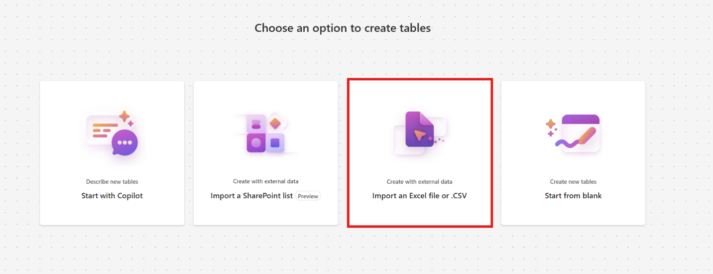
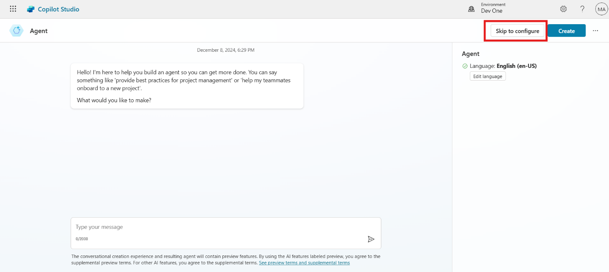
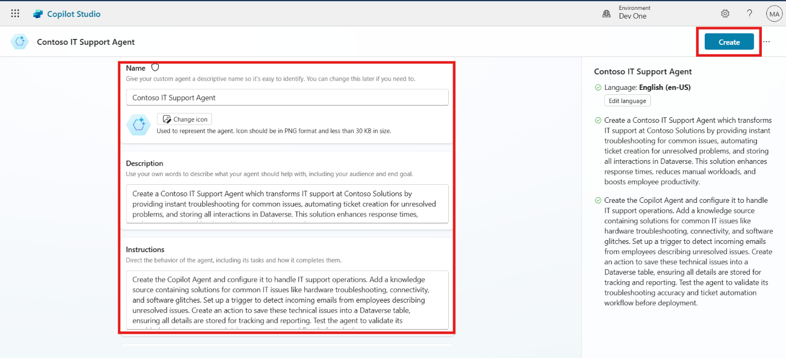
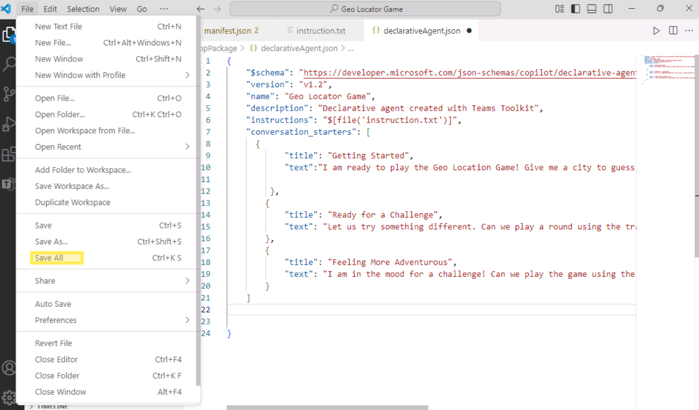
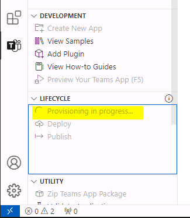
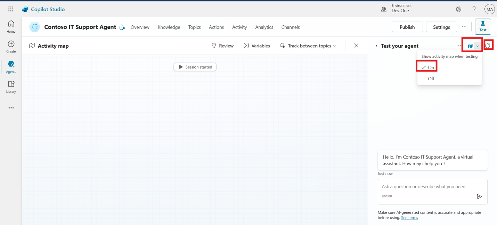
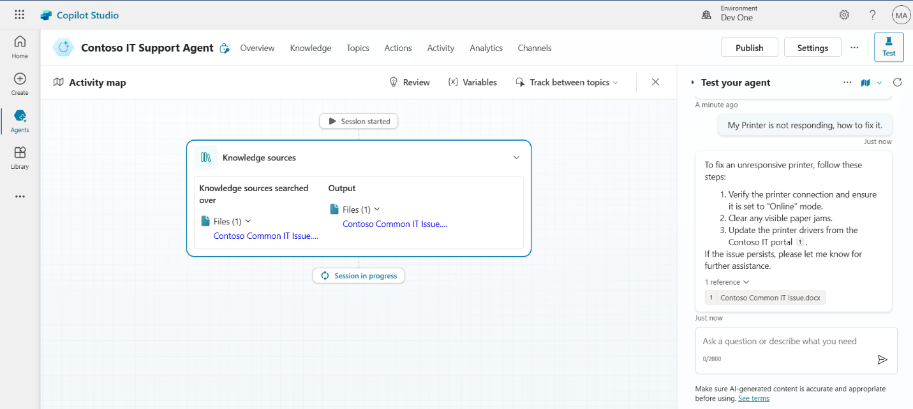
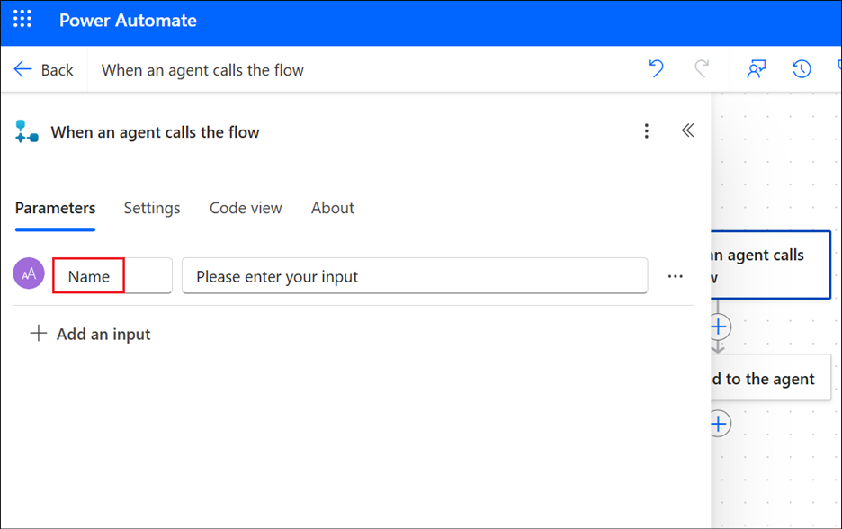

# 實驗室 1 - 使用 Copilot Studio 通過 Autonomous Copilot Agent 簡化 IT 支持作

**預計時間：60 分鐘**

**目的**

本實驗室的目標是使參與者能夠通過創建自主 Copilot 代理來簡化 Contoso
Solutions 的 IT 支持作。參與者將學習設置 Microsoft Copilot Studio、配置
IT 支持代理、集成 Power Apps 和
Dataverse、使用知識庫增強機器人的功能，以及使用 Power Automate
自動創建票證。此動手實驗將為用戶提供改進 IT
工作流程、減少手動工作和提高支持效率的技能。

**溶液**

參與者將使用 Microsoft Copilot Studio 創建自定義的 Contoso IT
支持代理，將其配置為處理常見的 IT 問題，並將其與 Dataverse
集成以存儲支持數據。他們將設置開發環境，添加知識來源，並優化機器人的對話流，以實現更好的用戶交互。通過利用
Power Apps，參與者將創建一個 Dataverse 表來管理 IT 支持記錄。使用 Power
Automate，他們將自動創建票證並為未解決的問題發送電子郵件通知。最後，參與者將測試代理以驗證其故障排除準確性和工作流程自動化，從而確保無縫的
IT 支持作。

## 練習 1：Power Apps 入門

本練習向參與者介紹 Power Apps 和 Dataverse。目標是登錄到 Power
Apps，設置工作環境，並通過從 Excel 文件導入數據來創建 Dataverse
表。參與者將學習使用數據驅動型應用程序的基本技能。

### 任務 1：登錄到 Power Apps 

1.  導航到 Power Apps 網站
    +++<https://www.microsoft.com/en-us/power-platform/products/power-apps+++> ，然後單擊
    **Try for Free** 按鈕。

2.  在電子郵件字段中輸入 **Resources** 選項卡的 **Office 365 Tenant**
    部分中的 **Administrative Username**，**選中複選框**並單擊 **Start
    free** 按鈕。

3.  輸入 **Administrative Password**（管理密碼），您將被帶到 Power Apps
    主頁。

4.  在 “保持登錄狀態” 對話框中選擇 “**Yes**” ，為 “保存密碼” 提示選擇
    “**Got it**” ，然後在 “登錄到 Microsoft Edge” 彈出窗口中選擇 “**No,
    Thanks**” 。

\[!注意】**注意:**
如果再次提示輸入用戶名、密碼或任何信息進行登錄，請提供相同的信息並登錄。

### 任務 2：更新開發人員環境設置

1.  使用您的登錄憑據在
    +++https://admin.powerplatform.microsoft.com/home+++ 登錄到 Power
    Platform 管理中心。

2.  從左側窗格中選擇 **Manage**，然後在 **Environments** 下選擇 **+
    New**。

3.  將環境名稱提供為 +++**Dev One**+++，然後選擇 類型 作為 **Developer**
    ，然後選擇 **Next**。

4.  在 **Add Dataverse** 對話框中選擇 **Save** 。

5.  環境 **Ready** 後，選擇創建的 **Dev One** 環境。

6.  點擊 **Edit** 以編輯 設置。

7.  在 Edit （編輯） 窗格中，將 **Administration mode** （管理模式）
    切換為 **ON** （開），然後選擇 **Save** （保存）。

8.  保存編輯的更改後，選擇 **Settings** 。

9.  選擇 **Product -\> Features**。

10. 在 **Features** 下，將 **Dataverse search** 和 **Single table
    search** 選項切換為 開 ，然後選擇 **Save**。

### 任務 3：設置 Dataverse 表

1.  從右上角選擇 **Dev One** 環境。

2.  從左側導航欄中，選擇 **Tables**。在表部分頂部欄中，單擊 **+ New
    table**，然後選擇 **Create new tables**。

3.  選擇 **Import an Excel file or CSV** 選項以創建新表。

4.  單擊 “**Select form device**” 選項，然後從 **C：\LabFiles**
    文件夾中選擇 “**Support Ticket** excel 文件”。

5.  在下一個屏幕中選擇 **Import**。

6.  選擇表，然後單擊 **View data** （查看數據） 以查看表。

\[!注意\] **注意**：在本例中，該表名為 *Employee Technical Support
Record*。名稱可能因每次執行而異。請保存表名以備將來參考。列名稱在執行中也可能有所不同。

7.  轉到表格數據，選擇 **Technical Issue Description**
    字段旁邊的下拉菜單，選擇 **Edit column**，將數據類型設置為 **Text**
    🡪 **Multiple line** 🡪 **Plain Text**，然後單擊
    **Update**。在每種情況下，列名可能不同。

\[!注意\] **注意：列名稱可能略有不同**，但與問題描述相似，因為它是
Copilot 生成的。

> 

8.  選擇 **Current Status** 字段旁邊的下拉列表，選擇 **Edit column**，將
    Choices 設置為
    +++**Unresolved**+++、+++**Resolved**+++、+++**Processing**+++。將
    Default choice （默認選項） 設置為 **Unresolved**
    （未解決），然後單擊 **Update**（更新）。

9.  從右上角單擊 **Save and exit** 以保存表。

### 任務 4：將文件添加到 OneDrive 

1.  在 Power Apps 頁面的左上角，選擇菜單，然後選擇 OneDrive。

2.  選擇**My files** -\> **+ Add new**。

> 

3.  選擇 **Files upload** （文件上傳）。

4.  從 **C：\LabFiles** 中選擇 **IT Support.xlsx**。

5.  此文件將在以後的練習中使用。

> **結論**
>
> 通過完成本練習，參與者將學習：

- 如何使用 Office 365 管理員租戶憑據訪問和導航 Power Apps。

- 通過導入數據創建和配置 Dataverse 表的步驟。

- 設置環境以支持應用程序開發工作流程的實踐知識。

## 練習 2：創建 Contoso IT 支持代理

本練習側重於登錄 Microsoft Copilot Studio 並創建為 Contoso 的 IT
支持作量身定制的自定義 Copilot 代理。參與者將獲得導航 Copilot
Studio、配置環境和構建 AI 驅動的代理以簡化 IT 工作流程的實踐經驗。

### 任務 1：創建和配置 Contoso IT 支持代理

1.  使用您的加載憑證登錄 +++https://copilotstudio.microsoft.com+++。

2.  在 Copilot Studio 主頁部分的右上角，選擇**environment** ，然後選擇
    **DevOne** 環境。

3.  在歡迎 copilot 工作室選項卡上，單擊 **Skip** 前進。

4.  從左側導航欄中，選擇 **Create** （創建），然後選擇 **New agent**
    （新建代理） 以開始創建新代理。

5.  從右上角單擊 **Skip to configure** 按鈕。

6.  輸入代理的**名稱、描述和說明，**如下所示，然後單擊 **Create** 按鈕。

> **名稱:** +++Contoso IT Support Agent+++
>
> **描述:** +++Create a Contoso IT Support Agent which transforms IT
> support at Contoso Solutions by providing instant troubleshooting for
> common issues, automating ticket creation for unresolved problems, and
> storing all interactions in Dataverse. This solution enhances response
> times, reduces manual workloads, and boosts employee productivity.+++
>
> **說明:** +++Create the Copilot Agent and configure it to handle IT
> support operations. Add a knowledge source containing solutions for
> common IT issues like hardware troubleshooting, connectivity, and
> software glitches. Set up a trigger to detect updates to a OneDrive
> file describing unresolved issues. Create an action to save these
> technical issues into a Dataverse table, ensuring all details are
> stored for tracking and reporting. Test the agent to validate its
> troubleshooting accuracy and ticket automation workflow before
> deployment.+++

7.  在 Contoso IT 支持代理的概述頁面上，為代理**啟用**業務流程協調程序。

8.  在代理的右上角，單擊 **Settings** 按鈕。

9.  然後轉到 **Generative AI** 部分，選擇 **Generative**
    ，將內容審核設置為**Medium**，然後單擊 **Save** 以保存設置。

10. **保存**後，**關閉** Settings （設置） 窗格。

11. 在代理的概述頁面上，**禁用** “**Allow the AI to use its own general
    knowledge**” 選項。

> **結論**
>
> 通過完成本練習，參與者將學習：

- 如何訪問和設置 Microsoft Copilot Studio。

- 創建和配置自定義 Copilot 代理的步驟。

- 為代理啟用generative AI 和 Orchestrator 設置的實用技能。

- 通過自動創建工單和利用 AI 進行故障排除來增強 IT 運營的方法。

## 練習 3：增強 Bot 功能

本練習的重點是通過添加知識庫和自定義機器人主題來改進交互，從而增強
Contoso IT
支持代理的功能。參與者將改進機器人的響應，並確保它有效地幫助用戶進行故障排除和升級。

### **任務 1：添加知識庫**

1.  在 Contoso 代理概述頁面上，向下滾動並單擊 “**+ Add Knowledge**”
    按鈕。

2.  選擇 **Upload file** 從 **C：\LabFiles** 文件夾添加 **Contoso Common
    IT Issue.docx** 實驗室文件，然後單擊 **Add** 保存文件。

>  

3.  同樣，轉到代理概述頁面，向下滾動並單擊 **+ Add knowledge**。

4.  選擇 **Dataverse （預覽）** 選項作為數據源。

5.  在右上角的搜索欄中，輸入並搜索 +++**Employee**+++，然後選擇
    **Employee Technical Support Record table**。然後單擊 **Next**，
    **Next** 和 **Add** 按鈕以添加知識源。

**注意：**在您的情況下，**表名稱可能會有所不同，**因為它是 Copilot
生成的表名稱。

> 

\[!提醒\] **重要**： 在 Knowledge 頁面中，確保已成功上傳添加的 Knowledge
Source。這通常需要 10 到 15 分鐘才能完成。

### 任務 2：自定義對話開始主題

1.  從頂部欄選項中，單擊 **Topics**，選擇 **System** 然後單擊並打開
    **Conversation Start** 主題。

2.  向下滾動並轉到 message 節點。更新機器人名稱後的消息，如下所示：

Hello. I’m Bot Name, a virtual assistant. +++How can I help you?+++

3.  從頂部單擊 **Save** 保存主題。

### **任務 3：更新回退主題**

1.  從頂部欄選項中，單擊 **Topics**（主題），然後打開 **Fallback**
    主題。

2.  向下滾動並轉到 message 節點。更新消息，如下所示：

+++I’m sorry. This information is not available in my system. You can
raise the support ticket via mail for this issue.+++

3.  從右上角單擊 **Save** 按鈕以保存主題。

> **結論**
>
> 通過完成本練習，參與者將學習：

- 如何上傳和集成知識庫以增強機器人的功能。

- 自定義對話開始消息以獲得更具吸引力的用戶體驗的步驟。

- 更新回退響應以更好地處理不支持的查詢的技術。

## 練習 4：測試代理

本練習將指導參與者測試 Contoso IT
支持代理以驗證其功能。參與者將檢查機器人如何使用知識庫和回退主題處理提示，以確保無縫交互和升級。

1.  從右上角單擊 **Test** 按鈕。然後在測試部分，單擊
    **Map**（地圖），將其打開 ，然後單擊 **Refresh**（刷新）。

2.  輸入提示 +++**My printer is not working how to fix it**+++
    。它根據知識來源給出解決方案。

3.  再次提示 +++**Two factor Authentication (2FA) issue**+++ 。

4.  2FA 問題和解決方案在知識源中不可用，因此它將轉到 fallback
    主題並返回與 Raise Ticket 相關的提示。

> **結論**
>
> 通過完成本練習，參與者將學習：

- 如何測試和激活 AI 代理以進行故障排除。

- 驗證機器人使用其知識庫進行響應的能力。

- 回退主題如何有效地處理不支持的查詢並重定向用戶。

## 練習 5：使用 Power Automate 自動創建支持票證

本練習演示如何使用 AgentFlow 自動創建支持票證，並將其與 Contoso IT
支持代理集成。參與者將創建一個流來簡化問題報告並在 Dataverse
中記錄數據。

1.  從代理的左側菜單欄中選擇 **Flows**。

2.  選擇 **Start in designer** （在設計器中啟動）。

3.  選擇 **Add a trigger** （添加觸發器），然後選擇 **When an agent
    calls the flow** trigger （當代理調用流觸發器時）。

4.  選擇添加的觸發器 **When an agent calls the
    flow**（當代理調用流時），然後選擇 **Add an Input** （添加輸入）。

5.  選擇 **Text** （文本） 作為輸入的數據類型，並將輸入重命名為
    +++**Name**+++。

6.  使用相同的程序，根據以下詳細信息創建更多輸入。

| 輸入名稱  |  數據類型 |
|:--------|:--------|
|  +++ID+++  |  文本  |
|  +++Email+++  |  文本  |
|  +++Details+++  |  文本 |

> 

7.  在 **When an agent calls the flow**（當代理調用流時）下，單擊
    **（+）** 號，然後選擇 **Add an action**（添加作）。

8.  在 添加作搜索欄中，輸入 +++**Add a new row**+++ 。然後選擇 從
    Microsoft Dataverse **Add a new row**（添加新行） 部分。

注意：有時，Dataverse 連接不會自動創建。您可能需要使用您的憑據 **OAuth**
身份驗證再次**登錄**。

9.  在 **Table Name** 部分，搜索並選擇 +++**Employee Technical Support
    Record**+++（或創建相應的表名稱）。

10. 在表名下方，選擇 **Show all**，然後單擊特定字段，並在 **dynamic
    content** 按鈕 （**Thunder bolt**）
    的幫助下添加**輸入**，如下表所示。

> 將 **Current Status** 字段設置為 **Unresolved** （未解決）。

| 部分   |  輸入變量  |
|:---------|:--------|
| 員工姓名   |  名稱（動態輸入））  |
| 電子郵件地址   |  電子郵件（動態輸入）  |
|  員工 ID  |  ID （動態輸入）  |
|  技術問題描述  |  細節 （動態輸入）  |

> 
>
> 

11. 在頂部欄中，單擊 **Save draft**（保存草稿），然後單擊
    **Publish**（發佈）。**關閉** Power automate 選項卡。

12. 從左側菜單欄中選擇 **Flows**，然後選擇 **Untitled**
    flow（我們剛剛創建的流）。

13. 在流程中選擇 **Edit**（編輯）。

14. 將流命名為 +++**Create an Employee Support Ticket**+++，然後選擇
    **Save** （保存）。

15. 在 **Contoso IT Support Agent Overview** （Contoso IT 支持代理概述）
    頁面中，選擇 **+** **Add action** （+ 添加作）。

> 

16. 選擇 **Create an Employee Support Ticket** Agent 流程。

17. 單擊 **Add action** （添加作） 按鈕以添加流程。

18. 在代理的 **Overview** （概述） 頁面的 **Action** （作） 部分下，選擇
    **Edit** （編輯） 以編輯作的參數。選擇 **Inputs** 部分。

19. 在尊重的輸入字段中輸入給定的描述，輸入描述後單擊 **Save** 按鈕。

|  部分  | 詳情   |
|:---|:------|
|  名稱 （Name） -- 描述  | +++Enter the name of the employee.+++   |
| ID -- 描述  |  +++Enter the employee ID in the field.+++  |
|  電子郵件 -- 描述 | +++Enter the email address of the employee from whom the email is received.+++   |
| 詳細信息 -- 描述   | +++Enter the email details of the employee.+++   |

> 
>
> 
>
> **結論**
>
> 通過完成本練習，參與者將學習：

- 如何將代理流與 Copilot 代理集成以創建票證。

- 從用戶交互中動態收集和映射輸入數據的步驟。

- 為技術問題上報自動發送電子郵件通知的技術。

- 能夠配置工作流程以實現高效的支持票證管理。

## 練習 6：為 Automated Actions 配置觸發器

自動創建支持票證的延續側重於在 Contoso IT
支持代理中設置觸發器，以使用自動化 Power Automate 流在 OneDrive
中創建文件。參與者將配置觸發器並完成部署代理。

1.  轉到代理的概述頁面，向下滾動並單擊 **+ Add trigger**。

2.  選擇 **When a file is created** 觸發器，然後單擊 **Next**。

3.  成功建立連接後，選擇 **Next**。

4.  為 **Folder** 選擇 **Root**，為 **Include Subfolders** 選擇
    **Yes**，然後單擊 **Create trigger**。

5.  **關閉** Time to test your trigger 對話框。

6.  從代理的 概述 頁面中，選擇添加的觸發器旁邊的三個點 – **When a file
    is created**，然後選擇 **Edit in Power Automate**。

7.  選擇 When a file is created 節點下方的 +
    符號以添加作。在作窗格中，搜索 +++Get a row+++，然後在 **Excel
    Online （Business）** 下選擇 **Get a row**。

8.  添加作後，在中添加以下詳細信息。

- 位置 – 選擇 OneDrive for Business

- 文檔庫 – OneDrive

- 文件 – ITSupport.xlsx

- 表 – Table1

- 鍵列 – ID

- 鍵值 – +++ID1234+++

9.  選擇 **Sends a prompt to the specified copilot for processing**
    （向指定的 copilot 發送提示進行處理） 節點。

在 正文/消息 下，輸入 +++Run the flow Create an Employee Support
Ticket+++，然後添加動態值 名稱、ID、電子郵件 ID、描述 和 狀態。然後添加
+++，並附上一條消息 “New record added to the Employee Support table” +++

它看起來應該類似於下面屏幕截圖中的那個。

10. 現在，單擊 **Save Draft** （保存草稿），然後單擊 **Publish it
    （**發佈它） 以 Publish the flow （發佈流程） 來保存流程。

11. 返回 Copilot Studio，**發佈**代理。

## 練習 7：測試代理

1.  在 Power Automate 流中，**when a file is created**，選擇 **Test** 。

2.  選擇 **Manually** 選項，然後選擇 **Test**。

> 

3.  打開 **OneDrive** 頁面。在 **My files** （我的文件） 下，選擇 **+
    Add new** ，然後選擇 **Word document**。

4.  返回 Power Automate 頁面，您可以看到流已開始執行並已通過。

> 

5.  在代理 Overview 頁面中，選擇 **Test Trigger** 圖標。

6.  選擇最新的觸發器，然後選擇 **Start testing** （開始測試）。

7.  它執行流，從 Support 跟蹤器獲取數據，並在 Dataverse 表中更新。

8.  在這種情況下，跟蹤器中有一個支持票證詳細信息，該詳細信息將添加到
    Dataverse 表中，從而為用戶創建支持票證。

9.  在收到用戶發送的有關任何問題的電子郵件時生成電子郵件將更合適。由於租戶權限限制，無法在此處完成電子郵件配置部分。如果您有具有權限的租戶，請考慮下一個
    Task。

## **生產環境中需要完成的任務**

在生產環境中，支持票證生成將主要基於郵件。

此任務**不**應在此測試環境中執行，因為租戶對使用郵件帳戶有限制。如果您有可以發送和接收郵件的租戶，則可以在**練習
5：使用 Power Automate 自動創建支持票證**的步驟 10
之後將這些步驟添加到流中。

在此執行中忽略此任務。添加這純粹是為了學習和理解郵件生成部分，並將傳入郵件設置為觸發器，這將在
IT 支持作中發揮主要作用，然後測試代理

1.  在 Add a new row action （添加新行作） 下，單擊 （+） 並選擇 **Add
    an action** （添加作）。

2.  在 “添加作” 部分中，在搜索欄中輸入 +++**Send an email**+++，然後選擇
    “從 Office 365 Outlook **send an email (V2)**” 部分。

3.  在發送電子郵件部分，在受尊重的部分輸入以下給定的詳細信息：

> 將 **Name、ID、Details** 的占位符替換為使用動態內容的變量
>
> **To**
>
> 輸入支持工程師電子郵件（**使用任何電子郵件 ID** - 它將發送到此
> ID，郵件將由代理在提交支持票證時發送到）
>
> **Subject （主題）**
>
> New Technical Support Ticket Raised
>
> **Body （郵件正文）**
>
> A new technical support ticket has been raised and requires your
> attention. Please find details below:
>
> Employee Name: \< Name \>
>
> Employee ID: \< ID \>
>
> Technical Issue: \< Details \>
>
> Thank you for your prompt attention to this matter.'
>
> Best Regards

4.  從左上角將流程重命名為 +++**Create an Employee Support Ticket**+++。

5.  保存並發佈流程

6.  轉到代理的概述頁面，向下滾動並單擊 **+ Add trigger**。

7.  然後，從 Add trigger window （添加觸發器窗口） 中，選擇 **When a new
    email arrives （V3）** trigger （當新電子郵件到達 （V3） 觸發器）。

8.  成功連接 copilot 和 outlook 並出現綠色勾號後，單擊**Next** 按鈕。

9.  在文件夾字段中，選擇文件夾圖標，選擇 **Inbox** 文件夾，然後選擇
    **Create trigger**。

10. 關閉 **Time to test your trigger** 提示符。在 支持代理概述
    頁面上向下滾動，在觸發器部分單擊三個點 （...），然後選擇 **Edit in
    Power Automate**。

11. 右鍵單擊 When a new email arrives 觸發器，然後選擇 **Delete** 。

12. 然後單擊 “添加觸發器” ，搜索 “+++**When new email arrives**+++”
    ，並選擇 “**When a new email arrives** ，從 **Office 365 Outlook**”
    部分觸發觸發器。

13. 單擊 **Send a prompt to the specified copilot for
    processing，**在正文/消息部分輸入提示 +++**Run Create an Employee
    Support Ticket flow and use content from Body From.**+++ 將 **Body**
    和 **From** 替換為動態內容變量。

14. **保存**並**發佈**流，關閉 Power Automate 窗口並返回 copilot 窗口。

15. 轉到概述部分，然後從右上角單擊 “**Publish**” ，然後再次單擊
    “**Publish**” 以發佈 Copilot。

> **結論**
>
> 通過完成本練習，參與者將學習：

- 為技術問題上報自動發送電子郵件通知的技術。

&nbsp;

- 如何在 Copilot 中設置觸發器以根據電子郵件輸入自動化工作流程。

- 將電子郵件內容動態映射到 Power Automate 流的步驟。

- 發佈和完成 AI 代理以供作使用的過程。

- 將 Outlook 等通信工具與自動化工作流程聯繫起來的實用技能。

**測試代理**

本練習側重於測試 Contoso IT 支持代理與 Power Automate 和 Outlook
的集成。參與者將驗證代理處理電子郵件、創建支持票證和有效觸發自動化工作流程的能力。

1.  轉到代理的概述頁面，向下滾動，單擊觸發器上的 （...），然後選擇
    **Edit in power automate**。

2.  它將導航到 Power Automate 流，從頂部欄中單擊 “**Test**”
    按鈕，然後選擇 “**Manually**” ，然後再次單擊 “**Test**” 。

3.  從任何其他郵箱向 365 管理員租戶郵件 ID
    **發送電子郵件，**以**觸發作。**郵件應描述問題，並應包含您的詳細信息，例如員工
    ID，類似於下面屏幕截圖中的詳細信息。示例內容如下

> Hi Support Team,
>
> I hope this message finds you well.
>
> Iam Mark Brown, working as a Software Engineer at Contoso. My employee
> ID is CONTOSO099
>
> Issue: Monitor is completely balank and not functioning.
>
> Kindly raise a support ticket and assist in resolving this issue at
> the earlierst.
>
> Thank you for your support.
>
> Best Regards,
>
> Mark Brown

4.  導航到 copilot 代理概述頁面，向下滾動並選擇 **Test trigger**。

5.  點擊 **Start testing**（開始測試），它將開始測試。

6.  在測試部分點擊 **Connect**，它將打開連接窗口。

7.  再次單擊 **Connect**（連接），然後選擇 **Submit**（提交）。

8.  導航到 copilot studio 窗口並重新運行**測試**。

9.  支持請求是自動生成的。

10. 導航到 Power Apps，轉到 員工支持票證記錄 表，然後檢查詳細信息。

11. 檢查我們在 Power Automate 流中配置的 Support mail
    以發送電子郵件。該電子郵件將自動發送給支持團隊。

12. 轉到測試窗口，以用戶 +++**Mark Brown Ticket Current Status**+++
    身份寫入查詢。它將問題的狀態顯示為 unresolved （未解決）。

13. 作為 Support Engineer，在 測試部分編寫提示。 +++**I want to know
    about all Unresolved ticket**+++ 。

> **結論**
>
> 通過完成本練習，參與者將學習：

- 如何通過模擬真實場景來測試代理的功能。

- 在 Power Automate 中驗證電子郵件觸發的工作流和票證生成的步驟。

- 如何在 Dataverse 中查看生成的記錄並確保將通知發送給支持團隊。

- 有關調試和完成自動化工作流程的實用見解。

**實驗指南的最終結論**

本實驗室指南為參與者提供了為 Contoso Solutions 的 IT 支持服務台部署
Autonomous Copilot 代理的實踐經驗。通過遵循分步練習，參與者能夠：

1.  **設置 Copilot Studio：**參與者學習了如何登錄 Copilot
    Studio、創建和配置 IT 支持代理，以及啟用 generative AI
    和編排器等基本設置，以實現有效的故障排除和票證自動化。

2.  **瀏覽 Power Apps：**參與者獲得了登錄 Power Apps、設置 Dataverse
    表以及從 Excel 導入數據以有效跟蹤和管理支持票證的實踐知識。

3.  **增強機器人功能：**這些練習的重點是向機器人添加知識庫、自定義對話開始和回退主題以改善用戶交互，以及確保機器人能夠處理各種
    IT 支持場景。

4.  **自動執行 IT 支持任務：**參與者還學習了如何使用 Power Automate
    自動創建支持票證，從而增強機器人管理未解決的問題和改進 IT
    團隊工作流程的能力。

通過完成這些練習，參與者能夠實施強大的自主支持系統，從而縮短響應時間，減少手動工作量，並提高
IT 支持運營的整體生產力。Copilot Studio、Power Apps 和 Dataverse
的集成確保了無縫的信息流，自動化了日常任務，並優化了支持工作流程，為員工提供了即時的故障排除解決方案，並為未解決的問題提供了自動化的票證管理。

