# 实验室 1 - 使用 Copilot Studio 通过 Autonomous Copilot Agent 简化 IT 支持作

**预计时间：60 分钟**

## 目的

本实验室的目标是使参与者能够通过创建自主 Copilot 代理来简化 Contoso
Solutions 的 IT 支持作。参与者将学习设置 Microsoft Copilot Studio、配置
IT 支持代理、集成 Power Apps 和
Dataverse、使用知识库增强机器人的功能，以及使用 Power Automate
自动创建票证。此动手实验将为用户提供改进 IT
工作流程、减少手动工作和提高支持效率的技能。

解决方案

参与者将使用 Microsoft Copilot Studio 创建自定义的 Contoso IT
支持代理，将其配置为处理常见的 IT 问题，并将其与 Dataverse
集成以存储支持数据。他们将设置开发环境，添加知识来源，并优化机器人的对话流，以实现更好的用户交互。通过利用
Power Apps，参与者将创建一个 Dataverse 表来管理 IT 支持记录。使用 Power
Automate，他们将自动创建票证并为未解决的问题发送电子邮件通知。最后，参与者将测试代理以验证其故障排除准确性和工作流程自动化，从而确保无缝的
IT 支持作。

## 练习 1：Power Apps 入门

本练习向参与者介绍 Power Apps 和 Dataverse。目标是登录到 Power
Apps，设置工作环境，并通过从 Excel 文件导入数据来创建 Dataverse
表。参与者将学习使用数据驱动型应用程序的基本技能。

### 任务 1：登录到 Power Apps

1.  从实验室 VM 打开浏览器。

2.  导航到 Power Apps 网站
    +++<https://www.microsoft.com/en-us/power-platform/products/power-apps+++>，然后单击
    **Try for Free ** 按钮。

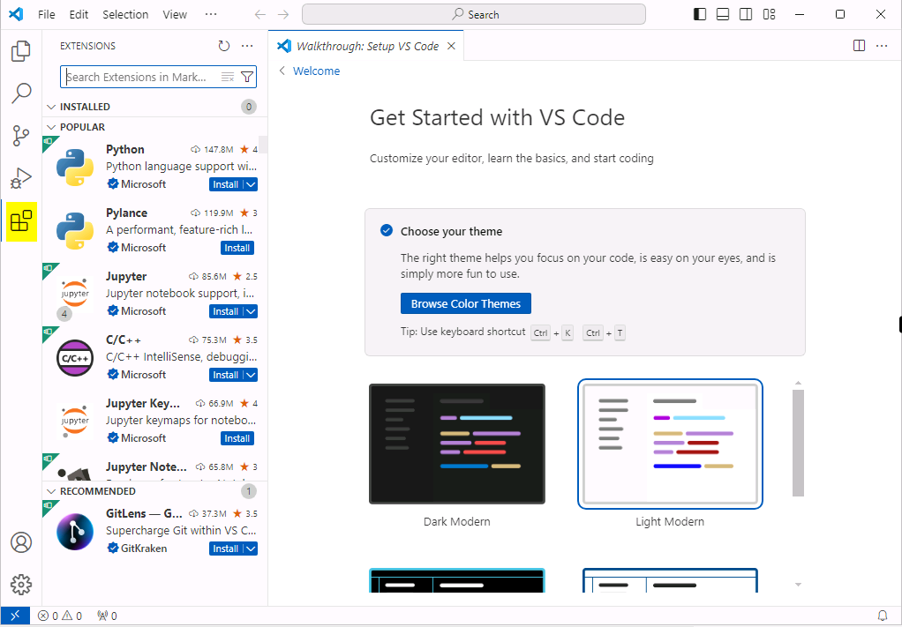

3.  将“**Resources** ”选项卡的 **Office 365
    Tenant**部分中的**Administrative
    Username** 输入到电子邮件字段中，**选**中**checkbox** ，然后单击“**Start
    free**”按钮。

4.  输入 **Administrative Password **，您将被带到 Power Apps 主页。

5.  在“Stay Signed in”对话框中选择“**Yes** ”，为“Save
    password”提示选择“**Got it** ”，然后在“登录到 Microsoft
    Edge”弹出窗口中选择“**No, Thanks** ”。 

\[！注意\]
**注意：**如果再次提示输入用户名、密码或任何登录信息，请提供相同信息并登录。

### 任务 2：设置 Dataverse 表

1.  确保已选择 **Dev One** 环境。如果尚未选择它，请选择它。

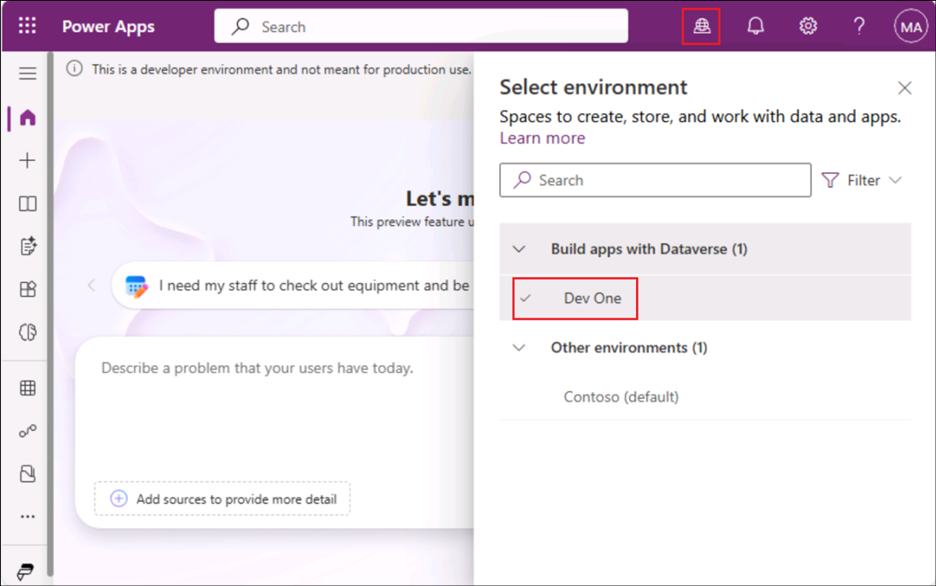

2.  从左侧导航栏中，选择 **Tables。** 在表部分顶部栏中，单击 **+ New
    table**然后选择**Create new tables**。

3.  选择 **Import an Excel file or CSV** 选项以创建新表。

4.  单击“**Select form device”**选项，然后从 **C：\LabFiles**
    文件夹中选择**“Support Ticket** excel 文件”。

5.  选择表，然后单击 **View data** 以查看表。

\[！注意\] **注意：**在本例中，该表名为 *Employee Technical Support
Record*。名称可能因每次执行而异。请保存表名以备将来参考。列名称在执行中也可能有所不同。

6.  转到表格数据，选择 **Technical Issue Description**
    字段旁边的下拉菜单，选择 **Edit column**，将数据类型设置为 **Text**
    🡪 **Multiple line** 🡪 **Plain Text**，然后单击
    **Update**。在每种情况下，列名可能不同。

\[！注意\] **注意：列名称可能略有不同**，但与问题描述相似，因为它是
Copilot 生成的。

7.  选择 **Current Status** 字段旁边的下拉列表 ，选择 **Edit
    column**，将 **Choices** 设置为
    +++**Unresolved**+++、+++**Resolved**+++、+++**Processing**+++。将
    Default choice （默认选项） 设置为 **Unresolved**，然后单击
    **Update**。

8.  从右上角单击 **Save and exit** 以保存表。

**总结**

通过完成此练习，参与者将学习:

- 如何使用 Office 365 管理员租户凭据访问和导航 Power Apps。

- 通过导入数据创建和配置 Dataverse 表的步骤。

- 设置环境以支持应用程序开发工作流程的实践知识。

## 练习 2：创建 Contoso IT 支持代理

本练习侧重于登录 Microsoft Copilot Studio 并创建为 Contoso 的 IT
支持作量身定制的自定义 Copilot 代理。参与者将获得导航 Copilot
Studio、配置环境和构建 AI 驱动的代理以简化 IT 工作流程的实践经验。

### 任务 1：登录到 Microsoft Copilot Studio

1.  在浏览器中，导航到 URL
    +++[https://copilotstudio.microsoft.com+++](https://copilotstudio.microsoft.com+++/)。

2.  如果它显示 **Setting up your copilot** 
    如下面的屏幕截图所示，请从右上角的菜单中选择 环境 ，然后选择 **Dev
    One**。否则，请忽略此步骤并继续执行步骤 3。

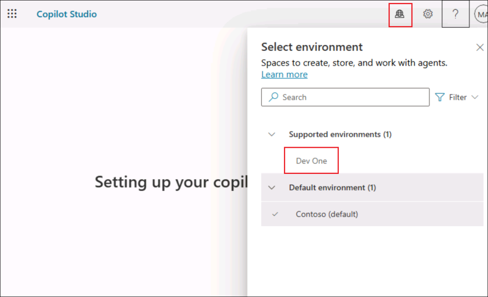

3.  单击**Start free trial**以开始 Copilot Studio 试用。

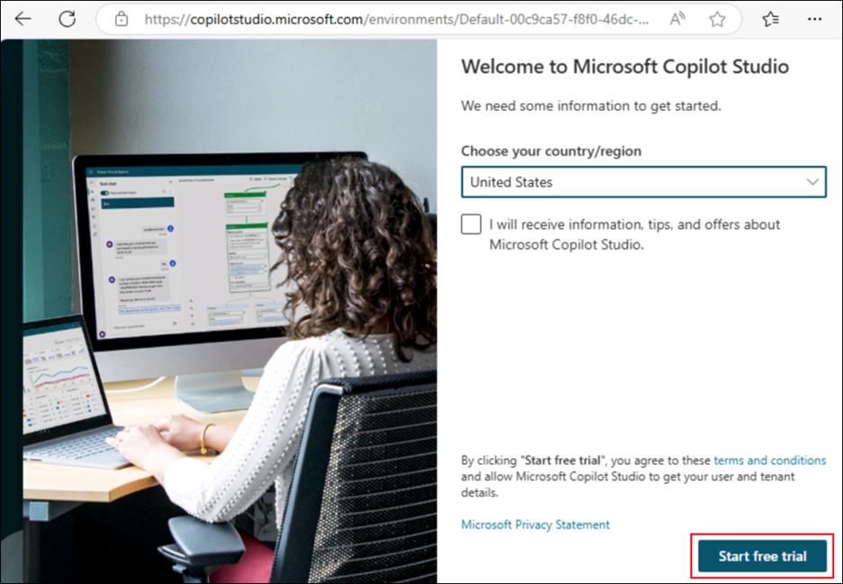

### 任务 2：创建和配置 Contoso IT 支持代理

1.  如果步骤 2 已完成上一个任务，请忽略此步骤。否则，请执行此步骤。在
    Copilot Studio 主页部分的右上角，选择**environment**，然后选择
    **DevOne** 环境。

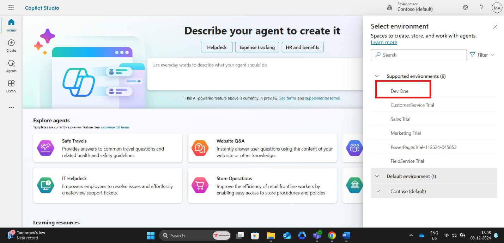

2.  在欢迎 copilot 工作室选项卡上，单击 **Skip** 前进。

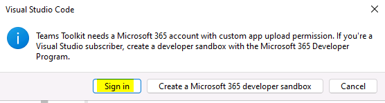

3.  从左侧导航栏中，选择 **Create** ，然后选择 **New agent**
    以开始创建新代理。

4.  从右上角单击 **Skip to configure** 按钮。

5.  输入代理的 **Name, Description and
    Instruction **，如下所示，然后单击 **Create** 按钮。

> **名字:** +++Contoso IT Support Agent+++
>
> **描述:** +++Create a Contoso IT Support Agent which transforms IT
> support at Contoso Solutions by providing instant troubleshooting for
> common issues, automating ticket creation for unresolved problems, and
> storing all interactions in Dataverse. This solution enhances response
> times, reduces manual workloads, and boosts employee productivity.+++
>
> **指示:** +++Create the Copilot Agent and configure it to handle IT
> support operations. Add a knowledge source containing solutions for
> common IT issues like hardware troubleshooting, connectivity, and
> software glitches. Set up a trigger to detect incoming emails from
> employees describing unresolved issues. Create an action to save these
> technical issues into a Dataverse table, ensuring all details are
> stored for tracking and reporting. Test the agent to validate its
> troubleshooting accuracy and ticket automation workflow before
> deployment.+++

6.  在 Contoso IT
    支持代理的概述页面上，为代理**Enable**业务流程协调程序。

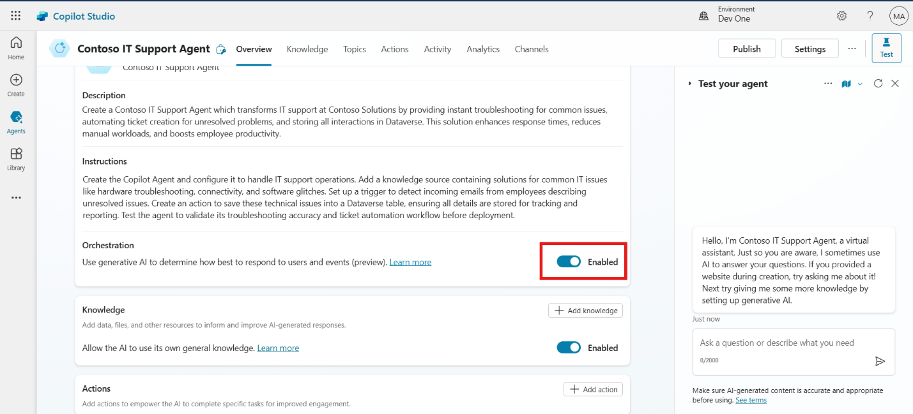

7.  在代理的overview页面上，**Disable** “**Allow the AI to use its own
    general knowledge**” 选项。

8.  在代理的右上角，单击 **Settings** 按钮 。

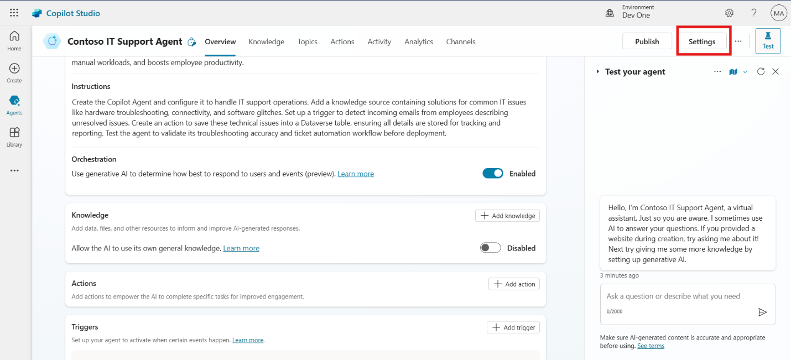

9.  然后转到 **Generative
    AI** 部分，选择**Generative**，将内容审核设置为**Medium**，然后单击保存以**Save** 设置。

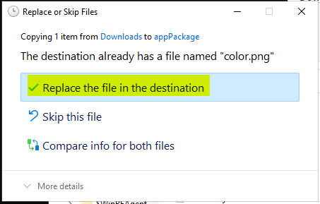

**结论**

通过完成本练习，参与者将学习:

- 如何访问和设置 Microsoft Copilot Studio。

- 创建和配置自定义 Copilot 代理的步骤。

- 为代理启用生成式 AI 和 Orchestrator 设置的实用技能。

- 通过自动创建工单和利用 AI 进行故障排除来增强 IT 运营的方法。

## 练习 3：增强 Bot 功能

本练习的重点是通过添加知识库和自定义机器人主题来改进交互，从而增强
Contoso IT
支持代理的功能。参与者将改进机器人的响应，并确保它有效地帮助用户进行故障排除和升级。

### 任务 1：添加知识库

1.  在 Contoso 代理概述页面上，向下滚动并单击“**+ Add Knowledge”**按钮。

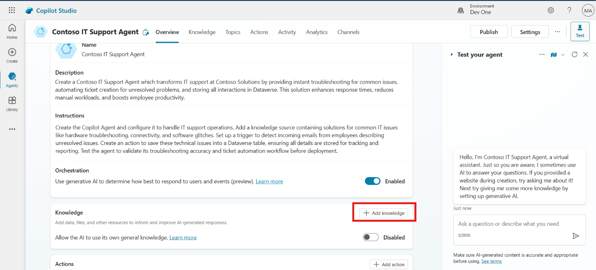

2.  选择 **Upload file**  从 **C：\LabFiles** 文件夹添加 **Contoso
    Common IT Issue.docx** 实验室文件，然后单击 添加**Add** 保存文件。

 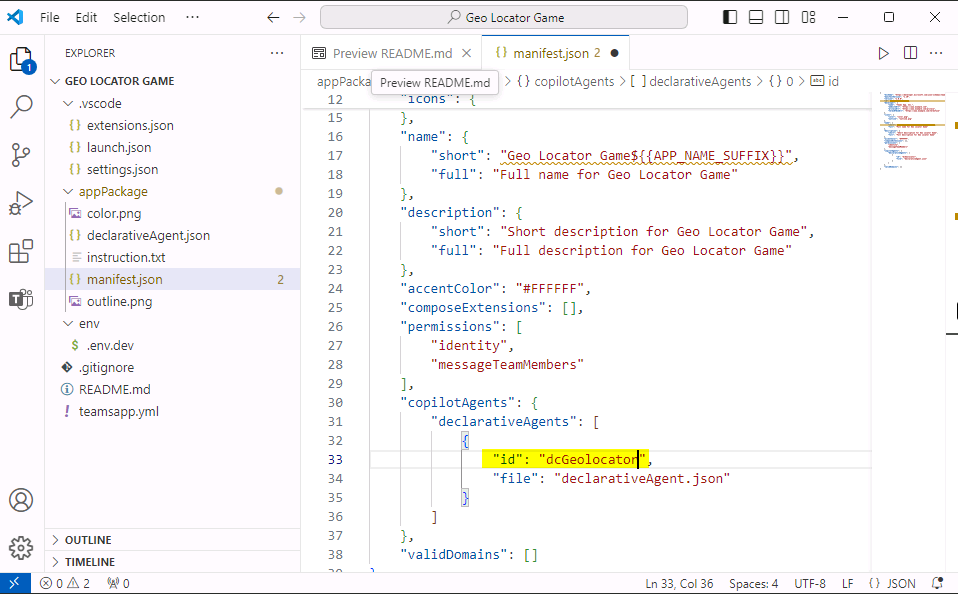

3.  同样，转到代理概述页面，向下滚动并单击 **+ Add knowledge。**

4.  选择 **Dataverse (preview) **选项作为数据源。

5.  在右上角的搜索栏中，输入并搜索 +++Employee+++，然后选择 **Employee
    Technical Support Record** table。然后单击 ** Next，  Next** 和
    **Add** 按钮以添加知识源。

**注意：**在您的情况下，**表名称可能会有所不同**，因为它是 Copilot
生成的表名称。

\[！提醒\] **重要：** 在 Knowledge 页面中，确保已成功上传添加的
Knowledge Source。这通常需要 10 到 15 分钟才能完成。

### 任务 2：自定义对话开始主题

1.  从顶部栏选项中，单击 **Topics** -\> **System**，然后单击并打开
    **Conversation Start** 主题。

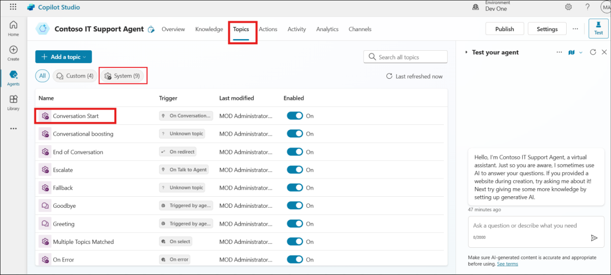

2.  向下滚动并转到 message 节点。更新机器人名称后的消息，如下所示:

你好。我是 Bot Name，一个虚拟助手。 +++How can I help you?+++

3.  从顶部单击 **Save** 保存主题。

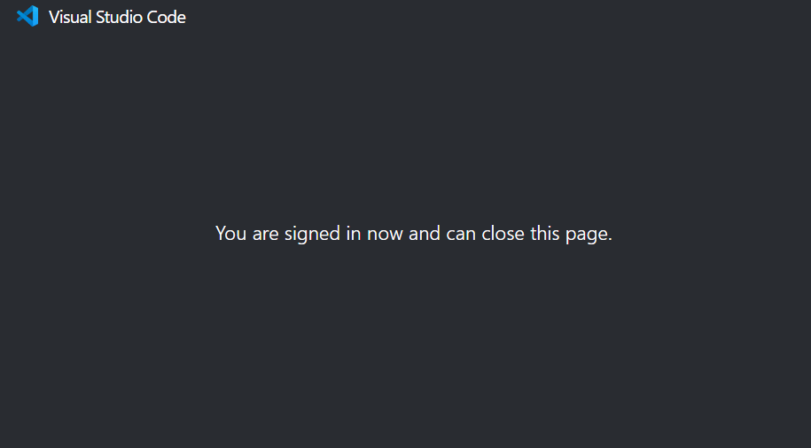

### 任务 3：更新回退主题

1.  从顶部栏选项中，单击 **Topics** -\> **System**，然后打开
    **Fallback** 主题。

2.  向下滚动并转到 message 节点。更新消息，如下所示:

+++I’m sorry. This information is not available in my system. You can
raise the support ticket via mail for this issue.+++

3.  从右上角单击 **Save** 按钮以保存主题。

**结论**

通过完成此练习，参与者将学习:

- 如何上传和集成知识库以增强机器人的功能。

- 自定义对话开始消息以获得更具吸引力的用户体验的步骤。

- 更新回退响应以更好地处理不支持的查询的技术。

## 练习 4：测试代理

本练习将指导参与者测试 Contoso IT
支持代理以验证其功能。参与者将检查机器人如何使用知识库和回退主题处理提示，以确保无缝交互和升级。

1.  从右上角单击 **Test** 按钮。然后在测试部分，单击 Map，将其** On 
    ，**然后单击 **Refresh**。

2.  输入提示 +++ **My printer is not working how to fix
    it**+++。它根据知识来源给出解决方案。

3.  再次提示 +++ **Two factor Authentication (2FA) issue**+++ 。

4.  2FA 问题和解决方案在知识源中不可用，因此它将转到 fallback
    主题并返回与 Raise Ticket 相关的提示。

**结论**

通过完成此练习，参与者将学习:

- 如何测试和激活 AI 代理以进行故障排除。

- 验证机器人使用其知识库进行响应的能力。

- 回退主题如何有效地处理不支持的查询并重定向用户。

## 练习 5：使用 Power Automate 自动创建支持票证

本练习演示如何使用 Power Automate 自动创建支持票证，并将其与 Contoso IT
支持代理集成。参与者将创建一个流来简化问题报告，在 Dataverse
中记录数据，并通过电子邮件通知支持工程师。

1.  转到代理的概述页面，向下滚动并单击 **+ Add action**。

2.  在选择作窗口中，单击左上角的 **+New Action ** ，然后选择 **New Power
    Automate Flow。**

3.  在 Power automate 流中，单击 **When an agent calls the
    flow ，**然后选择 **Add an Input。**

4.  选择 **Text**作为输入的数据类型，并将输入重命名为 **+++Name+++**。

5.  使用相同的程序，根据以下详细信息创建更多输入。

[TABLE]

6.  

7.  在 **When an agent calls the flow**下，单击 **（+）** 号，然后选择
    **Add an action**。

8.  在 添加作搜索栏中，输入 +++**Add a new row**+++。然后选择 从
    Microsoft Dataverse **Add a new row** 部分。

注意：有时，Dataverse 连接不会自动创建。您可能需要 使用您的凭据
**OAuth** 身份验证再次 **sign in**。

9.  在 **Table Name** 部分，搜索并选择 +++**Employee Technical Support
    Record**+++（或创建相应的表名称）。

10. 在表名下方，选择 **Show all**，然后单击特定字段，并在动态内容按钮
    （Thunder bolt） 的帮助下添加输入，如下表所示。应选择 **Current
    Status** 字段，并将下拉列表选为 **Unresolved** 。

[TABLE]

11. 

12. 

13. 在 Add a new row action下，单击 （+） 并选择 **Add an action** 。

14. 在“**Add an action**”部分中，在搜索栏中输入 +++ **Send an
    email**+++，然后选择“从 Office 365 Outlook **send an email
    (V2)** ”部分。

15. 在发送电子邮件部分，在尊重部分输入下面给定的详细信息:

> 将 **Name、ID、Details** 的占位符替换为 使用动态内容的变量
>
> **To**
>
> 输入支持工程师电子邮件（**使用任何电子邮件 ID** - 它将发送到此
> ID，邮件将由代理在提交支持票证时发送到）
>
> **Subject**
>
> 提出了新的技术支持工单
>
> **Body**
>
> 已提出新的技术支持票证，需要您注意。详情如下:
>
> Employee Name: \< Name \>
>
> Employee ID: \< ID \>
>
> Technical Issue: \< Details \>
>
> 感谢您及时关注此事。
>
> 此致敬意

16. 从左上角将流程重命名为 +++**Create an Employee Support Ticket**+++。

17. 在顶部栏中，单击 **Save draft**，然后单击 **Publish**。 **Close**
    Power automate 选项卡。

18. 返回 Copilot 窗口，然后单击 **Refresh** 按钮。

19. 在 Choose an action window 中，选择 **Create an Employee Support
    Ticket** 流程。

20. 单击 **Add action** 按钮以添加流程。

21. 在 代理的 **Overview** 页面的 **Action** 部分下，选择 **Edit**
    以编辑作的参数。选择 **Inputs** 部分。

22. 在相应的输入字段中输入给定的描述，输入描述后单击“**Save**”按钮。

[TABLE]

23. 

24. 

**结论**

通过完成此练习，参与者将学习:

- 如何将 Power Automate 流与 Copilot 代理集成以创建票证。

- 从用户交互中动态收集和映射输入数据的步骤。

- 为技术问题上报自动发送电子邮件通知的技术。

- 能够配置工作流程以实现高效的支持票证管理。

## 练习 6：为自动化作配置基于电子邮件的触发器

自动创建支持票证的延续侧重于在 Contoso IT
支持代理中设置触发器，以将电子邮件输入与自动化 Power Automate
流链接。参与者将配置触发器并完成部署代理。

1.  转到代理的概述页面，向下滚动并单击 **+ Add trigger**。

2.  然后，从 Add trigger window 中，选择 **When a new email arrives
    （V3） trigger**。

3.  成功连接 copilot 和 outlook 并出现绿色勾号后，单击**Next** 按钮。

4.  在文件夹字段中选择文件夹图标，然后选择**Inbox**文件夹，再选择**Create
    trigger**。 

5.  关闭 **Time to test your trigger** 提示符。在 Support agent overview
    page 向下滚动，在 trigger 部分单击三个点 **（...）** ，然后选择
    **Edit in Power Automate。**

6.  右键单击 When a new email arrives 触发器，然后选择 **Delete** 。

7.  然后单击Add a trigger，搜索+++ **When new email arrives**
    +++，然后从 **Office 365 outlook**  部分中选择**When new email
    arrives**触发器。

8.  单击**Send a prompt to the specified copilot for
    processing**，在正文/消息部分输入提示，+++**Run Create an Employee
    Support Ticket flow and use content from Body
    From.**+++将**Body**和**From**替换为动态内容变量。

9.  **Save**并**Publish**流，关闭 Power Automate 窗口并返回 copilot
    窗口。

10. 转到概述部分，然后从右上角单击“**Publish**”，然后再次单击“**Publish**”以发布
    Copilot。

**结论**

通过完成此练习，参与者将学习:

- 如何在 Copilot 中设置触发器以根据电子邮件输入自动化工作流程。

- 将电子邮件内容动态映射到 Power Automate 流的步骤。

- 发布和完成 AI 代理以供作使用的过程。

- 将 Outlook 等通信工具与自动化工作流程联系起来的实用技能。

## 练习 7：测试代理

本练习侧重于测试 Contoso IT 支持代理与 Power Automate 和 Outlook
的集成。参与者将验证代理处理电子邮件、创建支持票证和有效触发自动化工作流程的能力。

1.  转到代理的概述页面，向下滚动，单击 **（...）** on trigger，然后选择
    **Edit in power automate**。

2.  它将导航到 Power Automate 流，从顶部栏中单击 **“Test **”
    按钮，然后选择 **“Manually”**，然后再次单击 **“Test **”。

3.  从任何其他邮箱向 365 管理员租户邮件 ID
    **发送电子邮件**，以**触发作**。邮件应描述问题，并应包含您的详细信息，例如员工
    ID，类似于下面屏幕截图中的详细信息。示例内容如下

> 您好，支持团队，
>
> 我希望这条信息能找到你。
>
> 我是 Mark Brown，在 Contoso 担任软件工程师。我的员工 ID 为 CONTOSO099
>
> 问题：显示器完全不平衡，无法正常工作。
>
> 请提交支持票证并尽早协助解决此问题。
>
> 感谢您的支持。
>
> 此致敬意
>
> Mark Brown

4.  导航到 copilot 代理概述页面，向下滚动并选择 **Test trigger**。

5.  点击 **Start testing**，它将开始测试。

6.  在测试部分点击 **Connect**，它将打开连接窗口。

7.  再次单击 **Connect**，然后选择 **Submit。**

8.  导航到 copilot studio 窗口并重新运行**Test**。

9.  支持请求是自动生成的。

10. 导航到 Power Apps，转到 员工支持票证记录 表，然后检查详细信息。

11. 检查我们在 Power Automate 流中配置的 Support mail
    以发送电子邮件。该电子邮件将自动发送给支持团队。

12. 转到测试窗口，以用户 +++**Mark Brown Ticket Current Status**+++
    身份写入查询。它将问题的状态显示为 **unresolved**。

13. 作为 Support Engineer，在 test 部分编写提示。+++ I want to know
    about all Unresolved ticket+++。

**结论**

通过完成此练习，参与者将学习:

- 如何通过模拟真实场景来测试代理的功能。

- 在 Power Automate 中验证电子邮件触发的工作流和票证生成的步骤。

- 如何在 Dataverse 中查看生成的记录并确保将通知发送给支持团队。

- 有关调试和完成自动化工作流程的实用见解。

## 实验指南的最终结论

本实验室指南为参与者提供了为 Contoso Solutions 的 IT 支持服务台部署
Autonomous Copilot 代理的实践经验。通过遵循分步练习，参与者能够:

1.  **设置 Copilot Studio**：参与者学习了如何登录 Copilot
    Studio、创建和配置 IT 支持代理，以及启用生成式 AI
    和编排器等基本设置，以实现有效的故障排除和票证自动化。

2.  **浏览 Power Apps**：参与者获得了登录 Power Apps、设置 Dataverse
    表以及从 Excel 导入数据以有效跟踪和管理支持票证的实践知识。

3.  **增强机器人功能**：这些练习的重点是向机器人添加知识库、自定义对话开始和回退主题以改善用户交互，以及确保机器人能够处理各种
    IT 支持场景。

4.  **自动执行 IT 支持任务**：参与者还学习了如何使用 Power Automate
    自动创建支持票证，从而增强机器人管理未解决的问题和改进 IT
    团队工作流程的能力。

通过完成这些练习，参与者能够实施强大的自主支持系统，从而缩短响应时间，减少手动工作量，并提高
IT 支持运营的整体生产力。Copilot Studio、Power Apps 和 Dataverse
的集成确保了无缝的信息流，自动化了日常任务，并优化了支持工作流程，为员工提供了即时的故障排除解决方案，并为未解决的问题提供了自动化的票证管理。
