# Lab 2: Teams ツールキットを使用して Microsoft 365 Copilot の宣言型エージェントを構築する

**所要時間：30分**

## 目的

このLabの目的は、参加者がTeams Toolkitを用いてMicrosoft 365
Copilot用の宣言型エージェントを構築できるようにすることです。Labを完了することで、参加者は仕事の合間に楽しく学べる位置情報ゲームを作成できるようになります。Labでは、宣言型エージェントの構造を理解し、指示に従って設定し、Microsoft
365エコシステムに統合してCopilotのインタラクションをカスタマイズすることに重点を置きます。

## 解決

参加者はVisual Studio CodeにTeams
Toolkitをインストールし、開発環境を構築します。テンプレートを使用して、「Geo
Locator
Game」という宣言型エージェントのスキャフォールディングを行います。エージェントの指示をカスタマイズし、instruction.txtやmanifest.jsonなどの構成ファイルを更新します。また、このLabでは、参加者がエージェントに固有の識別子、カスタムアイコン、テスト機能を追加する方法についても指導します。その結果、都市に関するヒントを提供しながらMicrosoft
365とシームレスに統合された、完全に機能する魅力的なCopilotアプリケーションが完成します。

## 演習 1: Microsoft 365 Copilot用開発環境をセットアップする

### タスク1: Teamsツールキットをインストールする

これらのLabはTeams
Toolkitバージョン5.0に基づいています。以下のスクリーンショットに示されている手順に従ってください。

1.  Visual Studio Code
    を開き、すでに開いている**Appliances.csv**を閉じます。

2.  「Restricted Mode is intended」というメッセージが表示されたら、
    **Manage**を選択します。

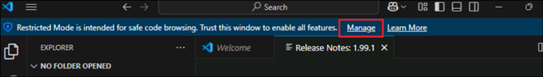

3.  「You are in Restricted mode」ダイアログで**Trust**を選択します。

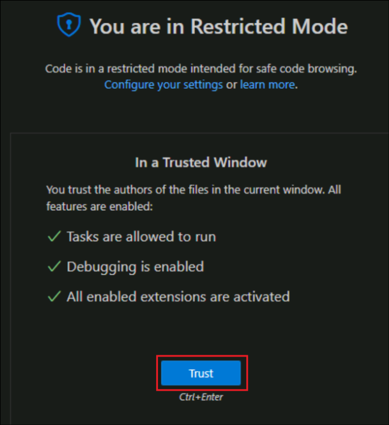

4.  Extensionsツールバーボタンをクリックします。

5.  +++ **Teams** +++ を検索し、Teams **Toolkit**を見つけて
    **Install**をクリックします**。**

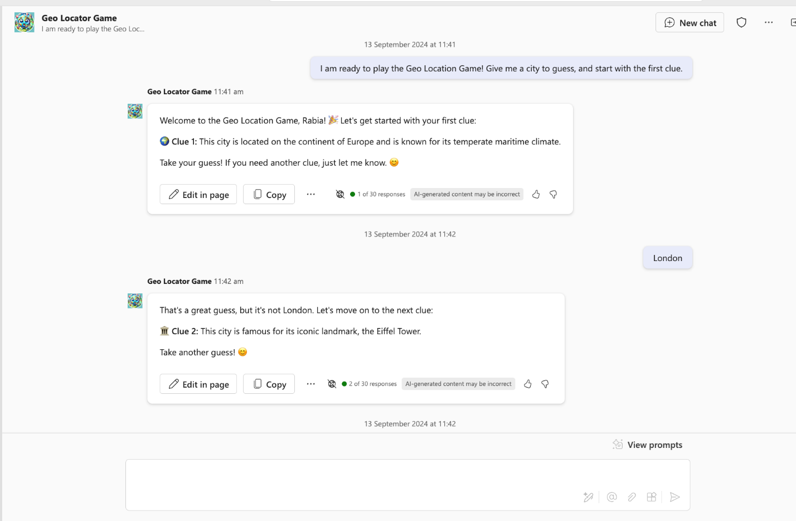

6.  インストールが完了すると、 **Teams
    Toolkit**アイコンが左側のナビゲーション
    バーに表示されます。

## 演習2: 最初の宣言的行為主体

このLabでは、Teams Toolkit for Visual Studio Code
を使用して、シンプルな宣言型エージェントを構築します。このエージェントは、世界中の都市を探索することで、仕事の合間に楽しく学びのひとときを過ごせるよう設計されています。抽象的なヒントを提示して都市を推測しますが、ヒントを多く使うほど得点が低くなります。最後に、最終スコアが発表されます。

この演習では以下のことを学習します。

- Microsoft 365 Copilot の宣言型エージェントとは

- Teams ツールキット テンプレートを使用して宣言型エージェントを作成する

- 指導通りにエージェントをカスタマイズし、ジオロケーターゲームを作成します。

- アプリの実行とテストの方法を学ぶ

- ボーナス演習のために、SharePointチームサイトが必要になります

**導入**

宣言型エージェントは、Microsoft 365 Copilot
と同じスケーラブルなインフラストラクチャとプラットフォームを活用し、お客様のニーズの特定の領域に特化して対応します。特定の分野やビジネスニーズにおける専門家として機能し、標準的な
Microsoft 365 Copilot
チャットと同じインターフェイスを使用しながら、特定のタスクに特化して対応できます。

宣言型エージェントの構築へようこそ！さあ、Copilot
を魔法のように動かしてみましょう！

このLabでは、Teams Toolkit
のデフォルトテンプレートを使用して、宣言型エージェントの構築から始めます。これは、何かを始める際の手助けとなります。次に、エージェントを地理位置情報ゲームに特化したものに修正します。

AIの目的は、世界中の様々な都市について学びながら、仕事の合間に楽しいひとときを過ごすことです。AIは抽象的な手がかりを提示し、都市を特定します。手がかりが多ければ多いほど、獲得できるポイントは少なくなります。ゲーム終了時に、最終スコアが表示されます。

また、エージェントに秘密の日記🕵🏽と地図🗺️を参照するためのファイルをいくつか提供し、プレイヤーにさらなる課題を与えます。

それでは始めましょう

**宣言的エージェントの解剖**

Copilot
の拡張機能を開発していくと、最終的に構築するのはいくつかのファイルを zip
ファイルにまとめたコレクションになります。これをアプリ
パッケージと呼びます。アプリ
パッケージをインストールして使用します。そのため、アプリ
パッケージの構成について基本的な理解をしておくことが重要です。宣言型エージェントのアプリ
パッケージは、以前に Teams
アプリを追加したことがある方であれば、そのアプリ
パッケージに似ています。すべてのコア要素については、表をご覧ください。また、アプリの展開プロセスも
Teams アプリの展開と非常によく似ていることがわかります。

[TABLE]

**注:** SharePoint、OneDrive、Web
検索などから参照データを追加したり、プラグインやコネクタなどの拡張機能を宣言型エージェントに追加したりできます。プラグインの追加方法については、このパスの今後のLabで学習します。

**宣言型エージェントの機能**

指示を追加するだけでなく、アクセスすべきナーレジベースを指定することで、エージェントのコンテキストとデータへの集中度を高めることができます。これらは「capabilities」と呼ばれ、3種類のcapabilitiesがサポートされています。

- **Microsoft Graph Connector**- Graph
  コネクタの接続をエージェントに渡し、エージェントがコネクタの知識にアクセスして利用できるようにします。

- **OneDrive and SharePoint** -
  エージェントがコンテンツにアクセスできるように、ファイルとサイトの URL
  をエージェントに提供します。

- **Web search**- エージェントのナレッジ ベースの一部として Web
  コンテンツを有効または無効にします。

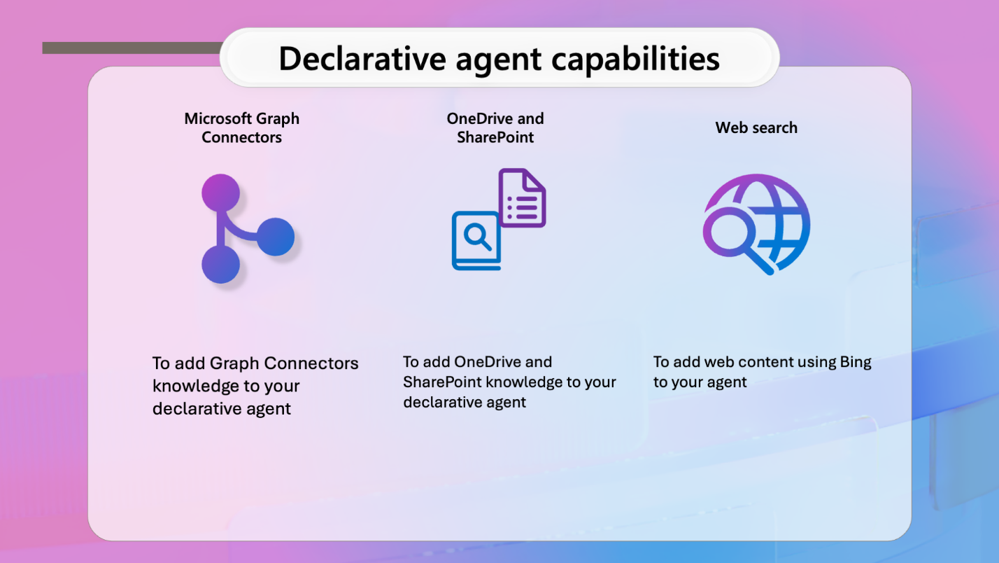

**One Drive and SharePoint**

URLはSharePointアイテム（サイト、ドキュメントライブラリ、フォルダー、またはファイル）へのフルパスである必要があります。SharePointの「直接リンクをコピー」オプションを使用すると、ファイルやフォルダーのフルパスを取得できます。これを行うには、ファイルまたはフォルダーを右クリックし、「詳細」を選択します。「パス」に移動し、コピーアイコンをクリックします。URLを指定しない場合、エージェントはログインユーザーが利用できるOneDriveとSharePointのコンテンツ全体を使用します。

**Microsoft Graph Connector**

接続を指定しないと、ログインしたユーザーが利用できるグラフ コネクタ
内容のコーパス全体がエージェントによって使用されます。

**Web Search**

現時点では、特定の Web サイトまたはドメインを渡すことはできず、これは
Web の使用のオン/オフを切り替えるものとしてのみ機能します。

## 演習3: テンプレートから宣言型エージェントを構築する

前述のアプリパッケージ内のファイル構造を理解していれば、任意のエディタを使って宣言型エージェントを作成できます。しかし、Teams
Toolkitのようなツールを使えば、ファイルの作成だけでなく、アプリのデプロイと公開も簡単に行えます。そのため、作業を可能な限りシンプルにするために、Teams
Toolkitを使用します。

### タスク 1: Teams ツールキットを使用して宣言型エージェント アプリを作成する

1.  Visual Studio Code editorのTeams Toolkit 拡張機能に移動し、**Create
    a New App**を選択します。

2.  プロジェクト
    タイプのリストから**Agent**を選択する必要があるパネルが開きます。

3.  次に、Copilot Agent
    のアプリ機能を選択するように求められます。**declarative
    agent **を選択して**Enter** キーを押します。

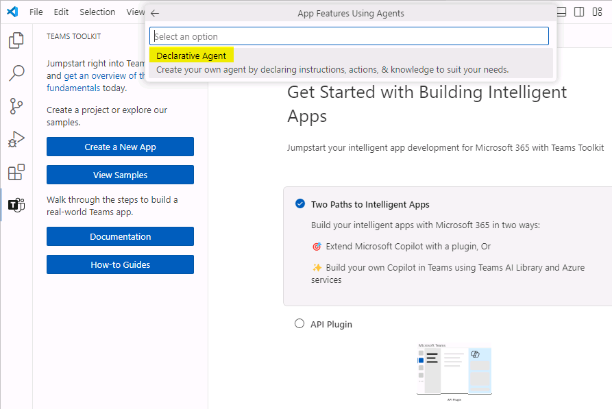

4.  基本的な宣言型エージェントを作成するか、APIプラグイン付きのエージェントを作成するかを選択するよう求められます。**No
    Plugin**オプションを選択します。

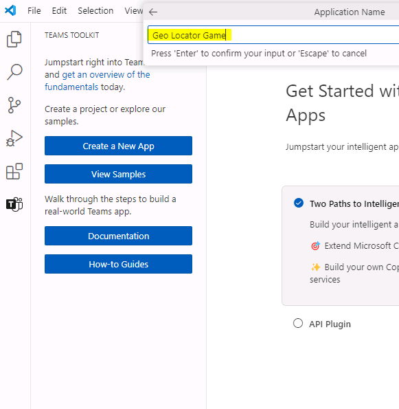

5.  次に、プロジェクト フォルダーを作成する場所を指定するための
    **Default folder** オプションを選択します。

6.  次に、アプリケーション名に+++ **Geo Locator Game**
    +++と入力し、Enter を選択します。

数秒以内に指定したフォルダにプロジェクトが作成され、Visual Studio Code
の新しいプロジェクトウィンドウで開きます。これが作業フォルダです。

7.  プロンプトが表示されたら、**Yes, I trust the
    authors **をクリックします。

> 

よくできました！ベース宣言型エージェントの設定に成功しました！次は、geo
locatorゲームアプリを作成するためにカスタマイズできるように、エージェントに含まれるファイルを確認します。

### タスク 2: Teams ツールキットでアカウントを設定する

1.  左ペインからTeams
    Toolkitアイコンを選択します。「Accounts」の下にある「Sign in to
    Microsoft 365」をクリックし、 **User1
    credentials**でログインします。Visual Studio
    Codeのポップアップで「Sign in」をクリックします。

- ユーザー名 - <+++@lab.CloudPortalCredential> (User1).Username+++

- パスワード - <+++@lab.CloudPortalCredential> (User1).Password+++

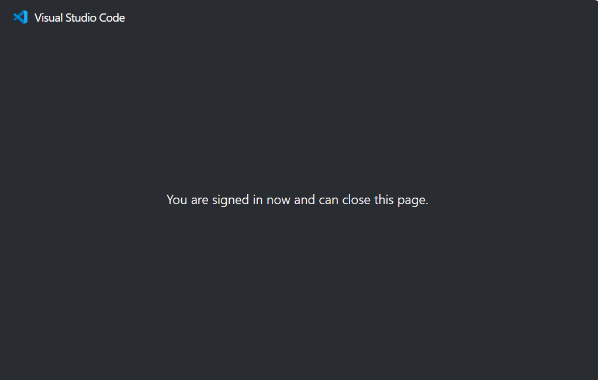

3.  セキュリティアラートダイアログで**Allow access **を選択します。

4.  ログインするとブラウザが開き、「You are signed in now and close this
    page」メッセージが表示されます。閉じてください。

5.  **Custom App Upload
    Enabled **チェッカーに緑色のチェックマークが付いていることを確認します。

6.  **Copilot Access
    Enabled**チェッカーに緑色のチェックマークが付いていることを確認します。

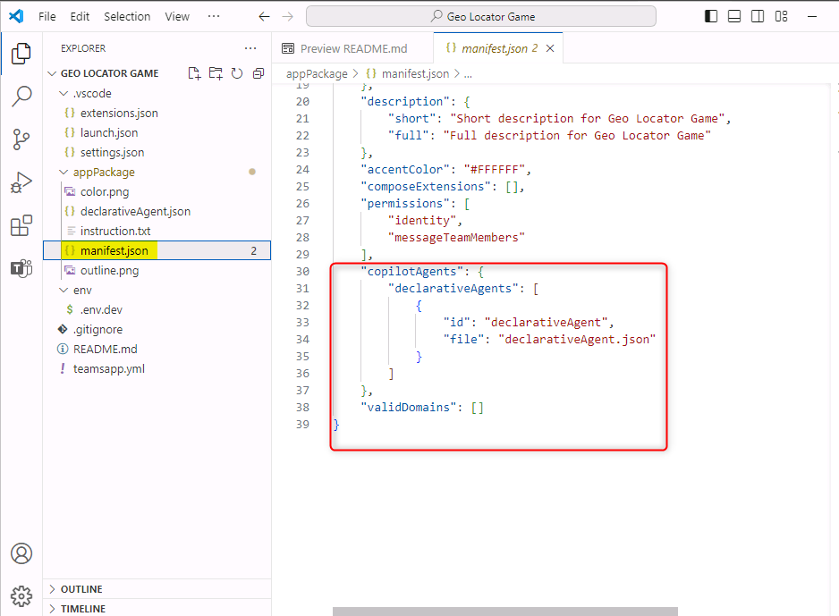

### タスク3: アプリ内のファイルを理解する

ベースプロジェクトの外観は次のようになります。

[TABLE]

1.  このLabで特に注目すべきファイルは、エージェントに必要なコアディレクティブが記述された**appPackage
    /instruction.txt**ファイルです。これはテキストファイルで、自然言語で指示を記述できます。

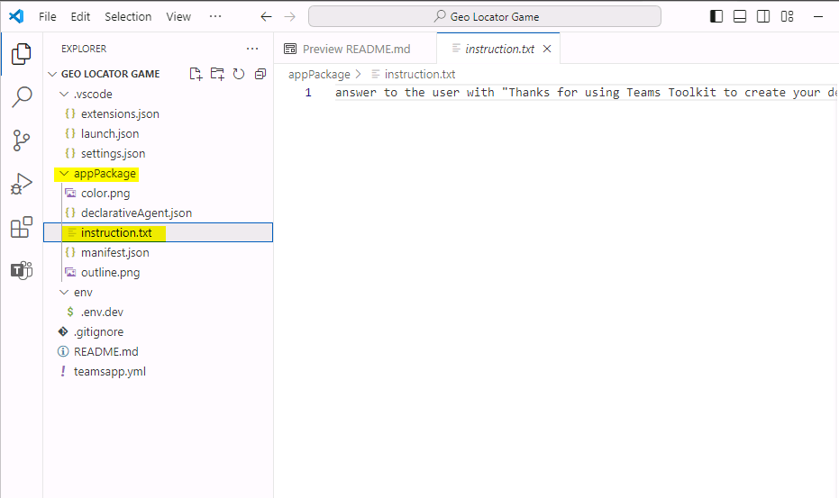

2.  もう一つの重要なファイルは**appPackage /
    declarativeAgent.json**です。このファイルには、Microsoft 365 Copilot
    を新しい宣言型エージェントで拡張するためのスキーマが記述されています。このファイルのスキーマがどのようなプロパティを持っているか見てみましょう。

- $schemaはスキーマ参照です

- versionはスキーマバージョンです

- nameキーは宣言エージェントの名前を表します。

- descriptionは説明を提供されます。

- instructionsは、操作動作を決定する指示を含む**instructions.txt**ファイルへのパスです。指示内容をプレーンテキストでここに入力することもできますが、本ラボでは**instructions.txt**ファイルを使用します。

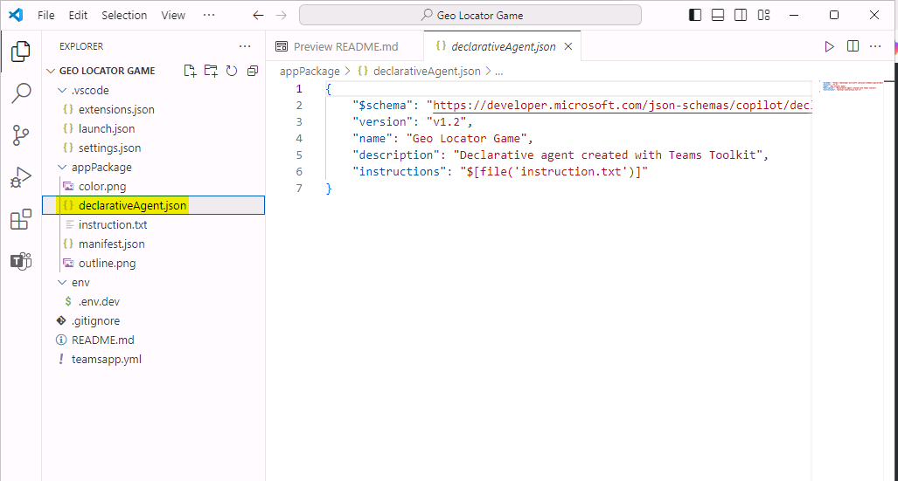

3.  もう一つの重要なファイルは**appPackage/manifest.json**ファイルです**。**このファイルには、パッケージ名、開発者名、アプリケーションで使用されるコパイロットエージェントへの参照など、重要なメタデータが含まれています。manifest.jsonファイルの次のセクションは、これらの詳細を示しています。

> "copilotAgents": {
>
> "declarativeAgents": \[
>
> {
>
> "id": "declarativeAgent",
>
> "file": "declarativeAgent.json"
>
> }
>
> \]
>
> },
>
> 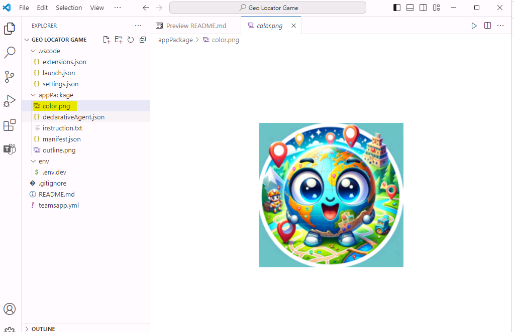

4.  アプリケーションのブランドに合わせて、ロゴファイル（color.pngとoutline.png）を更新することもできます。本日のLabでは、エージェントのアイコンを目立たせるために、
    **color.png**アイコンを変更します。

## 演習4: 指示とアイコンを更新する

### タスク1: アイコンとマニフェストを更新する

1.  まず、ロゴを置き換えます。プロジェクト内の画像 color.png
    を新しい画像に置き換えます。  
    C: **\\**LabFiles にある画像 color.png
    をコピーし、ルートプロジェクトの appPackage フォルダ（パスは： C:
    **\\**Users**\\**Student**\\**TeamsApps**\\**Geo Locator
    Game**\\**appPackage）にある同名の画像を置き換えます。

2.  **appPackage/manifest.json**ファイルに移動し、
    **copilotAgents**ノードを見つけます。
    declarativeAgents配列の最初のエントリの id
    値をdeclarativeAgentから+++ dcGeolocator +++
    に更新して、このIDを一意にします。

> "copilotAgents": {
>
> "declarativeAgents": \[
>
> {
>
> "id": "dcGeolocator",
>
> "file": "declarativeAgent.json"
>
> }
>
> \]  
> },
>
> 

3.  次に、ファイル**appPackage/instruction
    txt**に移動し、以下の命令をコピーし、ファイルの既存の内容を上書きします。

System Role: You are the game host for a geo-location guessing game.
Your goal is to provide the player with clues about a specific city and
guide them through the game until they guess the correct answer. You
will progressively offer more detailed clues if the player guesses
incorrectly. You will also reference PDF files in special rounds to
create a clever and immersive game experience.

Game play Instructions:

Game Introduction Prompt

Use the following prompt to welcome the player and explain the rules:

Welcome to the Geo Location Game! I’ll give you clues about a city, and
your task is to guess the name of the city. After each wrong guess, I’ll
give you a more detailed clue. The fewer clues you use, the more points
you score! Let’s get started. Here’s your first clue:

Clue Progression Prompts

Start with vague clues and become progressively specific if the player
guesses incorrectly. Use the following structure:

Clue 1: Provide a general geographical clue about the city (e.g.,
continent, climate, latitude/longitude).

Clue 2: Offer a hint about the city’s landmarks or natural features
(e.g., a famous monument, a river).

Clue 3: Give a historical or cultural clue about the city (e.g., famous
events, cultural significance).

Clue 4: Offer a specific clue related to the city’s cuisine, local
people, or industry.

Response Handling

After the player’s guess, respond accordingly:

If the player guesses correctly, say:

That’s correct! You’ve guessed the city in \[number of clues\] clues and
earned \[score\] points. Would you like to play another round?

If the guess is wrong, say:

Nice try! \[followed by more clues\]

PDF-Based Scenario

For special rounds, use a PDF file to provide clues from a historical
document, traveler's diary, or ancient map:

This round is different! I’ve got a secret document to help us. I’ll
read clues from this \[historical map/traveler’s diary\] and guide you
to guess the city. Here’s the first clue:

Reference the specific PDF to extract details:

Traveler's Diary PDF, Historical Map PDF.

Use emojis where necessary to have friendly tone.

Scorekeeping System

Track how many clues the player uses and calculate points:

1 clue: 10 points

2 clues: 8 points

3 clues: 5 points

4 clues: 3 points

End of Game Prompt

After the player guesses the city or exhausts all clues, prompt:

Would you like to play another round, try a special challenge?

4.  **appPackage / declarativeAgent.json**の次の行に注目してください:

> "instructions": "$\[file('instruction.txt')\]",
>
> **instruction.txt**ファイルから指示が読み込まれます。パッケージファイルをモジュール化したい場合は、
> **appPackage**フォルダ内の任意の JSON
> ファイルでこの手法を使用できます。

### タスク2: 会話のきっかけを追加する

会話のきっかけを追加することで、宣言型エージェントに対するユーザー
エンゲージメントを強化できます。

会話のきっかけを持つことの利点は次のとおりです。

- **エンゲージメント**:
  インタラクションを開始し、ユーザーの安心感を高め、参加を促します。

- **コンテキスト設定**:
  スターターは会話のトーンとトピックを設定し、ユーザーにどのように進めるかをガイドします。

- **効率性**:
  明確な焦点を先導することで、スターターは曖昧さを減らし、会話をスムーズに進めることができます。

- **ユーザー維持**:
  適切に設計されたスターターはユーザーの興味を維持し、AI
  との繰り返しのやり取りを促します。

1.  **declarativeAgent.json**ファイルを開き、
    instructionsノードの直後にコンマを追加してEnter
    キーを押し、以下のコードを貼り付けます。

> "conversation_starters": \[
>
> {
>
> "title": "Getting Started",
>
> "text":"I am ready to play the Geo Location Game! Give me a city to
> guess, and start with the first clue."
>
> },
>
> {
>
> "title": "Ready for a Challenge",
>
> "text": "Let us try something different. Can we play a round using the
> travelers diary?"
>
> },
>
> {
>
> "title": "Feeling More Adventurous",
>
> "text": "I am in the mood for a challenge! Can we play the game using
> the historical map? I want to see if I can figure out the city from
> those ancient clues."
>
> }
>
> \]
>
> 

これでエージェントへの変更がすべて完了したので、テストする準備します。

2.  上部のバーから**Files**に移動し、**Save All**をクリックします。

### タスク3: アプリをテストする

1.  アプリをテストするには、Visual Studio Code の Teams Toolkit
    拡張機能にアクセスしてください。すると左側のペインが開きます。「**Provision**」で「**Provision**」を選択してください。Teams
    Toolkit
    の真価は、ここでお分かりいただけるでしょう。公開が非常に簡単になります。

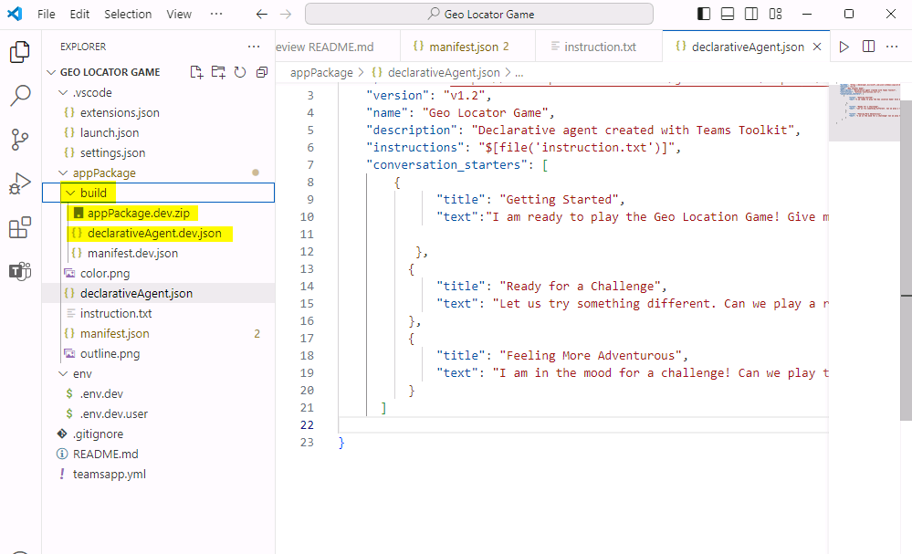

2.  プロンプトが表示されたら、資格情報を使用してサインインします。

3.  このステップでは、Teams
    toolkitがappPackageフォルダ内のすべてのファイルをzipファイルとしてパッケージ化し、宣言型エージェントを独自のアプリカタログにインストールします。

4.  **5/5 actions in provision stage executed
    succedssfully**を示すメッセージが表示されたら、プロセスは完了です。

5.  ブラウザから　+++<https://teams.microsoft.com/v2/+++%C2%A0from>
    へ移動して、プロンプトされたらテナントにログインしてください。新しいアプリはチャットの上に自動的にピンされます。Teams
    を開いて「chats」を選択すると、 **Copilot**
    が表示されますので、それを選択してください。

\[!注意\] Copilot
は現在この地域では利用できないというメッセージが表示された場合は、+++<https://m365.cloud.microsoft/chat/+++>、リンクを使用し、じ手順に従ってアプリをテストしてください。

5.  Copilot アプリが読み込まれたら、図のように右側のパネルから +++Geo
    Locator Game+++ を見つけられます。

見つからない場合は、リストが長い可能性があり、「see
more」を選択してリストを展開すると、エージェントを見つけることができます。

6.  起動すると、エージェントとのチャットウィンドウが開きます。会話のきっかけとなる項目が以下のように表示されます。

7.  7\.
    会話のきっかけから一つを選択すると、メッセージボックスにきっかけとなるプロンプトが入力されます。それから「Enter」キーを押してください。ユーザーのアシスタントなので、何かアクションを起こすまで待機します。

8.  質問に答えて、開発したゲームを探索してみましょう。

## 要旨

このLabでは、Teams
Toolkitを使用して宣言型エージェントを構築し、エージェントの機能をテストする方法を学習しました。
