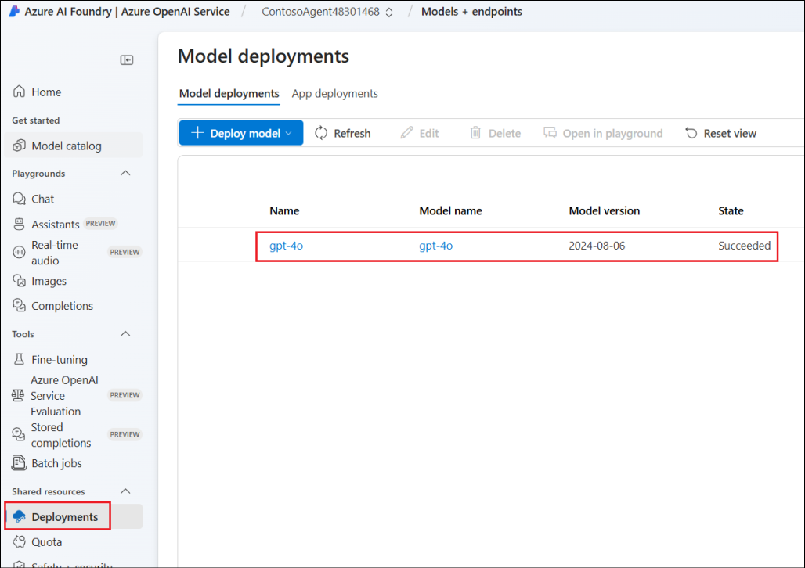

# Lab 3: Teams AI ライブラリと Teams toolkitを使用してデータとチャットするカスタム Contoso エージェントを構築する

**所要時間：45分**

## 目的

このLabの目的は、参加者がTeams AIライブラリとTeams
Toolkitを活用したカスタムContoso
Agentを構築できるようにすることです。参加者は、Azure OpenAI
APIを構成してGPT機能を統合し、Azure OpenAIとAzure Blob
Storageを使用してデータを設定・管理し、AI主導のインタラクション向けにカスタマイズされたチャットモデルを展開します。Labの終了時には、Visual
Studio CodeとTeams Toolkitを使用してTeams
AIを搭載したカスタムエージェントを作成・構成し、AI対応アプリケーションの展開と管理に関する実践的な経験を習得できます。

## ソリューションの重点領域

このLabガイドでは、参加者がAzure OpenAI
APIを活用して、インテリジェントでコンテキストアウェアなチャットインタラクションを作成できるようにすることに重点を置いています。参加者はGPTベースのモデルを構成し、Blob
StorageやAzure AI
SearchなどのAzureサービスと統合して、効率的なデータ管理を実現します。

本Labでは、ビジネスのためにカスタマイズされたプロンプトと設定を備えたチャットモデルの導入とカスタマイズする実践的に体験を得ます。さらに、参加者はTeams
AIライブラリとTeams
toolkitを使用してカスタムAIエージェントを構築し、組織のワークフローにシームレスに統合します。

## 演習 1: Azure OpenAI API とロールの権限の構成

### タスク 1: OpenAI の GPT を使用するための Azure OpenAI API キーを作成する

1.  ブラウザを開き、 +++
    [https://oai.azure.com/portal+++に移動し](https://oai.azure.com/portal+++)
    のURLへ移動し、以下を使用してログインします。

    - ユーザー名 - <+++@lab.CloudPortalCredential> (User1).Username+++

    - パスワード - <+++@lab.CloudPortalCredential> (User1).Password+++

2.  **Azure AI Foundry** のホームページで、 **Create new Azure OpenAI
    resource**をクリックします。

3.  Create Azure
    OpenAIウィンドウが開きます。プロンプトが表示されたら再度サインインしてください。以下の情報を該当のフィールドに入力し、
    **Next**をクリックしてください。

[TABLE]

4.  

5.  **Network**タブと**Tags**タブでデフォルトを受け入れて**Next**をクリックします。

6.  **Review + submit **タブで**Create**をクリックします**。**

7.  デプロイが成功すると、ウィンドウは自動的にCognitiveServiceOpenAIページに移動します。
    **Go to
    resource **をクリックして、リソースグループページに移動します。

8.  作成したAzure
    OpenAIリソースを選択します。AzureOpenAIリソースページの左側のペインで、
    **Resource Management **の**Keys and
    Endpoint **を選択し**、**参照のために、**Key**と**Endpoint**の値をメモ帳にコピーして**save** します。

### タスク 2: 認知貢献者ロールを割り当てます。

1.  **ResourceGroup1**を選択して、リソース
    グループの概要ページに移動します。

2.  リソースグループページの左側のペインから**Access
    control（IAM）**を選択します。次に、 **「+ Add **を選択し、**Add
    role assignment**をクリックします。

3.  +++ **Cognitive Service Contributor+++**を検索して選択し、
    **Next**をクリックします。

4.  メンバーを割り当てるには、**Select members **をクリックします。
    [+++@lab.CloudPortalCredential](mailto:+++@lab.CloudPortalCredential%20)
    (User1).Username+++ を検索し、 **Select**をクリックします。
    それから、**「Next」**をクリックします。

5.  割り当てタイプタブで、割り当てタイプを**Active**
    、期間を**Permanentと選択し**、 **「レビュー +
    割り当て」をクリックして**、**Review
    +Assign をクリックします**。もう一度**Review
    +Assign**をクリックします。 

6.  ロールの割り当てが成功すると、成功メッセージが表示されます。

## 演習 2: Azure OpenAI でデータを設定する

### タスク1: AI Foundaryにチャットを展開する

1.  左上のハンバーガーメニューを選択し、 **All
    resource**をクリックします。

2.  先作成したAzure OpenAI
    サービス**<ContosoAgent@lab.LabInstance.Id>　**を選択します。

3.  **Go to Azure AI Foundry portal**を選択します。

4.  左側のペインから**Model Catalog **を選択します。

5.  **Select a chat completion model **ページで、+++gpt-4o+++
    を検索して選択し、 **Confirm**をクリックします。

6.  **Deploy model gpt-4o **ペインで、
    **Customize**タブを展開し、次の詳細を入力して、
    **Deploy**をクリックします。

    - **Deployment type**: Standard

    - **Deployment name**: gpt-4o

    - **Token per Minute Rate**: 5K
      (制限をスクロールして調整できます。できない場合は、クリックしてShift+左右矢印キーで制限を調整してください。)

    - **Content Filter**: defaultv2

7.  **Shared resources **\>
    **Deployments**でデプロイメントを確認できます。

\

### タスク 2: Storage Accountの作成

1.  Azure ポータルの +++ <https://portal.azure.com/+++>ホーム
    ページで、+++ Storage accounts +++ を検索して選択します。

2.  **+ Create**をクリックし**、**次の詳細を入力して**Review +
    create**をクリックします。

    - Subscription - サブスクリプションを選択してください

    - Resource group – 割り当てられたリソースグループを選択します

    - Storage account name - <+++contosostorage@lab.LabInstance.Id> +++

    - Region – @lab.CloudResourceGroup(ResourceGroup1).Location を選択

    - Primary service – Azure Blob Storage または Azure Data Lake
      Storage Gen 2

    - Performance – Standard

3.  **Create**をクリックし、デプロイが完了するまで待ってから、 **Go to
    resource**をクリックします。

4.  新しく作成されたストレージアカウントで、データストレージの下の**Containers**に移動し、
    **+ Container**をクリックします。

5.  コンテナ名を +++ **source** +++
    と入力し、**create**をクリックします。

6.  **source**コンテナーをクリックして開きます。

7.  ソース コンテナーにデータを追加するには、 **Upload** --\_ **Browse
    for files** をクリックし、  
    C: \Labfiles
    から**TF-AzureOpenAI.pdf**を選択します。ファイルを選択したら、
    **upload**ボタンをクリックします。

### タスク3: Azure AI searchを作成する

1.  Azure ポータル
    +++<https://portal.azure.com/+++>ホームページで、**+++AI
    search+++**を検索して選択します。

2.  **+ Create**をクリックして、新しい Azure AI Search
    リソースを作成します。

以下の詳細を入力し、 **Review + create **をクリックして、
**Create**を選択します。

- Subscription: サブスクリプションを選択してください

- Resource Group: 割り当てられたリソースグループを選択します

- Service name: <+++contoso-ai-search-@lab.LabInstance.Id> +++

- Location: @lab.CloudResourceGroup(ResourceGroup1).Location

3.  search-service-contoso-ai-search-01overview で、 **Go to
    resource**をクリックします。

4.  <contoso-ai-search-@lab.LabInstance.Id>概要で、
    **URL**エンドポイントを参照用保存します。次に、左側のナビゲーションバーから**Settings**の下にある**Keys**を選択し、**primary**と**secondar
    key**を保存します**。** 

### タスク 4: Azure AI Foundry のチャットにデータを追加する

1.  **Azure AI Foundryページ**から、 **Chat** -\> **Add your data -\>
    Add a data source**を選択します

2.  ドロップダウンから、 **Azure Blob Storage (preview)**を選択します。

3.  **Add data**ページで、次の詳細を入力し、 **Next**をクリックします。

    - Select data source – Azure Blob Storage(preview)

    - Subscription - サブスクリプションを選択します

    - Select Azure Blob storage resource – Select
      [**contosostorage@lab.LabInstance.Id**](mailto:contosostorage@lab.LabInstance.Id)
      を選択します

    - Select storage container –**source**を選択します

    - Select Azure AI Search resource
      –　[**contoso-ai-search-@lab.LabInstance.Id**](mailto:contoso-ai-search-@lab.LabInstance.Id)を選択します

    - Index name –　<+++contosoindex@lab.LabInstance.Id>
      +++　を入力します

    - Index scheduler - Once

4.  **Data management**ページで、Search
    Typeフィールドに**keyword**を選択し、 **Next**をクリックします。

5.  **Data connection **ページで、 **API
    key**を選択し、**Next**へをクリックします。

6.  **Review and finish**ページで、 **Save and close**をクリックします。

7.  取り込みには多少時間がかかりますが、完了された上データの詳細がパネルに反映されます。データ取り込みプロセスが完了したら、Teams
    AI ライブラリと Teams toolkitを使用してカスタム エンジン
    エージェントの作成を開始できます。

**注:**ファイルは .txt、.md、.html、.pdf、.docx、または .pptx
形式であり、サイズ制限は 16 MB です。

## 演習3: カスタムエージェントの作成と構成

### タスク 1: Teams toolkit拡張機能の追加

1.  PCで**Visual Studio Code**を開きます。 **Trust**を選択して、Visual
    Studio Codeの制限モードを解除します。

2.  VS ホームページの左側のナビゲーション
    ペインで**拡張機能**アイコンをクリックし、+++ **Teams Toolkit**
    +++を検索して**Install**をクリックします。

3.  インストールが完了したら、Visual Studio Code アクティビティ バーの
    Teams Toolkit アイコンを選択し、**Create a
    New App**.を選択します。

4.  **Custom Engine Agent**を選択します。

5.  **Basic AI Chatbot**を選択します。

6.  プログラミング言語として**JavaScript**を選択します。

7.  **Azure OpenAI**を選択します。

8.  Azure ポータルからメモ帳に保存した値を入力します。

    - **Azure OpenAI key**

- **Azure OpenAI endpoint**

- **Deployment name**- +++gpt-4o+++

9.  チームに関連するデータを格納する新しいフォルダーを作成し、
    **Browse**をクリックしてその場所に移動します。

10. カスタム エンジン エージェントの名前として+++ **TeamsContosoAgent
    +++** と入力し、 **Enter** キーを押します。数秒でカスタム エンジン
    エージェントが作成されます。

11. Yes, I trust the authorを選択します。

**ソースコードツを見ましょう！**

このカスタム エンジン エージェント \> Basic AIチャットボット
テンプレートの内容を確認してください。

[TABLE]

### タスク2: カスタムエージェントを構成する

カスタム エンジン エージェントのプロンプトをカスタマイズしましょう。

1.  src/prompts/chat/skprompt.txt
    に移動し、既存のコードを以下のコードに置き換えます。更新後、
    **Ctrl+S**を押してファイルを保存します。

The following is a conversation with an AI assistant, who is an expert
on answering questions over the given context.  

Responses should be in a short journalistic style with no more than 80
words.

2.  **config.jsonファイル**に移動します。既存のコードを以下のコードに置き換え、
    **endpoint** 、 **index_name** 、 **key** の値を**Azure AI
    Search**リソースの詳細に置き換えます。更新後、 **Ctrl + S**
    キーを押してファイルを保存します。  
    {  
    "schema": 1.1,  
    "description": "A bot that can chat with users",  
    "type": "completion",  
    "completion": {  
    "completion_type": "chat",  
    "include_history": true,  
    "include_input": true,  
    "max_input_tokens": 2800,  
    "max_tokens": 1000,  
    "temperature": 0.9,  
    "top_p": 1.0,  
    "presence_penalty": 0.6,  
    "frequency_penalty": 0.0  
    },  
    "data_sources": \[  
    {

"type": "azure_search",  
"parameters": {  
"endpoint": "AZURE-AI-SEARCH-ENDPOINT",  
"index_name": "YOUR-INDEX_NAME",  
"authentication": {  
"type": "api_key",  
"key": "AZURE-AI-SEARCH-KEY"  
}  
}  
}  
\]

}

3.  src/app/app.js ファイルに移動し、OpenAIModel 内の azureEndpoint
    エントリの後に次の変数を追加します。

+++azureApiVersion: '2024-02-15-preview',+++

4.  管理者として Powershell を開き、次のコマンドを実行して、A
    を入力します。

5.  Set-ExecutionPolicy -Scope CurrentUser -ExecutionPolicy RemoteSigned

6.  **Visual Studio Code**に、左ペインから**Run and Debug
    (Ctrl+Shift+D)**を選択します。**Debug in Test
    Tool **を選択してデバッグを開始します。

7.  Windows セキュリティアラートが表示された場合は、Allow
    accessを選択します。

8.  カスタム エンジン エージェントは、ブラウザーで開く Teams App Test
    Tool内で実行されます

9.  ブラウザで新しいタブが開き、Teams App Test
    Toolとクエリをアプリ内で実行できるようになります。

## 結論

このLabを完了することで、参加者はTeams AIライブラリとTeams
toolkitを用いてカスタムAI駆動型チャットボットを構築・展開する実践的な経験を得ました。Azure
OpenAIリソースの設定、データストレージとAI検索機能の統合、そしてコンテキストアウェアなインタラクションのためのチャットボットのカスタマイズなどが含まれます。この演習を通して、参加者はビジネスニーズに合わせてインテリジェントエージェントを構成し、組織のワークフローに統合することで、Microsoft
Teams内で最新のAI機能を効果的に活用する方法を習得しました。

 
