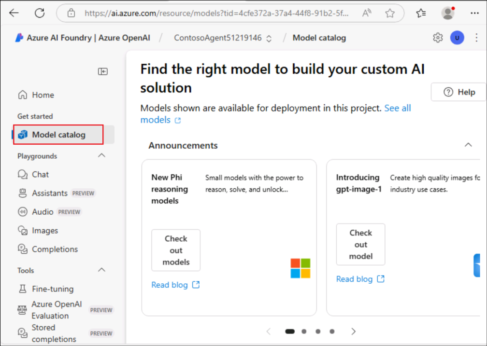
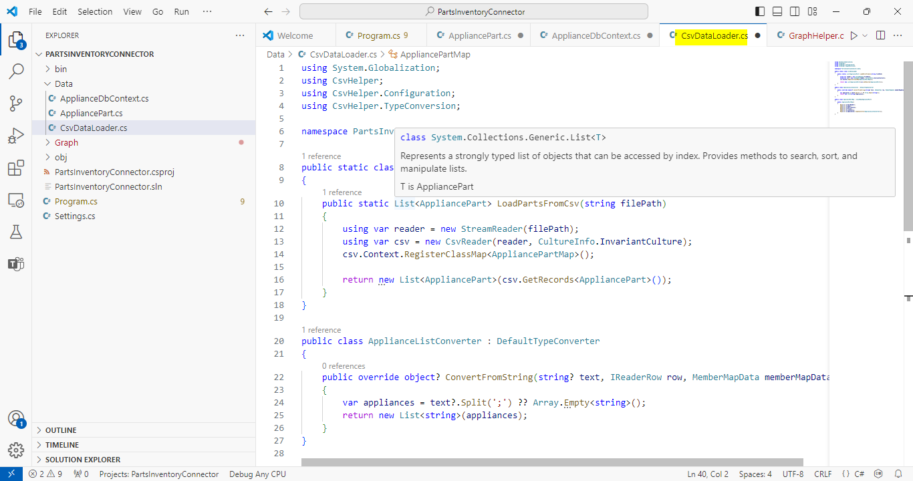

# 实验 3：使用 Teams AI 库和 Teams Toolkit构建自定义 Contoso 代理以与数据聊天

**预计时间：45 分钟**

## 目的

本实验室的目标是使参与者能够利用 Teams AI 库和 Teams 工具包构建自定义
Contoso 代理。参与者将配置 Azure OpenAI API 以集成 GPT 功能，使用 Azure
OpenAI 和 Azure Blob 存储设置和管理数据，并部署为 AI
驱动的交互量身定制的自定义聊天模型。在实验结束时，他们将使用 Visual
Studio Code 和 Teams 工具包创建并配置了 Teams AI
驱动的自定义代理，从而获得部署和管理支持 AI 的应用程序的实践经验。

## 解决方案重点领域

本实验室指南重点介绍如何使参与者能够利用 Azure OpenAI API
创建智能的上下文感知聊天交互。参与者将配置基于 GPT 的模型，并与 Blob
Storage 和 Azure AI Search 等 Azure 服务集成，以实现高效的数据管理。

该实验室提供使用定制的提示和设置来部署和自定义聊天模型以满足业务需求的实践经验。此外，参与者将使用
Teams AI 库和 Teams 工具包构建自定义 AI
代理，并将其无缝集成到组织工作流程中。

## 练习 1：配置 Azure OpenAI API 和角色权限

### 任务 1：创建 Azure OpenAI API 密钥以使用 OpenAI 的 GPT

1.  打开浏览器，导航到以下 URL
    +++<https://oai.azure.com/portal+++>，然后使用 

    - 用户名 - <+++@lab.CloudPortalCredential>(User1).Username+++

    - 密码 - <+++@lab.CloudPortalCredential>(User1).Password+++

2.  在 **Azure AI Foundry** 主页上，单击 **Create new Azure OpenAI
    resource**。

3.  创建 Azure OpenAI
    窗口将打开，如果出现提示，请再次登录。在尊重的字段中输入以下给定的详细信息，然后单击下**Next**。

[TABLE]

4.  

5.  在 **Network** 选项卡和 **Tags** 选项卡下，接受默认值并单击 **Next**

6.  在 **Review + submit** 选项卡上，单击 **Create。**

7.  部署成功后，窗口会自动导航到 CognitiveServiceOpenAI 页面。单击 **Go
    to resource** 导航到 Resource Group 页面。

8.  选择创建的 Azure OpenAI 资源。在 AzureOpenAI
    资源页的左窗格中，选择“**Resource Management** ”下的“**Keys and
    Endpoint** ”，然后将“**Key**”和“**Endpoint**”值复制并保存到记事本中，以备将来参考。

### 任务 2：分配 Cognitive 参与者角色。

1.  选择 **ResourceGroup1** 以转到 Resource Group
    overview（资源组概览）页面。

2.  从 Resource group （资源组） 页面的左侧窗格中选择 **Access control
    （IAM）**。然后选择 **+ Add** 并单击 **Add role assignment**.

3.  搜索并选择 +++**cognitive service
    contributor**+++，然后单击**Next**。

4.  单击 **Select members** 以分配成员。搜索
    <+++@lab.CloudPortalCredential>(User1).Username+++，然后单击
    **Select**。单击 **Next**。

5.  在“Assignment type”选项卡上，选择“**Active**”作为“assignment
    type”，选择“**Permanent**”作为“持续时间”，然后单击“**Review
    +Assign**”，然后单击“**Review +Assign**”。

6.  角色分配成功后，您将收到一条成功消息。

## 练习 2：在 Azure OpenAI 上设置数据

### 任务 1：在 AI Foundary 中部署聊天

1.  选择左上角的汉堡菜单，然后单击 **All resources**。

2.  选择您之前创建的 [Azure OpenAI 服务
    **ContosoAgent@lab.LabInstance.Id**](mailto:ContosoAgent@lab.LabInstance.Id) 。

3.  选择**“Go to Azure AI Foundry portal**”。

4.  从 左侧窗格中选择 **Model Catalog**。

5.  在 **Select a chat completion model **页面上，搜索
    +++**gpt-4o**+++，选择它，然后单击 **Confirm。**

6.  在 **Deploy model gpt-4o** 窗格中，展开 **Customize**
    选项卡，输入以下详细信息，然后单击 **Deploy。**

    - **部署类型**: Standard

    - **部署名称**: gpt-4o

    - **每分钟令牌费率**：5K（滚动以调整限制。如果它不起作用，请单击它，然后使用
      Shift+右/左箭头键调整限制)

    - **内容过滤器：** defaultv2

7.  您可以在 **Shared resources** à **Deployments** 下检查部署

\

2.  单击 **+ Create**，输入以下详细信息，然后单击 **Review + create。**

    - 订阅 - 选择您的订阅

    - Resource group – 选择分配的 Resourcegroup

    - 存储帐户名称 - <+++contosostorage@lab.LabInstance.Id>+++

    - Region – 选择 @lab.CloudResourceGroup(ResourceGroup1).Location

    - 主要服务 - Azure Blob storage或 Azure Data Lake Storage Gen 2

    - 性能 – Standard标准

3.  单击 **Create** 并等待部署完成，然后单击 **Go to resource**。

4.  在新创建的存储帐户上，导航到 数据存储下的Containers，然后单击 **+
    Container**

5.  将容器名称输入为 +++**source**+++，然后单击 **create。**

6.  单击 **Source** container 并打开它。

7.  要将数据添加到源容器中，请单击 **Upload** --\_ **Browse for
    files** ，然后从 C：\Labfiles 中选择
    **TF-AzureOpenAI.pdf** 选择文件后，单击**upload** 按钮。

### 任务 3：创建 Azure AI 搜索

1.  在 Azure 门户 +++<https://portal.azure.com/+++> 主页中，搜索并选择
    +++AI search+++。

2.  单击“**+ Create**”以创建新的 Azure AI 搜索资源。

输入以下详细信息，然后单击 **Review + create**，然后选择 **Create**。

- 订阅：选择您的订阅

- 资源组：选择已分配的资源组

- 服务名称：+[++contoso-ai-search-@lab.LabInstance.Id](mailto:+++contoso-ai-search-@lab.LabInstance.Id)+++

&nbsp;

- 位置： @lab.CloudResourceGroup(ResourceGroup1).Location

1.  在 search-service-contoso-ai-search-01overview 中，单击“**Go to
    resource**”。

2.  在 <contoso-ai-search-@lab.LabInstance.Id> 概述中，保存 **URL**
    端点以供将来使用。然后从左侧导航栏中选择 **Settings**下的
    **keys**，并保存**primary
    key** 和**secondary** **key** 以备将来使用。  

### 任务 4：在 Azure AI Foundry 中向聊天添加数据

1.  在 **Azure AI Foundry** 页面中，选择 **Chat** -\> **Add your data
    -\> Add a data source**。

2.  从下拉列表中，选择“**Azure Blob Storage (preview)**”。

3.  在 **Add data** 页面上，输入以下详细信息，然后单击 **Next）。**

    - 选择数据源 – Azure Blob Storage(preview)

    &nbsp;

    - 订阅 - 选择您的订阅

    &nbsp;

    - 选择 Azure Blob storage 资源 –
      Select [**contosostorage@lab.LabInstance.Id**](mailto:contosostorage@lab.LabInstance.Id)

    - 选择 storage container（选择存储容器）– 选择**source**

    - 选择 Azure AI Search资源 –
      选择[**contoso-ai-search-@lab.LabInstance.Id**](mailto:contoso-ai-search-@lab.LabInstance.Id)

    - 索引名称 - 类型<+++contosoindex@lab.LabInstance.Id>+++

    - 索引器计划 - Once

4.  在 **Data management**  页面上，选择 搜索类型 作为 **keyword**
    ，然后单击 **Next**。

5.  在 **Data connection** 页面上，选择 **API key**，然后单击 **Next。**

6.  在 **Review and finish**页面上，单击 **Save and close。**

3.  摄取需要一些时间，完成后，数据详细信息将反映在窗格中。数据引入过程完成后，您可以开始使用
    Teams AI library和 Teams Toolkit创建自定义引擎代理。

\[！注意\] **注意：**文件必须为 .txt、.md、.html、.pdf、.docx 或 .pptx
格式，大小限制为 16 MB。

## 练习 3：创建和配置自定义代理

### 任务 1：添加 Teams Toolkit扩展

1.  在您的 PC 上打开 **Visual Studio Code**。选择 **Trust** 以删除
    Visual Studio Code 中的受限模式。

2.  在 VS 主页的左侧导航窗格中，单击**“Extensions**”图标，搜索 +++Teams
    Toolkit+++，然后单击**“Install”。**

3.  安装完成后，选择  Visual Studio Code
    活动栏中的 Teams 工具包图标，然后选择 **“Create a New App**”。

4.  选择 **Custom Engine Agent** 。

5.  选择 **Basic AI Chatbot**。

6.  选择 **JavaScript** 作为编程语言。

7.  选择 **Azure OpenAI**。

8.  输入 Azure 门户中的值，即我们复制并保存在记事本中的值。

    - **Azure OpenAI key**

- **Azure OpenAI endpoint**

- **Deployment name** - +++gpt-4o+++

9.  创建一个新文件夹以包含与团队相关的数据，然后单击 **Browse**
    导航到该位置。

10. 输入 +++**TeamsContosoAgent**+++ 作为自定义引擎代理的名称，然后按
    **Enter**。自定义引擎代理将在几秒钟内创建。

11. 选择 Yes， I author 

**浏览源代码**

看看这个 custom engine agent \> Basic AI Chatbot 模板中的内容。

[TABLE]

### 任务 2：配置自定义代理

让我们为您的自定义引擎代理自定义提示。

1.  转到 src/prompts/chat/skprompt.txt
    并将现有代码替换为以下代码。更新后，按 **ctrl+s** 保存文件。

> 以下是与 AI 助理的对话，AI 助理是在给定上下文中回答问题的专家。
>
> 回复应采用简短的新闻风格，不超过 80 字。

2.  转到 **prompts**/chat 下的 config.json
    文件。将现有代码替换为以下代码，并将 **endpoint** 、 **index_name**
    和 **key** 值替换为 **Azure AI 搜索**资源详细信息。更新后，按
    **ctrl+s** 保存文件。

> {
>
> "schema": 1.1,
>
> "description": "A bot that can chat with users",
>
> "type": "completion",
>
> "completion": {
>
> "completion_type": "chat",
>
> "include_history": true,
>
> "include_input": true,
>
> "max_input_tokens": 2800,
>
> "max_tokens": 1000,
>
> "temperature": 0.9,
>
> "top_p": 1.0,
>
> "presence_penalty": 0.6,
>
> "frequency_penalty": 0.0
>
> },
>
> "data_sources": \[
>
> {
>
> "type": "azure_search",
>
> "parameters": {
>
> "endpoint": "AZURE-AI-SEARCH-ENDPOINT",
>
> "index_name": "YOUR-INDEX_NAME",
>
> "authentication": {
>
> "type": "api_key",
>
> "key": "AZURE-AI-SEARCH-KEY"
>
> }
>
> }
>
> }
>
> \]
>
> }

3.  转到 src/app/app.js 文件，并在 OpenAIModel 中添加以下变量 – 在
    azureEndpoint 条目之后。

+++azureApiVersion: '2024-02-15-preview',+++

4.  以管理员身份打开 Powershell 并运行以下命令，然后输入 A。

5.  Set-ExecutionPolicy -Scope CurrentUser -ExecutionPolicy RemoteSigned

6.  返回 **Visual Studio Code**，从左侧窗格中选择**“ Run and
    Debug”（Ctrl+Shift+D）。**在 **Test Tool** 中选择 **Debug in Test
    Tool **。

7.  如果您收到 Windows 安全警报，请选择允许访问。

8.  自定义引擎代理在浏览器中打开的 Teams App Test Tool中运行。

9.  浏览器将打开一个新选项卡 Teams App Test
    Tool，并且可以在应用程序中运行查询。

## 结论

通过完成此实验室，参与者获得了使用 Teams AI 库和 Teams
工具包构建和部署自定义 AI 驱动型聊天机器人的实践经验。这包括设置 Azure
OpenAI 资源、集成数据存储和 AI
搜索功能，以及自定义聊天机器人以进行上下文感知交互。通过此练习，参与者学习了如何配置根据业务需求量身定制的智能代理并将其集成到组织工作流中，从而有效地利用
Microsoft Teams 中的现代 AI 功能。

 
