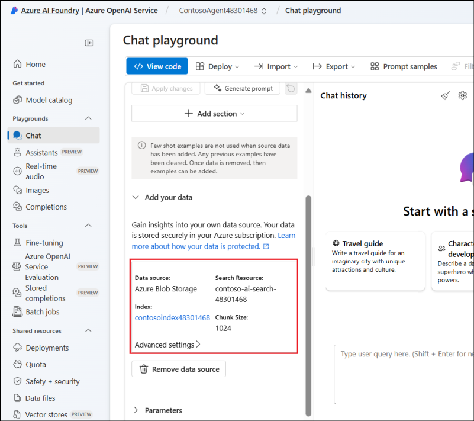
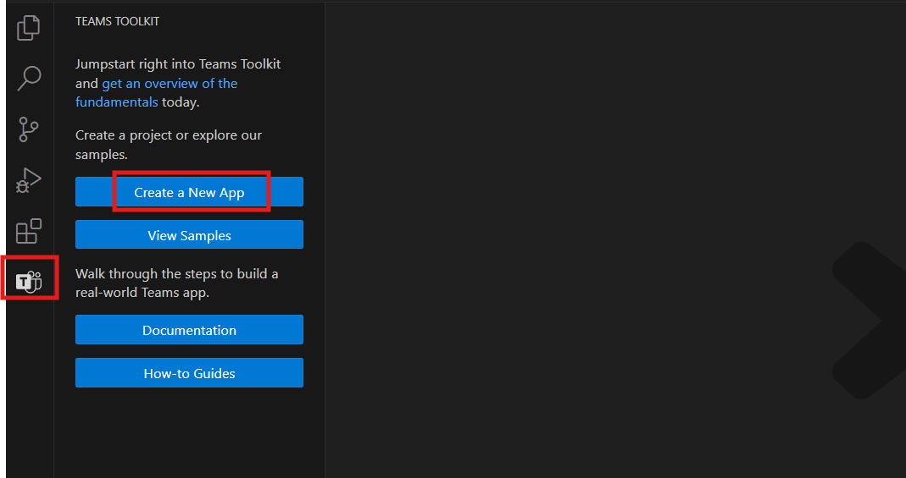
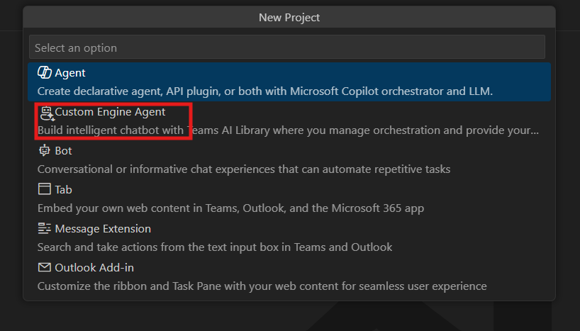
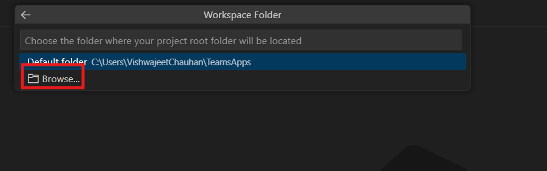
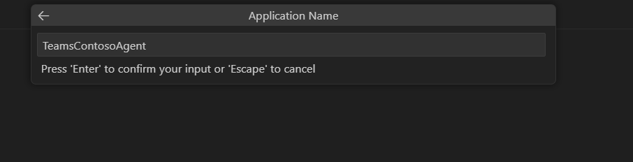

# Lab 3: Build a Custom Contoso Agent to Chat with Your Data Using Teams AI Library and Teams Toolkit

**Estimated Time: 45 mins**

## Objective

The objective of this lab is to enable participants to build a custom
Contoso Agent leveraging the Teams AI Library and Teams Toolkit.
Participants will configure the Azure OpenAI API to integrate GPT
capabilities, set up and manage data using Azure OpenAI and Azure Blob
Storage, and deploy a customized chat model tailored for AI-driven
interactions. By the end of the lab, they will have created and
configured a Teams AI-powered custom agent using Visual Studio Code and
the Teams Toolkit, gaining practical experience in deploying and
managing AI-enabled applications.

## Solution Focus Area

This lab guide focuses on enabling participants to leverage the Azure
OpenAI API to create intelligent, context-aware chat interactions.
Participants will configure GPT-based models and integrate with Azure
services like Blob Storage and Azure AI Search for efficient data
management.

The lab provides hands-on experience in deploying and customizing chat
models with tailored prompts and settings to meet business needs.
Additionally, participants will build a custom AI agent using the Teams
AI Library and Teams Toolkit, integrating it seamlessly into
organizational workflows.

## Exercise 1: Configuring Azure OpenAI API and Role Permissions

### Task 1: Creating an Azure OpenAI API key to use OpenAI’s GPT

1.  Navigate to the following the URL <https://oai.azure.com/portal> and
    login using <+++@lab.CloudPortalCredential(User1).Username>+++ and
    +++@lab.CloudPortalCredential(User1).Password+++.

2.  On the **Azure AI Foundry** home page Click on **Create new Azure
    OpenAI resource**.

2.  Create Azure OpenAI Window will open, if prompted sign in again.
    Enter the below given details into respected fields and click on
    **Next**.

[TABLE]

3.  Under **Network** tab and **Tags** tab, accept the defaults and
    click on **Next**

4.  On the **Review + submit** tab click on **Create.**

5.  After Successful deployment, window automatically navigate to
    CognitiveServiceOpenAI Page. Click on **Go to resource** to navigate
    to the Resource Group page.

6.  From the left pane, select **Keys and Endpoint** under **Resource
    Management** and copy and **save** the **Key** and **Endpoint**
    values to a notepad for future reference.

### Task 2: Assign Cognitive contributor role.

1.  Select **Access control (IAM)** from the left pane of the Resource
    group page. Then select **+** **Add** and click **Add role
    assignment**.

2.  Search and select +++**cognitive service contributor+++**, click
    **Next**.

3.  Click on **Select members** to assign members. Search for
    +++@lab.CloudPortalCredential(User1).Username+++ and click on
    **Select**. Click **Next**.

4.  On the assignment type tab, select assignment type as **Active**,
    duration as **Permanent**, and click on **Review +Assign** and again
    **Review + Assign**.

5.  You will get a success message once the role assignment is
    successful.

## Exercise 2: Set up your data on Azure OpenAI

### Task 1: Deploy chat in AI Foundary

1.  Select the hamburger menu in the top left and click on **All
    resources**.

> 

2.  Select the Azure OpenAI service **ContosoAgent@lab.LabInstanceId**
    that you created earlier.

> 

3.  Select **Go to Azure AI Foundry portal**, it will take you to the
    Foundry Chat playground page.

> 
>
> 

4.  If the Cht playground is not automatically selected, from the left
    navigation pane, under **Playgrounds,** Select **Chat.**

> 

5.  In the **Chat playground** page, click on **Create new deployment**
    and select **From base models**.

> 

6.  On the **Select a chat completion model** page, search for
    +++gpt-4o+++, select it and click on **Confirm.**

7.  On the **Deploy model gpt-4o** pane, Expand the **Customize** tab
    enter the following details, and click on **Deploy.**

    - **Deployment type**: Standard

    &nbsp;

    - **Deployment name**: gpt-35-turbo-16k

    - **Token per Minute Rate**: 5K (Scroll to adjust the limit. If it
      does not work, click on it and then use Shift+Right/Left arrow key
      to adjust the limit)

    &nbsp;

    - **Content Filter**: defaultv2

> 
>
> 

8.  You can check the deployment under **Shared resources** à
    **Deployments**

### Task 2: Creating a storage account

1.  From the Azure portal, +++<https://portal.azure.com/>+++ Home page,
    search for and select +++Storage accounts+++.

2.  Click on **Create,** enter the following details and click
    **Review + create.**

Subscription - Select your subscription

Resource group – Select your assigned Resourcegroup

Storage account name - +++contosostorage@lab.LabInstaceId+++

Region – West US

Primary service – Azure Blob storage or Azure Data Lake Storage Gen 2

Performance – Standard

3.  Click on **Create** and wait for the deployment to complete and then
    click on **Go to resource**.

4.  On the newly created storage account, navigate to **Containers**
    under Data storage and click on **+ Container**

5.  Enter the container name as **source** and click on **create.**

6.  Click on **source** container and open it.

7.  To add data into the source container, Click on **Upload** --\_
    **Browse for files** and then from C:\Labfiles select
    **TF-AzureOpenAI.** After selecting file click on **upload** button.

### Task 3: Create Azure AI search

1.  From the Azure portal +++<https://portal.azure.com/>+++ Home page,
    search for and select +++**AI search**+++.

2.  Click on **+ Create** to create a new Azure AI Search resource.

> Enter the following details and click on **Review + create** and then
> select **Create**.
>
> Subscription: select your subscription
>
> Resource Group: Select your assigned Resource group
>
> Service name: +++contoso-ai-search-@lab.LabInstanceId+++
>
> Location: Central US
>
> 
>
> 
>
> 

3.  On the search-service-contoso-ai-search-01overview click on **Go to
    resources**.

> 

4.  On contoso-ai-search-@lab.LabInstanceId overview, save **URL**
    endpoint for future use. Then from left navigation bar select
    **key** and save **primary** and **secondary** **key** for future
    use. 

### Task 4: Add data to chat in Azure AI Foundry

1.  From the **Azure AI Foundry** page, select **Chat** -\> **Add your
    data -\> Add a data source**.

> 

2.  From the dropdown, select **Azure Blob Storage (preview)**.

> 

3.  On the **Add data** page, enter the following details and click on
    **Next.**

> Select data source – Azure Blob Storage(preview)
>
> Subscription - Select your subscription
>
> Select Azure Blob storage resource – contosostorage@lab.LabInstanceId
>
> Select storage container – source
>
> Select Azure AI Search resource – contoso-ai-search-@lab.LabInstanceId
>
> Index Name - +++contosoindex@lab.LabInstanceId+++
>
> Indexer schedule - Once
>
> 

4.  On the **Data management** page, select search type as **keyword**
    and click **Next**.

> 

5.  On the **Data connection** page, select **API key** and click on
    **Next.**

> 

6.  On the **Review and finish** page, click on **Save and close.**

7.  Ingestion will take some time, once completed the data details will
    reflect in the pane. After the data ingestion process is complete,
    you can start creating your custom engine agent using the Teams AI
    library and Teams Toolkit.

Note: Files must be in .txt, .md, .html, .pdf, .docx, or .pptx format
with 16-MB size limit.

## Exercise 3: Create and configure your custom agent

### Task 1: Adding a Teams Toolkit extension

1.  Open **Visual Studio Code,** on your PC.

2.  On the VS home page, on the left navigation pane click on the
    **Extensions** icon, search for **Teams Toolkit** and click on
    **Install.**

3.  Select the Teams Toolkit  icon in the Visual
    Studio Code Activity Bar and select **Create a New App**.

> 

4.  Select **Custom Engine Agent**.

> 

5.  Select **Basic AI Chatbot**.

> 

6.  Select **JavaScript** as the programming language.

> 

7.  Select **Azure OpenAI**.

> 

8.  Enter the values from the Azure portal, the one which we have copied
    and saved in the notepad.

    - **Azure OpenAI key**

> 

- **Azure OpenAI endpoint**

> 

- **Deployment name** - +++gpt-4o+++

> 

9.  Create a new folder to contain the data related to teams and
    navigate to that location by clicking on **Browse**.

> 
>
> 

10. Enter a **TeamsContosoAgent** as name for your custom engine agent,
    select **Enter**. Custom engine agent is created in a few seconds.

> 

11. Select Yes, I author

> 

**Take a tour of the source code**

Have a look at what's inside this custom engine agent \> Basic AI
Chatbot template.

[TABLE]

### Task 2: Configure your custom agent

Let's customize the prompt for your custom engine agent.

1.  Go to src/prompts/chat/skprompt.txt and replace the existing code
    with the below code. After updating, press **ctrl+s** to save the
    file.

> **The following is a conversation with an AI assistant, who is an
> expert on answering questions over the given context.**
>
> **Responses should be in a short journalistic style with no more than
> 80 words.**
>
> 

2.  Go to the **config.json** file under prompts/chat. Replace the
    existing code with the following code and replace the **endpoint** ,
    **index_name**, and **key** values with your **Azure AI Search**
    resource details. After updating, press **ctrl+s** to save the file.

> {
>
>   "schema": 1.1,
>
>   "description": "A bot that can chat with users",
>
>   "type": "completion",
>
>   "completion": {
>
>     "completion_type": "chat",
>
>     "include_history": true,
>
>     "include_input": true,
>
>     "max_input_tokens": 2800,
>
>     "max_tokens": 1000,
>
>     "temperature": 0.9,
>
>     "top_p": 1.0,
>
>     "presence_penalty": 0.6,
>
>     "frequency_penalty": 0.0
>
>   },
>
>   "data_sources": \[
>
>     {
>
>       "type": "azure_search",
>
>       "parameters": {
>
>         "endpoint": "AZURE-AI-SEARCH-ENDPOINT",
>
>         "index_name": "YOUR-INDEX_NAME",
>
>         "authentication": {
>
>           "type": "api_key",
>
>           "key": "AZURE-AI-SEARCH-KEY"
>
>         }
>
>       }
>
>     }
>
>   \]
>
> }
>
> 

3.  Go to src/app/app.js file and add the following variable
    inside OpenAIModel – after the azureEndpoint entry.

azureApiVersion: '2024-02-15-preview',

> 

4.  Open Powershell as an administrator and run the following command,
    and enter A.

> Set-ExecutionPolicy -Scope CurrentUser -ExecutionPolicy RemoteSigned
>
> 

5.  Back in the **Visual Studio Code**, from the left pane, select **Run
    and Debug (Ctrl+Shift+D)**. Select **Debug in Test Tool** to start
    debugging.

> 

6.  Select Allow access if you get a Windows Security Alert.

7.  Custom engine agent runs within the Teams App Test Tool, which opens
    in your browser.

> 

8.  The browser will open a new tab, Teams App Test Tool and queries can
    be run in the app.

> 

## Conclusion

By completing this lab, participants have gained hands-on experience in
building and deploying a custom AI-driven chatbot using the Teams AI
Library and Teams Toolkit. This included setting up Azure OpenAI
resources, integrating data storage and AI search capabilities, and
customizing the chatbot for context-aware interactions. Through this
exercise, participants have learned how to configure intelligent agents
tailored to business needs and integrate them into organizational
workflows, effectively leveraging modern AI capabilities within
Microsoft Teams.
