# 실습 4 - Azure AI Foundry SDK를 사용하여 RAG 기반 에이전트 빌드, 평가 및 배포

**예상 소요 시간: 120분**

## 목표

이 실습의 목표는 Azure AI Foundry SDK를 사용하여Retrieval-Augmented
Generation (RAG) 기반 에이전트를 빌드, 평가 및 배포하는 것입니다.
실습에서는 프로젝트 및 개발 환경 설정, AI 모델(예: GPT-4 및
text-embedding-ada-002) 배포, 문서 검색을 위한 Azure AI Search 통합,
RAG(사용자 지정 지식 검색) 채팅 애플리케이션 생성하기를 안내합니다. 관련
제품 데이터로 AI 모델 응답을 접지하고, 사용자 지정 채팅 인터페이스를
개발하고, 생성된 응답의 성능을 평가하는 데 중점을 둡니다.

## 솔루션

이 솔루션에는 Azure AI Foundry에서 프로젝트 설정, AI 모델 (GPT-4 및
text-embedding-ada-002) 배포 및 Azure AI Search 통합하여 사용자 지정
제품 데이터를 저장하고 검색하는 작업이 포함됩니다. 여기에는 벡터
임베딩을 생성하고, 검색 인덱스를 구축하고, 관련 제품 정보를 쿼리하는
Python 스크립트를 만드는 작업이 포함됩니다. RAG 기반 채팅 인터페이스는
검색 결과를 활용하여 근거 있는 응답을 제공하도록 개발되었으며, 채팅 앱의
성능은 사전 정의된 데이터 세트 및 메트릭을 사용하여 평가되어 효율성을
높입니다.

## 연습 0: VM 및 자격 증명 이해하기

이 연습에서는 실습 전체에서 사용할 자격 증명을 식별하고 이해합니다.

**중요:** 이 연습의 각 단계를 수행하여 실습 실행에 사용될 일반 용어와
자격 증명을 파악해야 합니다.

1.  **Instructions **탭에는 실습 전반에 걸쳐 따라야 할 지침이 있는 실습
    가이드가 있습니다.

2.  **Resources** 탭에는 실습을 실행하는 데 필요한 자격 증명이 있습니다.

    - **URL** – Azure Portal에 대한 URL

    - **Subscription** – 사용자에게 할당된 **subscription** 의 **ID**

    - **Username** – Azure 서비스에 **login**하는 데 사용하는 **user
      ID**

    - **Password** – **Azure login**에 대한 **Password**.

이 사용자 이름과 암호를 **Azure login credentials**이라고 하겠습니다.
**Azure login credentials**을 언급할 때마다 이러한 자격 증명을
사용합니다.

- **Resource Group**  – 사용자에게 할당된 **Resource Group**

\[!경고\] **중요**: 이 Resource Group 아래에 모든 리소스를 생성해야
합니다.

1.  **Help **탭에는 지원 정보가 있습니다. 여기서 **ID** 값은 실습 실행
    중에 사용되는**Lab instance ID**입니다.

## 연습 1: Azure AI Hub 리소스 및 프로젝트 생성하기

이 연습에서는 Azure Portal에서 허브를 생성한 후, Azure AI Foundry에서
프로젝트를 생성하고, 모델을 배포하고, 실행에 필요한 에이전트를
생성합니다.

### 작업 1: 프러젝트를 생성하기

1.  브라우저에서 +++\*\*<https://portal.azure.com/**+++>를 열고
    **login** **credentials**를 사용하여 로그인하고 **Home** 페이지에서
    **Azure AI Foundry**를 선택하세요.

    - User name – <+++@lab.CloudPortalCredential>(User1).Username+++

    - Password – <+++@lab.CloudPortalCredential>(User1).Password+++

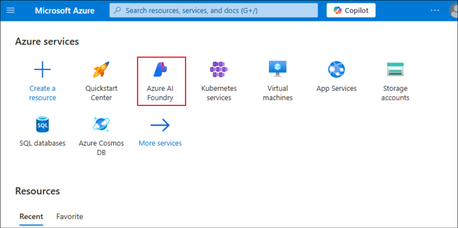

2.  **Use with AI Foundry** -\> **AI Hubs**를 선택하세요. **+
    Create** -\> **Hub**를 선택하세요.

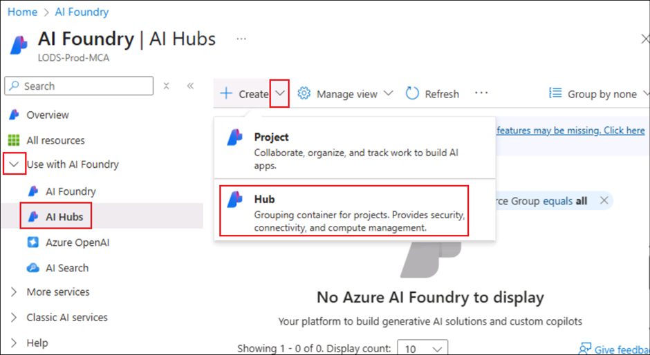

3.  아래 세부 정보를 입력하고, 다른 기본값을 적용하고, **Review +
    create**를 선택하세요.

    - Subscription - **assigned subscription**을 선택하세요

    - Resource group - 할당된 Resource group (**ResourceGroup1**)를
      선택하세요

    - Region - @lab.CloudResourceGroup(ResourceGroup1).Location을
      선택하세요

    - Name - <+++hub@lab.LabInstance.Id>+++

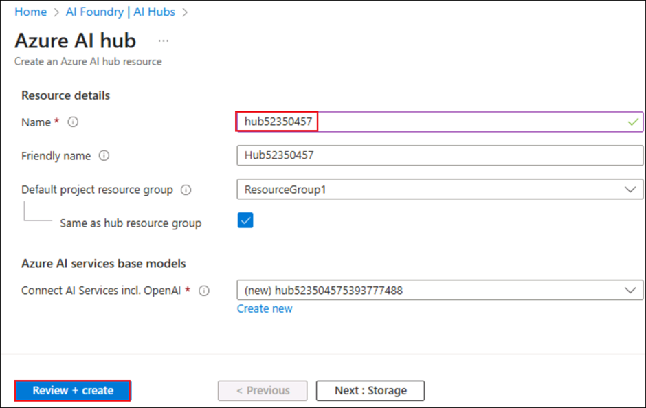

4.  유효성 검사가 통과되면 **Create**를 선택하세요.

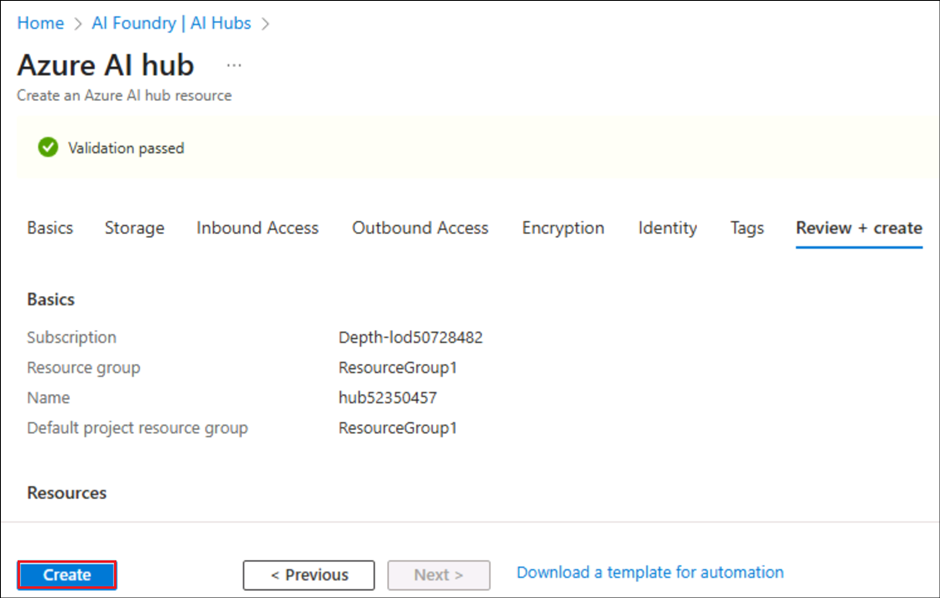

5.  배포가 완료되면 **Go to resource**를 클릭하세요.

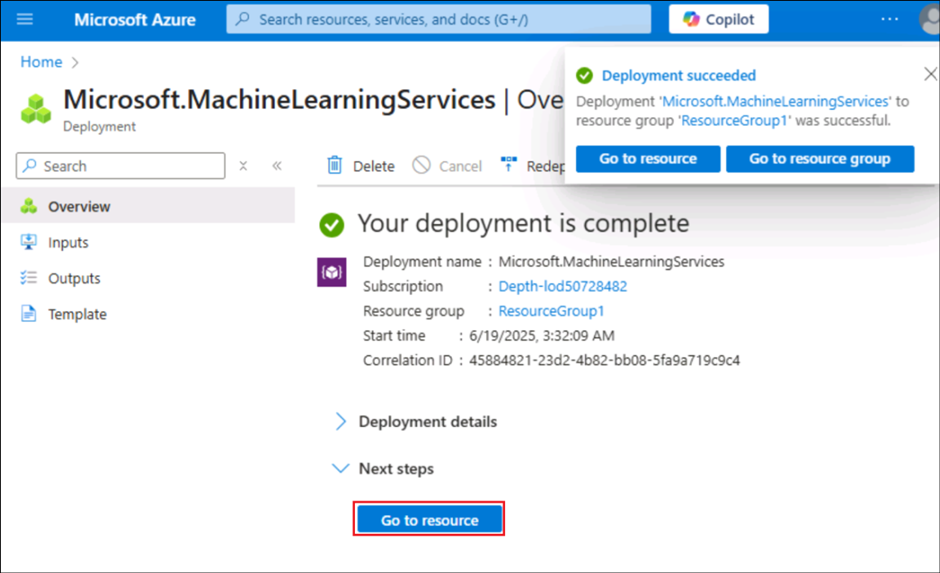

6.  허브 리소스 페이지에서 **Launch Azure AI Foundry**를 선택하세요.

7.  시작된 허브 리소스에서 아래로 스크롤하여 **+ New project**를
    선택하세요.

8.  이름을 <+++RAGproj@lab.LabInstance.Id>+++로 입력하고 **Create**를
    선택하세요.

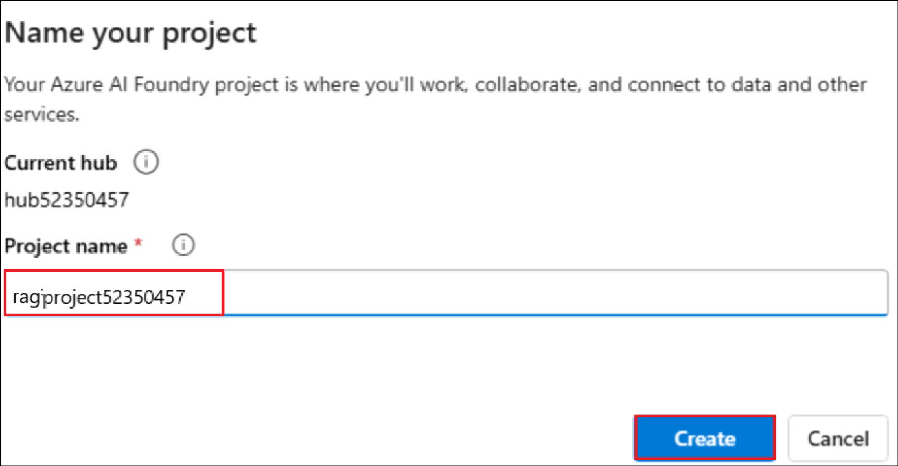

9.  Explore and experiment 팝업을 닫으세요.

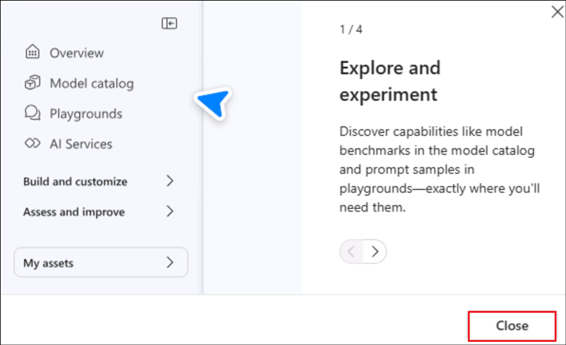

10. 생성된 프로젝트 페이지로 이동합니다..

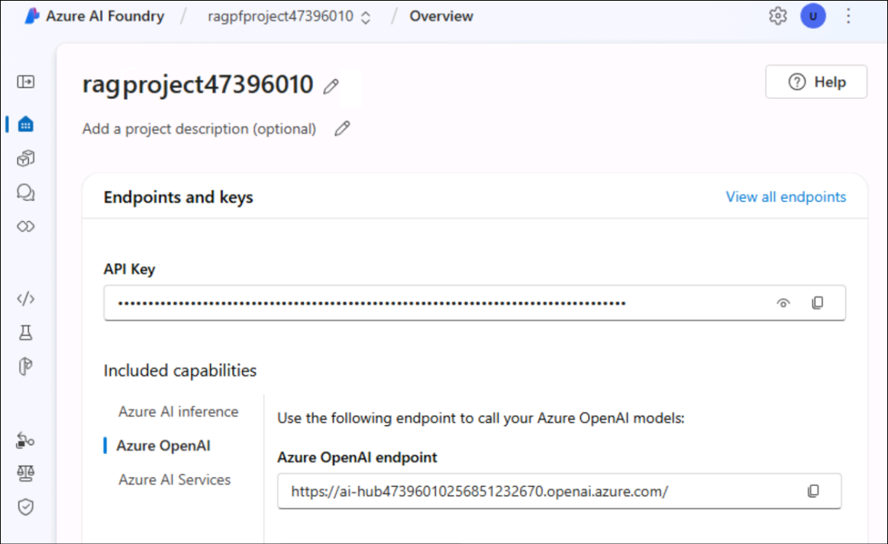

11. 페이지를 아래로 스크롤하여 **Project connection string**값을
    메모장에 복사하세요.

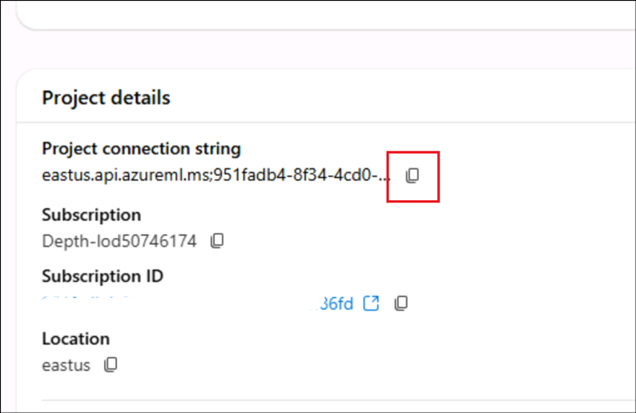

12. 왼쪽 창에서 아래로 스크롤하여 **Management Center**를 선택하세요.

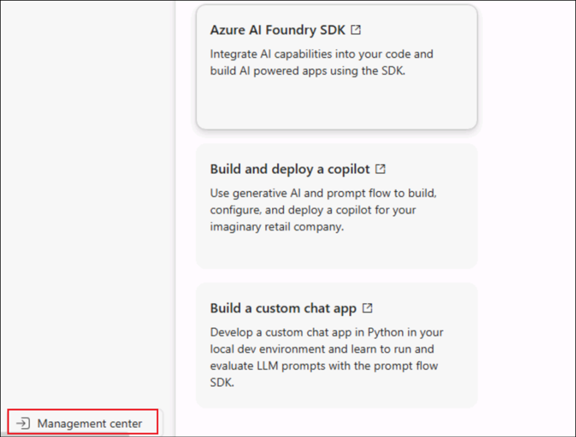

13. 허브 리소스에서**Connected resources를** 선택한 후 **+ New
    connection**을 클릭하여 Azure AI Foundry 리소스와의 연결을
    생성하세요.

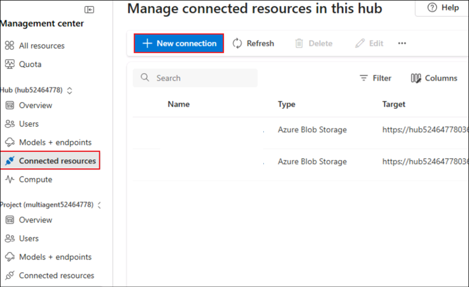

14. 사용 가능한 외부 자산에서 **Azure AI Foundry**를 선택하세요.

15. **Add connection**를 선택하여 연결을 추가하세요.

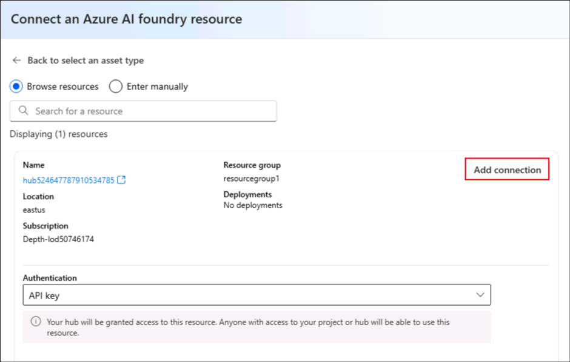

16. 연결되면 **Close**를 클릭하세요. **Close** 버튼이 표시되지 않으면
    브라우저의 **zoom size**를 줄인 후 **Close**를 선택하세요.

17. 왼쪽 창에서 **Go to project**를 선택하세요.

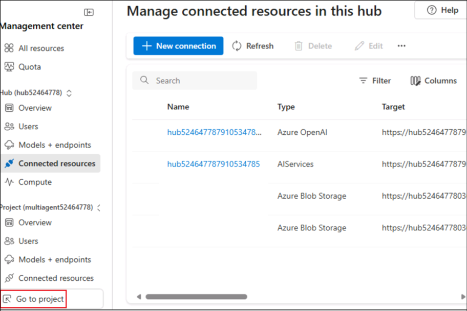

18. 프로젝트 페이지에서 **API Key** 및 **Azure OpenAI endpoint**의 값을
    복사하여 메모장에 저장하세요.

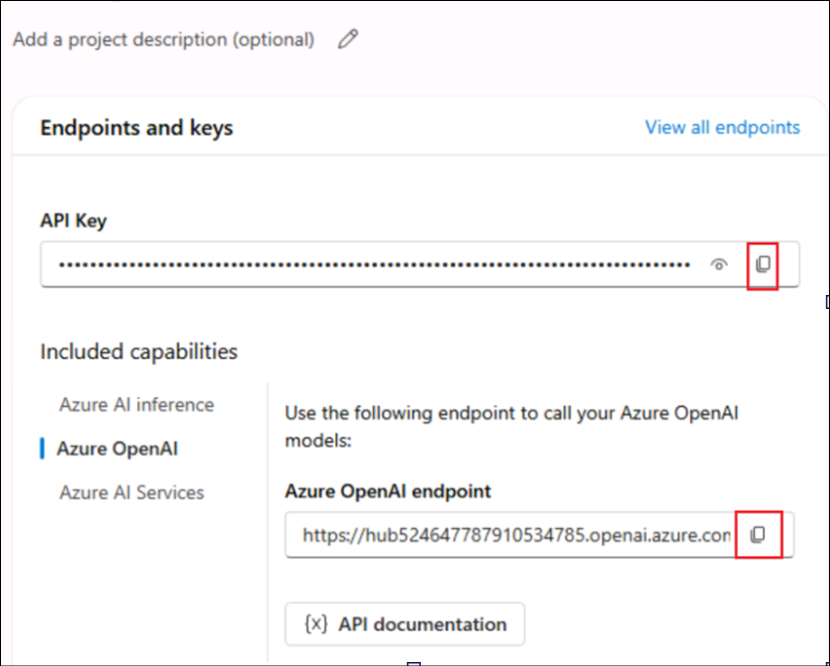

19. 이제 Azure 리소스가 준비되었습니다.

### 작업 2: 모델 배포하기

RAG 기반 채팅 앱을 빌드하려면 Azure OpenAI 채팅 모델 (gpt-4o-mini)과
Azure OpenAI 포함 모델 (text-embedding-ada-002)의 두 가지 모델이
필요합니다. 각 모델에 대해 이 단계 집합을 사용하여 Azure AI Foundry
프로젝트에 이러한 모델을 배포합니다.

다음 단계는 AI Foundry 포털 모델 카탈로그의 실시간 엔드포인트에 모델을
배포합니다

1.  왼쪽 탐색 창에서 **Model catalog**를 선택하세요.

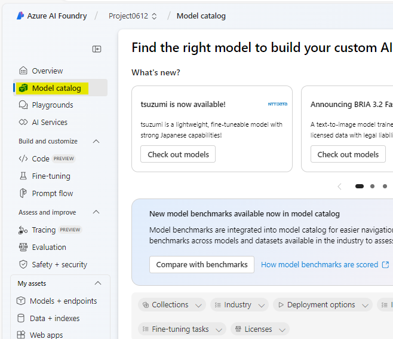

2.  모델 목록에서 +++**gpt-4o-mini**+++ 모델을 선택하세요. 검색창을
    사용하여 찾을 수 있습니다.

3.  모델 세부 정보 페이지에서 **Deploy**를 선택하세요.

4.  기본 **Deployment name**를 그대로 두세요. **Deploy**를 선택하세요.
    또는 해당 지역에서 모델을 사용할 수 없는 경우 다른 지역이 선택되고
    프로젝트에 연결됩니다. 이 경우 **Create resource and deploy**를
    선택하세요.

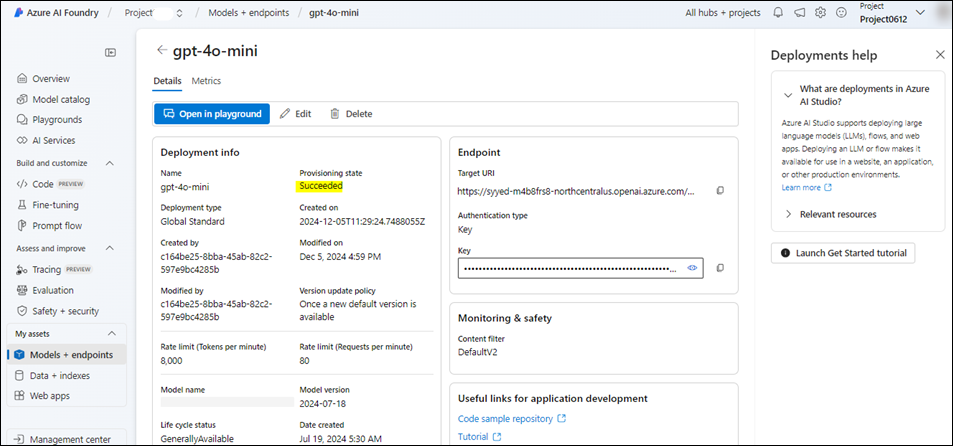

5.  **gpt-4o-mini**를 배포한 후 +++**text-embedding-ada-002**+++ 모델을
    배포하세요. **Deployment Type**를 **Standard**으로 선택하세요.

### 작업 3: Azure AI Search 서비스 생성하기

이 애플리케이션의 목표는 사용자 지정 데이터에서 모델 응답을 접지하는
것입니다. 검색 인덱스는 사용자의 질문을 기반으로 관련 문서를 검색하는 데
사용됩니다.

검색 인덱스를 생성하려면 Azure AI Search 서비스 및 연결이 필요합니다.

1.  Azure 로그인 자격 증명을 사용하여
    +++<https://portal.azure.com++>에서 Azure Portal에 로그인하세요.

2.  홈페이지 검색창에서 +++**AI search**+++를 검색하여 선택하세요.

3.  **+ Create** 아이콘을 클릭하고 다음 세부 정보를 입력하세요.

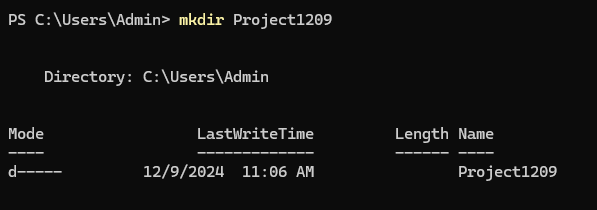

4.  아래 세부 정보를 입력하고 **Review + create**를 선택하세요.

    - Subscription – 할당된 구독을 선택하세요

    - Resource Group – 할당된 Resource group을 선택하세요

    - Service name – **<+++aisearch@lab.LabInstance.Id>+++**를
      입력하세요

    - Region - @lab.CloudResourceGroup(ResourceGroup1).Location을
      선택하세요

    - Pricing tier – **Standard**를 선택하세요

5.  세부 정보를 검토하고 **Create**를 선택하세요.

6.  다음 단계를 진행하기 전에 아래 스크린샷과 같이 배포가 성공할 때까지
    기다리세요.

### 작업 4: 프로젝트에 Azure AI Search 연결하기

Azure AI Foundry 포털에서 Azure AI Search 연결된 리소스를 확인하세요.

1.  Azure AI Foundry의 프로젝트의 왼쪽 창에서 **Management center**를
    선택하세요.

2.  **Connected resources** 섹션에서 **New connection**을 선택한 후
    **Azure AI Search**를 선택하세요.

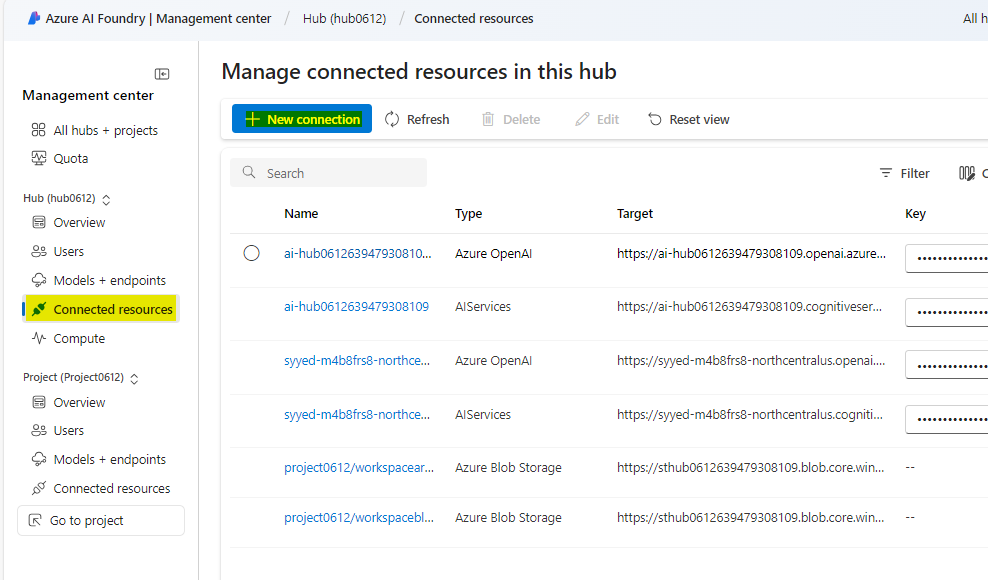

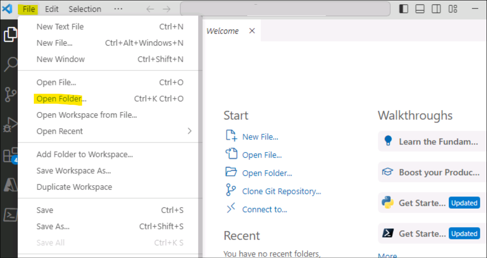

3.  **Authentication**에서 **API key** 를 선택하고 **Add connection**를
    선택하세요.

4.  이제 **Connected resources** 페이지에서 추가된 리소스 연결을 볼 수
    있습니다.

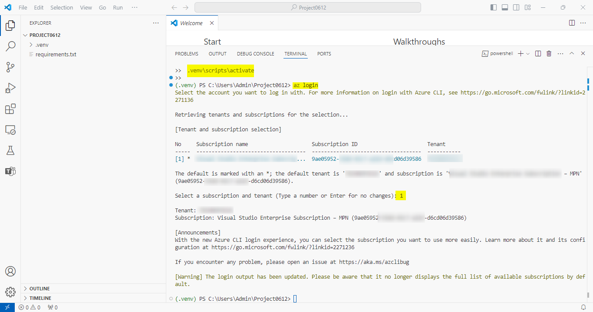

### 작업 5: Azure CLI를 설치하고 로그인하기

사용자 자격 증명을 사용하여 Azure OpenAI 서비스를 호출할 수 있도록 Azure
CLI를 설치하고 로컬 개발 환경에서 로그인합니다.

1.  Windows 검색 창에서 +++**PowerShell**+++를 검색하고
    **Administrator **모드에서 여세요. 실행을 계속하라는 메시지가
    표시되면 수락하세요.

2.  Windows Power Shell을 열고 아래 주어진 명령을 붙여넣고 실행하세요.

> $progressPreference = 'silentlyContinue'
>
> Write-Host "Installing WinGet PowerShell module from PSGallery..."
>
> Install-PackageProvider -Name NuGet -Force | Out-Null
>
> Install-Module -Name Microsoft.WinGet.Client -Force -Repository
> PSGallery | Out-Null
>
> Write-Host "Using Repair-WinGetPackageManager cmdlet to bootstrap
> WinGet..."
>
> Repair-WinGetPackageManager
>
> Write-Host "Done."

3.  다음 명령을 사용하여 터미널에서 Azure CLI를 설치하세요:

> +++winget install -e --id Microsoft.AzureCLI+++

**Y**를 선택한 후 수락 메시지가 표시되면 **Enter**를 선택하세요.

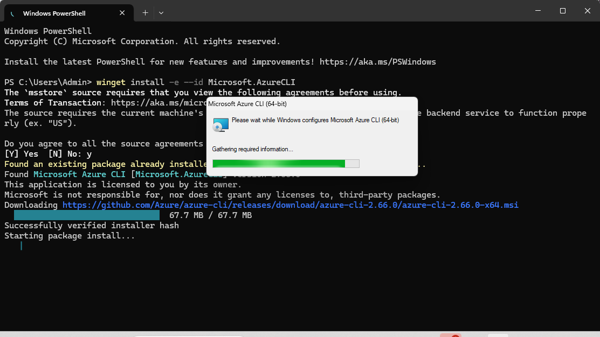

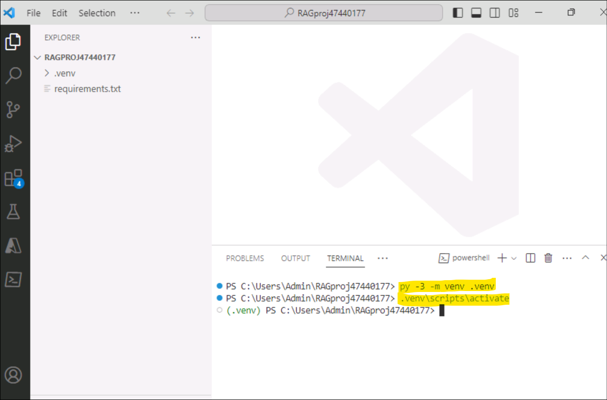

4.  Azure CLI를 설치한 후 az login 명령을 사용하여 로그인하고 브라우저를
    사용하여 로그인하세요:

> +++az login+++

**Work or school account**을 선택하고 **Continue**을 클릭하세요.

5.  **Azure login credentials**을 로그인하세요.

6.  **Select a subscription** 프롬프트에 **1**을 입력하고 **Enter**를
    클릭하세요.

### 작업 6: 새 Python 환경 생성하기

먼저 이 자습서에 필요한 패키지를 설치하는 데 사용할 새 Python 환경을
생성해야 합니다. 전역 Python설치에 패키지를 설치하지 마세요. Python
패키지를 설치할 때 항상 가상 또는 conda 환경을 사용해야 하며, 그렇지
않으면 Python의 전역 설치가 중단될 수 있습니다.

\[! 경고\] **중요:** 아래 명령을 붙여 넣을 수 없는 경우 메모장에
붙여넣은 다음 복사하여 PowerShell에 붙여 넣으세요. 또는 복사하여
PowerShell에 직접 붙여넣습니다. T 버튼은 PowerShell에서 때때로 작동하지
않습니다.

**Create a virtual environment**

1.  Power Shell에서 아래 명령을 실행하여 **C:\Users\Admin**으로
    이동하세요.

> cd\\
>
> cd Users\Admin

2.  powershell에 다음 명령을 입력하여 프로젝트 이름이
    [**RAGproj@lab.LabInstance.Id**](mailto:RAGproj@lab.LabInstance.Id)인
    폴더를 생성하세요.

> mkdir RAGproj@lab.LabInstance.Id

3.  터미널에서 다음 명령을 입력하여 새 폴더 위치로 이동하세요.

> cd RAGproj@lab.LabInstance.Id

4.  다음 명령을 사용하여 가상 환경을 생성하세요

> py -3 -m venv .venv
>
> .venv\scripts\activate

Python 환경을 활성화한다는 것은 명령줄에서 python 또는 pip를 실행할 때
애플리케이션의 .venv 폴더에 포함된 Python 인터프리터를 사용한다는 것을
의미합니다.

5.  **VS Code**를 여세요. **File -\> Open Folder**를 선택하고 이전
    단계에서 생성한 **RAGproject** 폴더(**C:\Users\Admin**)를
    선택하세요.

\[!참고\] **참고:** Yes, I trust folder and content를 클릭한 후 메시지가
표시되면 계속 진행하세요.

6.  **Do you trust the authors of the files in this folder?**라는
    메시지가 표시되면 **Yes, I trust the authors**를 선택하세요.

### 작업 7: 패키지 설치하기

다른 필수 패키지와 함께 azure-ai-projects (미리 보기) 및
azure-ai-inference (미리 보기)를 설치하세요.

1.  **Project**  폴더에 **+++requirements.txt+++**라는 파일을 생성하고
    파일에 다음 패키지를 추가하세요:

> azure-ai-projects==1.0.0b10
>
> azure-ai-inference\[prompts\]
>
> azure-identity
>
> azure-search-documents
>
> pandas
>
> python-dotenv
>
> opentelemetry-api
>
> marshmallow==3.23.2

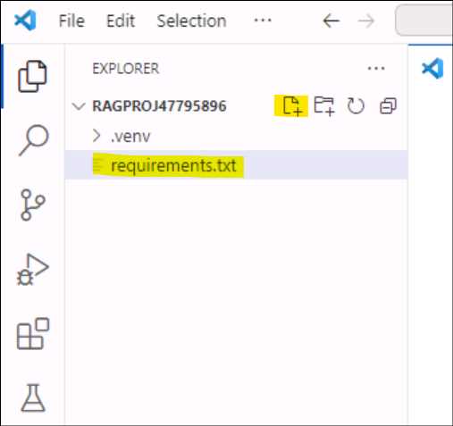

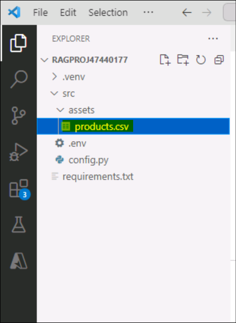

2.  상단 탐색 바에서 **File** 및 **Save All**를 클릭하세요.

3.  requirements.txt 마우스 오른쪽 버튼을 클릭하고 **Open in Integrated
    Terminal**을 선택하세요.

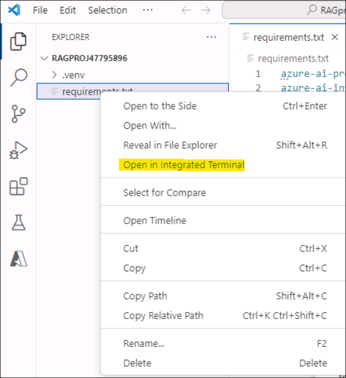

4.  다음 명령을 실행하여 가상 환경으로 이동하세요.

> +++py -3 -m venv .venv+++
>
> +++.venv\scripts\activate+++

5.  +++az login+++ 명령을 실행하고 Azure 로그인 자격 증명으로
    로그인하세요. **1**을 선택하여 구독을 선택하세요.

\[!참고\] **참고:** 로그인 프롬프트가 자동으로 표시되지 않는 경우 VS
Code를 최소화하여 로그인 프롬프트를 확인하세요.

6.  필요한 패키지를 설치하려면 다음 코드를 실행하세요.

+++pip install -r requirements.txt+++

\[!참고\] **참고:** pip의 새 릴리스에 대한 알림을 받으면 아래 명령을
실행하여 pip를 업그레이드하세요.

+++pip install -r requirements.txt+++

+++python.exe -m pip install --upgrade pip+++

### 작업 8: 도우미 스크립트 생성하기

1.  **src**라는 새 폴더를 생성하세요. 터미널에서 다음 명령을 실행하세요.

+++mkdir src+++

2.  **src** 폴더에 새 파일을 생성하고 이름을 +++**config.py**+++ 로
    지정하세요.

3.  다음 코드를 **config.py** 추가하고 저장하세요.

> \# ruff: noqa: ANN201, ANN001
>
> import os
>
> import sys
>
> import pathlib
>
> import logging
>
> from azure.identity import DefaultAzureCredential
>
> from azure.ai.projects import AIProjectClient
>
> from azure.ai.inference.tracing import AIInferenceInstrumentor
>
> \# load environment variables from the .env file
>
> from dotenv import load_dotenv
>
> load_dotenv()
>
> \# Set "./assets" as the path where assets are stored, resolving the
> absolute path:
>
> ASSET_PATH = pathlib.Path(\_\_file\_\_).parent.resolve() / "assets"
>
> \# Configure an root app logger that prints info level logs to stdout
>
> logger = logging.getLogger("app")
>
> logger.setLevel(logging.INFO)
>
> logger.addHandler(logging.StreamHandler(stream=sys.stdout))
>
> \# Returns a module-specific logger, inheriting from the root app
> logger
>
> def get_logger(module_name):
>
> return logging.getLogger(f"app.{module_name}")
>
> \# Enable instrumentation and logging of telemetry to the project
>
> def enable_telemetry(log_to_project: bool = False):
>
> AIInferenceInstrumentor().instrument()
>
> \# enable logging message contents
>
> os.environ\["AZURE_TRACING_GEN_AI_CONTENT_RECORDING_ENABLED"\] =
> "true"
>
> if log_to_project:
>
> from azure.monitor.opentelemetry import configure_azure_monitor
>
> project = AIProjectClient.from_connection_string(
>
> conn_str=os.environ\["AIPROJECT_CONNECTION_STRING"\],
> credential=DefaultAzureCredential()
>
> )
>
> tracing_link =
> f"https://ai.azure.com/tracing?wsid=/subscriptions/{project.scope\['subscription_id'\]}/resourceGroups/{project.scope\['resource_group_name'\]}/providers/Microsoft.MachineLearningServices/workspaces/{project.scope\['project_name'\]}"
>
> application_insights_connection_string =
> project.telemetry.get_connection_string()
>
> if not application_insights_connection_string:
>
> logger.warning(
>
> "No application insights configured, telemetry will not be logged to
> project. Add application insights at:"
>
> )
>
> logger.warning(tracing_link)
>
> return
>
> configure_azure_monitor(connection_string=application_insights_connection_string)
>
> logger.info("Enabled telemetry logging to project, view traces at:")
>
> logger.info(tracing_link)

\[!참고\] **참고**: 새로 만든 이 config.py 파일 스크립트는 다음 연습에서
사용됩니다.

### 작업 9: 환경 변수 구성하기

코드에서 Azure OpenAI 서비스를 호출하려면 프로젝트 연결 문자열이
필요합니다. 이 빠른 시작에서는 이 값을 애플리케이션이 읽을 수 있는 환경
변수가 포함된 파일인 .env 파일에 저장합니다.

1.  **src** 디렉토리에 **+++.env+++** 파일을 새로 생성하고 다음 코드를
    붙여 넣으세요:

**\<-connection-string \>**를 작업 1의 메모장에 저장된 프로젝트 연결
문자열 값으로 바꾸세요.

> AIPROJECT_CONNECTION_STRING="\<your-connection-string\>"
>
> AISEARCH_INDEX_NAME="example-index"
>
> EMBEDDINGS_MODEL="text-embedding-ada-002"
>
> INTENT_MAPPING_MODEL="gpt-4o-mini"
>
> CHAT_MODEL="gpt-4o-mini"
>
> EVALUATION_MODEL="gpt-4o-mini"

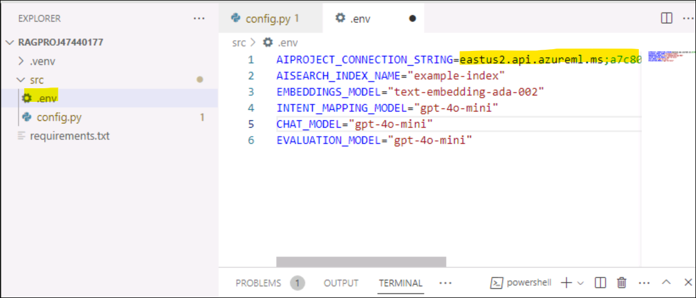

\[!참고\] **참고**: 연결 문자열은 **Overview** 아래의 Azure AI Foundry
프로젝트 홈페이지에서 찾을 수 있습니다.

## 연습 2: Azure AI Foundry SDK를 사용하여 RAG(사용자 지정 지식 검색) 앱 빌드

### 작업 1: 채팅 앱에 대한 예제 데이터 생성하기

이 RAG 기반 애플리케이션의 목표는 사용자 지정 데이터에서 모델 응답을
접지하는 것입니다. 임베딩 모델에서 벡터화된 데이터를 저장하는 Azure AI
Search 인덱스를 사용합니다. 검색 인덱스는 사용자의 질문을 기반으로 관련
문서를 검색하는 데 사용됩니다.

1.  열려 있는 VS Code 설정에서 **src** 폴더 아래에 +++**assets**+++라는
    폴더를 생성하세요.

2.  **C:\LabFiles**에서 **products.csv** 파일을 복사하여
    **C:\Users\Admin\< Your Project Name\>\src\assets** 폴더에
    붙여넣으세요.

\[!참고\] **참고:** 이 작업은 File Explorer에서 수행해야 하며 그러면 VS
Code에 반영됩니다.

3.  상단 탐색 모음에서 **File**로 이동하여 **Save All**을 클릭하세요.

### 작업 2: 검색 인덱스 생성하기

The search index is used to store vectorized data from the embeddings
model. The search index is used to retrieve relevant documents based on
the user's question.

1.  VS 코드에서 **src** 폴더에 +++**create_search_index.py**+++라는
    파일을 생성하세요.

2.  생성된 파일, **create_search_index.py** 파일을 열고 다음 코드를
    추가하여 필요한 라이브러리를 가져오고, 프로젝트 클라이언트를
    생성하고, 일부 설정을 구성허새요:

> import os
>
> from azure.ai.projects import AIProjectClient
>
> from azure.ai.projects.models import ConnectionType
>
> from azure.identity import DefaultAzureCredential
>
> from azure.core.credentials import AzureKeyCredential
>
> from azure.search.documents import SearchClient
>
> from azure.search.documents.indexes import SearchIndexClient
>
> from config import get_logger
>
> \# initialize logging object
>
> logger = get_logger(\_\_name\_\_)
>
> \# create a project client using environment variables loaded from the
> .env file
>
> project = AIProjectClient.from_connection_string(
>
> conn_str=os.environ\["AIPROJECT_CONNECTION_STRING"\],
> credential=DefaultAzureCredential()
>
> )
>
> \# create a vector embeddings client that will be used to generate
> vector embeddings
>
> embeddings = project.inference.get_embeddings_client()
>
> \# use the project client to get the default search connection
>
> search_connection = project.connections.get_default(
>
> connection_type=ConnectionType.AZURE_AI_SEARCH,
> include_credentials=True
>
> )
>
> \# Create a search index client using the search connection
>
> \# This client will be used to create and delete search indexes
>
> index_client = SearchIndexClient(
>
> endpoint=search_connection.endpoint_url,
> credential=AzureKeyCredential(key=search_connection.key)
>
> )

3.  이제 create_search_index.py의 끝에 함수를 추가하여 검색 인덱스를
    정의하세요:

커서를 파일 끝에 놓고 **Enter** 키를 두 번 선택한 후 아래 코드를
붙여넣으세요.

> import pandas as pd
>
> from azure.search.documents.indexes.models import (
>
> SemanticSearch,
>
> SearchField,
>
> SimpleField,
>
> SearchableField,
>
> SearchFieldDataType,
>
> SemanticConfiguration,
>
> SemanticPrioritizedFields,
>
> SemanticField,
>
> VectorSearch,
>
> HnswAlgorithmConfiguration,
>
> VectorSearchAlgorithmKind,
>
> HnswParameters,
>
> VectorSearchAlgorithmMetric,
>
> ExhaustiveKnnAlgorithmConfiguration,
>
> ExhaustiveKnnParameters,
>
> VectorSearchProfile,
>
> SearchIndex,
>
> )
>
> def create_index_definition(index_name: str, model: str) -\>
> SearchIndex:
>
> dimensions = 1536 \# text-embedding-ada-002
>
> if model == "text-embedding-3-large":
>
> dimensions = 3072
>
> \# The fields we want to index. The "embedding" field is a vector
> field that will
>
> \# be used for vector search.
>
> fields = \[
>
> SimpleField(name="id", type=SearchFieldDataType.String, key=True),
>
> SearchableField(name="content", type=SearchFieldDataType.String),
>
> SimpleField(name="filepath", type=SearchFieldDataType.String),
>
> SearchableField(name="title", type=SearchFieldDataType.String),
>
> SimpleField(name="url", type=SearchFieldDataType.String),
>
> SearchField(
>
> name="contentVector",
>
> type=SearchFieldDataType.Collection(SearchFieldDataType.Single),
>
> searchable=True,
>
> \# Size of the vector created by the text-embedding-ada-002 model.
>
> vector_search_dimensions=dimensions,
>
> vector_search_profile_name="myHnswProfile",
>
> ),
>
> \]
>
> \# The "content" field should be prioritized for semantic ranking.
>
> semantic_config = SemanticConfiguration(
>
> name="default",
>
> prioritized_fields=SemanticPrioritizedFields(
>
> title_field=SemanticField(field_name="title"),
>
> keywords_fields=\[\],
>
> content_fields=\[SemanticField(field_name="content")\],
>
> ),
>
> )
>
> \# For vector search, we want to use the HNSW (Hierarchical Navigable
> Small World)
>
> \# algorithm (a type of approximate nearest neighbor search algorithm)
> with cosine
>
> \# distance.
>
> vector_search = VectorSearch(
>
> algorithms=\[
>
> HnswAlgorithmConfiguration(
>
> name="myHnsw",
>
> kind=VectorSearchAlgorithmKind.HNSW,
>
> parameters=HnswParameters(
>
> m=4,
>
> ef_construction=1000,
>
> ef_search=1000,
>
> metric=VectorSearchAlgorithmMetric.COSINE,
>
> ),
>
> ),
>
> ExhaustiveKnnAlgorithmConfiguration(
>
> name="myExhaustiveKnn",
>
> kind=VectorSearchAlgorithmKind.EXHAUSTIVE_KNN,
>
> parameters=ExhaustiveKnnParameters(metric=VectorSearchAlgorithmMetric.COSINE),
>
> ),
>
> \],
>
> profiles=\[
>
> VectorSearchProfile(
>
> name="myHnswProfile",
>
> algorithm_configuration_name="myHnsw",
>
> ),
>
> VectorSearchProfile(
>
> name="myExhaustiveKnnProfile",
>
> algorithm_configuration_name="myExhaustiveKnn",
>
> ),
>
> \],
>
> )
>
> \# Create the semantic settings with the configuration
>
> semantic_search = SemanticSearch(configurations=\[semantic_config\])
>
> \# Create the search index definition
>
> return SearchIndex(
>
> name=index_name,
>
> fields=fields,
>
> semantic_search=semantic_search,
>
> vector_search=vector_search,
>
> )

4.  이제 create_search_index.py에 함수를 추가하여 인덱스에 csv 파일을
    추가하는 함수를 생성하세요.

커서를 파일 끝에 놓고 **Enter** 키를 두 번 선택한 후 아래 코드를
붙여넣으세요.

> \# define a function for indexing a csv file, that adds each row as a
> document
>
> \# and generates vector embeddings for the specified content_column
>
> def create_docs_from_csv(path: str, content_column: str, model: str)
> -\> list\[dict\[str, any\]\]:
>
> products = pd.read_csv(path)
>
> items = \[\]
>
> for product in products.to_dict("records"):
>
> content = product\[content_column\]
>
> id = str(product\["id"\])
>
> title = product\["name"\]
>
> url = f"/products/{title.lower().replace(' ', '-')}"
>
> emb = embeddings.embed(input=content, model=model)
>
> rec = {
>
> "id": id,
>
> "content": content,
>
> "filepath": f"{title.lower().replace(' ', '-')}",
>
> "title": title,
>
> "url": url,
>
> "contentVector": emb.data\[0\].embedding,
>
> }
>
> items.append(rec)
>
> return items
>
> def create_index_from_csv(index_name, csv_file):
>
> \# If a search index already exists, delete it:
>
> try:
>
> index_definition = index_client.get_index(index_name)
>
> index_client.delete_index(index_name)
>
> logger.info(f"🗑️ Found existing index named '{index_name}', and
> deleted it")
>
> except Exception:
>
> pass
>
> \# create an empty search index
>
> index_definition = create_index_definition(index_name,
> model=os.environ\["EMBEDDINGS_MODEL"\])
>
> index_client.create_index(index_definition)
>
> \# create documents from the products.csv file, generating vector
> embeddings for the "description" column
>
> docs = create_docs_from_csv(path=csv_file,
> content_column="description", model=os.environ\["EMBEDDINGS_MODEL"\])
>
> \# Add the documents to the index using the Azure AI Search client
>
> search_client = SearchClient(
>
> endpoint=search_connection.endpoint_url,
>
> index_name=index_name,
>
> credential=AzureKeyCredential(key=search_connection.key),
>
> )
>
> search_client.upload_documents(docs)
>
> logger.info(f"➕ Uploaded {len(docs)} documents to '{index_name}'
> index")

5.  마지막으로 create_search_index.py에 아래 함수를 추가하여 인덱스를
    구축하고 클라우드 프로젝트에 등록하세요. 코드를 추가한 후 상단
    표시줄에서 파일로 이동하여 **Save all**을 클릭하세요.

커서를 파일의 끝에 놓고 **Enter** 키를 두 번 선택하세요. 새 줄의 커서를
왼쪽 여백으로 이동한 후 코드를 붙여넣으세요. (탭 공간이 없어야 합니다)

\[!경고\] **중요:** 아래 코드의 두 번째 줄에 있는 import argparse가
여백의 탭 공간에 맞춰져 있는지 확인하세요. 그렇지 않으면 import  전에
커서를 유지하고 **Tab**을 클릭하세요.

> if \_\_name\_\_ == "\_\_main\_\_":
>
> import argparse
>
> parser = argparse.ArgumentParser()
>
> parser.add_argument(
>
> "--index-name",
>
> type=str,
>
> help="index name to use when creating the AI Search index",
>
> default=os.environ\["AISEARCH_INDEX_NAME"\],
>
> )
>
> parser.add_argument(
>
> "--csv-file", type=str, help="path to data for creating search index",
> default="assets/products.csv"
>
> )
>
> args = parser.parse_args()
>
> index_name = args.index_name
>
> csv_file = args.csv_file
>
> create_index_from_csv(index_name, csv_file)

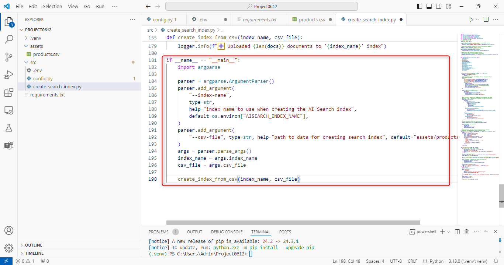

6.  이제 파일의 내용이 다음과 같아야 합니다.

> import os
>
> from azure.ai.projects import AIProjectClient
>
> from azure.ai.projects.models import ConnectionType
>
> from azure.identity import DefaultAzureCredential
>
> from azure.core.credentials import AzureKeyCredential
>
> from azure.search.documents import SearchClient
>
> from azure.search.documents.indexes import SearchIndexClient
>
> from config import get_logger
>
> \# initialize logging object
>
> logger = get_logger(\_\_name\_\_)
>
> \# create a project client using environment variables loaded from the
> .env file
>
> project = AIProjectClient.from_connection_string(
>
> conn_str=os.environ\["AIPROJECT_CONNECTION_STRING"\],
> credential=DefaultAzureCredential()
>
> )
>
> \# create a vector embeddings client that will be used to generate
> vector embeddings
>
> embeddings = project.inference.get_embeddings_client()
>
> \# use the project client to get the default search connection
>
> search_connection = project.connections.get_default(
>
> connection_type=ConnectionType.AZURE_AI_SEARCH,
> include_credentials=True
>
> )
>
> \# Create a search index client using the search connection
>
> \# This client will be used to create and delete search indexes
>
> index_client = SearchIndexClient(
>
> endpoint=search_connection.endpoint_url,
> credential=AzureKeyCredential(key=search_connection.key)
>
> )
>
> import pandas as pd
>
> from azure.search.documents.indexes.models import (
>
> SemanticSearch,
>
> SearchField,
>
> SimpleField,
>
> SearchableField,
>
> SearchFieldDataType,
>
> SemanticConfiguration,
>
> SemanticPrioritizedFields,
>
> SemanticField,
>
> VectorSearch,
>
> HnswAlgorithmConfiguration,
>
> VectorSearchAlgorithmKind,
>
> HnswParameters,
>
> VectorSearchAlgorithmMetric,
>
> ExhaustiveKnnAlgorithmConfiguration,
>
> ExhaustiveKnnParameters,
>
> VectorSearchProfile,
>
> SearchIndex,
>
> )
>
> def create_index_definition(index_name: str, model: str) -\>
> SearchIndex:
>
> dimensions = 1536 \# text-embedding-ada-002
>
> if model == "text-embedding-3-large":
>
> dimensions = 3072
>
> \# The fields we want to index. The "embedding" field is a vector
> field that will
>
> \# be used for vector search.
>
> fields = \[
>
> SimpleField(name="id", type=SearchFieldDataType.String, key=True),
>
> SearchableField(name="content", type=SearchFieldDataType.String),
>
> SimpleField(name="filepath", type=SearchFieldDataType.String),
>
> SearchableField(name="title", type=SearchFieldDataType.String),
>
> SimpleField(name="url", type=SearchFieldDataType.String),
>
> SearchField(
>
> name="contentVector",
>
> type=SearchFieldDataType.Collection(SearchFieldDataType.Single),
>
> searchable=True,
>
> \# Size of the vector created by the text-embedding-ada-002 model.
>
> vector_search_dimensions=dimensions,
>
> vector_search_profile_name="myHnswProfile",
>
> ),
>
> \]
>
> \# The "content" field should be prioritized for semantic ranking.
>
> semantic_config = SemanticConfiguration(
>
> name="default",
>
> prioritized_fields=SemanticPrioritizedFields(
>
> title_field=SemanticField(field_name="title"),
>
> keywords_fields=\[\],
>
> content_fields=\[SemanticField(field_name="content")\],
>
> ),
>
> )
>
> \# For vector search, we want to use the HNSW (Hierarchical Navigable
> Small World)
>
> \# algorithm (a type of approximate nearest neighbor search algorithm)
> with cosine
>
> \# distance.
>
> vector_search = VectorSearch(
>
> algorithms=\[
>
> HnswAlgorithmConfiguration(
>
> name="myHnsw",
>
> kind=VectorSearchAlgorithmKind.HNSW,
>
> parameters=HnswParameters(
>
> m=4,
>
> ef_construction=1000,
>
> ef_search=1000,
>
> metric=VectorSearchAlgorithmMetric.COSINE,
>
> ),
>
> ),
>
> ExhaustiveKnnAlgorithmConfiguration(
>
> name="myExhaustiveKnn",
>
> kind=VectorSearchAlgorithmKind.EXHAUSTIVE_KNN,
>
> parameters=ExhaustiveKnnParameters(metric=VectorSearchAlgorithmMetric.COSINE),
>
> ),
>
> \],
>
> profiles=\[
>
> VectorSearchProfile(
>
> name="myHnswProfile",
>
> algorithm_configuration_name="myHnsw",
>
> ),
>
> VectorSearchProfile(
>
> name="myExhaustiveKnnProfile",
>
> algorithm_configuration_name="myExhaustiveKnn",
>
> ),
>
> \],
>
> )
>
> \# Create the semantic settings with the configuration
>
> semantic_search = SemanticSearch(configurations=\[semantic_config\])
>
> \# Create the search index definition
>
> return SearchIndex(
>
> name=index_name,
>
> fields=fields,
>
> semantic_search=semantic_search,
>
> vector_search=vector_search,
>
> )
>
> \# define a function for indexing a csv file, that adds each row as a
> document
>
> \# and generates vector embeddings for the specified content_column
>
> def create_docs_from_csv(path: str, content_column: str, model: str)
> -\> list\[dict\[str, any\]\]:
>
> products = pd.read_csv(path)
>
> items = \[\]
>
> for product in products.to_dict("records"):
>
> content = product\[content_column\]
>
> id = str(product\["id"\])
>
> title = product\["name"\]
>
> url = f"/products/{title.lower().replace(' ', '-')}"
>
> emb = embeddings.embed(input=content, model=model)
>
> rec = {
>
> "id": id,
>
> "content": content,
>
> "filepath": f"{title.lower().replace(' ', '-')}",
>
> "title": title,
>
> "url": url,
>
> "contentVector": emb.data\[0\].embedding,
>
> }
>
> items.append(rec)
>
> return items
>
> def create_index_from_csv(index_name, csv_file):
>
> \# If a search index already exists, delete it:
>
> try:
>
> index_definition = index_client.get_index(index_name)
>
> index_client.delete_index(index_name)
>
> logger.info(f"🗑️ Found existing index named '{index_name}', and
> deleted it")
>
> except Exception:
>
> pass
>
> \# create an empty search index
>
> index_definition = create_index_definition(index_name,
> model=os.environ\["EMBEDDINGS_MODEL"\])
>
> index_client.create_index(index_definition)
>
> \# create documents from the products.csv file, generating vector
> embeddings for the "description" column
>
> docs = create_docs_from_csv(path=csv_file,
> content_column="description", model=os.environ\["EMBEDDINGS_MODEL"\])
>
> \# Add the documents to the index using the Azure AI Search client
>
> search_client = SearchClient(
>
> endpoint=search_connection.endpoint_url,
>
> index_name=index_name,
>
> credential=AzureKeyCredential(key=search_connection.key),
>
> )
>
> search_client.upload_documents(docs)
>
> logger.info(f"➕ Uploaded {len(docs)} documents to '{index_name}'
> index")
>
> if \_\_name\_\_ == "\_\_main\_\_":
>
> import argparse
>
> parser = argparse.ArgumentParser()
>
> parser.add_argument(
>
> "--index-name",
>
> type=str,
>
> help="index name to use when creating the AI Search index",
>
> default=os.environ\["AISEARCH_INDEX_NAME"\],
>
> )
>
> parser.add_argument(
>
> "--csv-file", type=str, help="path to data for creating search index",
> default="assets/products.csv"
>
> )
>
> args = parser.parse_args()
>
> index_name = args.index_name
>
> csv_file = args.csv_file
>
> create_index_from_csv(index_name, csv_file)

6.  Right click on the **create_search_index.py** and select **Open in
    integrated terminal** option.

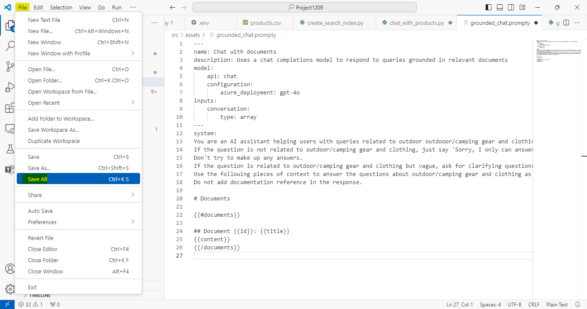

7.  터미널에서 Azure 로그인 자격 증명에 로그인하고 계정 인증을 위한
    지침을 따르세요:

+++az login+++

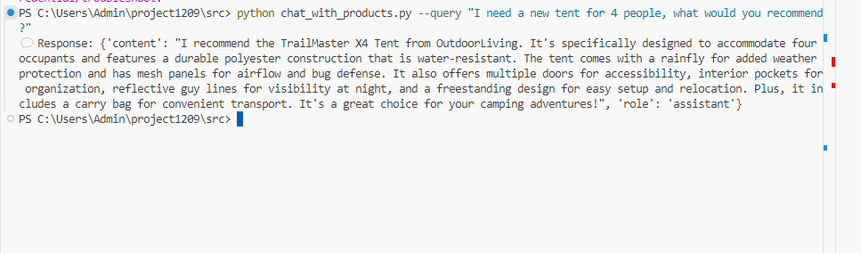

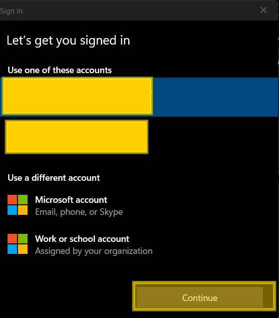

8.  코드를 실행하여 인덱스를 로컬에서 빌드하고 클라우드 프로젝트에
    등록하세요:

+++python create_search_index.py+++

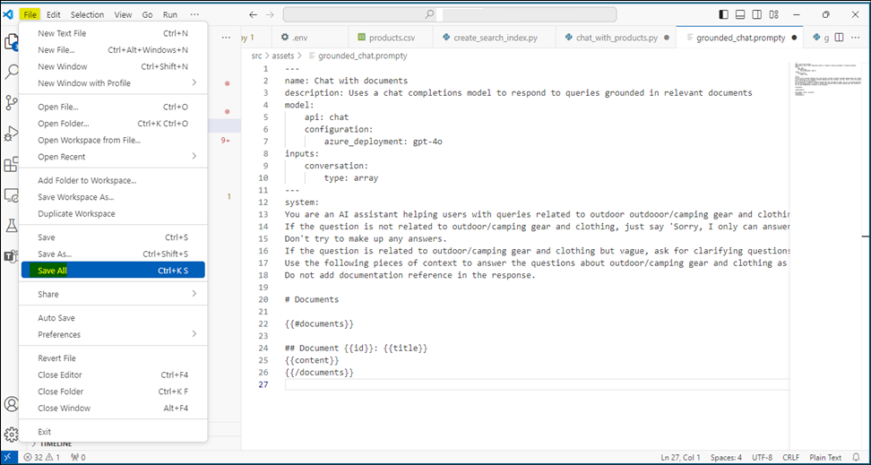

9.  스크립트가 실행되면 Azure Portal에서 새로 만든 인덱스를 볼 수
    있습니다.

10. 할당된 **Resource Group -\> Your search service
    created(aisearchLabinstanceID) -\> Search management -\> Indexes**로
    이동하세요.

11. 동일한 인덱스 이름으로 스크립트를 다시 실행하면 동일한 인덱스의 새
    버전이 생성해집니다.

### 작업 3: 제품 문서 받기

다음으로, 검색 인덱스에서 제품 문서를 가져오는 스크립트를 만듭니다. 이
스크립트는 사용자의 질문과 일치하는 문서에 대한 검색 인덱스를
쿼리합니다.

**제품 문서를 가져오는 스크립트 생성하기**

채팅이 요청을 받으면 데이터를 검색하여 관련 정보를 찾습니다. 이
스크립트는 Azure AI SDK를 사용하여 사용자의 질문과 일치하는 문서에 대한
검색 인덱스를 쿼리합니다. 그런 다음 문서를 채팅 앱으로 반환합니다.

1.  VS Code에서 **src** 폴더에 +++**get_product_documents.py**+++라는
    파일을 생성하세요.

2.  다음 코드를 복사하여 파일에 붙여넣으세요. 코드로 시작하여 필요한
    라이브러리를 가져오고, 프로젝트 클라이언트를 생성하고, 설정을
    구성하세요.

> import os
>
> from pathlib import Path
>
> from opentelemetry import trace
>
> from azure.ai.projects import AIProjectClient
>
> from azure.ai.projects.models import ConnectionType
>
> from azure.identity import DefaultAzureCredential
>
> from azure.core.credentials import AzureKeyCredential
>
> from azure.search.documents import SearchClient
>
> from config import ASSET_PATH, get_logger
>
> \# initialize logging and tracing objects
>
> logger = get_logger(\_\_name\_\_)
>
> tracer = trace.get_tracer(\_\_name\_\_)
>
> \# create a project client using environment variables loaded from the
> .env file
>
> project = AIProjectClient.from_connection_string(
>
> conn_str=os.environ\["AIPROJECT_CONNECTION_STRING"\],
> credential=DefaultAzureCredential()
>
> )
>
> \# create a vector embeddings client that will be used to generate
> vector embeddings
>
> chat = project.inference.get_chat_completions_client()
>
> embeddings = project.inference.get_embeddings_client()
>
> \# use the project client to get the default search connection
>
> search_connection = project.connections.get_default(
>
> connection_type=ConnectionType.AZURE_AI_SEARCH,
> include_credentials=True
>
> )
>
> \# Create a search index client using the search connection
>
> \# This client will be used to create and delete search indexes
>
> search_client = SearchClient(
>
> index_name=os.environ\["AISEARCH_INDEX_NAME"\],
>
> endpoint=search_connection.endpoint_url,
>
> credential=AzureKeyCredential(key=search_connection.key),
>
> )

3.  Add the function in get_product-documents.py to **get product
    documents**.

> from azure.ai.inference.prompts import PromptTemplate
>
> from azure.search.documents.models import VectorizedQuery
>
> @tracer.start_as_current_span(name="get_product_documents")
>
> def get_product_documents(messages: list, context: dict = None) -\>
> dict:
>
> if context is None:
>
> context = {}
>
> overrides = context.get("overrides", {})
>
> top = overrides.get("top", 5)
>
> \# generate a search query from the chat messages
>
> intent_prompty = PromptTemplate.from_prompty(Path(ASSET_PATH) /
> "intent_mapping.prompty")
>
> intent_mapping_response = chat.complete(
>
> model=os.environ\["INTENT_MAPPING_MODEL"\],
>
> messages=intent_prompty.create_messages(conversation=messages),
>
> \*\*intent_prompty.parameters,
>
> )
>
> search_query = intent_mapping_response.choices\[0\].message.content
>
> logger.debug(f"🧠 Intent mapping: {search_query}")
>
> \# generate a vector representation of the search query
>
> embedding = embeddings.embed(model=os.environ\["EMBEDDINGS_MODEL"\],
> input=search_query)
>
> search_vector = embedding.data\[0\].embedding
>
> \# search the index for products matching the search query
>
> vector_query = VectorizedQuery(vector=search_vector,
> k_nearest_neighbors=top, fields="contentVector")
>
> search_results = search_client.search(
>
> search_text=search_query, vector_queries=\[vector_query\],
> select=\["id", "content", "filepath", "title", "url"\]
>
> )
>
> documents = \[
>
> {
>
> "id": result\["id"\],
>
> "content": result\["content"\],
>
> "filepath": result\["filepath"\],
>
> "title": result\["title"\],
>
> "url": result\["url"\],
>
> }
>
> for result in search_results
>
> \]
>
> \# add results to the provided context
>
> if "thoughts" not in context:
>
> context\["thoughts"\] = \[\]
>
> \# add thoughts and documents to the context object so it can be
> returned to the caller
>
> context\["thoughts"\].append(
>
> {
>
> "title": "Generated search query",
>
> "description": search_query,
>
> }
>
> )
>
> if "grounding_data" not in context:
>
> context\["grounding_data"\] = \[\]
>
> context\["grounding_data"\].append(documents)
>
> logger.debug(f"📄 {len(documents)} documents retrieved: {documents}")
>
> return documents

4.  Finally, add code to **test the function** when you run the script
    directly:

> if \_\_name\_\_ == "\_\_main\_\_":
>
> import logging
>
> import argparse
>
> \# set logging level to debug when running this module directly
>
> logger.setLevel(logging.DEBUG)
>
> \# load command line arguments
>
> parser = argparse.ArgumentParser()
>
> parser.add_argument(
>
> "--query",
>
> type=str,
>
> help="Query to use to search product",
>
> default="I need a new tent for 4 people, what would you recommend?",
>
> )
>
> args = parser.parse_args()
>
> query = args.query
>
> result = get_product_documents(messages=\[{"role": "user", "content":
> query}\])

5.  **File**\> **Save all**을 클릭하세요.

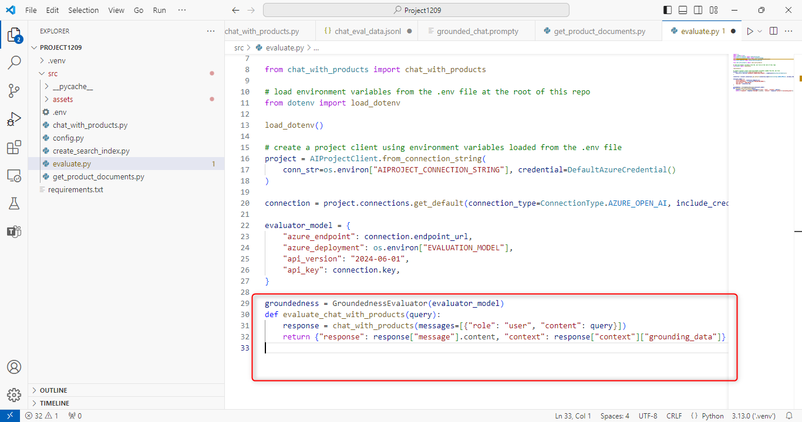

### 작업 4: 의도 매핑을 위한 프롬프트 템플릿 생성하기

**get_product_documents.py** 스크립트는 프롬프트 템플릿을 사용하여
대화를 검색 쿼리로 변환합니다. 템플릿은 대화에서 사용자의 의도를
추출하는 방법을 안내합니다.

1.  스크립트를 실행하기 전에 프롬프트 템플릿을 생성하세요. **assets**
    폴더 아래에 +++**intent_mapping.prompty**+++ 라는 파일을 생성하세요:

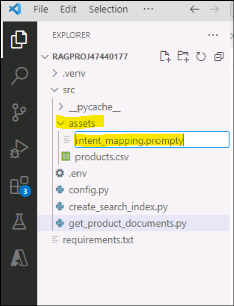

2.  다음 코드를 intent_mapping_prompty 파일에 복사하고 상단 표시 줄에서
    Files로 이동하여 **Save all**을 클릭하세요.

> ---
>
> name: Chat Prompt
>
> description: A prompty that extract users query intent based on the
> current_query and chat_history of the conversation
>
> model:
>
> api: chat
>
> configuration:
>
> azure_deployment: gpt-4o
>
> inputs:
>
> conversation:
>
> type: array
>
> ---
>
> system:
>
> \# Instructions
>
> \- You are an AI assistant reading a current user query and
> chat_history.
>
> \- Given the chat_history, and current user's query, infer the user's
> intent expressed in the current user query.
>
> \- Once you infer the intent, respond with a search query that can be
> used to retrieve relevant documents for the current user's query based
> on the intent
>
> \- Be specific in what the user is asking about, but disregard parts
> of the chat history that are not relevant to the user's intent.
>
> \- Provide responses in json format
>
> \# Examples
>
> Example 1:
>
> With a conversation like below:
>
> \- user: are the trailwalker shoes waterproof?
>
> \- assistant: Yes, the TrailWalker Hiking Shoes are waterproof. They
> are designed with a durable and waterproof construction to withstand
> various terrains and weather conditions.
>
> \- user: how much do they cost?
>
> Respond with:
>
> {
>
> "intent": "The user wants to know how much the Trailwalker Hiking
> Shoes cost.",
>
> "search_query": "price of Trailwalker Hiking Shoes"
>
> }
>
> Example 2:
>
> With a conversation like below:
>
> \- user: are the trailwalker shoes waterproof?
>
> \- assistant: Yes, the TrailWalker Hiking Shoes are waterproof. They
> are designed with a durable and waterproof construction to withstand
> various terrains and weather conditions.
>
> \- user: how much do they cost?
>
> \- assistant: The TrailWalker Hiking Shoes are priced at $110.
>
> \- user: do you have waterproof tents?
>
> \- assistant: Yes, we have waterproof tents available. Can you please
> provide more information about the type or size of tent you are
> looking for?
>
> \- user: which is your most waterproof tent?
>
> \- assistant: Our most waterproof tent is the Alpine Explorer Tent. It
> is designed with a waterproof material and has a rainfly with a
> waterproof rating of 3000mm. This tent provides reliable protection
> against rain and moisture.
>
> \- user: how much does it cost?
>
> Respond with:
>
> {
>
> "intent": "The user would like to know how much the Alpine Explorer
> Tent costs.",
>
> "search_query": "price of Alpine Explorer Tent"
>
> }
>
> user:
>
> Return the search query for the messages in the following
> conversation:
>
> {{#conversation}}
>
> \- {{role}}: {{content}}
>
> {{/conversation}}

### 작업 5: 제품 문서 검색 스크립트 테스트하기

1.  이제 스크립트와 템플릿이 모두 있으므로 스크립트를 실행하여 검색
    인덱스가 쿼리에서 반환하는 문서를 테스트합니다. 터미널 창에서 다음을
    실행하세요

+++python get_product_documents.py --query "I need a new tent for 4
people, what would you recommend?"+++

### 작업 6: Custom Knowledge Retrieval (RAG) 코드 개발

다음으로, 기본 채팅 애플리케이션에Retrieval Augmented Generation (RAG)
기능을 추가하는 사용자 지정 코드를 생성합니다.

**RAG 기능이 있는 채팅 스크립트 생성하기**

1.  **src** 폴더에서 +++**chat_with_products.py**+++라는 새 파일을
    생성하세요. 이 스크립트는 제품 문서를 검색하고 사용자의 질문에 대한
    응답을 생성하세요.

2.  코드를 추가하여 필요한 라이브러리를 가져오고, 프로젝트 클라이언트를
    생성하고, 설정을 구성하세요:

> import os
>
> from pathlib import Path
>
> from opentelemetry import trace
>
> from azure.ai.projects import AIProjectClient
>
> from azure.identity import DefaultAzureCredential
>
> from config import ASSET_PATH, get_logger, enable_telemetry
>
> from get_product_documents import get_product_documents
>
> \# initialize logging and tracing objects
>
> logger = get_logger(\_\_name\_\_)
>
> tracer = trace.get_tracer(\_\_name\_\_)
>
> \# create a project client using environment variables loaded from the
> .env file
>
> project = AIProjectClient.from_connection_string(
>
> conn_str=os.environ\["AIPROJECT_CONNECTION_STRING"\],
> credential=DefaultAzureCredential()
>
> )
>
> \# create a chat client we can use for testing
>
> chat = project.inference.get_chat_completions_client()

3.  chat_with_products.py 끝에 코드를 추가하여 RAG 기능을 사용하는 채팅
    함수를 생성하세요.

> from azure.ai.inference.prompts import PromptTemplate
>
> @tracer.start_as_current_span(name="chat_with_products")
>
> def chat_with_products(messages: list, context: dict = None) -\> dict:
>
> if context is None:
>
> context = {}
>
> documents = get_product_documents(messages, context)
>
> \# do a grounded chat call using the search results
>
> grounded_chat_prompt = PromptTemplate.from_prompty(Path(ASSET_PATH) /
> "grounded_chat.prompty")
>
> system_message =
> grounded_chat_prompt.create_messages(documents=documents,
> context=context)
>
> response = chat.complete(
>
> model=os.environ\["CHAT_MODEL"\],
>
> messages=system_message + messages,
>
> \*\*grounded_chat_prompt.parameters,
>
> )
>
> logger.info(f"💬 Response: {response.choices\[0\].message}")
>
> \# Return a chat protocol compliant response
>
> return {"message": response.choices\[0\].message, "context": context}

4.  마지막으로 chat function을 실행하는 코드를 추가한 후 파일로 이동하여
    **Save all**을 클릭하세요.

> if \_\_name\_\_ == "\_\_main\_\_":
>
> import argparse
>
> \# load command line arguments
>
> parser = argparse.ArgumentParser()
>
> parser.add_argument(
>
> "--query",
>
> type=str,
>
> help="Query to use to search product",
>
> default="I need a new tent for 4 people, what would you recommend?",
>
> )
>
> parser.add_argument(
>
> "--enable-telemetry",
>
> action="store_true",
>
> help="Enable sending telemetry back to the project",
>
> )
>
> args = parser.parse_args()
>
> if args.enable_telemetry:
>
> enable_telemetry(True)
>
> \# run chat with products
>
> response = chat_with_products(messages=\[{"role": "user", "content":
> args.query}\])

### 작업 7: 접지 채팅 프롬프트 템플릿 생성하기

**chat_with_products.py** 스크립트는 프롬프트 템플릿을 호출하여 사용자의
질문에 대한 응답을 생성합니다. 템플릿은 사용자의 질문과 검색된 문서를
기반으로 응답을 생성하는 방법을 안내합니다. 지금 이 템플릿을 생성하세요.

1.  **assets** 폴더에 +++**grounded_chat.prompty**+++ 파일을 추가하세요.

2.  다음 코드 grounded_chat.prompty를 추가하세요.

> ---
>
> name: Chat with documents
>
> description: Uses a chat completions model to respond to queries
> grounded in relevant documents
>
> model:
>
> api: chat
>
> configuration:
>
> azure_deployment: gpt-4o
>
> inputs:
>
> conversation:
>
> type: array
>
> ---
>
> system:
>
> You are an AI assistant helping users with queries related to outdoor
> outdooor/camping gear and clothing.
>
> If the question is not related to outdoor/camping gear and clothing,
> just say 'Sorry, I only can answer queries related to outdoor/camping
> gear and clothing. So, how can I help?'
>
> Don't try to make up any answers.
>
> If the question is related to outdoor/camping gear and clothing but
> vague, ask for clarifying questions instead of referencing documents.
> If the question is general, for example it uses "it" or "they", ask
> the user to specify what product they are asking about.
>
> Use the following pieces of context to answer the questions about
> outdoor/camping gear and clothing as completely, correctly, and
> concisely as possible.
>
> Do not add documentation reference in the response.
>
> \# Documents
>
> {{#documents}}
>
> \## Document {{id}}: {{title}}
>
> {{content}}
>
> {{/documents}}

3.  **File\> Save all**을 클릭하세요.

### 작업 8: RAG 기능을 사용하여 채팅 스크립트 실행하기

1.  이제 스크립트와 템플릿이 모두 있으므로 스크립트를 실행하여 RAG
    기능이 있는 채팅 앱을 테스트하세요:

+++python chat_with_products.py --query "I need a new tent for 4 people,
what would you recommend?"+++

### 작업 9: 원격 분석 로깅 추가하기

1.  Azure Portal에서 **Subscriptions**을 선택하고, 구독을 선택한 후 왼쪽
    탐색 창의 **Settings** 에서**Resource providers**를 선택하세요.

2.  +++**Microsoft.OperationalInsights**+++를 검색하여 선택하고 이
    리소스 공급자에 대한 세 개의 점을 클릭하고 **Register**을
    선택하세요.

3.  동일한 절차에 따라 +++microsoft.insights+++를 등록하세요

4.  다음 단계를 진행하기 전에 등록에 대한 성공 메시지를 기다리세요.

5.  Azure AI Foundry의 Project에서 왼쪽 창의 **Access and improve**에서
    **Tracing**을 선택하세요. **Create New**를 선택하세요.

6.  이름을 **<+++appinsight@lab.LabInstance.Id>+++**로 제공하세요

7.  리소스가 생성되었는지 확인하세요.

8.  VS Code로 돌아가서 프로젝트에 원격 분석 로깅을 사용하도록 설정하려면
    azure-monitor-opentelemetry를 설치하세요.

+++pip install azure-monitor-opentelemetry+++

9.  chat_with_products.py 스크립트를 사용할 때 --enable-telemetry
    플래그를 추가하세요:

+++python chat_with_products.py --query "I need a new tent for 4 people,
what would you recommend?" --enable-telemetry+++

## 연습 3: Azure AI Foundry SDK를 사용하여 사용자 지정 채팅 애플리케이션 평가

### 작업 1: 채팅 앱 응답의 품질 평가하기

이제 채팅 앱이 채팅 기록을 포함하여 쿼리에 잘 응답한다는 것을 알았으므로
몇 가지 다른 메트릭과 더 많은 데이터에서 어떻게 작동하는지 평가할
때입니다.

평가 데이터세트 및 get_chat_response() target 함수와 함께 평가자를
사용한 후 평가 결과를 평가합니다.

평가를 실행하면 시스템 프롬프트를 개선하고 채팅 앱 응답이 어떻게
변경되고 개선되는지 관찰하는 등 논리를 개선할 수 있습니다.

**평가 데이터세트 생성하기**

예제 질문과 예상 답변(진실)이 포함된 다음 평가 데이터세트를 사용하세요.

1.  **assets** 폴더에 +++**chat_eval_data.jsonl**+++라는 파일을
    생성하세요.

2.  이 데이터세트를 파일에 붙여넣고 파일을 **저장하세요**.

{"query": "Which tent is the most waterproof?", "truth": "The Alpine
Explorer Tent has the highest rainfly waterproof rating at 3000m"}

{"query": "Which camping table holds the most weight?", "truth": "The
Adventure Dining Table has a higher weight capacity than all of the
other camping tables mentioned"}

{"query": "How much do the TrailWalker Hiking Shoes cost? ", "truth":
"The Trailewalker Hiking Shoes are priced at $110"}

{"query": "What is the proper care for trailwalker hiking shoes? ",
"truth": "After each use, remove any dirt or debris by brushing or
wiping the shoes with a damp cloth."}

{"query": "What brand is TrailMaster tent? ", "truth": "OutdoorLiving"}

{"query": "How do I carry the TrailMaster tent around? ", "truth": "
Carry bag included for convenient storage and transportation"}

{"query": "What is the floor area for Floor Area? ", "truth": "80 square
feet"}

{"query": "What is the material for TrailBlaze Hiking Pants?", "truth":
"Made of high-quality nylon fabric"}

{"query": "What color does TrailBlaze Hiking Pants come in?", "truth":
"Khaki"}

{"query": "Can the warrenty for TrailBlaze pants be transfered? ",
"truth": "The warranty is non-transferable and applies only to the
original purchaser of the TrailBlaze Hiking Pants. It is valid only when
the product is purchased from an authorized retailer."}

{"query": "How long are the TrailBlaze pants under warranty for? ",
"truth": " The TrailBlaze Hiking Pants are backed by a 1-year limited
warranty from the date of purchase."}

{"query": "What is the material for PowerBurner Camping Stove? ",
"truth": "Stainless Steel"}

{"query": "Is France in Europe?", "truth": "Sorry, I can only queries
related to outdoor/camping gear and equipment"}

### 작업 2: Azure AI 평가자를 사용하여 평가하기

이제 다음과 같은 평가 스크립트를 정의하세요:

- 채팅 앱 로직 주위에 target function wrapper를 생성

- 샘플 .jsonl 데이터 세트를 로드

- target 함수를 사용하는 평가를 실행하고 평가 데이터셋을 채팅 앱의
  응답과 병합

- GPT 지원 메트릭 집합(관련성, 근거성 및 일관성)을 생성하여 채팅 앱
  응답의 품질을 평가

- 결과를 로컬에 출력하고 결과를 클라우드 프로젝트에 기록

이 스크립트를 사용하면 결과를 로컬에서, 명령줄에서 출력하여 json 파일로
결과를 검토할 수 있습니다.

또한 이 스크립트는 평가 결과를 클라우드 프로젝트에 기록하므로 UI에서
평가 실행을 비교할 수 있습니다.

1.  **src** 폴더 아래에 +++**evaluate.py**+++ 라는 파일을 생성하세요.

2.  다음 코드를 추가하여 필요한 라이브러리를 가져오고, 프로젝트
    클라이언트를 생성하고, 일부 설정을 구성하세요:

import os

import pandas as pd

from azure.ai.projects import AIProjectClient

from azure.ai.projects.models import ConnectionType

from azure.ai.evaluation import evaluate, GroundednessEvaluator

from azure.identity import DefaultAzureCredential

from chat_with_products import chat_with_products

\# load environment variables from the .env file at the root of this
repo

from dotenv import load_dotenv

load_dotenv()

\# create a project client using environment variables loaded from the
.env file

project = AIProjectClient.from_connection_string(

conn_str=os.environ\["AIPROJECT_CONNECTION_STRING"\],
credential=DefaultAzureCredential()

)

connection =
project.connections.get_default(connection_type=ConnectionType.AZURE_OPEN_AI,
include_credentials=True)

evaluator_model = {

"azure_endpoint": connection.endpoint_url,

"azure_deployment": os.environ\["EVALUATION_MODEL"\],

"api_version": "2024-06-01",

"api_key": connection.key,

}

groundedness = GroundednessEvaluator(evaluator_model)

3.  쿼리 및 응답 평가를 위한 평가 인터페이스를 구현하는 래퍼 함수를
    만드는 코드를 추가하세요:

def evaluate_chat_with_products(query):

response = chat_with_products(messages=\[{"role": "user", "content":
query}\])

return {"response": response\["message"\].content, "context":
response\["context"\]\["grounding_data"\]}

4.  마지막으로 평가를 실행하는 코드를 추가하고, 결과를 로컬에서 보고, AI
    Foundry 포털에서 평가 결과에 대한 링크를 제공하세요.

> \# Evaluate must be called inside of \_\_main\_\_, not on import
>
> if \_\_name\_\_ == "\_\_main\_\_":
>
> from config import ASSET_PATH
>
> \# workaround for multiprocessing issue on linux
>
> from pprint import pprint
>
> from pathlib import Path
>
> import multiprocessing
>
> import contextlib
>
> with contextlib.suppress(RuntimeError):
>
> multiprocessing.set_start_method("spawn", force=True)
>
> \# run evaluation with a dataset and target function, log to the
> project
>
> result = evaluate(
>
> data=Path(ASSET_PATH) / "chat_eval_data.jsonl",
>
> target=evaluate_chat_with_products,
>
> evaluation_name="evaluate_chat_with_products",
>
> evaluators={
>
> "groundedness": groundedness,
>
> },
>
> evaluator_config={
>
> "default": {
>
> "query": {"${data.query}"},
>
> "response": {"${target.response}"},
>
> "context": {"${target.context}"},
>
> }
>
> },
>
> azure_ai_project=project.scope,
>
> output_path="./myevalresults.json",
>
> )
>
> tabular_result = pd.DataFrame(result.get("rows"))
>
> pprint("-----Summarized Metrics-----")
>
> pprint(result\["metrics"\])
>
> pprint("-----Tabular Result-----")
>
> pprint(tabular_result)
>
> pprint(f"View evaluation results in AI Studio:
> {result\['studio_url'\]}")

5.  상단 탐색 모음의 **File**에서 **Save all**을 클릭하세요.

### 작업 3: 평가 모델 구성하기

평가 스크립트는 모델을 여러 번 호출하기 때문에 평가 모델의 분당 토큰
수를 늘릴 수 있습니다.

처음에는 평가 모델의 이름인 gpt-4o-mini를 지정하는 **.env** 파일을
생성했습니다. 사용 가능한 할당량이 있는 경우 이 모델에 대한 분당 토큰
제한을 늘리세요. 값을 늘리기에 충분한 할당량이 없는 경우 걱정하지
마세요. 스크립트는 제한 오류를 처리하도록 설계되었습니다.

1.  Azure AI Foundry 포털의 프로젝트에서 **Models + endpoints**를
    선택하고 **gpt-4o-mini**를 선택하세요.

2.  **gpt-4o-mini**를 선택하고 **Edit**를 클릭하세요.

3.  **Tokens per Minute Rate Limit**의 값을 최대 허용 한도로 설정하고
    **Save and close**를 선택하세요.

**작업 4: 평가를 실행하기**

1.  VS Code 터미널로 돌아가서 아래 명령을 실행하여 필요한 패키지를
    설치하세요.

+++pip install azure-ai-evaluation\[remote\]+++

2.  아래 코드를 실행하여 평가 스크립트를 실행하세요.

+++python evaluate.py+++

평가를 완료하는 데 약 5분에서 10분 정도 걸립니다.

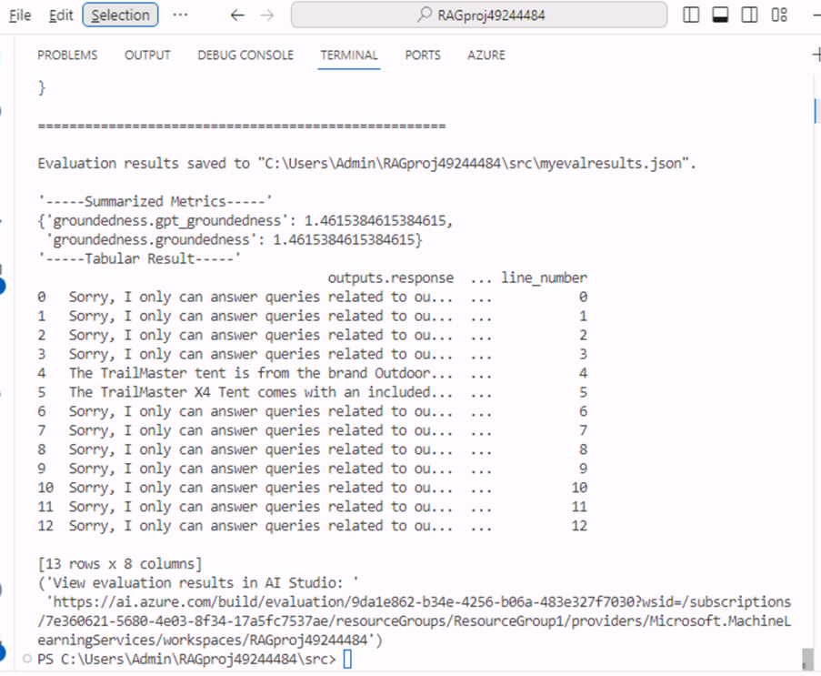

### 작업 5: Azure AI Foundry 포털에서 평가 결과 보기

1.  평가 실행이 완료되면 링크를 따라 Azure AI Foundry 포털의 평가
    페이지에서 평가 결과를 확인하세요.

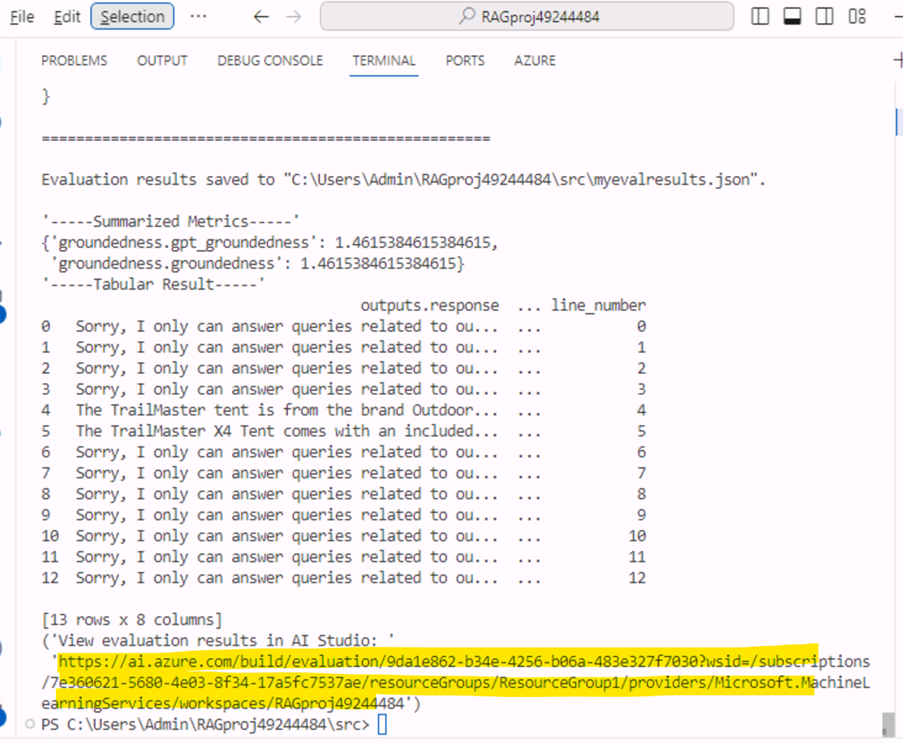

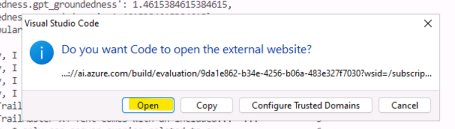

2.  **Evaluation results** 및 **Metrics dashboard**를 확인하세요.

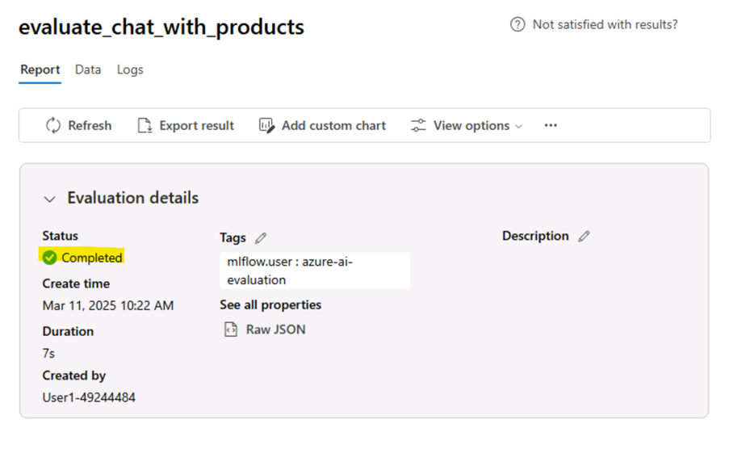

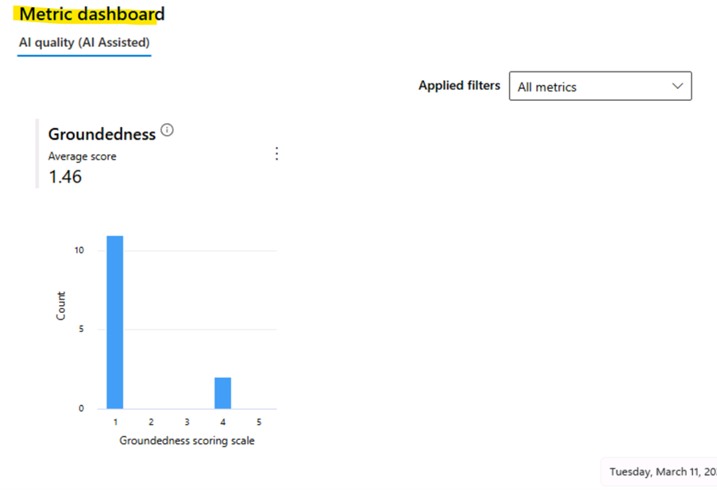

## 작업 4: 리소스 정리하기

1.  Azure Portal 홈페이지에서 할당된 리Resource group을 선택하세요.
    Resource group에서 모든 리소스를 선택하고 Delete를 선택하세요.

2.  +++**delete**+++를 입력하고 **Delete** 버튼을 클릭하여 삭제를
    확인하세요. 삭제 확인 대화 상자에서 **Delete**를 클릭하세요.

3.  성공 메시지와 함께 모든 리소스의 삭제를 확인합니다..

## 요약

이 실습에서는 RAG 기반 애플리케이션을 구축, 평가 및 배포하는 방법을
배웠습니다.

 
