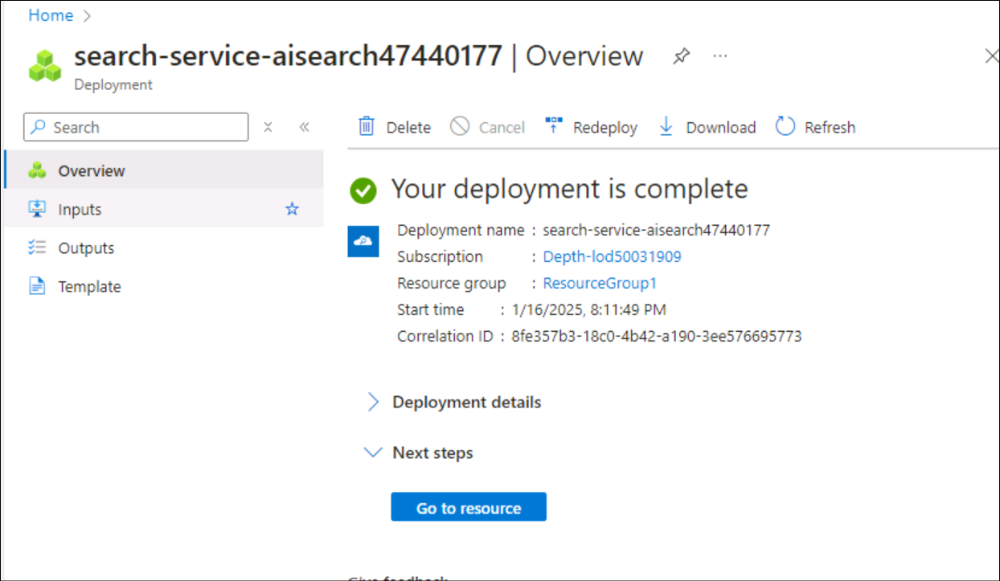
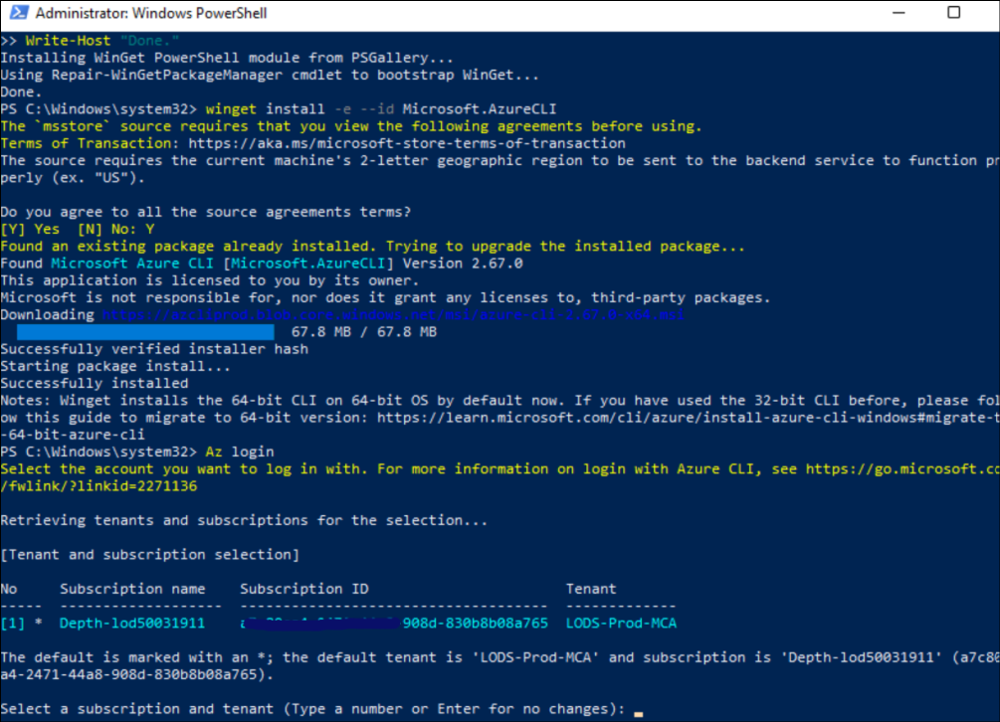
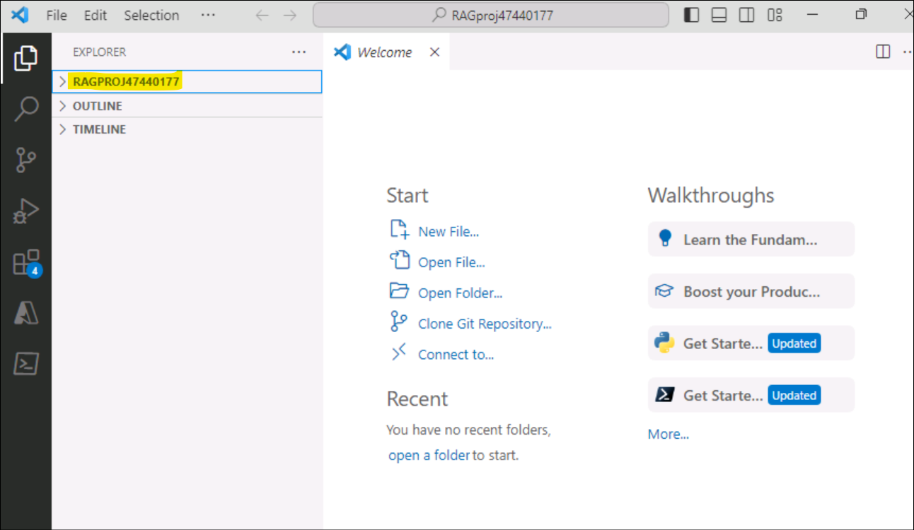
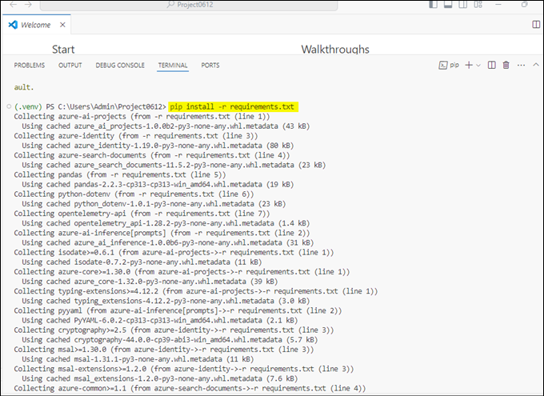
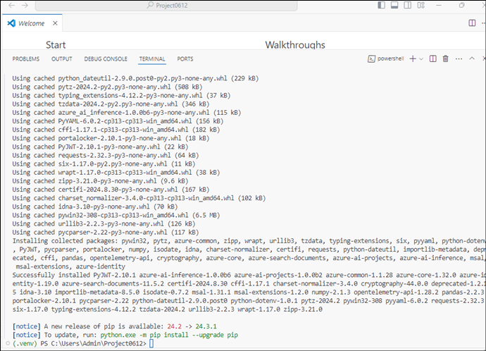
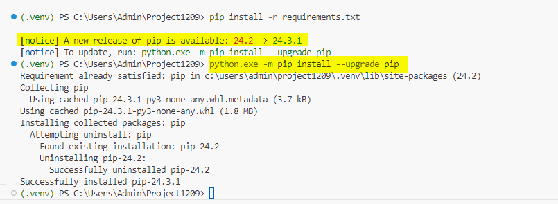
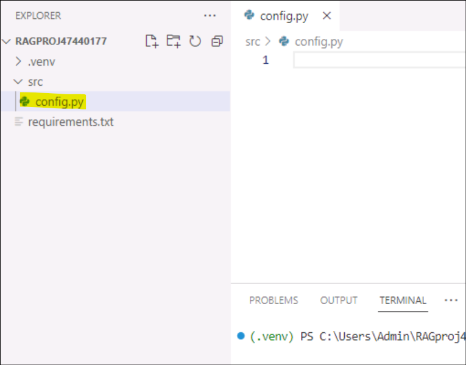
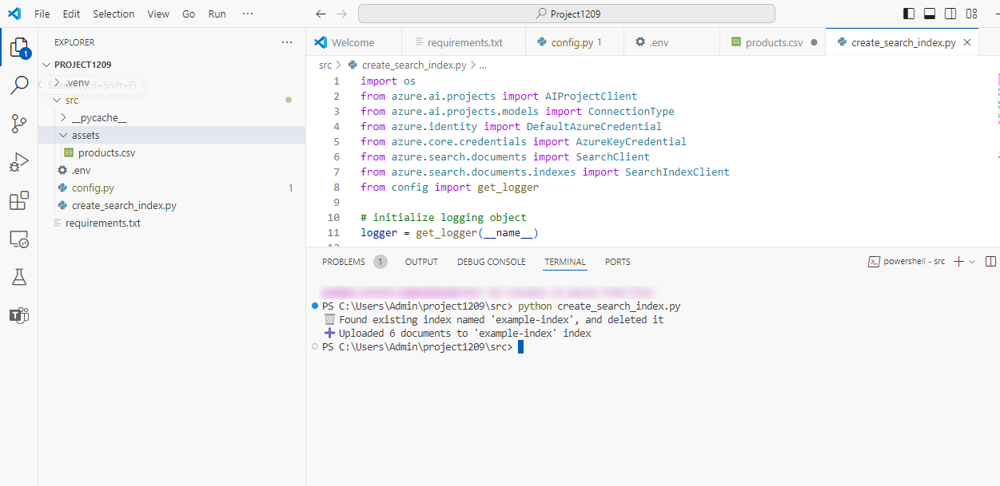
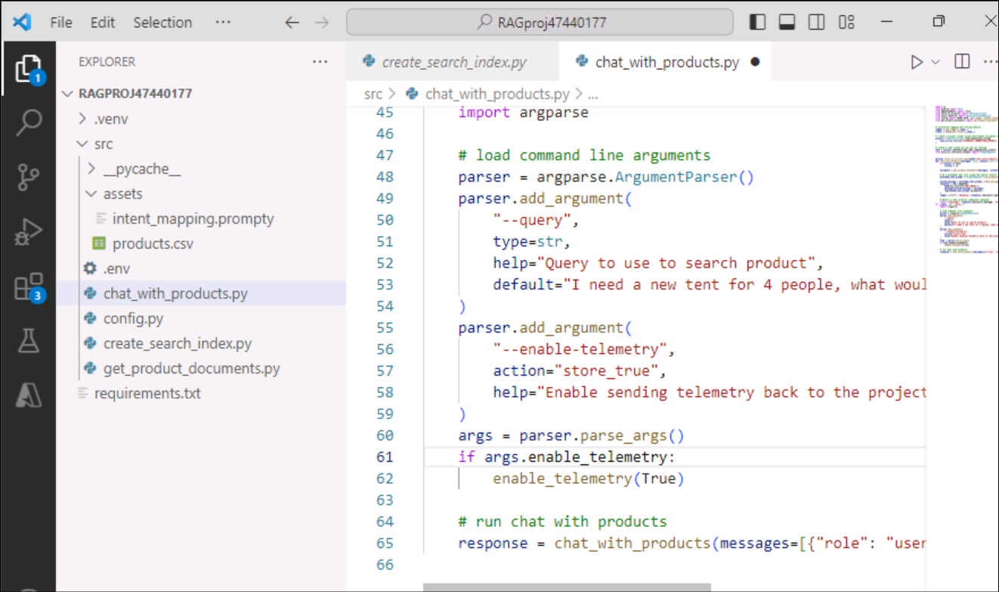

# Lab 4 - Build, evaluate and deploy a RAG-based agent with the Azure AI Foundry SDK

**Estimated Time: 120 mins**

## Objective

The objective of this lab is to build, evaluate, and deploy a
Retrieval-Augmented Generation (RAG)-based agent using the Azure AI
Foundry SDK. The lab guides you through setting up the project and
development environment, deploying AI models (e.g., GPT-4 and
text-embedding-ada-002), integrating Azure AI Search for document
retrieval, and creating a custom knowledge retrieval (RAG) chat
application. The focus is on grounding AI model responses with relevant
product data, developing a custom chat interface, and evaluating the
performance of the generated responses.

## Solution

The solution involves setting up a project in Azure AI Foundry,
deploying AI models (GPT-4 and text-embedding-ada-002), and integrating
Azure AI Search to store and retrieve custom product data. It includes
creating Python scripts to generate vector embeddings, build search
indexes, and query them for relevant product information. A RAG-based
chat interface is developed to provide grounded responses by leveraging
the search results, and the chat app's performance is evaluated using
predefined datasets and metrics to enhance its effectiveness.

## Exercise 1 - Set up project and development environment to build a custom knowledge retrieval (RAG) app with the Azure AI Foundry SDK

### Task 1 Create a project

To create a project in Azure AI Foundry, follow
these steps:

1.  Go to the **Home** page of Azure AI Foundry, by navigating to the following link +++https://ai.azure.com/+++ and click on **Sign in** with office 365 admin tenant credentials.

    

2.  When prompted enter the tenant details and login.

3.  Select **+ Create project**.

    

4.  Enter a +++**ProjectXXXX**+++ (replace xxxx with a random number) as name for the project, click on Customize.

    


5.  On the next page, enter the following details and click on **Next.**

    - Hub name: hubXXXX (replace xxxx with a random number)

    - Subscription: Select your subscription

    - Create new Resource group: +++rgxxxx+++ (replace xxxx with a random number)

    - Location: East US 2, or Sweden Central

    - Leave the rest as default and click on Next.

    


6.  On the **Review and finish** page, click on **Create.**

    


7.  The resource creation will take a few minutes.

    

8.  Close the pop-up windows, if any appears.

9.  From the home page of the project, note down the Project connection string on the notepad to be used in next task of this exercise.

    

    


### Task 2: Deploy models

You need two models to build a RAG-based chat app: an Azure OpenAI chat model (gpt-4o-mini) and an Azure OpenAI embedding model (text-embedding-ada-002). Deploy these models in your Azure AI Foundry project, using this set of steps for each model.

These steps deploy a model to a real-time endpoint from the AI Foundry portal:

1.  On the left navigation pane, select **Model catalogue**.

    

2.  Select the **gpt-4o-mini** model from the list of models. You can use the search bar to find it.

    


3.  On the model details page, select **Deploy**.

    


4.  Leave the default **Deployment name** select **Deploy**. Or, if the model isn't available in your region, a different region is selected for you and connected to your project. In this case, select **Connect**.

    


5.  After you deploy the **gpt-4o-mini**, repeat the steps to deploy
    the **text-embedding-ada-002** model.

    


### Task 3: Create an Azure AI Search service

The goal with this application is to ground the model responses in your
custom data. The search index is used to retrieve relevant documents
based on the user's question.

You need an Azure AI Search service and connection to create a search
index.

If you already have an Azure AI Search service, you can skip to the next section.

Otherwise, you can create an Azure AI Search service using the Azure
portal.

1.  Create an Azure AI Search
    service +++https://portal.azure.com/#create/Microsoft.Search+++ in the Azure portal, search for +++**AI search**+++ and click on icon.

    


2.  Click on **+ Create** icon and fill in the following details.

    


3.  Select your resource group, enter the service name as
    **aiserviceXXXX,** select the region as **Sweden Central or East us2** or any region closer to your location.

4.  Continue through the wizard and select **Review + assign** to create
    the resource.

    

5.  Confirm the details of your Azure AI Search service, including
    estimated cost.

6.  Select **Create** to create the Azure AI Search service.

    

    


### Task 4: Connect the Azure AI Search to your project

In the Azure AI Foundry portal, check for an Azure AI Search connected
resource.

1.  In Azure AI Foundry +++https://ai.azure.com/+++, go to your project and
    select **Management center** from the left pane.

    


2.  In the **Connected resources** section, look to see if you have a
    connection of type +++**Azure AI Search**+++. Otherwise, select **New connection** and then **Azure AI Search**.

    

    

3.  Use **API key** for **Authentication** and select **Add connection**.

    


    


    


### Task 5: Install the Azure CLI and sign in

You install the Azure CLI and sign in from your local development
environment, so that you can use your user credentials to call the Azure
OpenAI service.

1. Open windows power shell as adminstartor and paste the below given command and run it. After run the command close the power shell.

```
$progressPreference = 'silentlyContinue'
Write-Host "Installing WinGet PowerShell module from PSGallery..."
Install-PackageProvider -Name NuGet -Force | Out-Null
Install-Module -Name Microsoft.WinGet.Client -Force -Repository PSGallery | Out-Null
Write-Host "Using Repair-WinGetPackageManager cmdlet to bootstrap WinGet..."
Repair-WinGetPackageManager
Write-Host "Done."
```


2.  Again open power shell without adminstrator, In most cases you can install the Azure CLI from your command line terminal using the following command:


```
winget install -e --id Microsoft.AzureCLI
```


3.  After you install the Azure CLI, sign in using the az login command and sign-in using the browser:


```
Az login
```


select the tenant that your intent to login in with and click on **Continue**.


### Task 6: Create a new Python environment

First you need to create a new Python environment to use to install the package you need for this tutorial. DO NOT install packages into your global python installation. You should always use a virtual or conda environment when installing python packages, otherwise you can break your global install of Python.

**Create a virtual environment**

1.  Create a folder in **C:\Users\Student** as **ProjectXXXX**(This should be your Project name), by entering the following command in your powershell.


```
mkdir ProjectXXXX
```


2.  In your terminal enter the following command to navigate to the new folder location **cd C:\Users\Student\ProjectXXXX**




3.  Create a virtual environment using the following commands,

```
py -3 -m venv .venv
```


```
.venv\scripts\activate
```


Activating the Python environment means that when you run python or pip from the command line, you then use the Python interpreter contained in the .venv folder of your application.

4.  Open the project folder in VS Code

    


### Task 7: Install packages

Install **azure-ai-projects(preview) and azure-ai-inference (preview)**,along with other required packages.

5.  Create a file named +++**requirements.txt**+++ in your **ProjectXXXX** folder and add the following packages. After adding packages go to **files** and select **Save All**:


```
azure-ai-projects
azure-ai-inference[prompts]
azure-identity
azure-search-documents
pandas
python-dotenv
opentelemetry-api
marshmallow==3.23.2
```


6.  On the top navigation bar click on file and save all , the right clicks on the project and open the integrated terminal.

    


    


7.  Run the following command to get into the virtual environment


```
py -3 -m venv .venv
```


```
.venv\scripts\activate
```





8.  Run the +++**az login**+++ command and do the login with your credentials.

    


9.  To Install the required packages, run the following code.


```
pip install -r requirements.txt
```


> **Note:** if you get a notice to of new release of pip, kindly run the following command to upgrade pip and then re-run


```
pip install -r requirements.txt
```


```
python.exe -m pip install --upgrade pip
```


### Task 8: Create helper script

1.  Create a new folder named **src**. By running the following command in the terminal.


```
mkdir src
```


2.  Create a new file in **src** folder and name it +++**config.py**+++ 


3.  Add the following code to **config.py** and save it.


```
# ruff: noqa: ANN201, ANN001

import os
import sys
import pathlib
import logging
from azure.identity import DefaultAzureCredential
from azure.ai.projects import AIProjectClient
from azure.ai.inference.tracing import AIInferenceInstrumentor

# load environment variables from the .env file
from dotenv import load_dotenv

load_dotenv()

# Set "./assets" as the path where assets are stored, resolving the absolute path:
ASSET_PATH = pathlib.Path(__file__).parent.resolve() / "assets"

# Configure an root app logger that prints info level logs to stdout
logger = logging.getLogger("app")
logger.setLevel(logging.INFO)
logger.addHandler(logging.StreamHandler(stream=sys.stdout))


# Returns a module-specific logger, inheriting from the root app logger
def get_logger(module_name):
    return logging.getLogger(f"app.{module_name}")


# Enable instrumentation and logging of telemetry to the project
def enable_telemetry(log_to_project: bool = False):
    AIInferenceInstrumentor().instrument()

    # enable logging message contents
    os.environ["AZURE_TRACING_GEN_AI_CONTENT_RECORDING_ENABLED"] = "true"

    if log_to_project:
        from azure.monitor.opentelemetry import configure_azure_monitor

        project = AIProjectClient.from_connection_string(
            conn_str=os.environ["AIPROJECT_CONNECTION_STRING"], credential=DefaultAzureCredential()
        )
        tracing_link = f"https://ai.azure.com/tracing?wsid=/subscriptions/{project.scope['subscription_id']}/resourceGroups/{project.scope['resource_group_name']}/providers/Microsoft.MachineLearningServices/workspaces/{project.scope['project_name']}"
        application_insights_connection_string = project.telemetry.get_connection_string()
        if not application_insights_connection_string:
            logger.warning(
                "No application insights configured, telemetry will not be logged to project. Add application insights at:"
            )
            logger.warning(tracing_link)

            return

        configure_azure_monitor(connection_string=application_insights_connection_string)
        logger.info("Enabled telemetry logging to project, view traces at:")
        logger.info(tracing_link)

```


> **Note**: this newly created config.py file script will be used in the next exercise.

### Task 9: Configure environment variables

Your project connection string is required to call the Azure OpenAI service from your code. In this quickstart, you save this value in a .env file, which is a file that contains environment variables that your application can read.

1.  Create new file **.env** in the src directory, and paste the following code:

Replace the connection string with the value saved on notepad in task 1 step 9 and save it.


```
AIPROJECT_CONNECTION_STRING=<your-connection-string>
AISEARCH_INDEX_NAME="example-index"
EMBEDDINGS_MODEL="text-embedding-ada-002"
INTENT_MAPPING_MODEL="gpt-4o-mini"
CHAT_MODEL="gpt-4o-mini"
EVALUATION_MODEL="gpt-4o-mini"
```








> **Note**: Your connection string can be found in the Azure AI Foundry project homepage under **Overview**.



AISEARCH_INDEX_NAME : you'll create one in the next exercise.

## Exercise 2: Build a custom knowledge retrieval (RAG) app with the Azure AI Foundry SDK

**Prerequisites**

CompleteExercise 1 - Create resources for building a custom chat application with the Azure AI SDK to:

- Create a project with a connected Azure AI Search index

- Install the Azure CLI, Python, and required packages

- Configure your environment variables

### Task 1: Create example data for your chat app

The goal with this RAG-based application is to ground the model responses in your custom data. You use an Azure AI Search index that stores vectorized data from the embeddings model. The search index is used to retrieve relevant documents based on the user's question.

1.  Create an +++**assets**+++ directory in your project folder\src.


2.  Copy **products.csv** file from Lab files and paste it in **Project0612/src/assets** folder.




3.  Navigate to **File** on the top navigation bar and click on **Save all.**


### Task 2: Create a search index

The search index is used to store vectorized data from the embeddings model. The search index is used to retrieve relevant documents based on the user's question.

1.  On your VS code create the file +++**create_search_index.py**+++ in your src folder here it is (that is, the same directory where you placed your **assets** folder, not inside the **assets** folder).


2.  Open **create_search_index.py** file in Visual studio and add the following code to import the required libraries, create a project client, and configure some settings:


```
import os
from azure.ai.projects import AIProjectClient
from azure.ai.projects.models import ConnectionType
from azure.identity import DefaultAzureCredential
from azure.core.credentials import AzureKeyCredential
from azure.search.documents import SearchClient
from azure.search.documents.indexes import SearchIndexClient
from config import get_logger

# initialize logging object
logger = get_logger(__name__)

# create a project client using environment variables loaded from the .env file
project = AIProjectClient.from_connection_string(
    conn_str=os.environ["AIPROJECT_CONNECTION_STRING"], credential=DefaultAzureCredential()
)

# create a vector embeddings client that will be used to generate vector embeddings
embeddings = project.inference.get_embeddings_client()

# use the project client to get the default search connection
search_connection = project.connections.get_default(
    connection_type=ConnectionType.AZURE_AI_SEARCH, include_credentials=True
)

# Create a search index client using the search connection
# This client will be used to create and delete search indexes
index_client = SearchIndexClient(
    endpoint=search_connection.endpoint_url, credential=AzureKeyCredential(key=search_connection.key)
)
```


3.  Now add the function at the end of the create_search_index.py to define a search index:


```
import pandas as pd
from azure.search.documents.indexes.models import (
    SemanticSearch,
    SearchField,
    SimpleField,
    SearchableField,
    SearchFieldDataType,
    SemanticConfiguration,
    SemanticPrioritizedFields,
    SemanticField,
    VectorSearch,
    HnswAlgorithmConfiguration,
    VectorSearchAlgorithmKind,
    HnswParameters,
    VectorSearchAlgorithmMetric,
    ExhaustiveKnnAlgorithmConfiguration,
    ExhaustiveKnnParameters,
    VectorSearchProfile,
    SearchIndex,
)


def create_index_definition(index_name: str, model: str) -> SearchIndex:
    dimensions = 1536  # text-embedding-ada-002
    if model == "text-embedding-3-large":
        dimensions = 3072

    # The fields we want to index. The "embedding" field is a vector field that will
    # be used for vector search.
    fields = [
        SimpleField(name="id", type=SearchFieldDataType.String, key=True),
        SearchableField(name="content", type=SearchFieldDataType.String),
        SimpleField(name="filepath", type=SearchFieldDataType.String),
        SearchableField(name="title", type=SearchFieldDataType.String),
        SimpleField(name="url", type=SearchFieldDataType.String),
        SearchField(
            name="contentVector",
            type=SearchFieldDataType.Collection(SearchFieldDataType.Single),
            searchable=True,
            # Size of the vector created by the text-embedding-ada-002 model.
            vector_search_dimensions=dimensions,
            vector_search_profile_name="myHnswProfile",
        ),
    ]

    # The "content" field should be prioritized for semantic ranking.
    semantic_config = SemanticConfiguration(
        name="default",
        prioritized_fields=SemanticPrioritizedFields(
            title_field=SemanticField(field_name="title"),
            keywords_fields=[],
            content_fields=[SemanticField(field_name="content")],
        ),
    )

    # For vector search, we want to use the HNSW (Hierarchical Navigable Small World)
    # algorithm (a type of approximate nearest neighbor search algorithm) with cosine
    # distance.
    vector_search = VectorSearch(
        algorithms=[
            HnswAlgorithmConfiguration(
                name="myHnsw",
                kind=VectorSearchAlgorithmKind.HNSW,
                parameters=HnswParameters(
                    m=4,
                    ef_construction=1000,
                    ef_search=1000,
                    metric=VectorSearchAlgorithmMetric.COSINE,
                ),
            ),
            ExhaustiveKnnAlgorithmConfiguration(
                name="myExhaustiveKnn",
                kind=VectorSearchAlgorithmKind.EXHAUSTIVE_KNN,
                parameters=ExhaustiveKnnParameters(metric=VectorSearchAlgorithmMetric.COSINE),
            ),
        ],
        profiles=[
            VectorSearchProfile(
                name="myHnswProfile",
                algorithm_configuration_name="myHnsw",
            ),
            VectorSearchProfile(
                name="myExhaustiveKnnProfile",
                algorithm_configuration_name="myExhaustiveKnn",
            ),
        ],
    )

    # Create the semantic settings with the configuration
    semantic_search = SemanticSearch(configurations=[semantic_config])

    # Create the search index definition
    return SearchIndex(
        name=index_name,
        fields=fields,
        semantic_search=semantic_search,
        vector_search=vector_search,
    )
```


4.  Now add the function in create_search_index.py to create the function to add a csv file to the index:


```
# define a function for indexing a csv file, that adds each row as a document
# and generates vector embeddings for the specified content_column
def create_docs_from_csv(path: str, content_column: str, model: str) -> list[dict[str, any]]:
    products = pd.read_csv(path)
    items = []
    for product in products.to_dict("records"):
        content = product[content_column]
        id = str(product["id"])
        title = product["name"]
        url = f"/products/{title.lower().replace(' ', '-')}"
        emb = embeddings.embed(input=content, model=model)
        rec = {
            "id": id,
            "content": content,
            "filepath": f"{title.lower().replace(' ', '-')}",
            "title": title,
            "url": url,
            "contentVector": emb.data[0].embedding,
        }
        items.append(rec)

    return items


def create_index_from_csv(index_name, csv_file):
    # If a search index already exists, delete it:
    try:
        index_definition = index_client.get_index(index_name)
        index_client.delete_index(index_name)
        logger.info(f"🗑️  Found existing index named '{index_name}', and deleted it")
    except Exception:
        pass

    # create an empty search index
    index_definition = create_index_definition(index_name, model=os.environ["EMBEDDINGS_MODEL"])
    index_client.create_index(index_definition)

    # create documents from the products.csv file, generating vector embeddings for the "description" column
    docs = create_docs_from_csv(path=csv_file, content_column="description", model=os.environ["EMBEDDINGS_MODEL"])

    # Add the documents to the index using the Azure AI Search client
    search_client = SearchClient(
        endpoint=search_connection.endpoint_url,
        index_name=index_name,
        credential=AzureKeyCredential(key=search_connection.key),
    )

    search_client.upload_documents(docs)
    logger.info(f"➕ Uploaded {len(docs)} documents to '{index_name}' index")
```


5.  Finally, Add the below functions in create_search_index.py to build the index and register it to the cloud project. After adding the code go to Files from top bar and click on **Save all.**


```
if __name__ == "__main__":
    import argparse

    parser = argparse.ArgumentParser()
    parser.add_argument(
        "--index-name",
        type=str,
        help="index name to use when creating the AI Search index",
        default=os.environ["AISEARCH_INDEX_NAME"],
    )
    parser.add_argument(
        "--csv-file", type=str, help="path to data for creating search index", default="assets/products.csv"
    )
    args = parser.parse_args()
    index_name = args.index_name
    csv_file = args.csv_file

    create_index_from_csv(index_name, csv_file)
```


6.  Right click on the create_search_index.py and select **Open in integrated terminal** option.


7.  From your terminal, log in to your Azure account and follow instructions for authenticating your account:


```
az login
```


8.  Run the code to build your index locally and register it to the cloud project:


```
python create_search_index.py
```


9.  Once the script is run, you can view your newly created index in **Home/All resources/aiservice0612/indexes** on the Azure portal.


10. If you run the script again with the same index name, it creates a new version of the same index.

### Task 3: Get product documents

Next, you create a script to get product documents from the search index. The script queries the search index for documents that match a user's question.

**Create script to get product documents**

When the chat gets a request, it searches through your data to find relevant information. This script uses the Azure AI SDK to query the search index for documents that match a user's question. It then returns the documents to the chat app.


1.  Create the +++**get_product_documents.py**+++ file in your main directory(src directory). Copy and paste the following code into the file.


2.  Start with code to import the required libraries, create a project client, and configure settings:


```
import os
from pathlib import Path
from opentelemetry import trace
from azure.ai.projects import AIProjectClient
from azure.ai.projects.models import ConnectionType
from azure.identity import DefaultAzureCredential
from azure.core.credentials import AzureKeyCredential
from azure.search.documents import SearchClient
from config import ASSET_PATH, get_logger

# initialize logging and tracing objects
logger = get_logger(__name__)
tracer = trace.get_tracer(__name__)

# create a project client using environment variables loaded from the .env file
project = AIProjectClient.from_connection_string(
    conn_str=os.environ["AIPROJECT_CONNECTION_STRING"], credential=DefaultAzureCredential()
)

# create a vector embeddings client that will be used to generate vector embeddings
chat = project.inference.get_chat_completions_client()
embeddings = project.inference.get_embeddings_client()

# use the project client to get the default search connection
search_connection = project.connections.get_default(
    connection_type=ConnectionType.AZURE_AI_SEARCH, include_credentials=True
)

# Create a search index client using the search connection
# This client will be used to create and delete search indexes
search_client = SearchClient(
    index_name=os.environ["AISEARCH_INDEX_NAME"],
    endpoint=search_connection.endpoint_url,
    credential=AzureKeyCredential(key=search_connection.key),
)
```


3.  Add the function in get_product-documents.py to get product documents:


```
from azure.ai.inference.prompts import PromptTemplate
from azure.search.documents.models import VectorizedQuery


@tracer.start_as_current_span(name="get_product_documents")
def get_product_documents(messages: list, context: dict = None) -> dict:
    if context is None:
        context = {}

    overrides = context.get("overrides", {})
    top = overrides.get("top", 5)

    # generate a search query from the chat messages
    intent_prompty = PromptTemplate.from_prompty(Path(ASSET_PATH) / "intent_mapping.prompty")

    intent_mapping_response = chat.complete(
        model=os.environ["INTENT_MAPPING_MODEL"],
        messages=intent_prompty.create_messages(conversation=messages),
        **intent_prompty.parameters,
    )

    search_query = intent_mapping_response.choices[0].message.content
    logger.debug(f"🧠 Intent mapping: {search_query}")

    # generate a vector representation of the search query
    embedding = embeddings.embed(model=os.environ["EMBEDDINGS_MODEL"], input=search_query)
    search_vector = embedding.data[0].embedding

    # search the index for products matching the search query
    vector_query = VectorizedQuery(vector=search_vector, k_nearest_neighbors=top, fields="contentVector")

    search_results = search_client.search(
        search_text=search_query, vector_queries=[vector_query], select=["id", "content", "filepath", "title", "url"]
    )

    documents = [
        {
            "id": result["id"],
            "content": result["content"],
            "filepath": result["filepath"],
            "title": result["title"],
            "url": result["url"],
        }
        for result in search_results
    ]

    # add results to the provided context
    if "thoughts" not in context:
        context["thoughts"] = []

    # add thoughts and documents to the context object so it can be returned to the caller
    context["thoughts"].append(
        {
            "title": "Generated search query",
            "description": search_query,
        }
    )

    if "grounding_data" not in context:
        context["grounding_data"] = []
    context["grounding_data"].append(documents)

    logger.debug(f"📄 {len(documents)} documents retrieved: {documents}")
    return documents
```


4.  Finally, add code to test the function when you run the script directly:


```
if __name__ == "__main__":
    import logging
    import argparse

    # set logging level to debug when running this module directly
    logger.setLevel(logging.DEBUG)

    # load command line arguments
    parser = argparse.ArgumentParser()
    parser.add_argument(
        "--query",
        type=str,
        help="Query to use to search product",
        default="I need a new tent for 4 people, what would you recommend?",
    )

    args = parser.parse_args()
    query = args.query

    result = get_product_documents(messages=[{"role": "user", "content": query}])
```





5.  Click on File --> Save all.


### Task 4: Create prompt template for intent mapping

The **get_product_documents.py** script uses a prompt template to convert the conversation to a search query. The template instructs how to extract the user's intent from the conversation.

1. Before you run the script, create the prompt template. Add the file +++**intent_mapping.prompty**+++ to your assets folder:


4.  Copy the following code to the intent_mapping_prompty file and the from top bar go to Files and click on **Save all.**


```
---
name: Chat Prompt
description: A prompty that extract users query intent based on the current_query and chat_history of the conversation
model:
    api: chat
    configuration:
        azure_deployment: gpt-4o
inputs:
    conversation:
        type: array
---
system:
# Instructions
- You are an AI assistant reading a current user query and chat_history.
- Given the chat_history, and current user's query, infer the user's intent expressed in the current user query.
- Once you infer the intent, respond with a search query that can be used to retrieve relevant documents for the current user's query based on the intent
- Be specific in what the user is asking about, but disregard parts of the chat history that are not relevant to the user's intent.
- Provide responses in json format

# Examples
Example 1:
With a conversation like below:

 - user: are the trailwalker shoes waterproof?
 - assistant: Yes, the TrailWalker Hiking Shoes are waterproof. They are designed with a durable and waterproof construction to withstand various terrains and weather conditions.
 - user: how much do they cost?

Respond with:
{
    "intent": "The user wants to know how much the Trailwalker Hiking Shoes cost.",
    "search_query": "price of Trailwalker Hiking Shoes"
}

Example 2:
With a conversation like below:

 - user: are the trailwalker shoes waterproof?
 - assistant: Yes, the TrailWalker Hiking Shoes are waterproof. They are designed with a durable and waterproof construction to withstand various terrains and weather conditions.
 - user: how much do they cost?
 - assistant: The TrailWalker Hiking Shoes are priced at $110.
 - user: do you have waterproof tents?
 - assistant: Yes, we have waterproof tents available. Can you please provide more information about the type or size of tent you are looking for?
 - user: which is your most waterproof tent?
 - assistant: Our most waterproof tent is the Alpine Explorer Tent. It is designed with a waterproof material and has a rainfly with a waterproof rating of 3000mm. This tent provides reliable protection against rain and moisture.
 - user: how much does it cost?

Respond with:
{
    "intent": "The user would like to know how much the Alpine Explorer Tent costs.",
    "search_query": "price of Alpine Explorer Tent"
}

user:
Return the search query for the messages in the following conversation:
{{#conversation}}
 - {{role}}: {{content}}
{{/conversation}}

```


### Task 5: Test the product document retrieval script

1.  Now that you have both the script and template, run the script to test out what documents the search index returns from a query. In a terminal window run:


```
python get_product_documents.py --query "I need a new tent for 4 people, what would you recommend?"
```


### Task 6: Develop custom knowledge retrieval (RAG) code

Next you create custom code to add retrieval augmented generation (RAG) capabilities to a basic chat application.

**Create a chat script with RAG capabilities**

1.  In your src folder, create a new file
    called +++**chat_with_products.py**+++. This script retrieves product documents and generates a response to a user's question.


2.  Add the code to import the required libraries, create a project client, and configure settings:


```
import os
from pathlib import Path
from opentelemetry import trace
from azure.ai.projects import AIProjectClient
from azure.identity import DefaultAzureCredential
from config import ASSET_PATH, get_logger, enable_telemetry
from get_product_documents import get_product_documents


# initialize logging and tracing objects
logger = get_logger(__name__)
tracer = trace.get_tracer(__name__)

# create a project client using environment variables loaded from the .env file
project = AIProjectClient.from_connection_string(
    conn_str=os.environ["AIPROJECT_CONNECTION_STRING"], credential=DefaultAzureCredential()
)

# create a chat client we can use for testing
chat = project.inference.get_chat_completions_client()
```


3.  Add the code at end of chat_with_products.py to create the chat function that uses the RAG capabilities:


```
from azure.ai.inference.prompts import PromptTemplate


@tracer.start_as_current_span(name="chat_with_products")
def chat_with_products(messages: list, context: dict = None) -> dict:
    if context is None:
        context = {}

    documents = get_product_documents(messages, context)

    # do a grounded chat call using the search results
    grounded_chat_prompt = PromptTemplate.from_prompty(Path(ASSET_PATH) / "grounded_chat.prompty")

    system_message = grounded_chat_prompt.create_messages(documents=documents, context=context)
    response = chat.complete(
        model=os.environ["CHAT_MODEL"],
        messages=system_message + messages,
        **grounded_chat_prompt.parameters,
    )
    logger.info(f"💬 Response: {response.choices[0].message}")

    # Return a chat protocol compliant response
    return {"message": response.choices[0].message, "context": context}
```


4.  Finally, add the code to run the chat function and then go to files and click on save all.


```
if __name__ == "__main__":
    import argparse

    # load command line arguments
    parser = argparse.ArgumentParser()
    parser.add_argument(
        "--query",
        type=str,
        help="Query to use to search product",
        default="I need a new tent for 4 people, what would you recommend?",
    )
    parser.add_argument(
        "--enable-telemetry",
        action="store_true",
        help="Enable sending telemetry back to the project",
    )
    args = parser.parse_args()
    if args.enable_telemetry:
        enable_telemetry(True)

    # run chat with products
    response = chat_with_products(messages=[{"role": "user", "content": args.query}])
```


### Task 7: Create a grounded chat prompt template

The chat_with_products.py script calls a prompt template to generate a response to the user's question. The template instructs how to generate a response based on the user's question and the retrieved documents. Create this template now.

1.  In your **assets** folder, add the file +++**grounded_chat.prompty**+++


2.  Add the following code grounded_chat.prompty.


```
---
name: Chat with documents
description: Uses a chat completions model to respond to queries grounded in relevant documents
model:
    api: chat
    configuration:
        azure_deployment: gpt-4o
inputs:
    conversation:
        type: array
---
system:
You are an AI assistant helping users with queries related to outdoor outdooor/camping gear and clothing.
If the question is not related to outdoor/camping gear and clothing, just say 'Sorry, I only can answer queries related to outdoor/camping gear and clothing. So, how can I help?'
Don't try to make up any answers.
If the question is related to outdoor/camping gear and clothing but vague, ask for clarifying questions instead of referencing documents. If the question is general, for example it uses "it" or "they", ask the user to specify what product they are asking about.
Use the following pieces of context to answer the questions about outdoor/camping gear and clothing as completely, correctly, and concisely as possible.
Do not add documentation reference in the response.

# Documents

{{#documents}}

## Document {{id}}: {{title}}
{{content}}
{{/documents}}
```


3.  Click on **File -->Save all.**




### Task 8: Run the chat script with RAG capabilities

1.  Now that you have both the script and the template, run the script to test your chat app with RAG capabilities:


```
python chat_with_products.py --query "I need a new tent for 4 people, what would you recommend?"
```


2.  To enable logging of telemetry to your project,
    Install azure-monitor-opentelemetry:


```
pip install azure-monitor-opentelemetry
```


## Exercise 3: Evaluate a custom chat application with the Azure AI Foundry SDK

### Task 1: Evaluate the quality of the chat app responses

Now that you know your chat app responds well to your queries, including with chat history, it's time to evaluate how it does across a few different metrics and more data.

You use an evaluator with an evaluation dataset and the get_chat_response() target function, then assess the evaluation results.

Once you run an evaluation, you can then make improvements to your logic, like improving your system prompt, and observing how the chat app responses change and improve.

**Create evaluation dataset**

Use the following evaluation dataset, which contains example questions and expected answers (truth).


1.  Create a file called +++**chat_eval_data.jsonl**+++ in
    your **assets** folder.


2.  Paste this dataset into the file and the save the file.


```
{"query": "Which tent is the most waterproof?", "truth": "The Alpine Explorer Tent has the highest rainfly waterproof rating at 3000m"}
{"query": "Which camping table holds the most weight?", "truth": "The Adventure Dining Table has a higher weight capacity than all of the other camping tables mentioned"}
{"query": "How much do the TrailWalker Hiking Shoes cost? ", "truth": "The Trailewalker Hiking Shoes are priced at $110"}
{"query": "What is the proper care for trailwalker hiking shoes? ", "truth": "After each use, remove any dirt or debris by brushing or wiping the shoes with a damp cloth."}
{"query": "What brand is TrailMaster tent? ", "truth": "OutdoorLiving"}
{"query": "How do I carry the TrailMaster tent around? ", "truth": " Carry bag included for convenient storage and transportation"}
{"query": "What is the floor area for Floor Area? ", "truth": "80 square feet"}
{"query": "What is the material for TrailBlaze Hiking Pants?", "truth": "Made of high-quality nylon fabric"}
{"query": "What color does TrailBlaze Hiking Pants come in?", "truth": "Khaki"}
{"query": "Can the warrenty for TrailBlaze pants be transfered? ", "truth": "The warranty is non-transferable and applies only to the original purchaser of the TrailBlaze Hiking Pants. It is valid only when the product is purchased from an authorized retailer."}
{"query": "How long are the TrailBlaze pants under warranty for? ", "truth": " The TrailBlaze Hiking Pants are backed by a 1-year limited warranty from the date of purchase."}
{"query": "What is the material for PowerBurner Camping Stove? ", "truth": "Stainless Steel"}
{"query": "Is France in Europe?", "truth": "Sorry, I can only queries related to outdoor/camping gear and equipment"}
```


### Task 2: Evaluate with Azure AI evaluators

Now define an evaluation script that will:

- Generate a target function wrapper around our chat app logic.

- Load the sample .jsonl dataset.

- Run the evaluation, which takes the target function, and merges the
  evaluation dataset with the responses from the chat app.

- Generate a set of GPT-assisted metrics (relevance, groundedness, and
  coherence) to evaluate the quality of the chat app responses.

- Output the results locally, and logs the results to the cloud project.

The script allows you to review the results locally, by outputting the
results in the command line, and to a json file.

The script also logs the evaluation results to the cloud project so that
you can compare evaluation runs in the UI.

1.  Create a file called +++**evaluate.py**+++ in your main folder(src folder).


2.  Add the following code to import the required libraries, create a project client, and configure some settings:


```
import os
import pandas as pd
from azure.ai.projects import AIProjectClient
from azure.ai.projects.models import ConnectionType
from azure.ai.evaluation import evaluate, GroundednessEvaluator
from azure.identity import DefaultAzureCredential

from chat_with_products import chat_with_products

# load environment variables from the .env file at the root of this repo
from dotenv import load_dotenv

load_dotenv()

# create a project client using environment variables loaded from the .env file
project = AIProjectClient.from_connection_string(
    conn_str=os.environ["AIPROJECT_CONNECTION_STRING"], credential=DefaultAzureCredential()
)

connection = project.connections.get_default(connection_type=ConnectionType.AZURE_OPEN_AI, include_credentials=True)

evaluator_model = {
    "azure_endpoint": connection.endpoint_url,
    "azure_deployment": os.environ["EVALUATION_MODEL"],
    "api_version": "2024-06-01",
    "api_key": connection.key,
}

groundedness = GroundednessEvaluator(evaluator_model)
```


3.  Add code to create a wrapper function that implements the evaluation interface for query and response evaluation:


```
def evaluate_chat_with_products(query):
    response = chat_with_products(messages=[{"role": "user", "content": query}])
    return {"response": response["message"].content, "context": response["context"]["grounding_data"]}
```


4.  Finally, add code to run the evaluation, view the results locally, and gives you a link to the evaluation results in AI Foundry portal:


```
# Evaluate must be called inside of __main__, not on import
if __name__ == "__main__":
    from config import ASSET_PATH

    # workaround for multiprocessing issue on linux
    from pprint import pprint
    from pathlib import Path
    import multiprocessing
    import contextlib

    with contextlib.suppress(RuntimeError):
        multiprocessing.set_start_method("spawn", force=True)

    # run evaluation with a dataset and target function, log to the project
    result = evaluate(
        data=Path(ASSET_PATH) / "chat_eval_data.jsonl",
        target=evaluate_chat_with_products,
        evaluation_name="evaluate_chat_with_products",
        evaluators={
            "groundedness": groundedness,
        },
        evaluator_config={
            "default": {
                "query": {"${data.query}"},
                "response": {"${target.response}"},
                "context": {"${target.context}"},
            }
        },
        azure_ai_project=project.scope,
        output_path="./myevalresults.json",
    )

    tabular_result = pd.DataFrame(result.get("rows"))

    pprint("-----Summarized Metrics-----")
    pprint(result["metrics"])
    pprint("-----Tabular Result-----")
    pprint(tabular_result)
    pprint(f"View evaluation results in AI Studio: {result['studio_url']}")
```


5.  Click on **Save all** under **File** in the top navigation bar.

### Task 3: Configure the evaluation model

Since the evaluation script calls the model many times, you might want to increase the number of tokens per minute for the evaluation model.

In Part 1 of this tutorial series, you created an **.env** file that specifies the name of the evaluation model, gpt-4o-mini. Try to increase the tokens per minute limit for this model, if you have available quota.

If you don't have enough quota to increase the value, don't worry. The script is designed to handle limit errors.

1.  In your project in Azure AI Foundry portal, select **Models + endpoints**.


2.  Select **gpt-4o-mini**, click on **Edit.**


> Note: increase quota if your limit is less than 30

3.  If you have quota to increase the **Tokens per Minute Rate Limit**, try increasing it to 30.

4.  Select **Save and close**.


### Task 4: Run the evaluation script

1.  From your console, sign in to your Azure account with the Azure CLI:


```
az login
```


2.  Install the required package:


```
pip install azure_ai-evaluation[prompts]
```


```
pip install azure-ai-evaluation[remote]
```


3.  Now run the evaluation script.


```
python evaluate.py
```


### Task 5: Interpret the evaluation output

In the console output, you see an answer for each question, followed by a table with summarized metrics. (You might see different columns in your output.)

If you weren't able to increase the tokens per minute limit for your model, you might see some time-out errors, which are expected. The evaluation script is designed to handle these errors and continue running.

**Note**: You may also see many WARNING:opentelemetry.attributes: - these can be safely ignored and do not affect the evaluation results.

```
====================================================

'-----Summarized Metrics-----'

{'groundedness.gpt_groundedness': 1.6666666666666667,

'groundedness.groundedness': 1.6666666666666667}

'-----Tabular Result-----'

outputs.response ... line_number

0 Could you specify which tent you are referring... ... 0

1 Could you please specify which camping table y... ... 1

2 Sorry, I only can answer queries related to ou... ... 2

3 Could you please clarify which aspects of care... ... 3

4 Sorry, I only can answer queries related to ou... ... 4

5 The TrailMaster X4 Tent comes with an included... ... 5

6 (Failed) ... 6

7 The TrailBlaze Hiking Pants are crafted from h... ... 7

8 Sorry, I only can answer queries related to ou... ... 8

9 Sorry, I only can answer queries related to ou... ... 9

10 Sorry, I only can answer queries related to ou... ... 10

11 The PowerBurner Camping Stove is designed with... ... 11

12 Sorry, I only can answer queries related to ou... ... 12

\[13 rows x 8 columns\]

('View evaluation results in AI Foundry portal: '

'https://xxxxxxxxxxxxxxxxxxxxxxx')
```

### Task 6: View evaluation results in AI Foundry portal(optional)

Once the evaluation run completes, follow the link to view the evaluation results on the **Evaluation** page in the Azure AI Foundry portal.


You can also look at the individual rows and see metric scores per row, and view the full context/documents that were retrieved. These metrics can be helpful in interpreting and debugging evaluation results.


For more information about evaluation results in AI Foundry portal, see How to view evaluation results in AI Foundry portal.

### Task 7: Iterate and improve(Optional)

Notice that the responses are not well grounded. In many cases, the model replies with a question rather than an answer. This is a result of the prompt template instructions.

- In your **assets/grounded_chat.prompty** file, find the sentence "If the question is related to outdoor/camping gear and clothing but vague, ask for clarifying questions instead of referencing documents."

- Change the sentence to "If the question is related to outdoor/camping gear and clothing but vague, try to answer based on the reference documents, then ask for clarifying questions."

- Save the file and re-run the evaluation script.

Try other modifications to the prompt template, or try different models, to see how the changes affect the evaluation results.


**Summary:**

In this lab, we have learnt to build, evaluate and deploy a RAG based application.


