# Lab 4 - Build, evaluate and deploy a RAG-based agent with the Azure AI Foundry SDK

**Estimated Time: 120 mins**

## Objective

The objective of this lab is to build, evaluate, and deploy a
Retrieval-Augmented Generation (RAG)-based agent using the Azure AI
Foundry SDK. The lab guides you through setting up the project and
development environment, deploying AI models (e.g., GPT-4 and
text-embedding-ada-002), integrating Azure AI Search for document
retrieval, and creating a custom knowledge retrieval (RAG) chat
application. The focus is on grounding AI model responses with relevant
product data, developing a custom chat interface, and evaluating the
performance of the generated responses.

## Solution

The solution involves setting up a project in Azure AI Foundry,
deploying AI models (GPT-4 and text-embedding-ada-002), and integrating
Azure AI Search to store and retrieve custom product data. It includes
creating Python scripts to generate vector embeddings, build search
indexes, and query them for relevant product information. A RAG-based
chat interface is developed to provide grounded responses by leveraging
the search results, and the chat app's performance is evaluated using
predefined datasets and metrics to enhance its effectiveness.

## Exercise 0: Understand the VM and the credentials

In this exercise, we will identify and understand the credentials that
we will be using throughout the lab.

**Important:** Do go through each step in this exercise to get to know
the generic terms and the credentials that will be used for the lab
execution.

1.  **Instructions** tab hold the lab guide with the instructions to be
    followed throughout the lab.

2.  **Resources** tab has got the credentials that will be needed for
    executing the lab.

    - **URL** – URL to the Azure portal

    - **Subscription** – This is the **ID** of the **subscription** assigned
    to you

    - **Username** – The **user id** with which you need to **login** to the
    **Azure services**.

    - **Password** – **Password** to the **Azure login**.

    Let us call this Username and password as **Azure login credentials**. We will use these creds wherever we mention **Azure login credentials**.

    - **Resource Group** – The **Resource group** assigned to you.

    >[!Alert] **Important**: Make sure you create all your resources under this Resource group

    

3.  **Help** tab holds the Support information. The **ID** value here is
    the **Lab instance ID** which will be used during the lab execution.

    

## Exercise 1 - Set up project and development environment to build a custom knowledge retrieval (RAG) app with the Azure AI Foundry SDK

### Task 1 Create a project

To create a project in Azure AI Foundry, follow these steps:

1.  Login to the Azure AI Foundry at +++https://ai.azure.com/+++
    **sign in** using the **Azure login credentials**.

    

2.  Select **+ Create project**.

    

3.  Enter **+++RAGproj@lab.LabInstance.Id+++** as name for the project,
    click on **Customize**.

    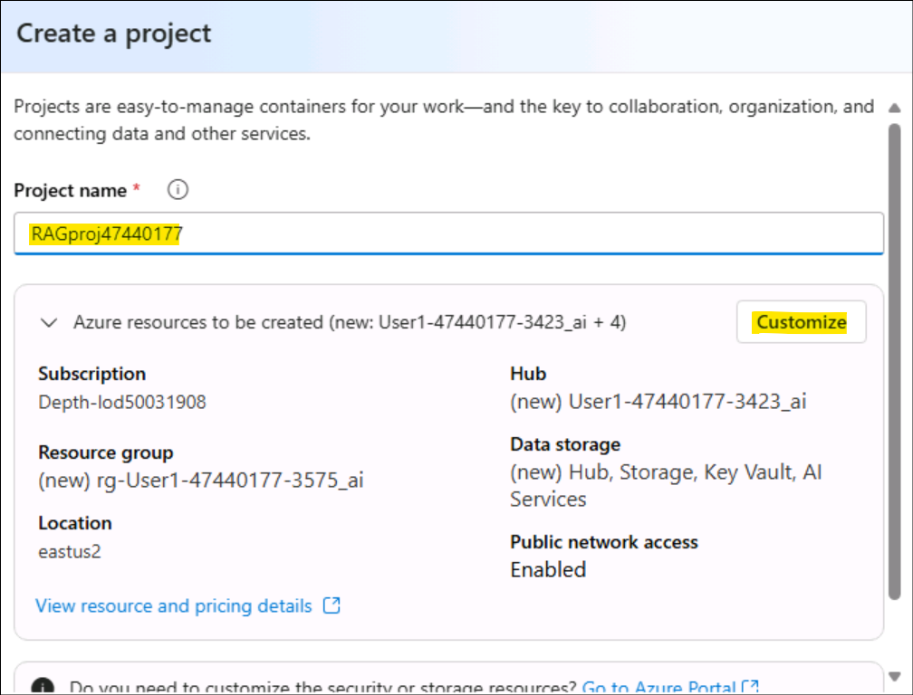

4.  On the next page, enter the following details and click on **Next.**

    -   Hub name - **+++hub@lab.LabInstance.Id+++**

    -   Subscription - Select your assigned subscription

    -   Create new Resource group - Select your assigned Resource Group(ResourceGroup1)

    -   Location - Select Region (We have used East US 2 while executing this lab)

    Leave the rest as default and click on **Next**.

    

5.  On the **Review and finish** page, click on **Create.**

    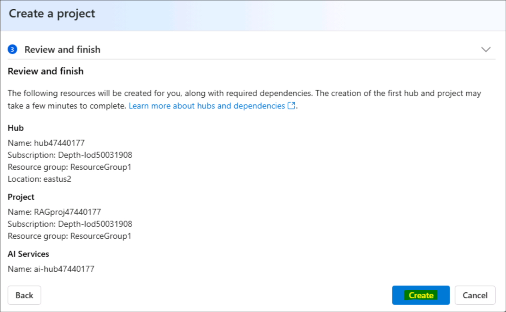

6.  The resource creation will take a few minutes.

    

7.  Close the pop-up windows, if any appears.

8.  From the home page of the project, note down the **Project
    connection string** in a notepad to be used in next task of this
    exercise.

    

### Task 2: Deploy models

You need two models to build a RAG-based chat app: an Azure OpenAI chat
model (gpt-4o-mini) and an Azure OpenAI embedding model
(text-embedding-ada-002). Deploy these models in your Azure AI Foundry
project, using this set of steps for each model.

These steps deploy a model to a real-time endpoint from the AI Foundry
portal model catalog

1.  From the left navigation pane, select **Model catalog**.

    

2.  Select the **gpt-4o-mini** model from the list of models. You can
    use the search bar to find it.

    

3.  On the model details page, select **Deploy**.

    

4.  Leave the default **Deployment name**. select **Deploy**. Or, if the
    model isn't available in your region, a different region is selected
    for you and connected to your project. In this case, select **Create
    resource and deploy**.

    

    

5.  After you deploy the **gpt-4o-mini**, repeat the steps to deploy
    the +++**text-embedding-ada-002**+++ model.

    

### Task 3: Create an Azure AI Search service

The goal with this application is to ground the model responses in your
custom data. The search index is used to retrieve relevant documents
based on the user's question.

You need an Azure AI Search service and connection to create a search
index.

1.  Login to the Azure portal at +++https://portal.azure.com+++ using
    the Azure login credentials.

2.  From the home page search bar, search for +++**AI search**+++ and
    select it.

    

3.  Click on **+ Create** icon and fill in the following details.

    

4.  Enter the below details and select **Review + create**.

    - Subscription – Select your assigned subscription

    - Resource Group – Select your assigned Resource group

    - Service name – Enter **+++aisearch@lab.LabInstance.Id+++** 

    - Region - Select Region (We are using East US 2 here)

    - Pricing tier – Select **Standard**

    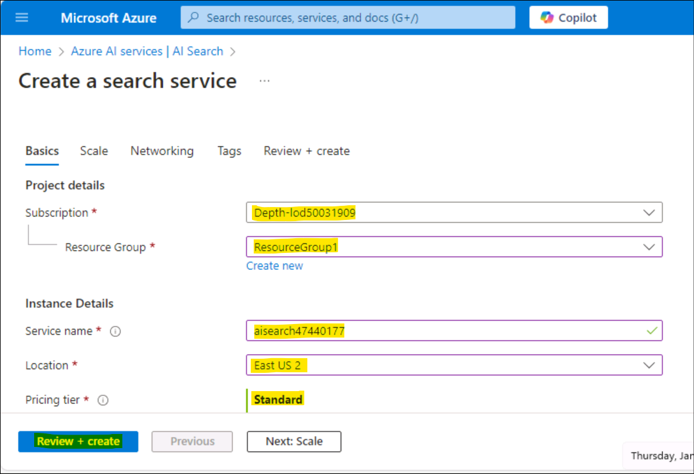

5.  Review the details and select **Create**.

    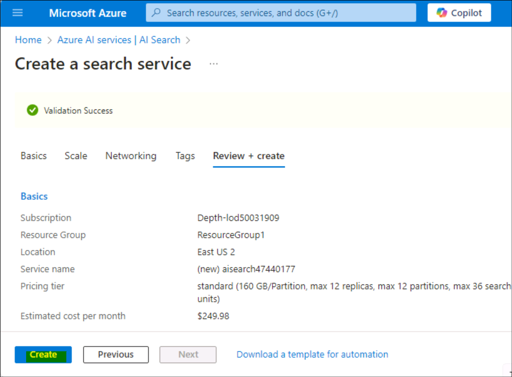

6.  Wait until the deployment succeeds, as in the below screenshot
    before proceeding with the next step.

    

### Task 4: Connect the Azure AI Search to your project

In the Azure AI Foundry portal, check for an Azure AI Search connected
resource.

1.  From your project in Azure AI Foundry, select **Management
    center** from the left pane.

    

2.  In the **Connected resources** section, select **New
    connection** and then select **Azure AI Search**.

    

    

3.  Select **API key** under **Authentication** and select **Add
    connection**.

    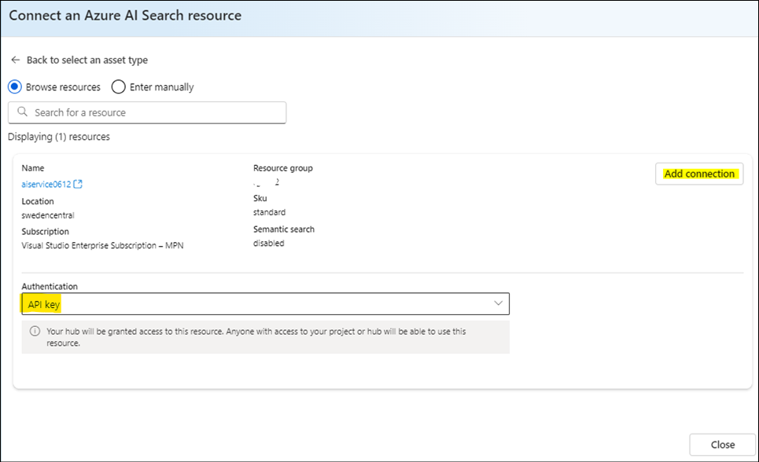

    

4.	From the **Connected resources** page, you can now see the added resource connection.
   
    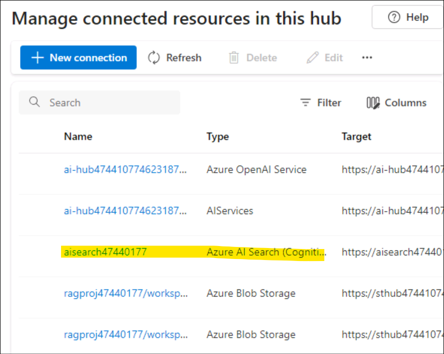

### Task 5: Install the Azure CLI and sign in

You install the Azure CLI and sign in from your local development
environment, so that you can use your user credentials to call the Azure
OpenAI service.

1.  Search for +++**PowerShell**+++ from the Windows search bar and open
    it in the Administrator mode. Accept if prompted for the launch to continue.

    

2.  Open windows power shell and paste the below given command and run
    it.

    ```
    $progressPreference = 'silentlyContinue'
    Write-Host "Installing WinGet PowerShell module from PSGallery..."
    Install-PackageProvider -Name NuGet -Force | Out-Null
    Install-Module -Name Microsoft.WinGet.Client -Force -Repository PSGallery | Out-Null
    Write-Host "Using Repair-WinGetPackageManager cmdlet to bootstrap WinGet..."
    Repair-WinGetPackageManager
    Write-Host "Done."
    ```

3.  Install the Azure CLI from your terminal using the following
    command:

    ```
    winget install -e --id Microsoft.AzureCLI
    ```

    Select **Y** and then **Enter** when prompted for acceptance.

    

    

    

4.  After you install the Azure CLI, sign in using the az login command
    and sign-in using the browser:

    ```
    az login
    ```

    Select **Work or school account** and click on **Continue**.

    

5.  Login with your **Azure login credentials**.

    

6.  Enter **1** for the **Select a subscription** prompt and click
    **Enter**.

    

### Task 6: Create a new Python environment

First you need to create a new Python environment to use to install the
package you need for this tutorial. DO NOT install packages into your
global python installation. You should always use a virtual or conda
environment when installing python packages, otherwise you can break
your global install of Python.

>[Alert] **Important:** If the commands below are not pastable, try pasting them to a notepad and then copy and paste it to the PowerShell. Or copy and paste directly to the PowerShell. The T button does not work at times in the PowerShell.

**Create a virtual environment**

1.  From your Power Shell, navigate to **C:\Users\Admin** by executing
    the below commands.

    ```
    cd\\
    ```
    ```
    cd Users\Admin
    ```
    
1.  Create a folder with your project name, **+++RAGproj@lab.LabInstance.Id+++**, by entering the following command in your powershell.

    >[!Note] **Note:** Replace < Project name > with your project’s name in the command below and execute it.

    +++**mkdir < Project name >**+++

    

2.  In your terminal enter the following command to navigate to the new
    folder location

    +++**cd < Project name >**+++

    Replace < Project name > with the folder name you created in the previous step.

    

3.  Create a virtual environment using the following commands

    ```
    py -3 -m venv .venv
    ```

    ```
    .venv\scripts\activate
    ```

    

    Activating the Python environment means that when you run python or pip from the command line, you then use the Python interpreter contained in the .venv folder of your application.

5.  Open **VS Code**. Select **File -\> Open Folder** and select
    **RAGproject** folder that we created in the previous steps (from **C:\Users\Admin**).

    >[!Note] **Note:**  Click on Yes, I trust the folder and content and then proceed if prompted.
    
    

    

    

### Task 7: Install packages

Install azure-ai-projects(preview) and azure-ai-inference (preview),
along with other required packages.

1.  Create a file named +++**requirements.txt**+++ in your **Project**
    folder and add the following packages to the file:

    ```
    azure-ai-projects
    azure-ai-inference[prompts]
    azure-identity
    azure-search-documents
    pandas
    python-dotenv
    opentelemetry-api
    marshmallow==3.23.2
    ```

    

    

2.  On the top navigation bar click on **File** and **Save All**.

3.  Right click on the requirements.txt and select **Open in Integrated
    Terminal**.

    

    

4.  Run the following command to get into the virtual environment

    +++py -3 -m venv .venv+++

    +++.venv\scripts\activate+++

    

5.  Run the +++az login+++ command and login with your Azure login
    credentials. Select **1** to select the subscription.

    >[!note] **Note:** Minimize the VS Code to view the login prompt if not automatically visible.
    
    

    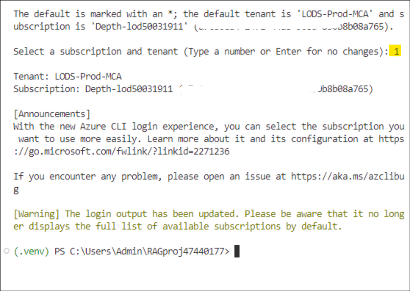

7.  To Install the required packages, run the following code.

    +++pip install -r requirements.txt+++

    

    

    >[!Note] **Note:** if you get a notice to of new release of pip, execute the below commands to upgrade pip
    >
    +++pip install -r requirements.txt+++
    >
    +++python.exe -m pip install --upgrade pip+++
    >
    

### Task 8: Create helper script

1.  Create a new folder named **src**. By running the following command
    in the terminal.

    +++mkdir src+++

    

2.  Create a new file in **src** folder and name it +++**config.py**+++

    

3.  Add the following code to **config.py** and save it.

```
# ruff: noqa: ANN201, ANN001

import os
import sys
import pathlib
import logging
from azure.identity import DefaultAzureCredential
from azure.ai.projects import AIProjectClient
from azure.ai.inference.tracing import AIInferenceInstrumentor

# load environment variables from the .env file
from dotenv import load_dotenv

load_dotenv()

# Set "./assets" as the path where assets are stored, resolving the absolute path:
ASSET_PATH = pathlib.Path(__file__).parent.resolve() / "assets"

# Configure an root app logger that prints info level logs to stdout
logger = logging.getLogger("app")
logger.setLevel(logging.INFO)
logger.addHandler(logging.StreamHandler(stream=sys.stdout))


# Returns a module-specific logger, inheriting from the root app logger
def get_logger(module_name):
    return logging.getLogger(f"app.{module_name}")


# Enable instrumentation and logging of telemetry to the project
def enable_telemetry(log_to_project: bool = False):
    AIInferenceInstrumentor().instrument()

    # enable logging message contents
    os.environ["AZURE_TRACING_GEN_AI_CONTENT_RECORDING_ENABLED"] = "true"

    if log_to_project:
        from azure.monitor.opentelemetry import configure_azure_monitor

        project = AIProjectClient.from_connection_string(
            conn_str=os.environ["AIPROJECT_CONNECTION_STRING"], credential=DefaultAzureCredential()
        )
        tracing_link = f"https://ai.azure.com/tracing?wsid=/subscriptions/{project.scope['subscription_id']}/resourceGroups/{project.scope['resource_group_name']}/providers/Microsoft.MachineLearningServices/workspaces/{project.scope['project_name']}"
        application_insights_connection_string = project.telemetry.get_connection_string()
        if not application_insights_connection_string:
            logger.warning(
                "No application insights configured, telemetry will not be logged to project. Add application insights at:"
            )
            logger.warning(tracing_link)

            return

        configure_azure_monitor(connection_string=application_insights_connection_string)
        logger.info("Enabled telemetry logging to project, view traces at:")
        logger.info(tracing_link)

```

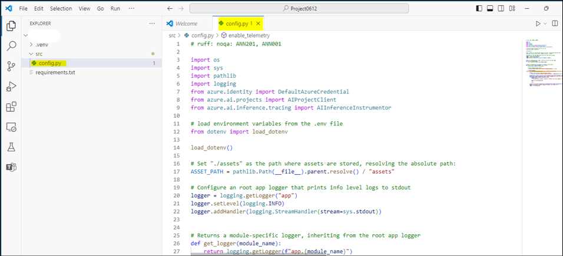

>[!Note] **Note**: this newly created config.py file script will be used in the next exercise.

### Task 9: Configure environment variables

Your project connection string is required to call the Azure OpenAI
service from your code. In this quickstart, you save this value in
a .env file, which is a file that contains environment variables that
your application can read.

1.  Create a new file **+++.env+++** in the **src** directory, and
    paste the following code:

    Replace  **< your-connection-string >** with the project connection string value saved in the notepad in task 1.

    ```
    AIPROJECT_CONNECTION_STRING="<your-connection-string>"
    AISEARCH_INDEX_NAME="example-index"
    EMBEDDINGS_MODEL="text-embedding-ada-002"
    INTENT_MAPPING_MODEL="gpt-4o-mini"
    CHAT_MODEL="gpt-4o-mini"
    EVALUATION_MODEL="gpt-4o-mini"
    ```

    

    >[!Note] **Note**: Your connection string can be found in the Azure AI Foundry project homepage under **Overview**.

## Exercise 2: Build a custom knowledge retrieval (RAG) app with the Azure AI Foundry SDK

### Task 1: Create example data for your chat app

The goal with this RAG-based application is to ground the model
responses in your custom data. You use an Azure AI Search index that
stores vectorized data from the embeddings model. The search index is
used to retrieve relevant documents based on the user's question.

1.  From your VS Code set up that is open, create a folder
    named +++**assets**+++ under the **src** folder.

    

2.  Copy **products.csv** file from **C:\LabFiles** and paste it in
    **C:\Users\Admin\< Your Project Name>\src\assets** folder.

    >[!Note] **Note:** This needs to be done in the File Explorer and then it will get reflected in the VS Code.

    

3.  Navigate to **File** on the top navigation bar and click on **Save All.**

    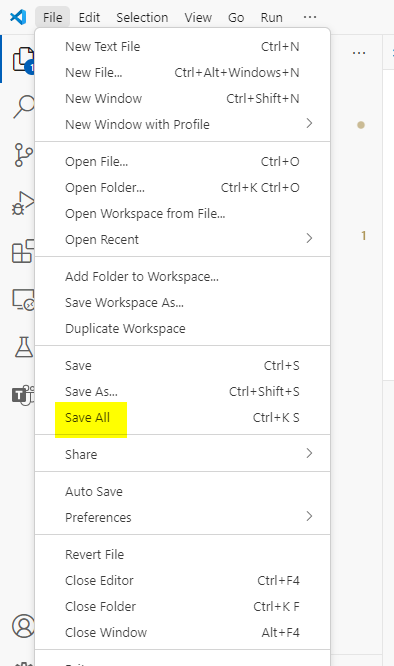

### Task 2: Create a search index

The search index is used to store vectorized data from the embeddings model. The search index is used to retrieve relevant documents based on the user's question.

1.  In VS code, create a file named +++**create_search_index.py**+++ in
    your **src** folder.

    

2.  Open the created file, **create_search_index.py** file and add the
    following code to import the required libraries, create a project
    client, and configure some settings:

```
import os
from azure.ai.projects import AIProjectClient
from azure.ai.projects.models import ConnectionType
from azure.identity import DefaultAzureCredential
from azure.core.credentials import AzureKeyCredential
from azure.search.documents import SearchClient
from azure.search.documents.indexes import SearchIndexClient
from config import get_logger

# initialize logging object
logger = get_logger(__name__)

# create a project client using environment variables loaded from the .env file
project = AIProjectClient.from_connection_string(
    conn_str=os.environ["AIPROJECT_CONNECTION_STRING"], credential=DefaultAzureCredential()
)

# create a vector embeddings client that will be used to generate vector embeddings
embeddings = project.inference.get_embeddings_client()

# use the project client to get the default search connection
search_connection = project.connections.get_default(
    connection_type=ConnectionType.AZURE_AI_SEARCH, include_credentials=True
)

# Create a search index client using the search connection
# This client will be used to create and delete search indexes
index_client = SearchIndexClient(
    endpoint=search_connection.endpoint_url, credential=AzureKeyCredential(key=search_connection.key)
)
```


3.  Now add the function at the end of the **create_search_index.py** to
    define a search index:

```
import pandas as pd
from azure.search.documents.indexes.models import (
    SemanticSearch,
    SearchField,
    SimpleField,
    SearchableField,
    SearchFieldDataType,
    SemanticConfiguration,
    SemanticPrioritizedFields,
    SemanticField,
    VectorSearch,
    HnswAlgorithmConfiguration,
    VectorSearchAlgorithmKind,
    HnswParameters,
    VectorSearchAlgorithmMetric,
    ExhaustiveKnnAlgorithmConfiguration,
    ExhaustiveKnnParameters,
    VectorSearchProfile,
    SearchIndex,
)


def create_index_definition(index_name: str, model: str) -> SearchIndex:
    dimensions = 1536  # text-embedding-ada-002
    if model == "text-embedding-3-large":
        dimensions = 3072

    # The fields we want to index. The "embedding" field is a vector field that will
    # be used for vector search.
    fields = [
        SimpleField(name="id", type=SearchFieldDataType.String, key=True),
        SearchableField(name="content", type=SearchFieldDataType.String),
        SimpleField(name="filepath", type=SearchFieldDataType.String),
        SearchableField(name="title", type=SearchFieldDataType.String),
        SimpleField(name="url", type=SearchFieldDataType.String),
        SearchField(
            name="contentVector",
            type=SearchFieldDataType.Collection(SearchFieldDataType.Single),
            searchable=True,
            # Size of the vector created by the text-embedding-ada-002 model.
            vector_search_dimensions=dimensions,
            vector_search_profile_name="myHnswProfile",
        ),
    ]

    # The "content" field should be prioritized for semantic ranking.
    semantic_config = SemanticConfiguration(
        name="default",
        prioritized_fields=SemanticPrioritizedFields(
            title_field=SemanticField(field_name="title"),
            keywords_fields=[],
            content_fields=[SemanticField(field_name="content")],
        ),
    )

    # For vector search, we want to use the HNSW (Hierarchical Navigable Small World)
    # algorithm (a type of approximate nearest neighbor search algorithm) with cosine
    # distance.
    vector_search = VectorSearch(
        algorithms=[
            HnswAlgorithmConfiguration(
                name="myHnsw",
                kind=VectorSearchAlgorithmKind.HNSW,
                parameters=HnswParameters(
                    m=4,
                    ef_construction=1000,
                    ef_search=1000,
                    metric=VectorSearchAlgorithmMetric.COSINE,
                ),
            ),
            ExhaustiveKnnAlgorithmConfiguration(
                name="myExhaustiveKnn",
                kind=VectorSearchAlgorithmKind.EXHAUSTIVE_KNN,
                parameters=ExhaustiveKnnParameters(metric=VectorSearchAlgorithmMetric.COSINE),
            ),
        ],
        profiles=[
            VectorSearchProfile(
                name="myHnswProfile",
                algorithm_configuration_name="myHnsw",
            ),
            VectorSearchProfile(
                name="myExhaustiveKnnProfile",
                algorithm_configuration_name="myExhaustiveKnn",
            ),
        ],
    )

    # Create the semantic settings with the configuration
    semantic_search = SemanticSearch(configurations=[semantic_config])

    # Create the search index definition
    return SearchIndex(
        name=index_name,
        fields=fields,
        semantic_search=semantic_search,
        vector_search=vector_search,
    )
```


4.  Now add the function in create_search_index.py to create the
    function to add a csv file to the index:

```
# define a function for indexing a csv file, that adds each row as a document
# and generates vector embeddings for the specified content_column
def create_docs_from_csv(path: str, content_column: str, model: str) -> list[dict[str, any]]:
    products = pd.read_csv(path)
    items = []
    for product in products.to_dict("records"):
        content = product[content_column]
        id = str(product["id"])
        title = product["name"]
        url = f"/products/{title.lower().replace(' ', '-')}"
        emb = embeddings.embed(input=content, model=model)
        rec = {
            "id": id,
            "content": content,
            "filepath": f"{title.lower().replace(' ', '-')}",
            "title": title,
            "url": url,
            "contentVector": emb.data[0].embedding,
        }
        items.append(rec)

    return items


def create_index_from_csv(index_name, csv_file):
    # If a search index already exists, delete it:
    try:
        index_definition = index_client.get_index(index_name)
        index_client.delete_index(index_name)
        logger.info(f"🗑️  Found existing index named '{index_name}', and deleted it")
    except Exception:
        pass

    # create an empty search index
    index_definition = create_index_definition(index_name, model=os.environ["EMBEDDINGS_MODEL"])
    index_client.create_index(index_definition)

    # create documents from the products.csv file, generating vector embeddings for the "description" column
    docs = create_docs_from_csv(path=csv_file, content_column="description", model=os.environ["EMBEDDINGS_MODEL"])

    # Add the documents to the index using the Azure AI Search client
    search_client = SearchClient(
        endpoint=search_connection.endpoint_url,
        index_name=index_name,
        credential=AzureKeyCredential(key=search_connection.key),
    )

    search_client.upload_documents(docs)
    logger.info(f"➕ Uploaded {len(docs)} documents to '{index_name}' index")
```


5.  Finally, Add the below functions in create_search_index.py to build
    the index and register it to the cloud project. After adding the
    code go to Files from top bar and click on **Save all.**

```
if __name__ == "__main__":
    import argparse

    parser = argparse.ArgumentParser()
    parser.add_argument(
        "--index-name",
        type=str,
        help="index name to use when creating the AI Search index",
        default=os.environ["AISEARCH_INDEX_NAME"],
    )
    parser.add_argument(
        "--csv-file", type=str, help="path to data for creating search index", default="assets/products.csv"
    )
    args = parser.parse_args()
    index_name = args.index_name
    csv_file = args.csv_file

    create_index_from_csv(index_name, csv_file)
```
    


6.  Right click on the **create_search_index.py** and select **Open in
    integrated terminal** option.

    

7.  From your terminal, log in to your Azure login credential and follow
    instructions for authenticating your account:

    +++az login+++

    

    

8.  Run the code to build your index locally and register it to the
    cloud project:

    +++python create_search_index.py+++

    

9.  Once the script is run, you can view your newly created index in
    from Azure portal.

10. Navigate to the assigned **Resource Group -> Your search service
    created(aisearchLabinstanceID) -> Search management -> Indexes**.

    

11. If you run the script again with the same index name, it creates a
    new version of the same index.

### Task 3: Get product documents

Next, you create a script to get product documents from the search index. The script queries the search index for documents that match a user's question.

**Create script to get product documents**

When the chat gets a request, it searches through your data to find relevant information. This script uses the Azure AI SDK to query the search index for documents that match a user's question. It then returns the documents to the chat app.

1.  From VS Code, create a file named +++**get_product_documents.py**+++
    in the **src** folder.

    

2.  Copy and paste the following code into the file. Start with code to
    import the required libraries, create a project client, and
    configure settings.

```
import os
from pathlib import Path
from opentelemetry import trace
from azure.ai.projects import AIProjectClient
from azure.ai.projects.models import ConnectionType
from azure.identity import DefaultAzureCredential
from azure.core.credentials import AzureKeyCredential
from azure.search.documents import SearchClient
from config import ASSET_PATH, get_logger

# initialize logging and tracing objects
logger = get_logger(__name__)
tracer = trace.get_tracer(__name__)

# create a project client using environment variables loaded from the .env file
project = AIProjectClient.from_connection_string(
    conn_str=os.environ["AIPROJECT_CONNECTION_STRING"], credential=DefaultAzureCredential()
)

# create a vector embeddings client that will be used to generate vector embeddings
chat = project.inference.get_chat_completions_client()
embeddings = project.inference.get_embeddings_client()

# use the project client to get the default search connection
search_connection = project.connections.get_default(
    connection_type=ConnectionType.AZURE_AI_SEARCH, include_credentials=True
)

# Create a search index client using the search connection
# This client will be used to create and delete search indexes
search_client = SearchClient(
    index_name=os.environ["AISEARCH_INDEX_NAME"],
    endpoint=search_connection.endpoint_url,
    credential=AzureKeyCredential(key=search_connection.key),
)
```

3.  Add the function in get_product-documents.py to **get product
    documents**.

```
from azure.ai.inference.prompts import PromptTemplate
from azure.search.documents.models import VectorizedQuery


@tracer.start_as_current_span(name="get_product_documents")
def get_product_documents(messages: list, context: dict = None) -> dict:
    if context is None:
        context = {}

    overrides = context.get("overrides", {})
    top = overrides.get("top", 5)

    # generate a search query from the chat messages
    intent_prompty = PromptTemplate.from_prompty(Path(ASSET_PATH) / "intent_mapping.prompty")

    intent_mapping_response = chat.complete(
        model=os.environ["INTENT_MAPPING_MODEL"],
        messages=intent_prompty.create_messages(conversation=messages),
        **intent_prompty.parameters,
    )

    search_query = intent_mapping_response.choices[0].message.content
    logger.debug(f"🧠 Intent mapping: {search_query}")

    # generate a vector representation of the search query
    embedding = embeddings.embed(model=os.environ["EMBEDDINGS_MODEL"], input=search_query)
    search_vector = embedding.data[0].embedding

    # search the index for products matching the search query
    vector_query = VectorizedQuery(vector=search_vector, k_nearest_neighbors=top, fields="contentVector")

    search_results = search_client.search(
        search_text=search_query, vector_queries=[vector_query], select=["id", "content", "filepath", "title", "url"]
    )

    documents = [
        {
            "id": result["id"],
            "content": result["content"],
            "filepath": result["filepath"],
            "title": result["title"],
            "url": result["url"],
        }
        for result in search_results
    ]

    # add results to the provided context
    if "thoughts" not in context:
        context["thoughts"] = []

    # add thoughts and documents to the context object so it can be returned to the caller
    context["thoughts"].append(
        {
            "title": "Generated search query",
            "description": search_query,
        }
    )

    if "grounding_data" not in context:
        context["grounding_data"] = []
    context["grounding_data"].append(documents)

    logger.debug(f"📄 {len(documents)} documents retrieved: {documents}")
    return documents
```

4.  Finally, add code to **test the function** when you run the script
    directly:

```
if __name__ == "__main__":
    import logging
    import argparse

    # set logging level to debug when running this module directly
    logger.setLevel(logging.DEBUG)

    # load command line arguments
    parser = argparse.ArgumentParser()
    parser.add_argument(
        "--query",
        type=str,
        help="Query to use to search product",
        default="I need a new tent for 4 people, what would you recommend?",
    )

    args = parser.parse_args()
    query = args.query

    result = get_product_documents(messages=[{"role": "user", "content": query}])
```


5.  Click on **File**> **Save all**.

    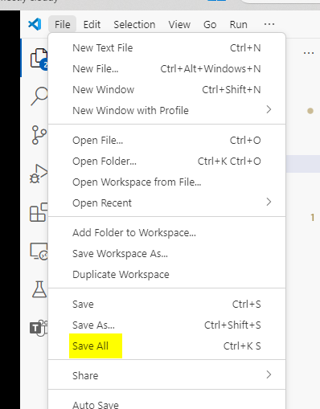

### Task 4: Create prompt template for intent mapping

The **get_product_documents.py** script uses a prompt template to convert the conversation to a search query. The template instructs how to extract the user's intent from the conversation.

1.  Before you run the script, create the prompt template. Create a file
    named +++**intent_mapping.prompty**+++ under your **assets** folder:

    

4.  Copy the following code to the intent_mapping_prompty file and the
    from top bar go to Files and click on **Save all.**

```
---
name: Chat Prompt
description: A prompty that extract users query intent based on the current_query and chat_history of the conversation
model:
    api: chat
    configuration:
        azure_deployment: gpt-4o
inputs:
    conversation:
        type: array
---
system:
# Instructions
- You are an AI assistant reading a current user query and chat_history.
- Given the chat_history, and current user's query, infer the user's intent expressed in the current user query.
- Once you infer the intent, respond with a search query that can be used to retrieve relevant documents for the current user's query based on the intent
- Be specific in what the user is asking about, but disregard parts of the chat history that are not relevant to the user's intent.
- Provide responses in json format

# Examples
Example 1:
With a conversation like below:

 - user: are the trailwalker shoes waterproof?
 - assistant: Yes, the TrailWalker Hiking Shoes are waterproof. They are designed with a durable and waterproof construction to withstand various terrains and weather conditions.
 - user: how much do they cost?

Respond with:
{
    "intent": "The user wants to know how much the Trailwalker Hiking Shoes cost.",
    "search_query": "price of Trailwalker Hiking Shoes"
}

Example 2:
With a conversation like below:

 - user: are the trailwalker shoes waterproof?
 - assistant: Yes, the TrailWalker Hiking Shoes are waterproof. They are designed with a durable and waterproof construction to withstand various terrains and weather conditions.
 - user: how much do they cost?
 - assistant: The TrailWalker Hiking Shoes are priced at $110.
 - user: do you have waterproof tents?
 - assistant: Yes, we have waterproof tents available. Can you please provide more information about the type or size of tent you are looking for?
 - user: which is your most waterproof tent?
 - assistant: Our most waterproof tent is the Alpine Explorer Tent. It is designed with a waterproof material and has a rainfly with a waterproof rating of 3000mm. This tent provides reliable protection against rain and moisture.
 - user: how much does it cost?

Respond with:
{
    "intent": "The user would like to know how much the Alpine Explorer Tent costs.",
    "search_query": "price of Alpine Explorer Tent"
}

user:
Return the search query for the messages in the following conversation:
{{#conversation}}
 - {{role}}: {{content}}
{{/conversation}}

```


### Task 5: Test the product document retrieval script

1.  Now that you have both the script and template, run the script to
    test out what documents the search index returns from a query. From
    the terminal window run,

    +++python get_product_documents.py --query "I need a new tent for 4 people, what would you recommend?"+++

    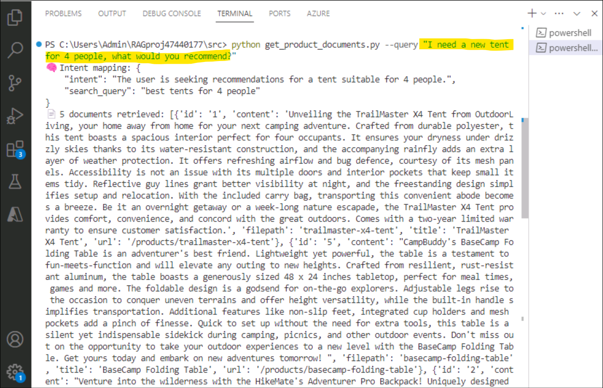

### Task 6: Develop custom knowledge retrieval (RAG) code

Next you create custom code to add retrieval augmented generation (RAG) capabilities to a basic chat application.

**Create a chat script with RAG capabilities**

1.  In your **src** folder, create a new file called +++**chat_with_products.py**+++. This script retrieves
    product documents and generates a response to a user's question.

    

2.  Add the code to import the required libraries, create a project
    client, and configure settings:

```
import os
from pathlib import Path
from opentelemetry import trace
from azure.ai.projects import AIProjectClient
from azure.identity import DefaultAzureCredential
from config import ASSET_PATH, get_logger, enable_telemetry
from get_product_documents import get_product_documents


# initialize logging and tracing objects
logger = get_logger(__name__)
tracer = trace.get_tracer(__name__)

# create a project client using environment variables loaded from the .env file
project = AIProjectClient.from_connection_string(
    conn_str=os.environ["AIPROJECT_CONNECTION_STRING"], credential=DefaultAzureCredential()
)

# create a chat client we can use for testing
chat = project.inference.get_chat_completions_client()
```


3.  Add the code at end of chat_with_products.py to create the chat
    function that uses the RAG capabilities.

```
from azure.ai.inference.prompts import PromptTemplate


@tracer.start_as_current_span(name="chat_with_products")
def chat_with_products(messages: list, context: dict = None) -> dict:
    if context is None:
        context = {}

    documents = get_product_documents(messages, context)

    # do a grounded chat call using the search results
    grounded_chat_prompt = PromptTemplate.from_prompty(Path(ASSET_PATH) / "grounded_chat.prompty")

    system_message = grounded_chat_prompt.create_messages(documents=documents, context=context)
    response = chat.complete(
        model=os.environ["CHAT_MODEL"],
        messages=system_message + messages,
        **grounded_chat_prompt.parameters,
    )
    logger.info(f"💬 Response: {response.choices[0].message}")

    # Return a chat protocol compliant response
    return {"message": response.choices[0].message, "context": context}
```


4.  Finally, add the code to run the **chat** **function** and then go
    to files and click on S**ave all**.

```
if __name__ == "__main__":
    import argparse

    # load command line arguments
    parser = argparse.ArgumentParser()
    parser.add_argument(
        "--query",
        type=str,
        help="Query to use to search product",
        default="I need a new tent for 4 people, what would you recommend?",
    )
    parser.add_argument(
        "--enable-telemetry",
        action="store_true",
        help="Enable sending telemetry back to the project",
    )
    args = parser.parse_args()
    if args.enable_telemetry:
        enable_telemetry(True)

    # run chat with products
    response = chat_with_products(messages=[{"role": "user", "content": args.query}])
```


### Task 7: Create a grounded chat prompt template

The **chat_with_products.py** script calls a prompt template to generate a response to the user's question. The template instructs how to generate a response based on the user's question and the retrieved documents. Create this template now.

1.  In your **assets** folder, add the
    file +++**grounded_chat.prompty**+++

    

2.  Add the following code grounded_chat.prompty.

```
---
name: Chat with documents
description: Uses a chat completions model to respond to queries grounded in relevant documents
model:
    api: chat
    configuration:
        azure_deployment: gpt-4o
inputs:
    conversation:
        type: array
---
system:
You are an AI assistant helping users with queries related to outdoor outdooor/camping gear and clothing.
If the question is not related to outdoor/camping gear and clothing, just say 'Sorry, I only can answer queries related to outdoor/camping gear and clothing. So, how can I help?'
Don't try to make up any answers.
If the question is related to outdoor/camping gear and clothing but vague, ask for clarifying questions instead of referencing documents. If the question is general, for example it uses "it" or "they", ask the user to specify what product they are asking about.
Use the following pieces of context to answer the questions about outdoor/camping gear and clothing as completely, correctly, and concisely as possible.
Do not add documentation reference in the response.

# Documents

{{#documents}}

## Document {{id}}: {{title}}
{{content}}
{{/documents}}
```


3.  Click on **File> Save all.**

    

### Task 8: Run the chat script with RAG capabilities

1.  Now that you have both the script and the template, run the script
    to test your chat app with RAG capabilities:

    +++python chat_with_products.py --query "I need a new tent for 4 people, what would you recommend?"+++

    

### Task 9: Add telemetry logging

1.  From the Azure portal, select **Subscriptions**, select your subscription and then select
    **Resource providers** under **Settings** from the left navigation
    pane.

2.  Search for and select +++**Microsoft.OperationalInsights**+++ and
    click on the three dots for this resource provider and select
    **Register**.

    

3.  Follow the same procedure to register +++microsoft.insights+++

4.  Wait for a success message on the registration before proceeding to
    the next step.

    

5.  From your Project in the Azure AI Foundry, select **Tracing** under
    **Access and improve** from the left pane. Select **Create New**.

    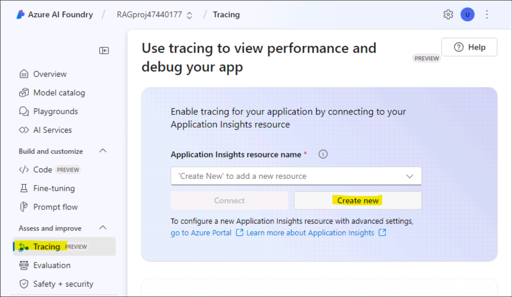

6.	Provide the name as **+++appinsight@lab.LabInstance.Id+++**

    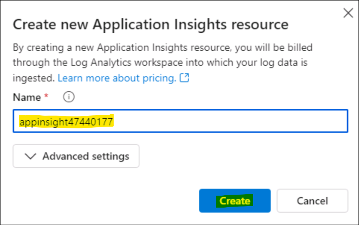

6.  Ensure that the resource gets created.

    

7.  Back in the VS Code, to enable logging of telemetry to your project,
    install azure-monitor-opentelemetry.

    +++pip install azure-monitor-opentelemetry+++

    

8.  Add the --enable-telemetry flag when you use
    the chat_with_products.py script:

    +++python chat_with_products.py --query "I need a new tent for 4 people, what would you recommend?" --enable-telemetry+++

    

## Exercise 3: Evaluate the custom chat application with the Azure AI Foundry SDK

### Task 1: Evaluate the quality of the chat app responses

Now that you know your chat app responds well to your queries, including
with chat history, it's time to evaluate how it does across a few
different metrics and more data.

You use an evaluator with an evaluation dataset and
the get_chat_response() target function, then assess the evaluation
results.

Once you run an evaluation, you can then make improvements to your
logic, like improving your system prompt, and observing how the chat app
responses change and improve.

**Create evaluation dataset**

Use the following evaluation dataset, which contains example questions
and expected answers (truth).

1.  Create a file called +++**chat_eval_data.jsonl**+++ in
    your **assets** folder.

    

2.  Paste this dataset into the file and the **save** the file.

```
{"query": "Which tent is the most waterproof?", "truth": "The Alpine Explorer Tent has the highest rainfly waterproof rating at 3000m"}
{"query": "Which camping table holds the most weight?", "truth": "The Adventure Dining Table has a higher weight capacity than all of the other camping tables mentioned"}
{"query": "How much do the TrailWalker Hiking Shoes cost? ", "truth": "The Trailewalker Hiking Shoes are priced at $110"}
{"query": "What is the proper care for trailwalker hiking shoes? ", "truth": "After each use, remove any dirt or debris by brushing or wiping the shoes with a damp cloth."}
{"query": "What brand is TrailMaster tent? ", "truth": "OutdoorLiving"}
{"query": "How do I carry the TrailMaster tent around? ", "truth": " Carry bag included for convenient storage and transportation"}
{"query": "What is the floor area for Floor Area? ", "truth": "80 square feet"}
{"query": "What is the material for TrailBlaze Hiking Pants?", "truth": "Made of high-quality nylon fabric"}
{"query": "What color does TrailBlaze Hiking Pants come in?", "truth": "Khaki"}
{"query": "Can the warrenty for TrailBlaze pants be transfered? ", "truth": "The warranty is non-transferable and applies only to the original purchaser of the TrailBlaze Hiking Pants. It is valid only when the product is purchased from an authorized retailer."}
{"query": "How long are the TrailBlaze pants under warranty for? ", "truth": " The TrailBlaze Hiking Pants are backed by a 1-year limited warranty from the date of purchase."}
{"query": "What is the material for PowerBurner Camping Stove? ", "truth": "Stainless Steel"}
{"query": "Is France in Europe?", "truth": "Sorry, I can only queries related to outdoor/camping gear and equipment"}
```


### Task 2: Evaluate with Azure AI evaluators

Now define an evaluation script that will:

- Generate a target function wrapper around our chat app logic.

- Load the sample .jsonl dataset.

- Run the evaluation, which takes the target function, and merges the
  evaluation dataset with the responses from the chat app.

- Generate a set of GPT-assisted metrics (relevance, groundedness, and
  coherence) to evaluate the quality of the chat app responses.

- Output the results locally, and logs the results to the cloud project.

The script allows you to review the results locally, by outputting the
results in the command line, and to a json file.

The script also logs the evaluation results to the cloud project so that
you can compare evaluation runs in the UI.

1.  Create a file called +++**evaluate.py**+++ under **src** folder.

    

2.  Add the following code to import the required libraries, create a
    project client, and configure some settings:

```
import os
import pandas as pd
from azure.ai.projects import AIProjectClient
from azure.ai.projects.models import ConnectionType
from azure.ai.evaluation import evaluate, GroundednessEvaluator
from azure.identity import DefaultAzureCredential

from chat_with_products import chat_with_products

# load environment variables from the .env file at the root of this repo
from dotenv import load_dotenv

load_dotenv()

# create a project client using environment variables loaded from the .env file
project = AIProjectClient.from_connection_string(
    conn_str=os.environ["AIPROJECT_CONNECTION_STRING"], credential=DefaultAzureCredential()
)

connection = project.connections.get_default(connection_type=ConnectionType.AZURE_OPEN_AI, include_credentials=True)

evaluator_model = {
    "azure_endpoint": connection.endpoint_url,
    "azure_deployment": os.environ["EVALUATION_MODEL"],
    "api_version": "2024-06-01",
    "api_key": connection.key,
}

groundedness = GroundednessEvaluator(evaluator_model)
```


3.  Add code to create a wrapper function that implements the evaluation
    interface for query and response evaluation:

```
def evaluate_chat_with_products(query):
    response = chat_with_products(messages=[{"role": "user", "content": query}])
    return {"response": response["message"].content, "context": response["context"]["grounding_data"]}
```


4.  Finally, add code to run the evaluation, view the results locally,
    and gives you a link to the evaluation results in AI Foundry portal.

```
# Evaluate must be called inside of __main__, not on import
if __name__ == "__main__":
    from config import ASSET_PATH

    # workaround for multiprocessing issue on linux
    from pprint import pprint
    from pathlib import Path
    import multiprocessing
    import contextlib

    with contextlib.suppress(RuntimeError):
        multiprocessing.set_start_method("spawn", force=True)

    # run evaluation with a dataset and target function, log to the project
    result = evaluate(
        data=Path(ASSET_PATH) / "chat_eval_data.jsonl",
        target=evaluate_chat_with_products,
        evaluation_name="evaluate_chat_with_products",
        evaluators={
            "groundedness": groundedness,
        },
        evaluator_config={
            "default": {
                "query": {"${data.query}"},
                "response": {"${target.response}"},
                "context": {"${target.context}"},
            }
        },
        azure_ai_project=project.scope,
        output_path="./myevalresults.json",
    )

    tabular_result = pd.DataFrame(result.get("rows"))

    pprint("-----Summarized Metrics-----")
    pprint(result["metrics"])
    pprint("-----Tabular Result-----")
    pprint(tabular_result)
    pprint(f"View evaluation results in AI Studio: {result['studio_url']}")
```


5.  Click on **Save all** under **File** in the top navigation bar.

### Task 3: Configure the evaluation model

Since the evaluation script calls the model many times, you might want
to increase the number of tokens per minute for the evaluation model.

Initially, you created a **.env** file that specifies the name of the
evaluation model, gpt-4o-mini. Try to increase the tokens per minute
limit for this model, if you have available quota. If you don't have
enough quota to increase the value, don't worry. The script is designed
to handle limit errors.

1.  From your project in Azure AI Foundry portal, select **Models +
    endpoints** and select **gpt-4o-mini**.

    

2.  Select **gpt-4o-mini**, click on **Edit.**

    

3.  Set the value of **Tokens per Minute Rate Limit** to the maximum
    allowed limit and select **Save and close**.

    

### Task 4: Run the evaluation 

1.  From the Azure AI Foundry, select **Evaluations** from the left pane
    and select **+ New Evaluation**. Click on **Create a new evaluation**.

    

2.  Select **Dataset**.

    

3.  Accept the defaults in the Basic information page and click
    **Next**.

    

4.  Select **Add your** **dataset** -\> **Upload file** and upload the
    **chat_eval_data.jsonl** that we created in the **assets** folder
    and click on **Next**.

    

5.  Select the **Metrics** under AI quality and Risk and safety metrics as in the screenshots below. Also, under the Ai quality, select your connection and the deployment name.

    

    

6.  Select the Data source types as in the below screenshot and click
    **Next**.

    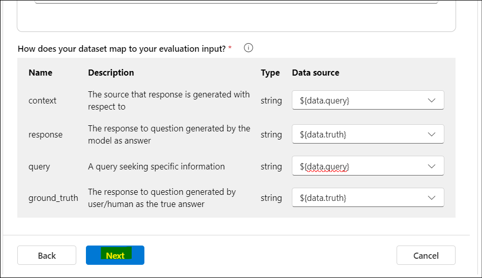

7.  Select **Submit** to submit the evaluation.

    

8.  Once the evaluation completes, explore the results.

    

    

    

## Exercise 4: Delete the resources

1.  From the Azure portal home page, select the assigned Resouce group.
    Select all the resources under the Resource group and select Delete.

    

2.  Enter +++**delete**+++ and click on the **Delete** button to confirm
    deletion. Click on **Delete** in the Delete confirmation dialog box.

    

3.  Confirm the deletion of all the resources with a success message.

    

**Summary:**

In this lab, we have learnt to build, evaluate and deploy a RAG based application.
