# ラボ 5 - Azure AI Foundry と検索統合を使用したカスタム AI エージェントの作成

**所要時間：45分**

## 目的

このラボの目的は、Azure AI サービスと検索統合を活用した
AI-poweredエージェントの構築方法を参加者に指導することです。Retrieval
Augmented Generation(RAG)
は、カスタムデータソースからのデータを生成AIモデルのプロンプトに統合するアプリケーションを構築するために使用される手法です。RAG
は、生成 AI アプリ
(言語モデルを用いて入力を解釈し、適切な応答を生成するchat-basedアプリケーション)
の開発で広く使用されているパターンです。参加者は、Azure AI Foundry
ポータルを使用して、カスタムデータを生成 AI
プロンプトフローに統合する方法を学習します。

## 解決

このラボでは、Azure
AIサービスと高度な検索機能を統合し、堅牢でインテリジェントなソリューションを構築することに重点を置いています。AI-poweredエージェントの構成、シームレスなデータ取得の実現、そしてコンテキストに応じたレスポンスの提供に重点を置いています。AIと検索の統合を活用することで、ワークフローの合理化、意思決定の改善、そして直感的で効率的なインタラクションによるユーザーエンゲージメントの向上を目指します。

## タスク 1: Azure AI Search リソースを作成する

1.  WebブラウザでAzureポータル（+++
    [https://portal.azure.com+++）](https://portal.azure.com+++/)を開き、

- ユーザー名 - <+++@lab.CloudPortalCredential> (User1).Username+++

- パスワード - <+++@lab.CloudPortalCredential> (User1).Password+++

2.  ホーム ページで、 **+ Create a resource**を選択します。

3.  検索バーから、+++ **Azure AI Search** +++を検索して選択します。

4.  **Create**の横にあるドロップダウンを選択し、 **Azure AI
    Search**を選択します。

5.  「検索サービスの作成」ページで、以下の詳細を入力し、 **Review +
    create**をクリックします。

    - **Subscription**: ドロップダウンから Azure
      サブスクリプションを選択します。

    - **Resource group** サブスクリプションに割り当てられたリソース
      グループ (ResourceGroup1) を選択します。

    - **Service name**: <+++aisearch@lab.LabInstance.Id> +++

    - **Location**: @lab.CloudResourceGroup(ResourceGroup1).Location
      を選択します。

    - **Pricing tier**: Standard

6.  設定を確認して、 **Create**をクリックします。

7.  Azure AI Search リソースのデプロイが完了するまで待ちます。

## タスク 2: Azure AI Hub のリソースとプロジェクトを作成する

1.  Azure ポータルの**ホーム**ページから**Azure AI Foundry**
    を選択します。

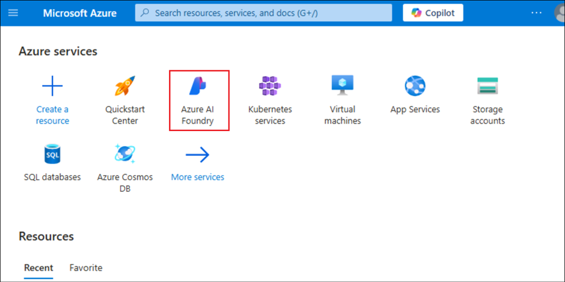

2.  **Use with AI Foundry -\> AI Hubs**を選択します。 **+
    Create -\> Hub**を選択します。

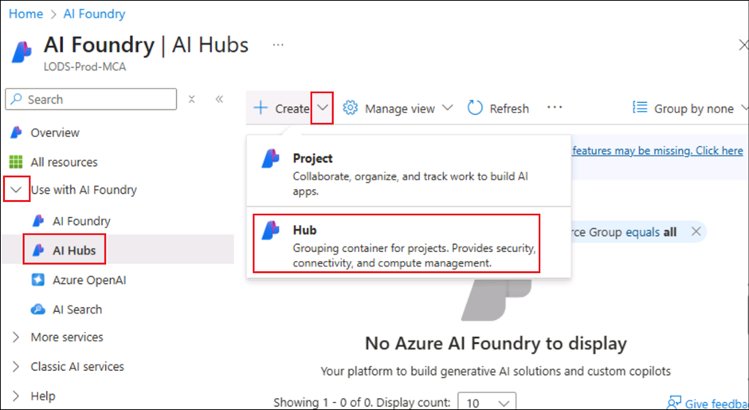

3.  以下の詳細を入力し、他のデフォルトを受け入れて、 **Review +
    create**を選択します。

    - Subscription -**割り当てられたサブスクリプション**を選択します

    - Resource group- 割り当てられたリソース グループ (
      **ResourceGroup1** )を選択します

    - Region- @lab.CloudResourceGroup(ResourceGroup1).Location
      を選択します。

    - Name - +++
      [**hub@lab.LabInstance.Id**](mailto:hub@lab.LabInstance.Id) +++

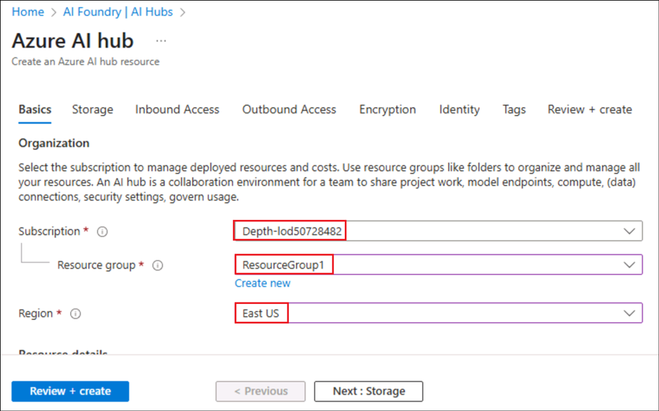

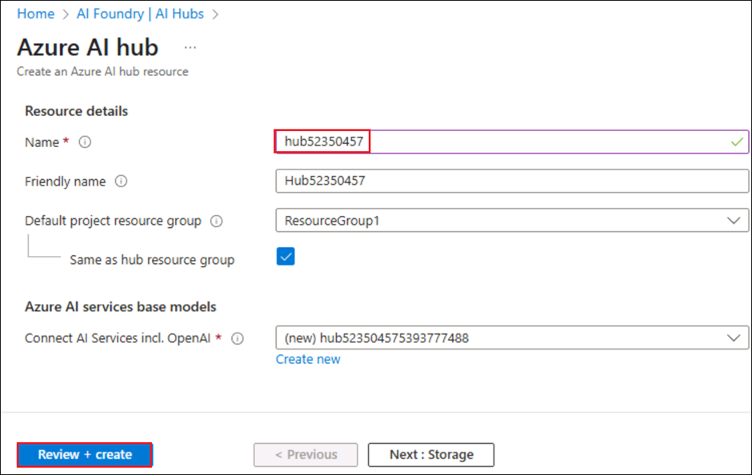

4.  検証に合格したら**Create**を選択します。

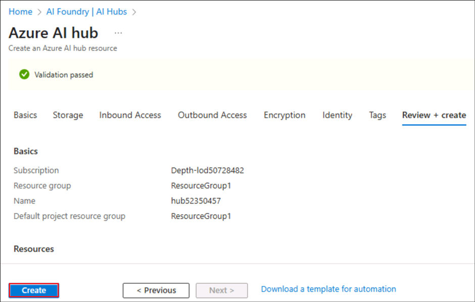

5.  デプロイが完了したら、 **Go to resource**をクリックします。

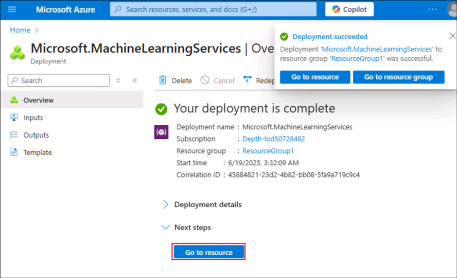

6.  ハブ リソース ページから**Launch Azure AI Foundry **を選択します。

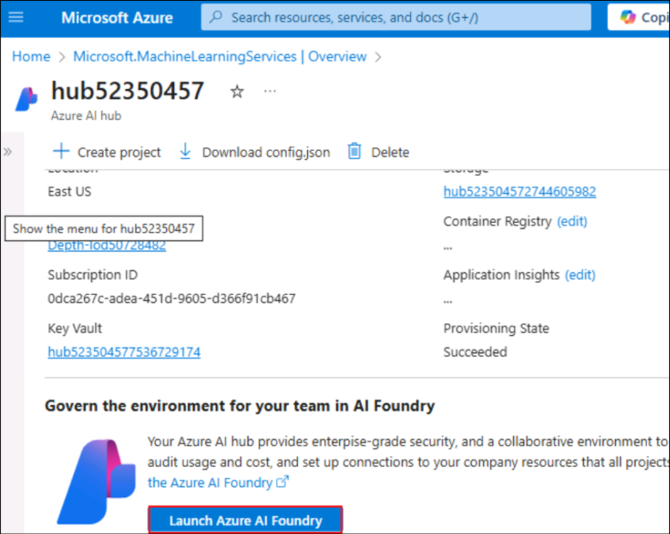

7.  起動したハブリソースから下にスクロールして**+ New
    project**を選択します

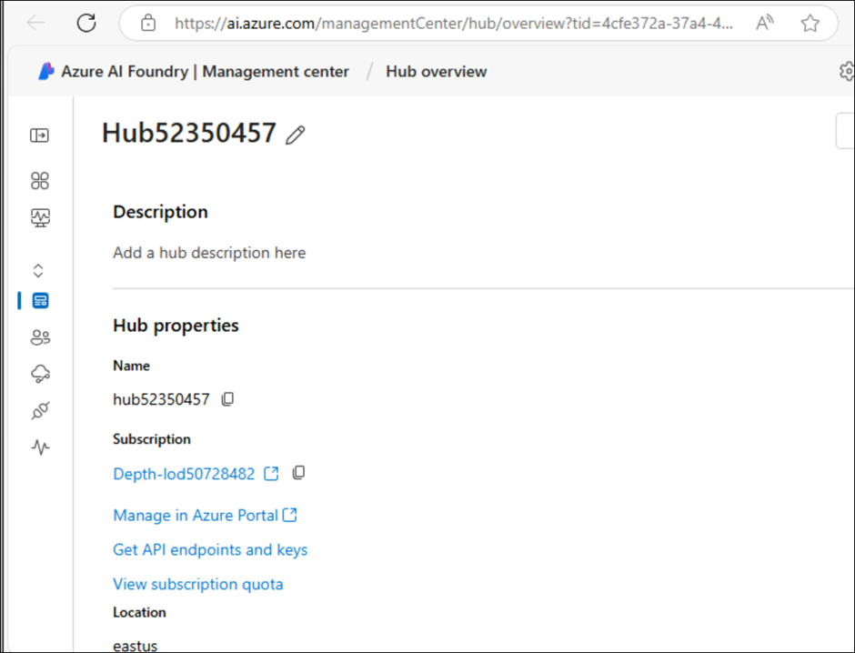

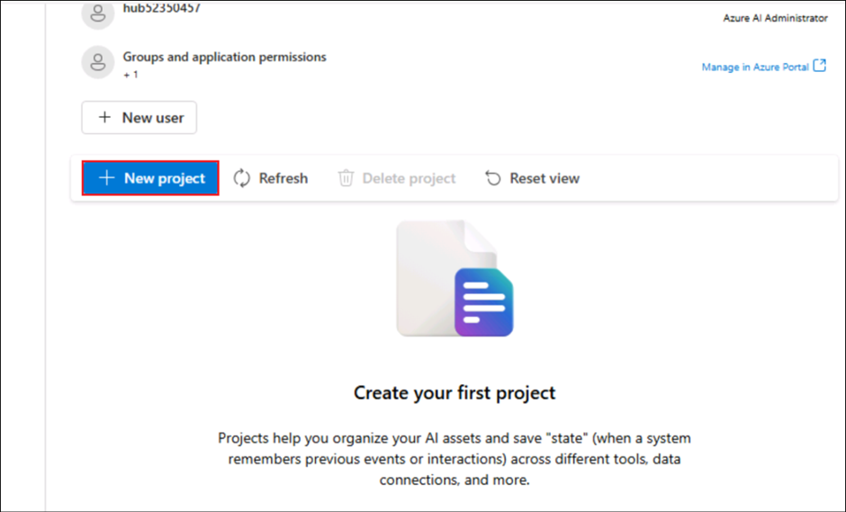

8.  名前を +++
    [**ragpfproject@lab.LabInstance.Id**](mailto:ragpfproject@lab.LabInstance.Id)
    +++ と入力し、 **Create**を選択します。

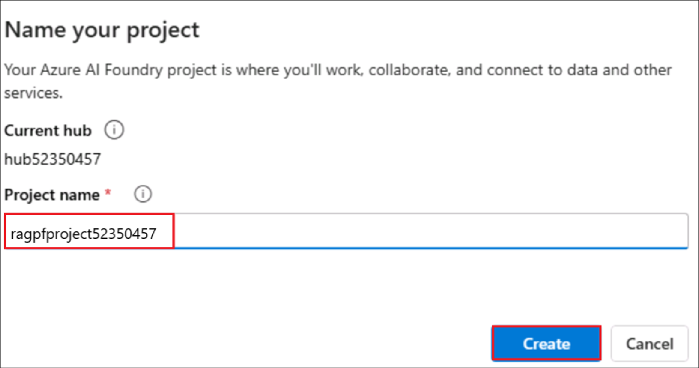

9.  「Explore and experiment」ポップアップを**Close**します**。**

10. 作成されたプロジェクト ページに移動します。

## タスク3: モデルのデプロイ

ソリューションを実装するには、次の 2 つのモデルが必要です。

- 効率的なインデックス作成と処理のためにテキスト
  データをベクトル化する埋め込みモデル。

- データに基づいて質問に対する自然言語の応答を生成できるモデル。

1.  左側のペインから、 **My assets **の下にある**Models +
    endpoints **を選択します。

2.  **Manage deployments of your models and services page**ページで、
    **+Deploy model **をクリックし、**Deploy base model**を選択します。

3.  **Select a model **ページで、+++ **text-embedding-ada-002** +++
    モデルを検索して選択し、**Confirm**をクリックします**。**

4.  **Deploy model text-embedding-ada-002 **パネルで、**Deployment
    name** にあらかじめ設定されている値を受け入れ、**Deployment
    type**に**Standard**を選択します。
    ** Customize **をクリックし、Deploy
    modelウィザードで以下の詳細を入力します。

- **Model version**: デフォルトのバージョンを選択

- **AIresource**:
  以前に作成したリソースを選択します（ドロップダウンに表示されるリソースです）

- **Token per minute rate limit（thousands）** : 5K

- **Content filter**: DefaultV2

- **動的クォータを有効にする**: 無効

5.  前の手順を繰り返して、デプロイメント名 gpt-4o で+++ **gpt-4o +++**
    モデルをデプロイします

6.  これで 2 つのデプロイメントの準備が整いました。

**注:** 1 Tokens Per Minute (TPM)
を減らすと、使用しているサブスクリプションで利用可能なクォータの過剰使用を防ぐことができます。この演習で使用するデータには
5,000 TPM で十分です。

## タスク4: プロジェクトにデータを追加する

copilotのデータは、架空の旅行代理店*「Margie’s
Travel」*が発行するPDF形式の旅行ブローシャのセットです。これをプロジェクトに追加してみましょう。

1.  左ペインの**My assets **の下にある**Data + indexes **を選択します。
    **+ New data**を選択します

2.  **Add your data **ウィザードで、ドロップダウンから**Upload
    files/folders を選択します。**

3.  **Upload folder **を選択し、 **C:
    \LabFiles**から**brochures**フォルダーを選択して、
    **Upload**をクリックします。

4.  フォルダがアップロードされるまでお待ちください。フォルダ内に複数の.pdfファイルが含まれていることをご確認ください。すべてのファイルがアップロードされたら、
    **Next**を選択してください。

5.  \[name and finish\]の次のページで、データ名を +++
    [**data@lab.LabInstance.Id**](mailto:data@lab.LabInstance.Id) +++
    と入力し、 **Create**をクリックします。

## タスク5: データのインデックスを作成する

プロジェクトにデータ ソースを追加したので、それを使用して Azure AI
Search リソースにインデックスを作成できます。

1.  **Data + indexes **ページから、 **Indexes **タブを選択します。

2.  **Indexes **タブで**+ New
    index **を選択して新しいインデックスを追加します。

3.  以下の詳細を入力し、 **Next**をクリックします。

    - **Data source**- **Data in Azure AI Foundry**を選択する

リストされた**data source **を選択し、 **Next**をクリックします。

4.  「ベクター インデックスの作成 -
    インデックス構成」ページで以下の詳細を入力し、
    **Next**をクリックします**。**

    - **Select Azure AI Search service**: **AzureAISearch**を選択

    - Vector index - +++**パンフレットインデックス**+++

    - **Virtual machine**: **Auto select**を選択

5.  Create a vector index – Search settingsページで、

**Vector settings ** - **Add vector search to this search
resourceを追加を選択**

他のデフォルトを受け入れて、 **Next**を選択します。

6.  **Review and finish **ページで詳細を確認し、 **Create vector
    index**選択します。

7.  インデックス作成プロセスが完了するまでお待ちください。完了には数分かかる場合があります。インデックス作成操作は、以下のジョブで構成されます。

    - ブローシャデータ内のテキスト
      トークンをCrack、chunkとembedすること。

    - Azure AI Search インデックスを作成します。

    - インデックス資産を登録します。

## タスク6: インデックスをテストする

RAG-basedプロンプト フローでインデックスを使用する前に、それが生成 AI
応答に影響を与えるために使用できることを確認しましょう。

1.  左側のペインから**Playgrounds **を選択し、**Chat
    Playground**を選択します。

2.  デフォルトで表示されない場合は、 **Show setup **をクリックします。

3.  **gpt-4o**モデルのデプロイメントが選択されていることを確認してください。次に、メインのチャットセッションパネルで+++**Where
    can I stay in New York?**+++というプロンプトを送信してください。

4.  応答を確認します。これは、インデックスからのデータを含まないモデルからの一般的な回答はずです。

5.  セットアップ ペインで、**Add your data **フィールドを展開し、
    **brochures-index**プロジェクト インデックスを選択して、**hybrid
    (vector + keyword) **検索タイプを選択します。

**注:**一部のユーザー様が、新しく作成したインデックスがすぐに利用できない場合があります。ブラウザを更新すると通常は改善しますが、それでもインデックスが見つからないという問題が発生する場合は、インデックスが認識されるまでお待ちいただく必要がある場合があります。

6.  データソースを追加すると新しいセッションが開始されます。完了したら、+++**Where
    can I stay in New York?**+++プロンプトを再送信してください。

7.  応答を確認し、応答がインデックス内のデータに基づいていることを確認します。

## タスク 7: プロンプトフローでインデックスを使用する

ベクター インデックスが Azure AI Foundry
プロジェクトに保存され、プロンプト
フローで簡単に使用できるようになりました。

1.  左側のナビゲーション ペインから**Build and
    customize **の下にある**Prompt flow** を選択し、
    **Create**をクリックします。

2.  **Multi-Round Q&A on Your Data**の下の**Clone**を選択します。

3.  フォルダー名を +++ **brochure-flow** +++ にして、
    **Clone**をクリックします。

**注:**アクセス許可エラーが発生した場合は、2
分後に新しい名前で再試行すると、フローが複製されます。

4.  プロンプトフローデザイナーページが開いたら、
    **brochure-flow**を確認します。グラフは次のようになります。

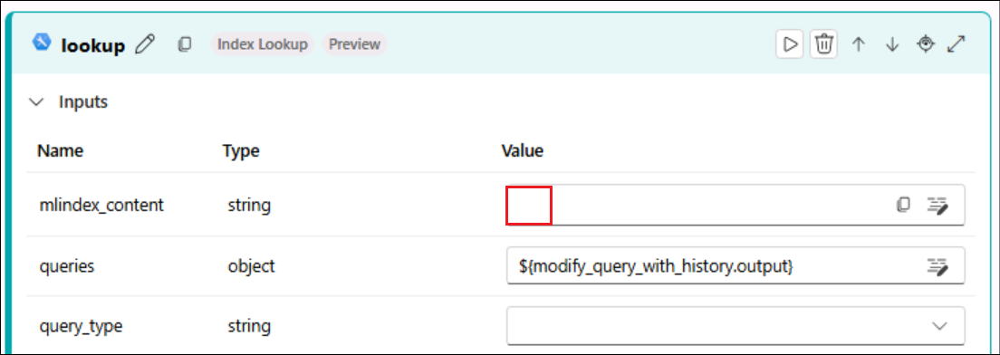

使用しているサンプルプロンプトフローは、ユーザーがチャットインターフェースにテキスト入力を繰り返し送信できるチャットアプリケーションのプロンプトロジックを実装しています。会話履歴は保持され、各反復処理のコンテキストに含まれます。プロンプトフローは、以下の機能を実行する一連の*ツールをオーケストレーションします*。

- チャット入力に履歴を追加して、コンテキストに応じた質問の形式でプロンプトを定義します。

- 質問に基づいて独自に選択したインデックスとクエリ
  タイプを使用してコンテキストを取得します。

- インデックスから取得したデータを使用してプロンプトのコンテキストを生成し、質問を拡張します。

- システム
  メッセージを追加し、チャット履歴を構造化して、プロンプトのバリエーションを作成します。

- プロンプトを言語モデルに送信して、自然言語応答を生成します。

5.  フローのランタイム コンピューティングを開始するには、 **Start
    compute session **を使用します。

ランタイムが起動するまでお待ちください。これにより、プロンプトフローのコンピューティングコンテキストが提供されます。待機中は、**Flow** タブでフロー内のツールのセクションを確認してください。

6.  **Inputs **クションで、入力に以下が含まれていることを確認します。

    - **chat_history**

    - **chat_input**

このサンプルのデフォルトのチャット履歴には、AI
に関する会話がいくつか含まれています。

7.  **Output**で、出力に以下が含まれていることを確認します。

    - 値が ${chat_with_context.output} である**chat_output**

8.  **modify_query_with_history**セクションで、次の設定を選択します
    (他の設定はそのままにします)。

    - **Connection**:リストに表示される AI ハブの**Azure OpenAI
      resource** を選択します。

    - **API** :**Chat**を選択します

    - **deployment_name**: **gpt-4o**を選択します

    - **response_format** : **{“type”:”text”}**を選択

9.  コンピューティング
    セッションが開始されたら、**lookup **セクションで次のパラメーター値を設定します。

    - **mlindex_content**
      :*空のフィールドを選択して生成ペインを開きます*

      - **index_type** : **Registered Index**を選択します

 

- **mlindex_asset_id : brochures-index:1 を**選択します

ルックアップセクションに戻り、以下の詳細を入力します

- **queries:** ${modify_query_with_history.output}

- **query_type: Hybrid (vector + keyword)**

- **top_k:** 2

10. **generate_prompt_context**セクションで、Python
    スクリプトを確認し、このツールの入力に次のパラメーターが含まれていることを確認します。

    - **search_result ** *(object)* : ${lookup.output}

11. **Prompt_variants**セクションで、Python
    スクリプトを確認し、このツールの**input**に次のパラメーターが含まれていることを確認します。

    - **contexts ** *(文字列)* : ${generate_prompt_context.output}

    - **chat_history ** *(文字列)* : ${inputs.chat_history}

    - **chat_input ** *(文字列)* : ${inputs.chat_input}

12. **chat_with_context**セクションで、次の設定を選択します
    (他の設定はそのままにします)。

    - **Connection**: **Azure OpenAIリソース**を選択する

    - **API** : Chat

    - **deployment_name**: gpt-4o

    - **response_format**: {“type”:”text”}

次に、このツールの**input**に次のパラメータが含まれていることを確認します。

- **prompt_text ** *(文字列)* : ${Prompt_variants.output}

13. プロンプト
    フローのツールに加えた変更を保存するには、ツールバーの**Save **ボタンを選択します。

14. ツールバーから**Chat**を選択します。チャットパネルが開き、サンプルの会話履歴と、サンプル値に基づいて既に入力された入力内容が表示されます。これらは無視して構いません。

15. チャットパネルで、デフォルトの入力を**+++Where can I stay in
    London?+++**という質問に置き換えて送信します。

16. 応答はインデックス内のデータに基づいています。

17. フロー内の各ツールの出力を確認します。

18. **+++What can I do there?+++**という質問を入力します。

19. 応答を確認します。応答はインデックス内のデータに基づいており、**チャット履歴**を考慮するべきです。(つまり、「**there**」は「**in
    London**」と理解されます)。

20. フロー内の各ツールの出力を確認し、フロー内の各ツールが入力に対してどのように操作してコンテキスト化されたプロンプトを準備し、適切な応答を取得したかに注目します。

## タスク 8: リソースを削除する:

1.  Azure ポータル (+++
    [https://portal.azure.com+++](https://portal.azure.com+++/) ) から、
    **ResourceGroup1** (自分に割り当てられているもの) を選択します。

2.  その下にあるすべてのリソースを選択し、 **Delete**をクリックします。

3.  +++ **delete** +++
    と入力し、**Delete **ボタンをクリックして削除を確定します。削除確認ダイアログボックスで**Delete **をクリックします。

4.  削除確認メッセージによってリソースが削除されたことを確認します。

## 要旨

**Azure AI Foundry**からの独自のデータを使用するカスタム
エージェントを作成する方法を学習しました。
