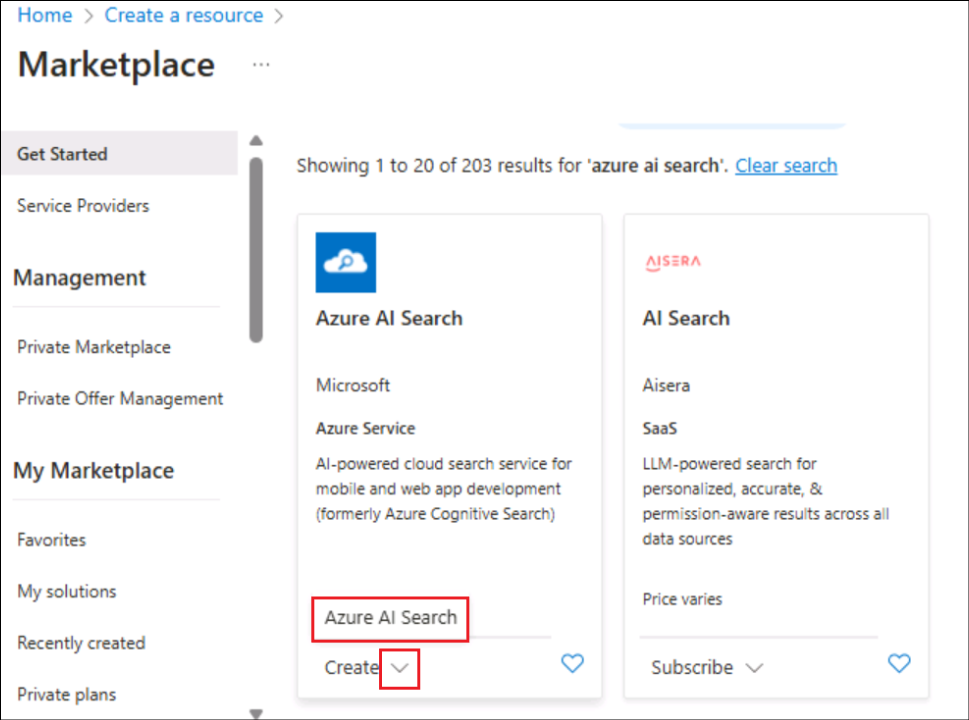
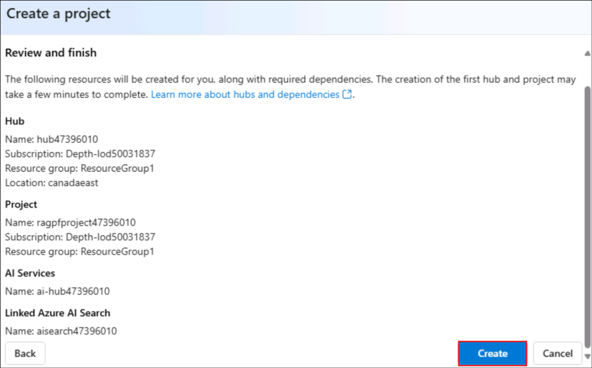
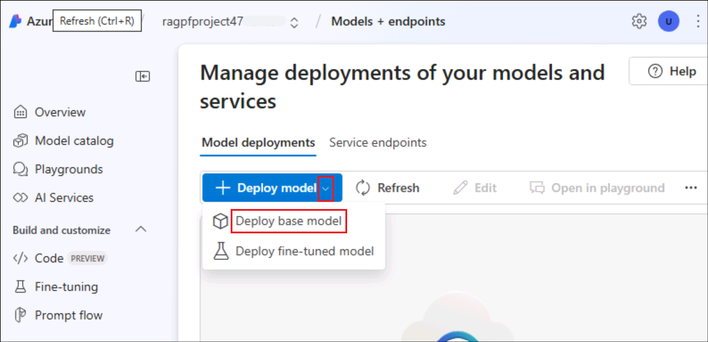
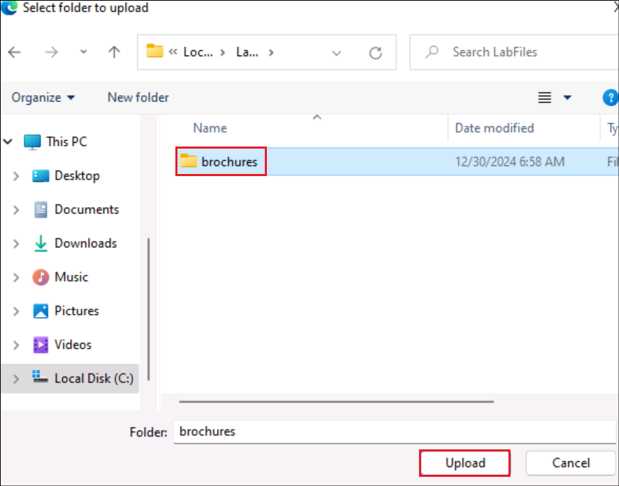

# Lab 5 - Develop a Contoso AI Travel assistant agent using Azure OpenAI and the Semantic Kernel SDK

**Estimated Time: 40 mins**

## Objective

In this lab, participants will build an AI-powered travel agent for
Contoso using Azure OpenAI and the Semantic Kernel SDK. The objective is
to demonstrate how to leverage AI technologies to create a
conversational agent capable of understanding user queries, providing
travel recommendations, and performing tasks such as booking flights,
hotels, and managing itineraries. By the end of the lab, participants
will have hands-on experience in integrating AI models with real-world
applications, utilizing the Semantic Kernel SDK to enhance the travel
agent's capabilities, and testing the agent’s performance in a simulated
environment.

## Solution focus area

The lab focuses on building an AI-powered travel agent using Azure
OpenAI and the Semantic Kernel SDK. It enables natural language
processing (NLP) for handling user queries related to travel planning,
such as booking flights, accommodations, and providing travel
recommendations.

The lab emphasizes creating a conversational AI interface that interacts
with users, answering questions, and assisting with travel-related
tasks. Using the Semantic Kernel SDK, it orchestrates tasks like
itinerary management and integrates APIs for real-time travel data.

The solution aims to enhance user experience by providing personalized
and responsive travel assistance. It automates common travel tasks to
optimize workflows and streamline travel planning processes.

## Exercise 1: Cloning and configuring the AI Travel Agent Project with Azure OpenAI Services

In this exercise, you will clone a guided project repository from GitHub
into Visual Studio Code and configure it to integrate with Azure OpenAI
Services. By following the steps, you will learn how to set up a local
development environment, modify project files, and prepare the
application for execution using your Azure OpenAI deployment details.

**Important:** You must have .NET Framework 8.0 installed and a GitHub
account to complete these steps.

1.  Open Visual Studio Code on your virtual machine.

> 

2.  In the **Start** section of Visual Studio Code, click **Clone Git
    Repository**.

> 

3.  In the URL bar, enter the following repository URL:
    <https://github.com/MicrosoftLearning/APL-2005-Guided-Project.git>

>  alt="A screenshot of a computer Description automatically generated" />

4.  In the File Explorer, create a new folder in a location that is easy
    to find, such as on your Desktop.

> 

5.  Click Select as Repository Destination to choose this folder as the
    location to clone the repository.

> **Note:** You need to be signed in to GitHub to successfully clone the
> project.
>
>  alt="A screenshot of a computer Description automatically generated" />

6.  After cloning, Visual Studio Code will automatically open the
    project.

>  alt="A screenshot of a computer Description automatically generated" />
>
>  alt="A screenshot of a computer Description automatically generated" />

7.  In the Explorer panel, navigate to the AITravelAgent/Starter folder.
    Right-click the folder and select Open in Integrated Terminal.

>  alt="A screenshot of a computer Description automatically generated" />

8.  In the Explorer panel, expand the Starter folder, and you should see
    the Plugins folder, Prompts folder, and Program.cs file.

9.  Open the Starter/Program.cs file and update the following variables
    with your Azure OpenAI Services deployment name, API key, and
    endpoint. After making the changes, press Ctrl + S to save the file:

> string yourDeploymentName = "gpt-35-turbo-16k";
>
> string yourEndpoint = "Which we created in Lab 3";
>
> string yourKey = "Which we created in Lab 3";
>
> **Note:** For the API key and endpoint, refer to the AI Foundry and
> the Lab 3 project overview section.
>
>  style="width:6.26806in;height:3.14097in" />
>
> 

## Exercise 2: Creating and Testing a Currency Converter Plugin with Semantic Kernel

In this exercise, you will create a currency converter plugin using
Semantic Kernel. You will write and test a function that converts an
amount from one currency to another using predefined exchange rates.
This exercise will help you understand how to build and invoke custom
plugins, utilize decorators for functionality and descriptions, and
integrate plugins into a larger application.

**Important:** You need to complete the Setup instructions in the
previous unit, Prepare, before you begin this exercise.

1.  Create a new file named CurrencyConverter.cs in
    the **Stater/Plugins/ConvertCurrency** folder

>  alt="A screenshot of a computer Description automatically generated" />

2.  In the CurrencyConverter.cs file, add the following code to create a
    plugin function:

> using Microsoft.SemanticKernel;
>
> using System.ComponentModel;
>
> using AITravelAgent;
>
> class CurrencyConverter
>
> {
>
>     \[KernelFunction,
>
>     Description("Convert an amount from one currency to another")\]
>
>     public static string ConvertAmount(
>
>     {
>
>         var currencyDictionary = Currency.Currencies;
>
>     }
>
> }

> In this code, you use the KernelFunction decorator to declare your
> native function. You also use the Description decorator to add a
> description of what the function does. You can
> use Currency.Currencies to get a dictionary of currencies and their
> exchange rates. Next, add some logic to convert a given amount from
> one currency to another.

3.  Modify your ConvertAmount function, the full code is looks like:

> using Microsoft.SemanticKernel;
>
> using System.ComponentModel;
>
> using AITravelAgent;
>
> class CurrencyConverter
>
> {
>
>     \[KernelFunction, Description(@"Converts an amount from one
> currency to another
>
>         and returns a friendly message with the results")\]
>
>     public static string ConvertAmount(
>
>         \[Description("The starting currency code")\] string
> baseCurrencyCode,
>
>         \[Description("The target currency code")\] string
> targetCurrencyCode,
>
>         \[Description("The amount to convert")\] string amount)
>
>     {
>
>         var currencyDictionary = Currency.Currencies;
>
>         Currency targetCurrency =
> currencyDictionary\[targetCurrencyCode\];
>
>         Currency baseCurrency =
> currencyDictionary\[baseCurrencyCode\];
>
>        
>
>         if (targetCurrency == null)
>
>         {
>
>             return targetCurrencyCode + " was not found";
>
>         }
>
>         else if (baseCurrency == null)
>
>         {
>
>             return baseCurrencyCode + " was not found";
>
>         }
>
>         else
>
>         {
>
>             double amountInUSD = Double.Parse(amount) \*
> baseCurrency.USDPerUnit;
>
>             double result = amountInUSD \* targetCurrency.UnitsPerUSD;
>
>             return \$"\${amount} {baseCurrencyCode} is approximately
> {result.ToString("C")} in {targetCurrency.Name}s
> ({targetCurrencyCode})";
>
>         }
>
>     }
>
> }
>
> In this code, you use the Currency.Currencies dictionary to get
> the Currency object for the target and base currencies. You then use
> the Currency object to convert the amount from the base currency to
> the target currency. Finally, you return a string with the converted
> amount. Next, let's test your plugin.
>
>  style="width:6.26806in;height:3.95069in" />
>
> **Note:** When using the Semantic Kernel SDK in your own projects, you
> don't need to hardcode data into files if you have access to RESTful
> APIs. Instead, you can use the Plugins.Core.HttpClient plugin to
> retrieve data from APIs.

4.  In the Starter/Program.cs file, import and invoke your new plugin
    function with the following code. (Delete the code below var kernel
    = builder.Build(); and replace it with the given below code. )

> kernel.ImportPluginFromType\<CurrencyConverter\>();
>
> kernel.ImportPluginFromType\<ConversationSummaryPlugin\>();
>
> var prompts = kernel.ImportPluginFromPromptDirectory("Prompts");
>
> var result = await kernel.InvokeAsync("CurrencyConverter",
>
>     "ConvertAmount",
>
>     new() {
>
>         {"targetCurrencyCode", "USD"},
>
>         {"amount", "52000"},
>
>         {"baseCurrencyCode", "VND"}
>
>     }
>
> );
>
> Console.WriteLine(result);
>
> In this code, you use the ImportPluginFromType method to import your
> plugin. Then you use the InvokeAsync method to invoke your plugin
> function. The InvokeAsync method takes the plugin name, function name,
> and a dictionary of parameters. Finally, you print the result to the
> console. Next, run the code to make sure it's working.
>
>  style="width:6.26806in;height:3.31819in" />

5.  Go to files from top bar and select **Save all.**

6.  In the terminal, enter **dotnet run**. You should see the following
    output:

Output: \$52000 VND is approximately \$2.13 in US Dollars (USD)

> Now that your plugin is working correctly, let's create a natural
> language prompt that can detect what currencies and amount the user
> wants to convert.

## Exercise 3: Configuring a Target Currency Prompt for Semantic Processing

In this exercise, you will configure a prompt system to identify target
currencies, base currencies, and amounts from user input. By creating
and setting up configuration and prompt files, you will define how the
AI interprets and processes natural language requests for currency
conversions.

1.  Open your project directory in Visual Studio Code or File Explorer
    and locate the Starter/Prompt folder. Navigate into this folder to
    prepare for the next steps.

>  style="width:6.26806in;height:2.91806in" />

2.  Inside the Starter/Prompt folder, create a new folder named
    **GetTargetCurrencies**. This folder will contain all the files
    related to this exercise.

>  style="width:6.26806in;height:3.64097in" />

3.  Within the **GetTargetCurrencies** folder, create a new file named
    **config.json**.

>  style="width:6.26806in;height:3.15417in" />

4.  Open the newly created **config.json** file in Visual Studio Code.
    Copy and paste the following code into the file:

> {
>
>     "schema": 1,
>
>     "type": "completion",
>
>     "description": "Identify the target currency, base currency, and
> amount to convert",
>
>     "execution_settings": {
>
>         "default": {
>
>             "max_tokens": 800,
>
>             "temperature": 0
>
>         }
>
>     },
>
>     "input_variables": \[
>
>         {
>
>             "name": "input",
>
>             "description": "Text describing some currency amount to
> convert",
>
>             "required": true
>
>         }
>
>     \]
>
> }
>
>  style="width:6.26806in;height:2.87639in" />
>
> Save the file by pressing **Ctrl + S**. This configuration defines how
> the AI system should interpret and process user input.

5.  Still inside the **GetTargetCurrencies** folder, create another new
    file named **skprompt.txt**.

>  style="width:6.26806in;height:3.32153in" />

6.  Open the **skprompt.txt** file in your text editor and paste the
    following content:

> \<message role="system"\>Identify the target currency, base currency,
> and
>
> amount from the user's input in the format
> target\|base\|amount\</message\>
>
> For example:
>
> \<message role="user"\>How much in GBP is 750.000 VND?\</message\>
>
> \<message role="assistant"\>GBP\|VND\|750000\</message\>
>
> \<message role="user"\>How much is 60 USD in New Zealand
> Dollars?\</message\>
>
> \<message role="assistant"\>NZD\|USD\|60\</message\>
>
> \<message role="user"\>How many Korean Won is 33,000 yen?\</message\>
>
> \<message role="assistant"\>KRW\|JPY\|33000\</message\>
>
> \<message role="user"\>{{\$input}}\</message\>
>
> \<message role="assistant"\>target\|base\|amount\</message\>
>
>  style="width:6.26806in;height:3.01458in" />
>
> Save the file by pressing **Ctrl + S**. This script defines the prompt
> logic for processing currency conversion requests.

## Exercise 4: Configuring a Prompt System for Travel Activity Recommendations

In this exercise, you will set up and customize a prompt system to
suggest activities and points of interest based on a user's travel
destination. By editing configuration and prompt files, you will define
the system's behavior, tone, and input requirements to generate
personalized and creative travel recommendations.

1.  Open your project directory in Visual Studio Code or File Explorer.
    Navigate to the folder Starter/Prompts/SuggestActivities.

>  style="width:6.26806in;height:3.64931in" />

2.  Locate the **config.json** file inside the SuggestActivities folder
    and open it.

>  style="width:6.26806in;height:2.89375in" />

3.  Replace the existing code in the **config.json** file with the
    following:

> {
>
>     "schema": 1,
>
>     "type": "completion",
>
>     "description": "Suggest activities and points of interest at a
> given destination",
>
>     "execution_settings": {
>
>         "default": {
>
>             "max_tokens": 4000,
>
>             "temperature": 0.5
>
>         }
>
>     },
>
>     "input_variables": \[
>
>         {
>
>             "name": "history",
>
>             "description": "Some background information about the
> user",
>
>             "required": false
>
>         },
>
>         {
>
>             "name": "destination",
>
>             "description": "The destination a user wants to visit",
>
>             "required": true
>
>         }
>
>     \]
>
>   }
>
>  style="width:6.26806in;height:3.12847in" />
>
> Save the file after making the changes by pressing **Ctrl + S**. This
> file configures the system to process user inputs and generate
> suggestions for activities.

4.  Stay within the SuggestActivities folder and locate the
    **skprompt.txt** file. Open this file in editor.

>  style="width:6.26806in;height:2.57361in" />

5.  Replace the existing content of **skprompt.txt** with the following
    text:

> You are an experienced travel agent.
>
> You are helpful, creative, and very friendly.
>
> Consider the traveler's background: {{\$history}}
>
> The traveler would like some activity recommendations for their trip
> to {{\$destination}}.
>
> Please suggest a list of things to do, see, and points of interest.
>
>  style="width:6.26806in;height:1.80694in" />
>
> Save the file by pressing **Ctrl + S**. This script sets the behaviour
> and tone of the system when generating activity recommendations.

## Exercise 5: Configuring the Main Program for AI Workflow

In this exercise, you will configure the main Program.cs file to
integrate with Azure OpenAI services and the Microsoft Semantic Kernel.
By customizing the code, you will enable functionalities such as
currency conversion, activity suggestions, and travel recommendations.
This setup establishes a robust AI-powered workflow for user interaction
and intent recognition, leveraging plugins and prompt-based logic.

1.  Open your project folder in Visual Studio Code or your preferred
    code editor. Navigate to the **Starter/Program.cs** file and open it
    for editing.

2.  Replace the entire content of the **Program.cs** file with the
    following code and then **press cntrl + S** to save the code.

**Note:** After replacing code, please again add endpoint, Key and
deployment name in the respected part of code.

<table>
<colgroup>
<col style="width: 100%" />
</colgroup>
<thead>
<tr>
<th>
using System.Text;

using Microsoft.SemanticKernel;

using Microsoft.SemanticKernel.ChatCompletion;

using Microsoft.SemanticKernel.Connectors.OpenAI;

using Microsoft.SemanticKernel.Plugins.Core;

#pragma warning disable SKEXP0050

#pragma warning disable SKEXP0060

string yourDeploymentName = "gpt-35-turbo-16k";

string yourEndpoint = "EndPoint";

string yourApiKey = "API Key";

var builder = Kernel.CreateBuilder();

builder.Services.AddAzureOpenAIChatCompletion(

    yourDeploymentName,

    yourEndpoint,

    yourApiKey,

    "gpt-35-turbo-16k");

var kernel = builder.Build();

kernel.ImportPluginFromType&lt;CurrencyConverter&gt;();

kernel.ImportPluginFromType&lt;ConversationSummaryPlugin&gt;();

var prompts = kernel.ImportPluginFromPromptDirectory("Prompts");

// Note: ChatHistory isn't working correctly as of SemanticKernel v
1.4.0

StringBuilder chatHistory = new();

OpenAIPromptExecutionSettings settings = new()

{

    ToolCallBehavior = ToolCallBehavior.AutoInvokeKernelFunctions

};

string input;

do {

    Console.WriteLine("What would you like to do?");

    input = Console.ReadLine()!;

    var intent = await kernel.InvokeAsync&lt;string&gt;(

        prompts["GetIntent"],

        new() {{ "input",  input }}

    );

    switch (intent) {

        case "ConvertCurrency":

            var currencyText = await
kernel.InvokeAsync&lt;string&gt;(

                prompts["GetTargetCurrencies"],

                new() {{ "input",  input }}

            );

           

            var currencyInfo = currencyText!.Split("|");

            var result = await
kernel.InvokeAsync("CurrencyConverter",

                "ConvertAmount",

                new() {

                    {"targetCurrencyCode", currencyInfo[0]},

                    {"baseCurrencyCode", currencyInfo[1]},

                    {"amount", currencyInfo[2]},

                }

            );

            Console.WriteLine(result);

            break;

        case "SuggestDestinations":

            chatHistory.AppendLine("User:" + input);

            var recommendations = await
kernel.InvokePromptAsync(input!);

            Console.WriteLine(recommendations);

            break;

        case "SuggestActivities":

            var chatSummary = await kernel.InvokeAsync(

                "ConversationSummaryPlugin",

                "SummarizeConversation",

                new() {{ "input", chatHistory.ToString() }});

            var activities = await kernel.InvokePromptAsync(

                input!,

                new () {

                    {"input", input},

                    {"history", chatSummary},

                    {"ToolCallBehavior",
ToolCallBehavior.AutoInvokeKernelFunctions}

            });

            chatHistory.AppendLine("User:" + input);

            chatHistory.AppendLine("Assistant:" +
activities.ToString());

            Console.WriteLine(activities);

            break;

        case "HelpfulPhrases":

        case "Translate":

            var autoInvokeResult = await
kernel.InvokePromptAsync(input, new(settings));

            Console.WriteLine(autoInvokeResult);

            break;

        default:

            Console.WriteLine("Sure, I can help with that.");

            var otherIntentResult = await
kernel.InvokePromptAsync(input);

            Console.WriteLine(otherIntentResult);

            break;

    }

}

while (!string.IsNullOrWhiteSpace(input));
</th>
</tr>
</thead>
<tbody>
</tbody>
</table>

> The program begins by importing essential namespaces such as
> System.Text for text handling and Microsoft.SemanticKernel for
> AI-powered conversational workflows. It integrates Microsoft Azure
> OpenAI services through the Microsoft.SemanticKernel.Connectors.OpenAI
> namespace, allowing communication with the GPT model
> (gpt-35-turbo-16k). The configuration involves setting up variables
> like yourDeploymentName, yourEndpoint, and yourApiKey to authenticate
> and connect to the Azure OpenAI endpoint.
>
> The **Semantic Kernel** is initialized using a builder pattern.
> Plugins for additional functionalities, such as CurrencyConverter and
> ConversationSummaryPlugin, are imported. Furthermore, prompts stored
> in a directory (Prompts) are dynamically loaded to facilitate intent
> recognition and task execution.
>
> The main loop of the program interacts with the user by asking for
> input and determining the intent using the GetIntent prompt. Based on
> the intent, the program branches into different functionalities:

1.  **Currency Conversion**: If the intent is to convert currency, the
    program extracts details (target currency, base currency, and
    amount) using the GetTargetCurrencies prompt. It then calls the
    CurrencyConverter plugin's ConvertAmount method and displays the
    result.

2.  **Destination Suggestions**: If the intent is to suggest
    destinations, the program uses the Semantic Kernel's
    InvokePromptAsync method to provide recommendations based on user
    input.

3.  **Activity Suggestions**: This functionality leverages conversation
    summarization through the ConversationSummaryPlugin to provide
    contextually relevant activity suggestions. The conversation history
    is maintained using a StringBuilder object for continuous dialogue
    flow.

4.  **Helpful Phrases and Translation**: For intents like
    "HelpfulPhrases" or "Translate," the kernel automatically invokes
    relevant functions based on the input and settings.

> Other user intents are handled generically by invoking the prompt
> system, ensuring flexibility in responses. The interaction loop
> continues until the user provides no input (an empty string).

## Exercise 6: Testing the Application

In this exercise, you will test the functionality of your application by
running queries for currency conversion, destination suggestions, and
activity recommendations. This will ensure your AI-powered system is
working as intended and providing accurate, context-sensitive outputs.

**Steps to Test**

1.  **Run the Application**

    - Right-click on the Starter folder and select **Open in Integrated
      Terminal**.

    - In the terminal, enter the following command to execute the
      application:

    - dotnet run

2.  **Test Currency Conversion**

    - When prompted, enter a currency conversion query, such as:  
      *"How much is 60 USD in New Zealand dollars?"*

    - Expected Output:  
      *"\$60 USD is approximately \$97.88 in New Zealand Dollars
      (NZD)."*

3.  **Test Destination Suggestions**

    - Enter a query for destination suggestions, providing context. For
      example:  
      *"I'm planning an anniversary trip with my spouse, but they are
      currently using a wheelchair and accessibility is a must. What are
      some destinations that would be romantic for us?"*

    - Expected Output: A list of accessible romantic destinations, such
      as:

      1.  Santorini, Greece: Romantic sunsets and wheelchair-accessible
          paths in certain areas.

      2.  Venice, Italy: Gondola rides with accessible boarding options.

      3.  Maui, Hawaii: Stunning views and accessible resorts.

4.  **Test Activity Suggestions**

    - Enter a query for activity recommendations in a specific
      destination. For example:  
      *"What are some things to do in Barcelona?"*

    - Expected Output: Recommendations tailored to the destination, such
      as:

      1.  Visit the Sagrada Família: A Gaudí masterpiece with accessible
          facilities.

      2.  Explore Park Güell: Unique mosaic designs with
          wheelchair-friendly routes.

      3.  Discover the Picasso Museum: A wheelchair-accessible art
          venue.
