# Lab 6 - Creating a Custom AI Agent with Azure AI Foundry and search integration

**Estimated time: 45 min**

## Objective

The objective of this lab is to guide participants in building an
AI-powered agent using Azure AI services and Search integration.
Participants will learn to configure, integrate, and test key components
to create a functional agent capable of intelligent information
retrieval and interaction, enhancing user experience and productivity.

## Solution

This lab focuses on integrating Azure AI services with advanced search
capabilities to create a robust, intelligent solution. It emphasizes
configuring an AI-powered agent, enabling seamless data retrieval, and
providing contextual responses. By leveraging AI and search integration,
the solution aims to streamline workflows, improve decision-making, and
enhance user engagement through intuitive and efficient interactions.

## Task 1: Create an Azure AI Search resource

1.  In a web browser, open the Azure portal at +++https://portal.azure.com+++ and sign in using your office 365 admin tenant credentials.

    

2.  On the home page, select **+ Create a resource** and search for +++**Azure AI Search**+++. Then **create** a new Azure AI Search resource with the following settings:

    - **Subscription**: *Select your Azure subscription.

    - **Resource group**: *Select or create a resource group, here we select **RG4OpenAI***

    - **Service name**: *Enter a unique service name, here we name it as **copilotXXXX***

    - **Location**: *Make a **random** choice from any of the following regions, here we select Canada East*

      - Australia East

      - Canada East

      - East US

      - East US 2

      - France Central

      - Japan East

      - North Central US

      - Sweden Central

      - Switzerland

    - **Pricing tier**: Standard

    - Click on **Review+create,** then click on **Create.**

    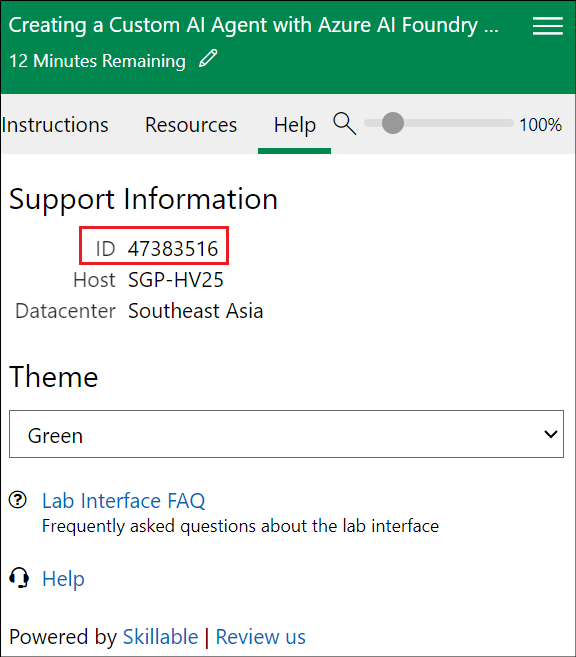

    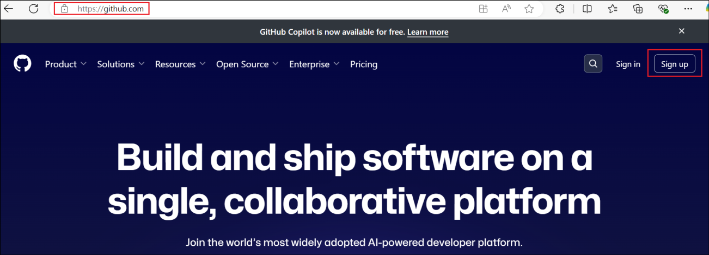

    

    

    Later, you’re going to create an Azure AI Hub (which includes an Azure OpenAI service) in the same region as your Azure AI Search resource. Azure OpenAI resources are constrained at the tenant level by regional quotas. The listed regions include default quota for the model type(s) used in this exercise. Randomly choosing a region reduces the risk of a single region reaching its quota limit in scenarios where you are sharing a tenant with other users. In the event of a quota limit being reached later in the exercise, there’s a possibility you may need to create another Azure AI hub in a different region.

3.  Wait for your Azure AI Search resource deployment to be completed.

    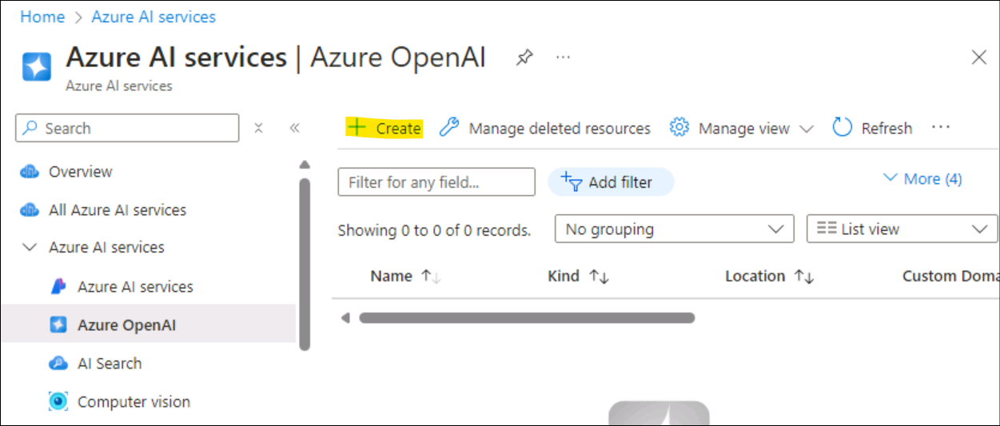

## Task 2: Create an Azure AI project

1.  In a web browser, open Azure AI Foundry at +++https://ai.azure.com+++ and sign in using your Azure credentials.

2.  In the home page, select **+ Create project**.

    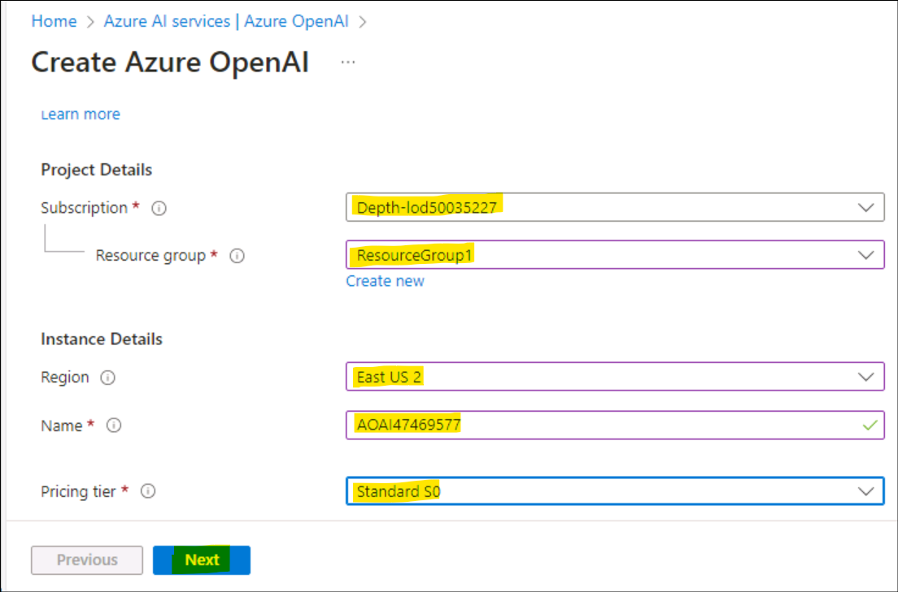

3.  In the **Create a project** wizard enter project name as **ProjectXXXX** and click on **Customize**.

    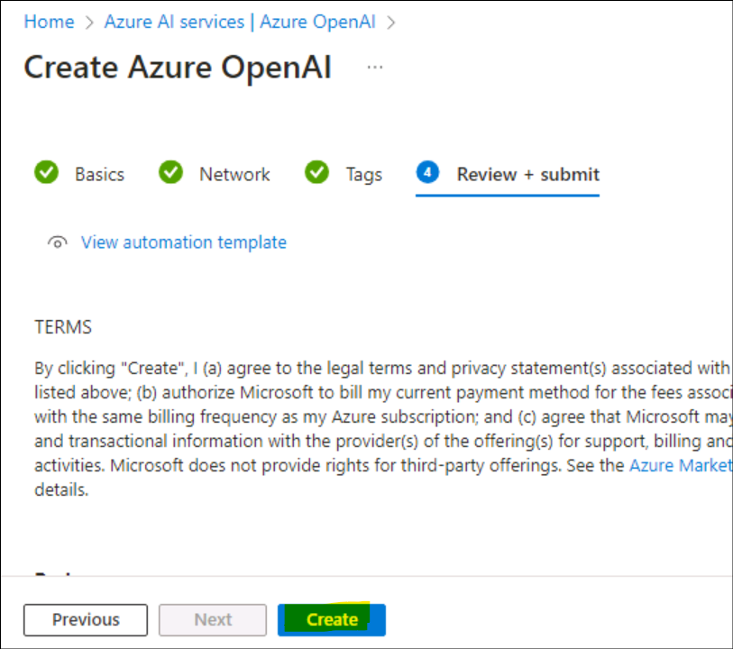

4.  **In Customize**, connect to your Azure AI Search resource, enter the following details, select **Next** and review your configuration.

    - **Hub name**: ***hubXXXX***

    - **Azure Subscription**: *Your Azure subscription*

    - **Resource group**: **RG4OpenAI**

    - **Location**: *The same location as your Azure AI Search resource, **Canada East***

    - **Connect Azure AI Services or Azure OpenAI**: (New)*Autofill’s with your selected hub name*

    - **Connect Azure AI Search**: *Select your Azure AI Search resource, **copilotXXXX***

    

5.  Select **Next** and then **Create** and wait for the process to complete.

    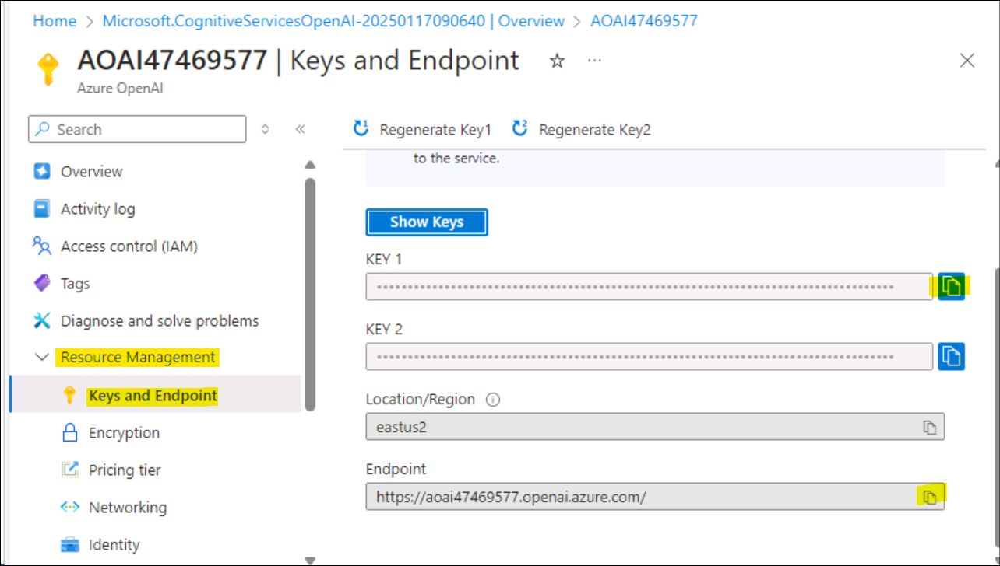

    

    

## Task 3: Deploy models

You need two models to implement your solution:

- An *embedding* model to vectorize text data for efficient indexing and processing.

- A model that can generate natural language responses to questions based on your data.

1.  In the Azure AI Foundry portal, in your project, in the navigation pane on the left, under **My assets**, select the **Models + endpoints** page.

    

2.  On the **Manage deployments of your models and services page,** click on **+ Deploy model** and select **Deploy base model.**

    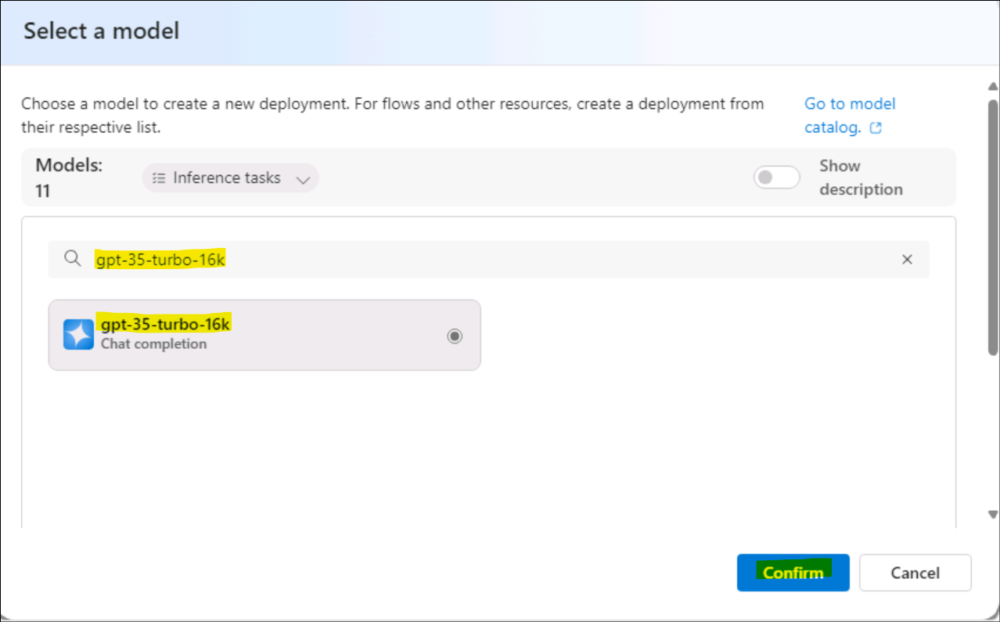

3.  On the **Select a model** page, search and select +++**text-embedding-ada-002**+++ model and click on **Confirm.**

    

4.  On the Deploy model **text-embedding-ada-002** pane click on **Customize** and enter the following details in the Deploy model
    wizard:

    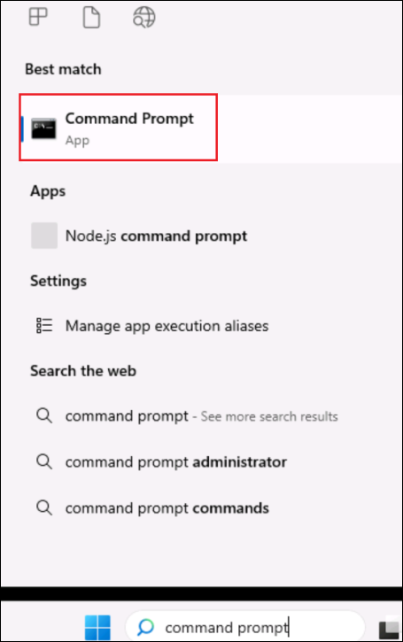

- **Deployment name**: +++text-embedding-ada-002+++

- **Deployment type**: Standard

- **Model version**: *Select the default version*

- **AI resource**: *Select the resource created previously*

- **Tokens per Minute Rate Limit (thousands)**: 5K

- **Content filter**: DefaultV2

- **Enable dynamic quota**: Disabled

    

    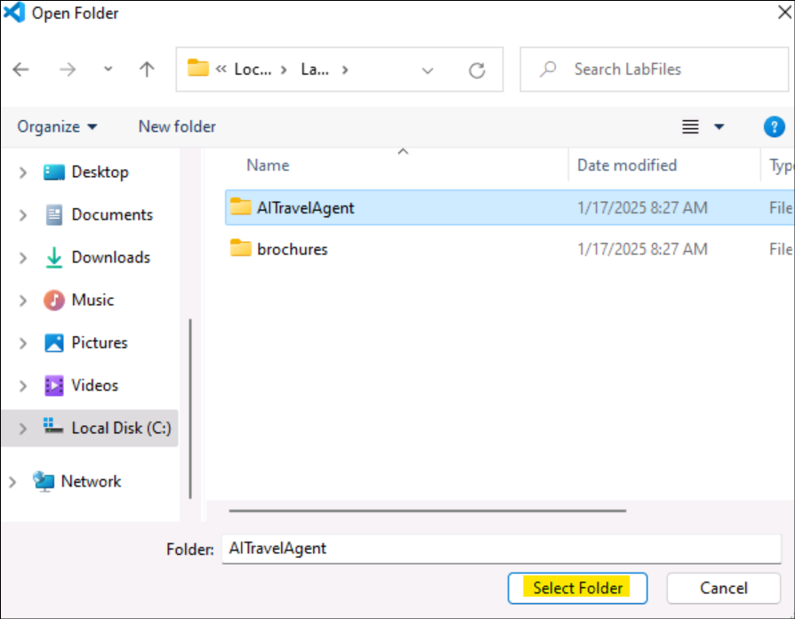

5.  Repeat the previous steps to deploy a +++**gpt-35-turbo-16k**+++ model with the deployment name gpt-35-turbo-16k.

    

    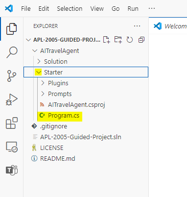

    > **Note**: Reducing the Tokens Per Minute (TPM) helps avoid over-using the quota available in the subscription you are using. 5,000 TPM is sufficient for the data used in this exercise.

## Task 4: Add data to your project

The data for your copilot consists of a set of travel brochures in PDF format from the fictitious travel agency *Margie’s Travel*. Let’s add them to the project.

1.  Navigate to folder named **brochures** in the C:\Lab files of your system.

2.  In Azure AI Foundry portal, in your project, in the navigation pane on the left, under **My assets**, select the **Data + indexes** page.

    

3.  Select **+ New data**.

    

4.  In the **Add your data** wizard, expand the drop-down menu to select **Upload files/folders**.

    

5.  Select **Upload folder** and select the **brochures** folder.

    

6.  Select **Next** on the screen.

    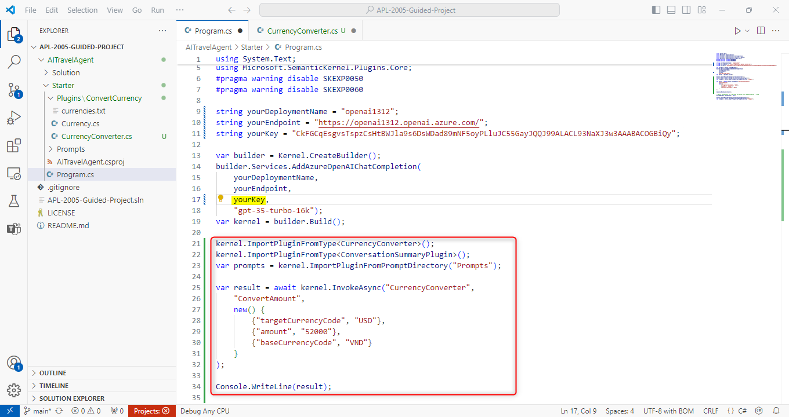

7.  Wait for the folder to be uploaded and note that it contains several .pdf files.

8.  On the next page of name and finish, enter the data name as +++**data0212**+++ and click on **Create.**

    

    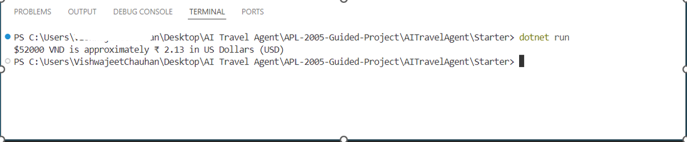

## Task 5: Create an index for your data

Now that you’ve added a data source to your project, you can use it to create an index in your Azure AI Search resource.

1.  In Azure AI Foundry portal, in your project, in the navigation pane on the left, under **My assets**, select the **Data + indexes** page.

    

2.  In the **Indexes** tab, add a new index with the following settings and then select on **Next**.

    - **Source location**:

      - **Data source**: Data in Azure AI Foundry

        - *Select the **brochures** data source- **dataXXXX***

    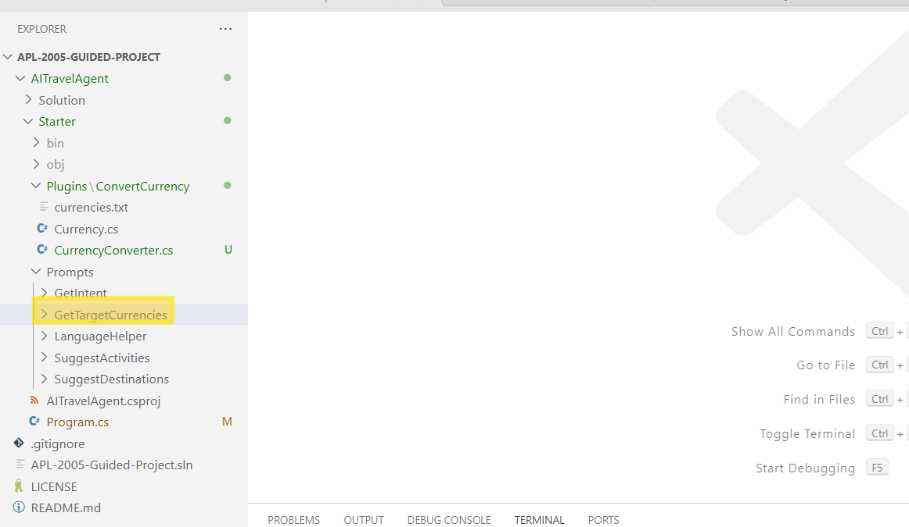

- Configure the index as below given options and then select **Next.**

  - **Select Azure AI Search service**: *Select the **AzureAISearch** connection to your Azure AI Search resource*

  - **Vector index**: +++brochures-index+++

  - **Virtual machine**: Auto select

    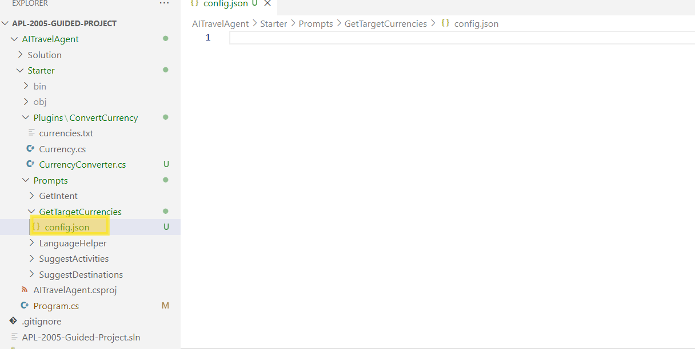

- Configure the search setting as given below and select **Next**, on the Review window click on the **Create Vector Index**.

  - **Vector settings**: Add vector search to this search resource

  - **Azure OpenAI connection**: *Select the default Azure OpenAI resource for your hub.*

    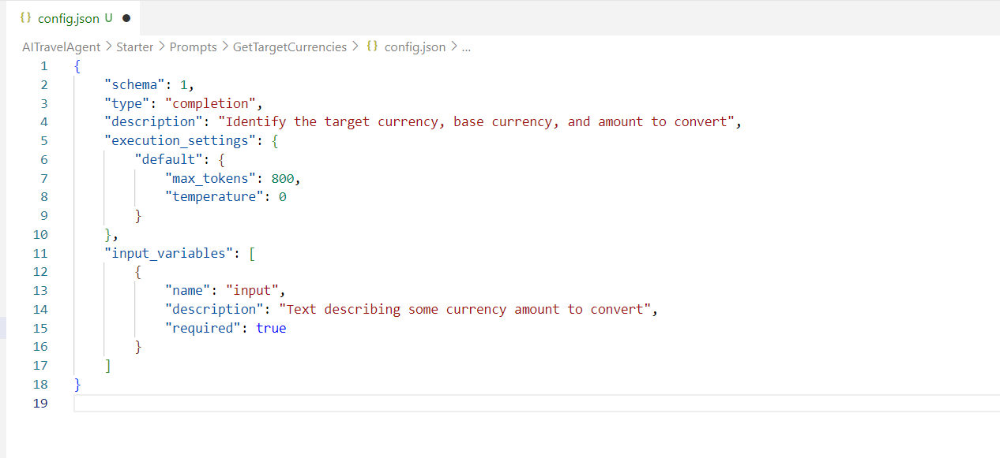

    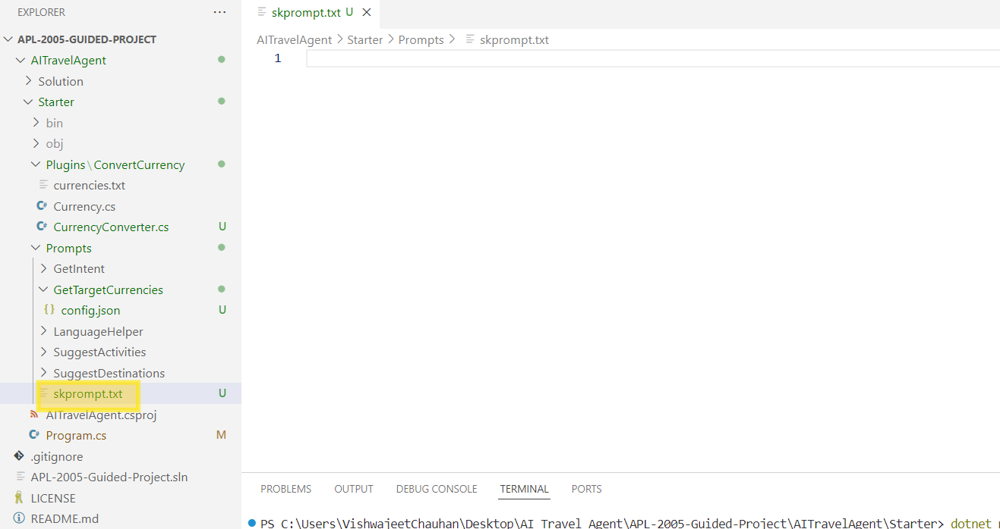

3.  Wait for the indexing process to be completed, which can take several minutes. The index creation operation consists of the following jobs:

    - Crack, chunk, and embed the text tokens in your brochures data.

    - Create the Azure AI Search index.

    - Register the index asset.

    

    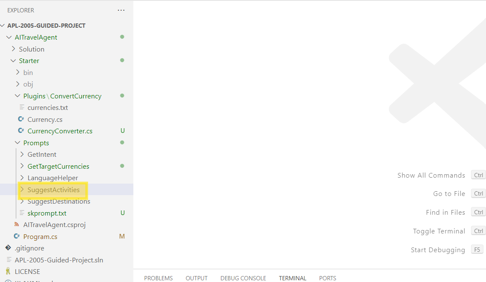

## Task 6: Test the index

Before using your index in a RAG-based prompt flow, let’s verify that it can be used to affect generative AI responses.

1.  In the navigation pane on the left, select the **Playgrounds** page and then select **Chat Playground.**

    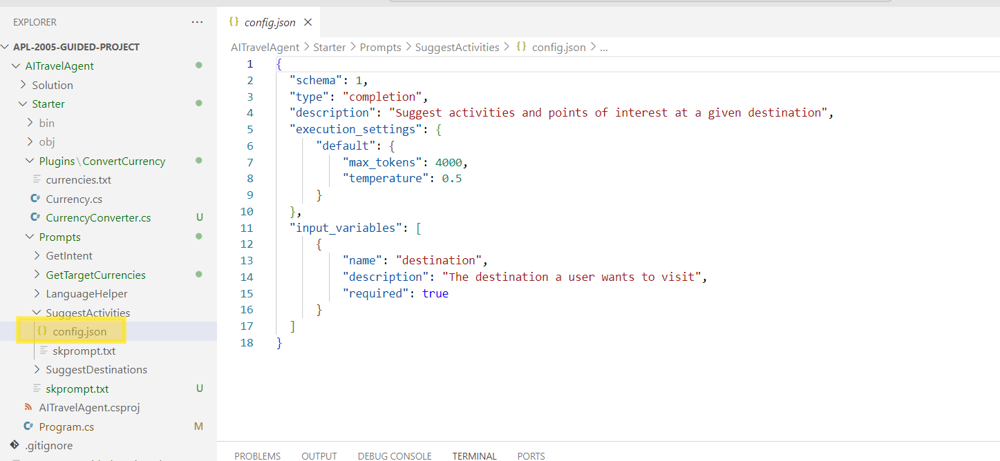

2.  On the Chat page, in the Setup pane, ensure that your **gpt-35-turbo-16k** model deployment is selected. Then, in the main chat session panel, submit the prompt +++**Where can I stay in New York?**+++

    

3.  Review the response, which should be a generic answer from the model without any data from the index.

4.  In the Setup pane, expand the **Add your data** field, and then add the **brochures-index** project index and select the **hybrid (vector + keyword)** search type.

    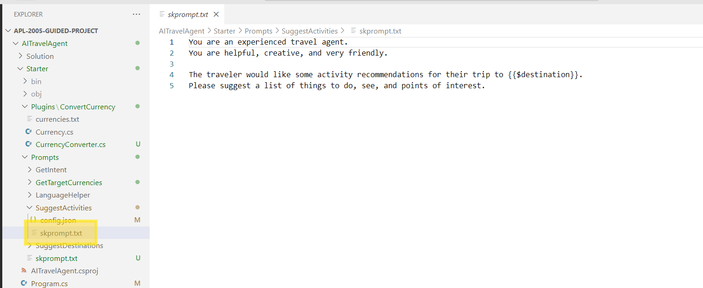

    > **Note**: Some users are finding newly created indexes unavailable right away. Refreshing the browser usually helps, but if you’re still experiencing the issue where it can’t find the index you may need to wait until the index is recognized.

5.  After the index has been added and the chat session has restarted, resubmit the prompt +++**Where can I stay in New York?**+++

    

6.  Review the response, which should be based on data in the index.

## Task 7: Use the index in a prompt flow

Your vector index has been saved in your Azure AI Foundry project, enabling you to use it easily in a prompt flow.

1.  In Azure AI Foundry portal, in your project, in the navigation pane on the left, under **Build and customize**, select the **Prompt flow** page and click on **+Create.**

    

2.  Create a new prompt flow by cloning the **Multi-Round Q&A on Your Data** sample in the gallery. Save your clone of this sample in a folder named **brochure-flow**.

    

    

    > Note: if Permissions error, retry with a new name after 2 minutes and the flow will get cloned.

    

3.  When the prompt flow designer page opens, review **brochure-flow**. Its graph should resemble the following image:

    

    

    The sample prompt flow you are using implements the prompt logic for a chat application in which the user can iteratively submit text input to chat interface. The conversational history is retained and included in the context for each iteration. The prompt flow orchestrates a sequence of *tools* to:

    - Append the history to the chat input to define a prompt in the form of a contextualized form of a question.

    - Retrieve the context using your index and a query type of your own choice based on the question.

    - Generate prompt context by using the retrieved data from the index to augment the question.

    - Create prompt variants by adding a system message and structuring the chat history.

    - Submit the prompt to a language model to generate a natural language response.

4.  Use the **Start compute session** button to start the runtime compute for the flow.

    Wait for the runtime to start. This provides a compute context for the prompt flow. While you’re waiting, in the **Flow** tab, review the sections for the tools in the flow.

    

5.  In the **Inputs** section, ensure the inputs include:

    - **chat_history**

    - **chat_input**

    The default chat history in this sample includes some conversation about AI.

    

6.  In the **Outputs** section, ensure that the output includes:

    - **chat_output** with value \${chat_with_context.output}

    

7.  In the **modify_query_with_history** section, select the following settings (leaving others as they are):

    - **Connection**: *The default Azure OpenAI resource for your AI hub*

    - **Api**: chat

    - **deployment_name**: gpt-35-turbo-16k

    - **response_format**: {“type”:”text”}

    

8.  Wait for the compute session to start, then in the **lookup** section, set the following parameter values:

    - **mlindex_content**: *Select the empty field to open the Generate pane*

      - **index_type**: Registered Index

      - **mlindex_asset_id**: brochures-index:1

    - **queries**: +++\${modify_query_with_history.output}+++

    - **query_type**: Hybrid (vector + keyword)

    - **top_k**: 2

    

    

9.  In the **generate_prompt_context** section, review the Python script and ensure that the **inputs** for this tool include the following parameter:

    - **search_result** *(object)*: \${lookup.output}

    

10. In the **Prompt_variants** section, review the Python script and ensure that the **inputs** for this tool include the following parameters:

    - **contexts** *(string)*: \${generate_prompt_context.output}

    - **chat_history** *(string)*: \${inputs.chat_history}

    - **chat_input** *(string)*: \${inputs.chat_input}

    

11. In the **chat_with_context** section, select the following settings (leaving others as they are):

    - **Connection**: Default_AzureOpenAI

    - **Api**: Chat

    - **deployment_name**: gpt-35-turbo-16k

    - **response_format**: {“type”:”text”}

Then ensure that the **inputs** for this tool include the following parameters:

- **prompt_text** *(string)*: \${Prompt_variants.output}

    

12. On the toolbar, use the **Save** button to save the changes you’ve made to the tools in the prompt flow.

    

13. On the toolbar, select **Chat**. A chat pane opens with the sample conversation history and the input already filled in based on the sample values. You can ignore these.

    

14. In the chat pane, replace the default input with the question +++**Where can I stay in London?**+++ and submit it.

    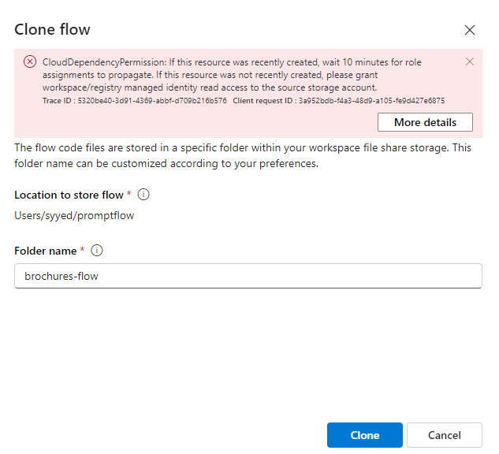

15. Review the response, which should be based on data in the index.

16. Review the outputs for each tool in the flow.

    

17. In the chat pane, enter the question +++**What can I do there?**+++

18. Review the response, which should be based on data in the index and take into account the chat history (so “there” is understood as “in London”).

    

19. Review the outputs for each tool in the flow, noting how each tool in the flow operated on its inputs to prepare a contextualized prompt and get an appropriate response.

## Task 8: Challenge

Now you’ve experienced how to integrate your own data in a copilot built with the Azure AI Foundry portal, let’s explore further!

Try adding a new data source through the Azure AI Foundry portal, index it, and integrate the indexed data in a prompt flow. Some data sets you could try are:

- A collection of (research) articles you have on your computer.

- A set of presentations from past conferences.

Be as resourceful as you can to create your data source and integrate it in your prompt flow. Try out the new prompt flow and submit prompts that could only be answered by the data set you chose!
