# Laboratorio 7 - Cree una solución multiagente mediante Azure AI Agent Service con Semantic Kernel

Podemos crear agentes de IA orientados a la empresa a través de Azure AI
Agent Service.

**Introducción**

A continuación, se presenta un escenario de escritura de blogs. Este
escenario involucra a dos agentes de IA: uno para la asistencia de
escritura y el siguiente para el almacenamiento y la administración de
contenido. Estos agentes se pueden orquestar sin problemas mediante
AutoGen o Semantic Kernel. En este laboratorio, estamos usando el
Semantic Kernel Orchestration.

## Objetivo:

Con Azure AI Foundry SDK, los desarrolladores pueden crear rápidamente
agentes basados en Azure AI Agent Service con Python o C#. Las empresas
tendrán diferentes agentes de IA en función de su negocio, entonces,
¿cómo deben combinarse estos agentes de IA en el flujo de trabajo?
Necesitamos usar AutoGen o Semantic Kernel para orquestar los Agentes de
IA. En este laboratorio, utilizamos el Semantic Kernel para desarrollar
una solución multiagente utilizando Azure AI Agent Service.

## Ejercicio 1: Cree un recurso y un proyecto deAzure AI Hub

En este ejercicio, crearemos el centro en Azure Portal y, a
continuación, un proyecto en Azure AI Foundry, implementaremos el modelo
y crearemos el agente necesario para la ejecución.

1.  Desde un navegador, abra +++\*\*<https://portal.azure.com/**+++>, e
    inicie sesión con sus **credenciales de login** y seleccione **Azure
    AI Foundry** en la **página** principal.

    - User name – <+++@lab.CloudPortalCredential>(User1).Username+++

    - Password – <+++@lab.CloudPortalCredential>(User1).Password+++

2.  Seleccione **Use with AI Foundry** -\> **AI Hubs**. Seleccione **+
    Create** -\> **Hub**.

3.  Ingrese los detalles a continuación, acepte los otros valores
    predeterminados y seleccione **Review + create**.

    - Subscription - Seleccione la **suscripción asignada**

    - Resource group - Seleccione el grupo de recursos asignado
      (**ResourceGroup1**)

    - Region - Seleccione
      @lab.CloudResourceGroup(ResourceGroup1).Location

    - Name - <+++hub@lab.LabInstance.Id>+++

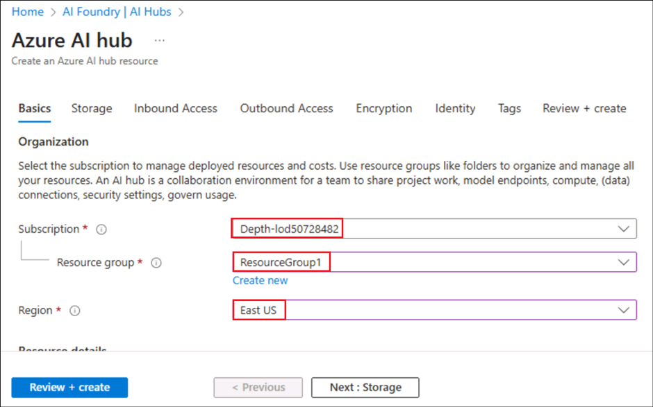

4.  Una vez superada la validación, seleccione **Create**.

5.  Una vez que se complete la implementación, haga clic en **Go to
    resource**.

6.  Seleccione **Launch Azure AI Foundry** desde la página de recursos
    del hub.

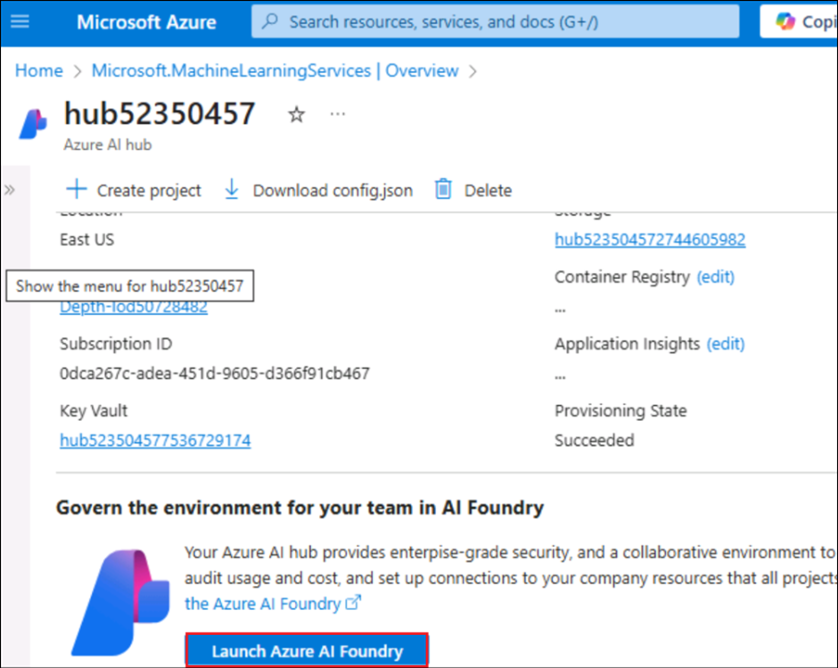

7.  En el recurso de hub iniciado, baje y seleccione **+ New project**.

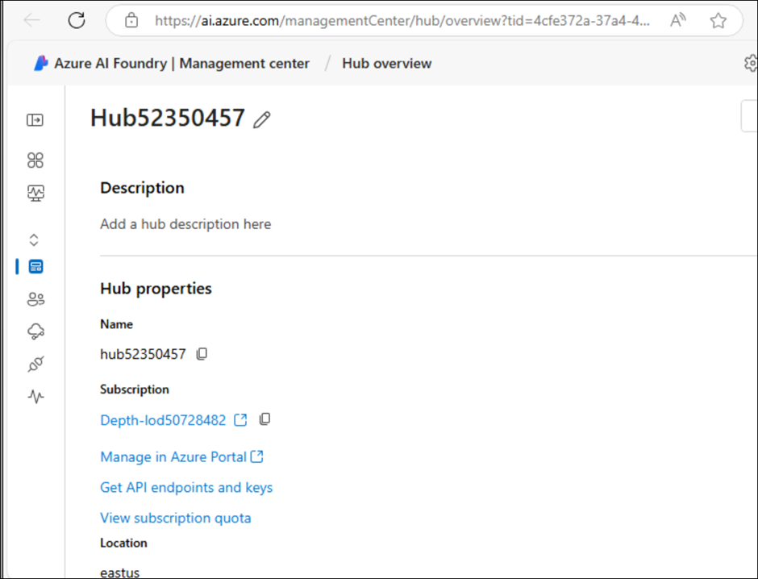

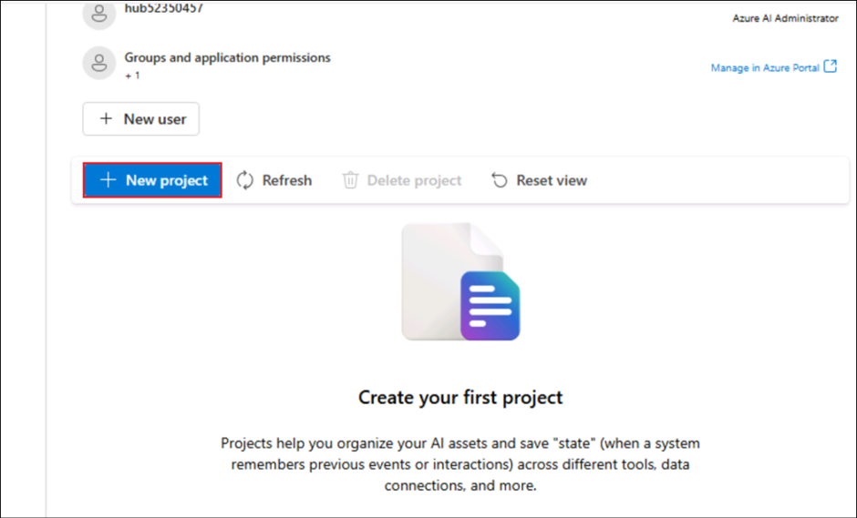

8.  Introduzca el nombre como <+++multiagent@lab.LabInstance.Id>+++ y
    seleccione **Create**.

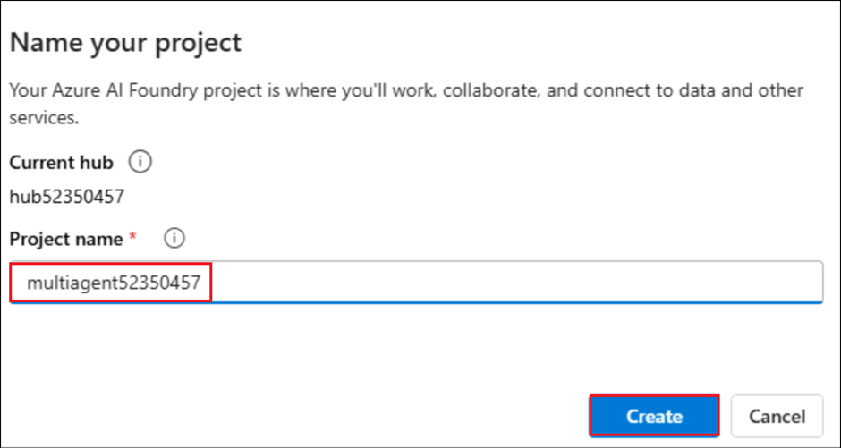

9.  **Cierre** el popup Explore and experiment.

10. Llega en la página del proyecto creado.

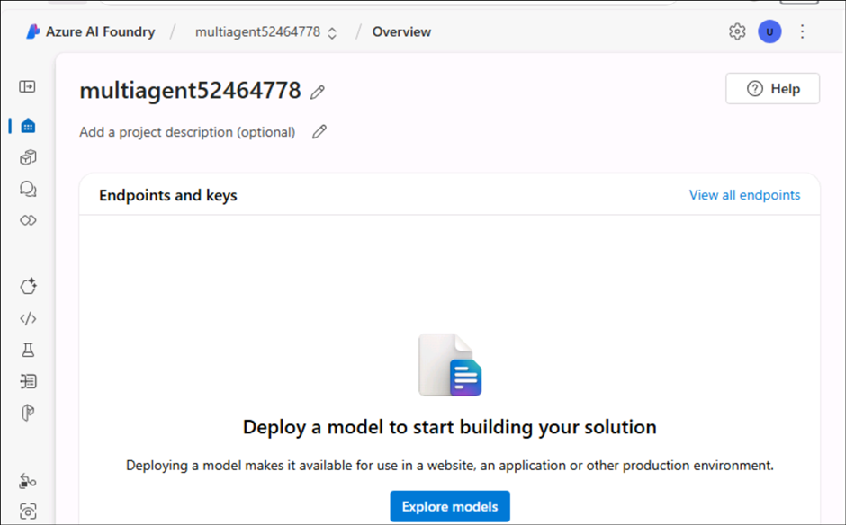

11. Desplácese hacia abajo en la página y copie el valor de la
    propiedad **Project connection string** a un notepad.

12. Desplácese hacia abajo en el panel izquierdo y
    seleccione **Management center**.

13. Seleccione **Connected resources** en el Hub resource y haga clic
    en **+ New connection** para crear una conexión con el Azure AI
    Foundry resource.

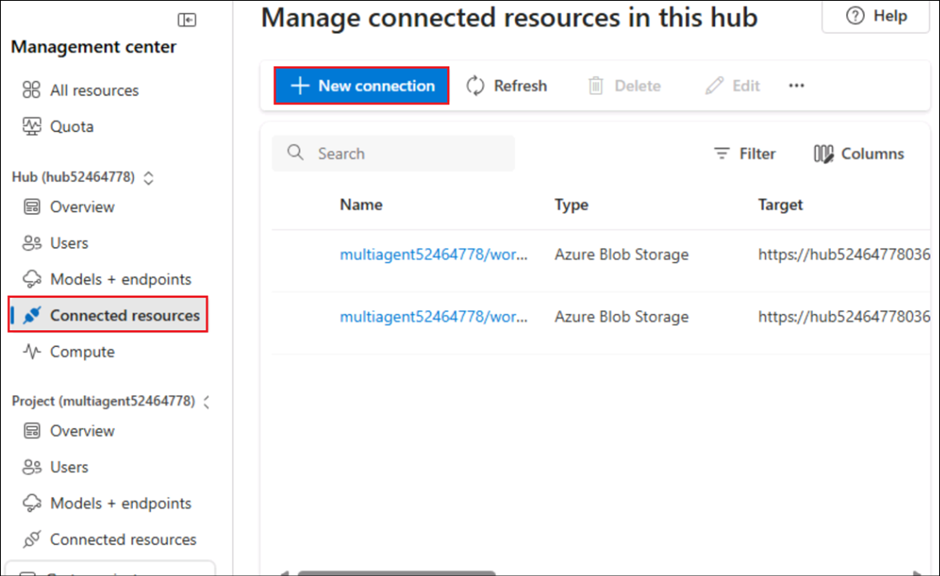

14. Seleccione **Azure AI Foundry** de los activos externos disponibles.

15. Seleccione **Add connection** para agregar la conexión.

16. Una vez conectado, haga clic en **Close**. Si no se ve el
    botón **Close**, reduzca el tamaño de **zoom** del navegador y
    seleccione **Close**.

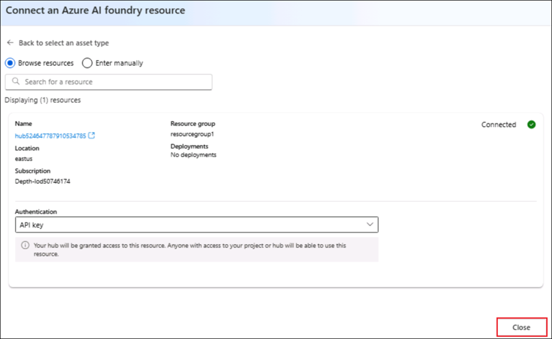

17. Seleccione **Go to project** desde el panel izquierdo.

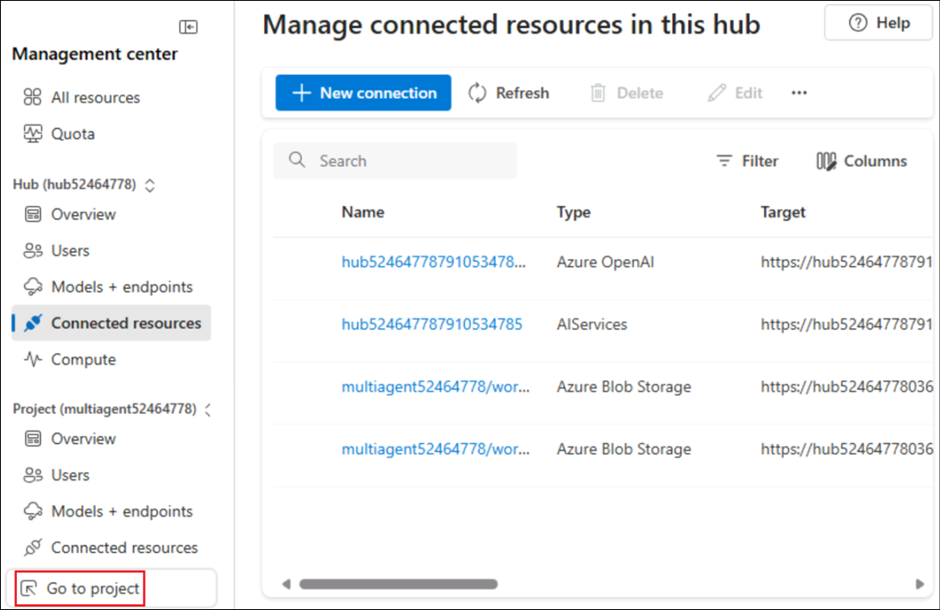

18. En la página del proyecto, copie los valores de **API
    Key** y **Azure OpenAI endpoint** y guárdelos en un notepad.

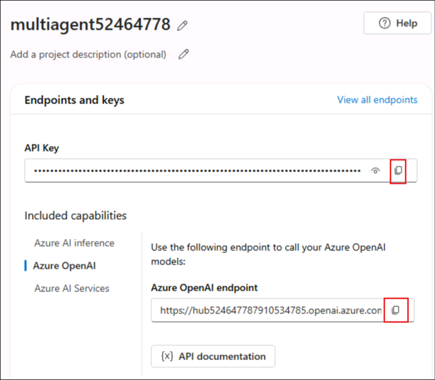

19. Seleccione **Agents** en **Build and customize** en el panel
    izquierdo. En la página **Azure AI Agent Service**, seleccione
    su **Azure OpenAI Service** que se creó, y luego haga clic
    en **Let’s go**.

20. Seleccione **gpt-4o-mini** y haga clic en **Confirm**.

21. Acepte el deployment name como +++**gpt-4o-mini**+++, seleccione el
    Deployment type como **Standard**. Acepte los demás valores
    predeterminados y haga clic en **Deploy** para implementar el
    modelo.

22. Ahora, tenemos listos los recursos de Azure.

## Ejercicio 2: Orquestación multiagente

En este ejercicio, configuraremos el código de Visual Studio e
instalaremos los requisitos previos necesarios para la ejecución.

1.  Desde la máquina virtual, abra el **Visual Studio Code**.

2.  Seleccione **File** -\> **Open Folder** y seleccione la
    carpeta **MultiAgent** desde **C:\LabFiles** y haga clic en **Select
    Folder**.

3.  Seleccione **Yes, I trust the authors** en el pop up.

4.  Haga clic con el botón derecho en el notebook y seleccione **Open in
    Integrated Terminal**.

5.  Ejecute los siguientes comandos uno tras otro para agregar
    el **nuget source**.

+++dotnet nuget list source+++

> +++dotnet nuget add
> source <https://api.nuget.org/v3/index.json> --name nuget.org+++

6.  Execute the below command to install dotnet interacrive.

+++dotnet tool install --global Microsoft.dotnet-interactive --version
1.0.556801+++

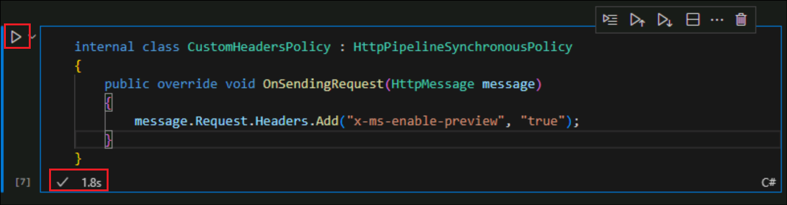

7.  Ejecute +++pip install jupyter+++ para instalar Jupyter.

8.  Ejecute el siguiente comando en jupyter interactive.

+++dotnet interactive jupyter install+++

9.  **Cierre** el **Terminal**. Seleccione **Extensions** desde el panel
    izquierdo, el archivo **Visual Studio Code**. Busque y seleccione
    +++**Jupyter**+++ y haga clic en **Install** para instalar la
    extensión Jupyter.

10. **Cierre** el Visual Studio Code y **ábralo** de nuevo.

11. Abra el notebook **AzureAIMultiAgentWithSK.ipynb**. Una vez abierto,
    haga clic en **Select Kernel**.

12. Seleccione **Jupyter Kernel**.

13. Seleccione **.NET (C#) dotnet** en el siguiente conjunto de
    opciones.

14. Seleccione **Allow access** en el **Security Alert**.

15. Ejecute la primera celda para **instalar** todos los **paquetes
    necesarios**.

16. Ejecute la siguiente celda para importar el namespaces.

17. En la siguiente celda, compruebe que el valor de la variable de
    **implementación** es el mismo que el **model deployment** que usted
    creó. Reemplace,

    - Endpoint – **Azure OpenAI Endpoint**

    - Key – The **API Key**

Los dos valores anteriores, los hemos guardado anteriormente en un
notepad una vez que se creó el proyecto en el Azure AI Foundry.

Después de reemplazar los valores, **ejecute** la celda.

Esto establece estos valores en las variables correspondientes que se
utilizarán más adelante.

18. La siguiente celda crea una nueva **instancia de KernelBuilder**,
    agrega **Azure OpenAI Chat Completion** como proveedor de servicios
    de IA al kernel con las variables del último paso como entrada e
    invoca **Build**() crea una instancia de Kernel.

**Ejecútelo** para crear la instancia del kernel.

19. Ejecute la siguiente celda para instalar los paquetes de **Azure**
    necesarios y la siguiente celda para importar las referencias.

20. La clase de la celda siguiente define una **directiva de pipeline
    HTTP personalizada para** las solicitudes del Azure SDK y agrega un
    encabezado HTTP personalizado (x-ms-enable-preview: true) a cada
    solicitud saliente. **Ejecutarlo** .

## Ejercicio 3: Guarde el Blog Agent

1.  La siguiente celda define la **clase SavePlugin**, que implementa un
    método para **guardar el contenido del blog** usando **Azure AI
    Projects y el Semantic Kernel**.

    - Recibe el contenido del **blog** como entrada.

    - Interactúa con **proyectos de Azure AI** para crear un agente de
      IA.

    - Genera y ejecuta código Python para **guardar** el **contenido**
      como un **archivo Markdown** (.md).

    - **Descarga** y **almacena** el archivo generado localmente.

    - **Devuelve** un **mensaje de** confirmación ("Saved").

Para ejecutar esta celda, reemplace **Your Connection String** con
su **Project Connection String** que haya guardado anteriormente en un
notepad. Se puede acceder a él desde la página de información general
del proyecto del portal de Azure AI Foundry.

Haga clic en **Execute** después de reemplazar el connection string.

2.  La siguiente celda inicializa **las constantes** con Save specific
    values. **Ejecútelo**. Estas constantes se utilizarán en las
    siguientes celdas.

3.  La siguiente celda crea un **ChatCompletionAgent** denominado
    **save_blog_agent**. Ejecútelo para crear el agente.

## Ejercicio 4: Writer agent

1.  Ejecute la siguiente celda en el notebook que declara constantes con
    Writer specific values.

2.  La siguiente celda crea un **ChatCompletionAgent** llamado
    write-blog_content que será responsable de escribir una publicación
    de blog usando Microsoft Semantic Kernel y Azure OpenAI chat models.
    Ejecútelo para crear el agente.

3.  El código de la siguiente celda hace que **SavePlugin** esté
    disponible como una función dentro de **save_blog_agent**. Crea un
    **kernel plugin** a partir de **SavePlugin. Agrega** el plugin al
    **kernel del agente**. La IA llama a la función **SavePlugin.Save**
    cuando detecta una solicitud relacionada con el guardado.

Ejecútelo para crear el Kernel Plugin.

4.  La siguiente celda contiene el código de la
    clase **ApprovalTerminationStrategy**

5.  Este **custom termination strategy** se utiliza para determinar
    **cuándo debe dejar de ejecutarse un agente de IA**. **Ejecútelo**.

6.  La siguiente celda contiene el **código de AgentGroupChat**. Esto
    crea un sistema **de chat multiagente** en el que colaboran dos
    agentes de IA (**write_blog_agent** y **save_blog_agent**). Usa
    **ApprovalTerminationStrategy** para determinar cuándo se debe
    detener el chat.

Solo **save_blog_agent** puede aprobar la rescisión.

**Ejecútelo** para configurar el chat multiagente.

7.  La siguiente celda contiene instrucciones para el agente. **Agrega
    un mensaje de usuario al sistema de chat multiagente**, instruyendo
    a la IA para **buscar información en GraphRAG, escribir un blog y
    guardarlo**.

8.  **Ejecute** la siguiente celda. Esto **itera sobre las respuestas
    generadas por IA** en el chat multiagente **a medida que se
    transmiten**.

Al ejecutarse, escribe un blog y lo guarda.

## Resumen

Hemos implementado un Multi Agent system usando Azure AI Agent Service
con Semantic Kernel.
