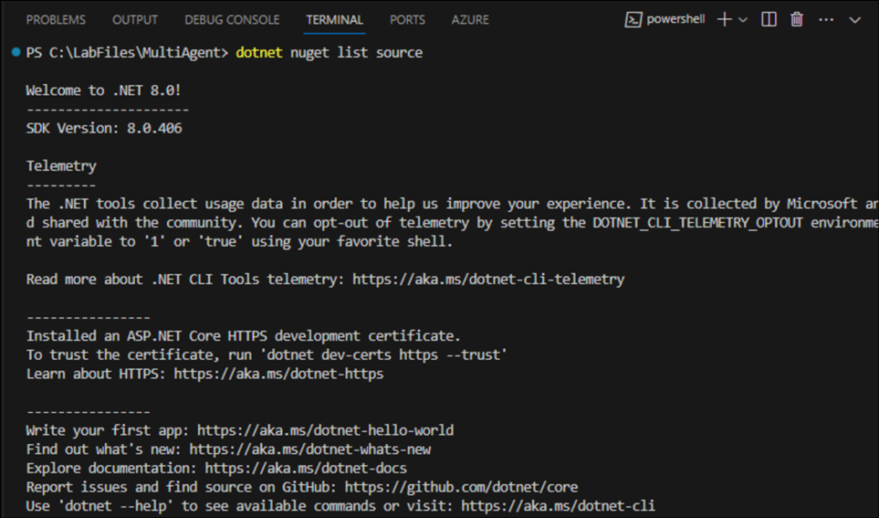
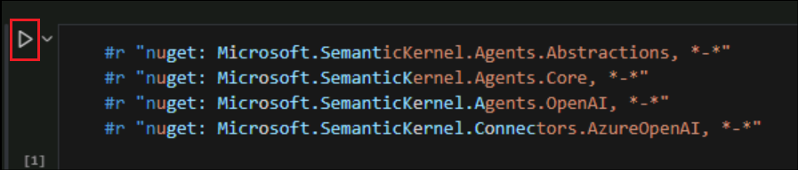
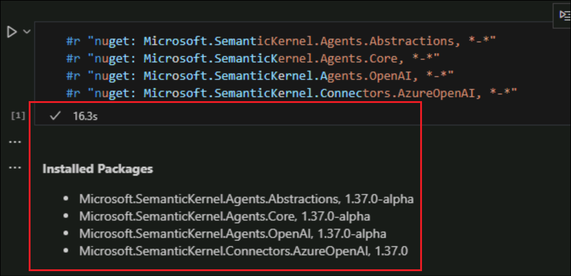
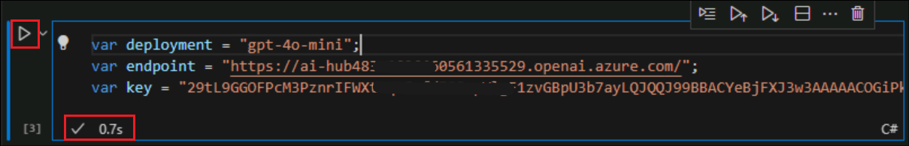
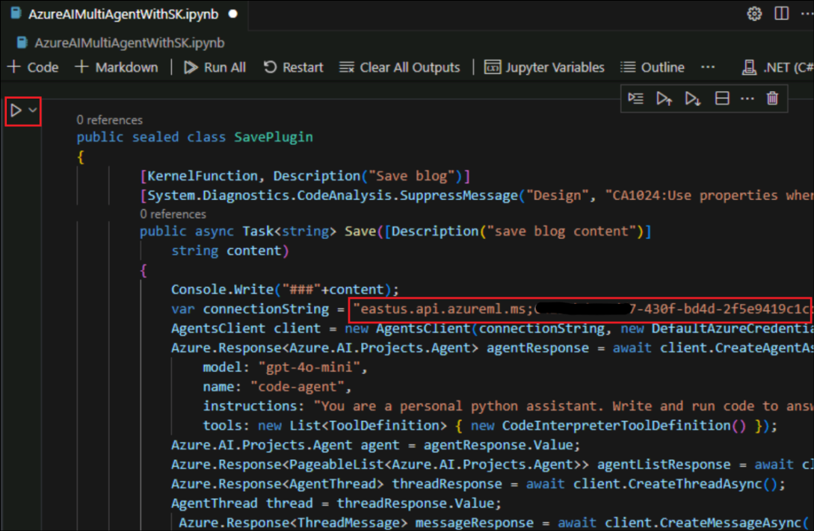
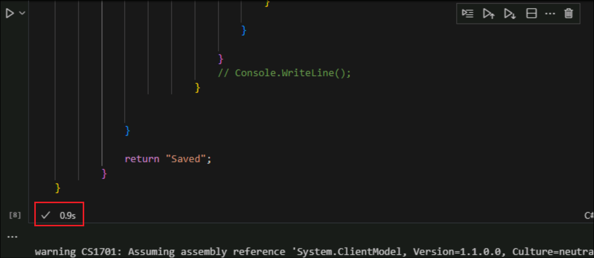

# Lab 7 - Build Multi-Agent solution using Azure AI Agent Service with Semantic Kernel 

We can build enterprise-oriented AI agents through Azure AI Agent
Service.

**Introduction**

The following introduces a blog writing scenario. This scenario involves
two AI agents: one for writing assistance, and the next for content
storage and management. These agents can be seamlessly orchestrated
using AutoGen or Semantic Kernel. In this lab, we are using the Semantic
Kernel Orchestration.

**Objective:**

Using Azure AI Foundry SDK, developers can quickly build agents based on
Azure AI Agent Service using Python or C#. Enterprises will have
different AI Agents based on their business, so how should these AI
Agents be combined in the workflow? We need to use AutoGen or Semantic
Kernel to orchestrate the AI Agents. In this lab, we use Semantic Kernel
to develop a Multi-Agent solution using Azure AI Agent Service.

## Exercise 1: Create the Azure AI Agent Service

1.  From a browser, open +++**https://ai.azure.com/**+++, click on
    **Sign in** and login using your **login** **credentials**

    - User name – @lab.CloudPortalCredential(User1).Username
    
    - Password – @lab.CloudPortalCredential(User1).Password

    

2.  **Close** the pop ups and click on **+ Create project**

    

3.  Provide the Project name as +++**multiagent@lab.LabInstanceId**+++
    and click on **Customize**.

    

4.  In the Customization pane, fill in the below details and select
    **Next**.

    - Hub - +++hub@lab.LabInstanceId+++
    
    - Subscription – Select the **assigned subscription**
    
    - Resource Group – Select the **assigned Resource Group**
    
    - Location – **East US**
    
    - Connect Azure AI Services or Azure OpenAI Service – Select the
      **(new)** resource name that gets listed.

    

5.  Select **Create** from the Review and finish screen to create the
    project.

    

6.  Once the project is created, copy the **API Key**, **Azure OpenAI
    Service Endpoint** and **Project connection string** to a notepad.

    

7.  Select **Agents** under **Build and customize** from the left pane.
    In the **Azure AI Agent Service** page, select your **Azure OpenAI
    Service** that was created, and then click on **Let’s go**.

    

8.  Select **gpt-4o-mini** and click on **Confirm**.

    

9.  Accept the deployment name as +++**gpt-4o-mini**+++, select the
    Deployment type to be **Standard**. Accept the other defaults and
    click on **Deploy** to deploy the model.

    

    

10. Now, we have the Azure resources ready.

## Exercise 2: Multi Agent Orchestration 

1.  From your VM, open the **Visual Studio Code**.

    

2.  Select **File** -> **Open Folder** and select the folder
    **MultiAgents** from **C:\LabFiles** and click **Select Folder**.

    

    

3.  Select **Yes, I trust the authors** in the pop up.

    

4.  Right click on the notebook and select **Open in Integrated
    Terminal**.

    

5.  Execute the below commands one after another to add the **nuget
    source**.

    +++dotnet nuget list source+++

    

    +++dotnet nuget add source https://api.nuget.org/v3/index.json --name nuget.org+++

    

6.  Execute the below command to install dotnet interacrive.

    +++dotnet tool install --global Microsoft.dotnet-interactive --version 1.0.556801+++

    

7.  Execute +++pip install jupyter+++ to install Jupyter.

    

8.  Execute the next command to jupyter interactive.

    +++dotnet interactive jupyter install+++

    

9.  **Close** the **Terminal**. Select **Extensions** from the left pane
    pf the **Visual Studio Code**. Search and select **Jupyter** and
    click on **Install** to install the Jupyter extension.

    

10. **Close** the Visual Studio Code and **open** it again.

11. Open the notebook **AzureAIMultiAgentWithSK.ipynb**. Once opened,
    click on **Select Kernel**.

    

12. Select **Jupyter Kernel**.

    

13. Select **.NET (C#) dotnet** in the next set of options.

    

14. Select **Allow access** in the **Security Alert**.

    

15. Execute the first cell to **install** all the required **packages**.

    

    

16. Execute the next cell to import the namespaces.

    

17. In the next cell, verify that the **deployment** variable value is
    the same as the **model deployment** that you created. Replace,

    - Endpoint – **Azure OpenAI Endpoint**
    
    - Key – The **API Key**

    Both the values above, we have saved earlier in a notepad once the
project was created in the Azure AI Foundry.

    After replacing the values, **execute** the cell.

    This sets these values to corresponding variables to be used further.

    

18. The next cell creates a new **KernelBuilder** instance, adds **Azure
    OpenAI Chat Completion** as an AI service provider to the kernel
    with the variables from the last step as input and invokes
    **Build**() creates an instance of Kernel.

    **Execute** it to create the Kernel instance.

    

19. Execute the next cell to install the required **Azure** packages and
    the next cell to import the references.

    

    

20. The class in the next cell defines a **custom HTTP pipeline policy
    for Azure SDK** requests and adds a custom HTTP header
    (x-ms-enable-preview: true) to every outgoing request. **Execute**
    it.

    

## Exercise 3: Save Blog Agent

1.  The next cell defines the **SavePlugin** class which implements a
    method to **save blog content** using **Azure AI Projects and the
    Semantic Kernel**.

    - It receives the **blog content** as input.

    - Interacts with **Azure AI Projects** to create an AI agent.

    - Generates and executes Python code to **save** the **content** as
      a **Markdown** (.md) file.

    - **Downloads** and **stores** the generated file locally.

    - **Returns** a **confirmation** message ("Saved").

    To execute this cell, replace **Your Connection String** with your
**Project Connection String** that you saved earlier to a note pad. It
can be accessed from the project overview page of Azure AI Foundry
portal.

    Click on **Execute** after replacing the connection string.

    

    

2.  The next cell initializes **constants** with Save specific values.
    **Execute** it. These constants will be used in the next cells.

    

3.  The next cell creates a **ChatCompletionAgent** named
    **save_blog_agent**. Execute it to create the agent.

    

## Exercise 4: Writer agent

1.  Execute the next cell in the notebook which declares constants with
    Writer specific values.

    

2.  The next cell creates a **ChatCompletionAgent** named
    write-blog_content which will be responsible for writing a blog post
    using the Microsoft Semantic Kernel and Azure OpenAI chat models.
    Execute it to create the agent.

    

3.  The code in the next cell makes **SavePlugin** available as a
    function inside **save_blog_agent**. It creates a **Kernel Plugin**
    from **SavePlugin.** **Adds** the Plugin to the **Agent's Kernel** .
    The AI calls the **SavePlugin.Save** function when it detects a
    save-related request.

    Execute it to create the Kernel Plugin.

    

4.  The next cell contains the code for the class
    **ApprovalTerminationStrategy**

5.  This **custom termination strategy** is used to determine **when an
    AI agent should stop running**. **Execute** it.

    

6.  The next cell contains the **AgentGroupChat** code. This creates a
    **multi-agent chat** system where two AI agents
    (**write_blog_agent** and **save_blog_agent**) collaborate. Uses
    **ApprovalTerminationStrategy** to determine when the chat should
    stop.

    Only **save_blog_agent** can approve termination.
    
    **Execute** it to configure the multi agent chat.

    

7.  The next cell contains instructions to the agent. It **adds a user
    message to the multi-agent chat system**, instructing the AI to
    **search for information on GraphRAG, write a blog, and save it**.

    

8.  **Execute** the next cell. This **iterates over the AI-generated
    responses** in the multi-agent chat **as they are streamed**.

    On execution, it writes a blog, saves it.

    

    

    

**Summary:**

We have implemented a Multi Agent system using Azure AI Agent Service
with Semantic Kernel.

