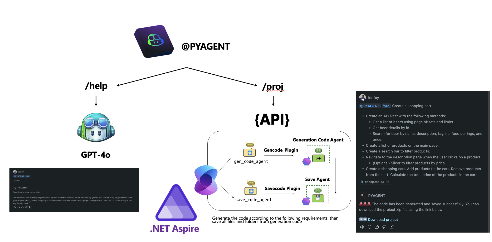

## **Create a custom Visual Studio Code Chat participant with Azure AI Agent Service**

### **Architecture**

.NET Aspire is a very good distributed application framework. We use .NET Aspire to manage our Agent services. By integrating .NET + Semantic Kernel, we can easily create Chat participant customized interface services. We can see that Chat participant can be used to cope with different development scenarios, and different AI Agents can be used to complete the definition very well. But we must say that in the LLM/SLM era, we need to adapt the workflow more flexibly. Semantic Kernel/AutoGen both have the orchestration capabilities of AI Agent.

As for Visual Studio Code Chat Extension, we define two instructions /help and /proj to define the work of self-introduction and project creation.

- /help uses gpt-4o provided by GitHub Copilot to complete simple introduction work. No need to bind any third-party agent,

- /proj builds the project, you need to write the requirements, and call the multi-agent interface orchestrated by the encapsulated Semantic Kernel through fetch